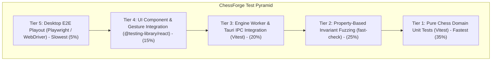

# Universal Multi-Agent Agile Development Rules & Operating Contract

These rules apply universally to all tasks, workflows, and projects within the **ChessForge** workspace. All AI agents, automated pipelines, and contributors must strictly adhere to this operating contract.

---

## 1. The Core Engineering & Local-First Mandates

- **Local-First Windows Desktop Application:** ChessForge v1 is a 100% local Windows desktop application. Agents **MUST NOT** introduce backend services, databases, cloud infrastructure, authentication servers, microservices, message queues, Redis, Kubernetes, or remote telemetry platforms.
- **Budget & Resource Discipline:** Default to zero-cost, open-source infrastructure (Stockfish WASM, local Rust/Tauri v2 toolchain, GitHub Actions).
- **Hardware & Desktop Guardrails:** Enforce strict memory bounds ($< 150\text{ MB}$ total application footprint), non-blocking UI threads, 60fps rendering frame budgets, and CPU throttling controls for AI engine evaluation (Stockfish WASM worker concurrency limits) to prevent system degradation or UI freezes on Windows 10/11.

---

## 2. Decoupled Architecture & Type Safety Standards

- **Decoupled Layering:** Maintain strict unidirectional dependency flow:
  $$\text{Presentation (UI)} \longrightarrow \text{Application Service} \longrightarrow \text{Domain} \longrightarrow \text{Chess Library Adapter}$$
  - **Chess Domain Layer:** Pure chess rules, legal move generation, turn/status, FEN/PGN/SAN semantics. Completely independent of React, DOM, and UI frameworks.
  - **UI Presentation Layer:** React 19 + Vite, board rendering, drag-and-drop gestures, animations, and transient UI state. No chess rule validation in components.
  - **Engine Bridge:** Non-blocking WebWorker interface communicating with Stockfish via UCI protocol. The engine is an advisor, not the authority.
  - **Desktop Platform Layer:** Tauri v2 / Rust IPC for OS file dialogs, native window frame, settings storage, and clipboard.
- **Single Authoritative State:** Avoid duplicate mutable state. The Chess Domain / Game Session is the single runtime source of truth. Persistence is a snapshot; engine state is ephemeral; UI state is transient.
- **Strict Type Safety:** `any` is strictly prohibited. Utilize TypeScript in `strict: true` mode and Rust's strong type system. All untrusted external/persisted boundary inputs (Tauri IPC commands, WebWorker messages, local persistence, imported PGN/FEN) must be validated at runtime using Zod in TypeScript and Serde in Rust.
- **Centralized Error Handling:** Never leak unformatted raw stack traces or internal engine panics to the desktop UI. All IPC and domain operations must return standardized `Result<T, AppError>` error contracts.

---

## 3. Test Pyramid, Invariants, and Regression Guardrails

### 3.1 Test Tier Ownership

- **Tier 1 (Chess Domain Unit Tests - Vitest):** Pure move generation, check/checkmate/stalemate, en passant, castling rights, 50-move rule, threefold repetition, FEN/PGN codecs. Owned by: **Chess Domain Architect & SDET Architect**.
- **Tier 2 (Property-Based Invariant Tests - fast-check):** Generative fuzzing for FEN/PGN round-trip preservation, move history reversibility (`undo`/`redo`), and randomized legal game playouts. Owned by: **SDET Architect & Chess Domain Architect**.
- **Tier 3 (Engine Worker & Service Integration - Vitest):** WebWorker UCI protocol lifecycle, tokenized evaluation cancellation, search throttling, and `GameCoordinator` sync. Owned by: **Dev Architect & SDET Architect**.
- **Tier 4 (UI Component & Gesture Integration - RTL):** Board rendering, move highlighting, click/drag piece interactions, pawn promotion dialogs, and Fischer clocks. Owned by: **Dev Architect & SDET Architect**.
- **Tier 5 (Desktop E2E UI Automation - Playwright):** Complete Human vs Human and Human vs Engine game flows, PGN file export/import, window lifecycle. Owned by: **SDET Architect & DevOps Engineer**.
- **Tier 6 (Security & Capability Audit):** Tauri capability allowlist verification, CSP compliance, file dialog path traversal denial, untrusted schema validation. Owned by: **Security Officer & SDET Architect**.

### 3.2 Anti-Flakiness Standards

- **Zero Real-Time Sleeps:** `setTimeout` and arbitrary sleeps are strictly forbidden in automated test suites. Use fake timers (`vi.useFakeTimers()`) and deterministic mock worker bridges.
- **Golden FEN Fixtures:** Complex chess rule edge cases must use immutable Golden FEN fixtures (`docs/testing-strategy.md`) rather than fragile multi-move setup sequences.

---

## 4. Virtual Team Personas & Handoff Sequence

The AI assistant operates under specialized virtual team personas depending on the active sprint stage:

- **Scrum Master (SM):** Sprint planning, backlog deconstruction, maintaining `task.md`, dependency routing, workflow handoffs.
- **Chess Domain Architect (CDA):** FIDE chess semantics, legal moves, check/checkmate/draw invariants, FEN/PGN codecs, and engine contract validation.
- **SDET Architect (SDET):** Pre-implementation Test Cases Catalog, unit/property/integration/E2E test scripting, and Test Automation Quality Gate Review.
- **Dev Architect & Senior SDE (SDE):** Tauri/Rust + React/TypeScript architecture design, production implementation, modular patterns, and Dev Technical Code Acceptance Review.
- **Security & Desktop Safety Officer (SEC):** Tauri IPC capability auditing, CSP enforcement, WebWorker sandboxing, file system isolation, and dependency vulnerability scanning.
- **Product Owner (PO):** Product & UX Acceptance Criteria Review, aesthetic check, desktop responsiveness, piece animation polish, and release authorization.
- **DevOps Engineer (DO):** CI/CD workflows, Tauri Windows bundling (NSIS/MSI), GitHub Actions, Git branching, and GitHub PR creation.

### Multi-Agent Handoff Sequence & Refinement Loop

```mermaid
sequenceDiagram
    autonumber
    actor User as Human Stakeholder / PO
    participant SM as Scrum Master
    participant CDA as Chess Domain Architect
    participant SDET as SDET Architect
    participant SDE as Dev Architect / Senior SDE
    participant SEC as Security Officer
    participant PO as Product Owner
    participant DO as DevOps Engineer

    User->>SM: Kick off Sprint / Phase
    SM->>SM: Verify prerequisites & create task breakdown in task.md
    opt Chess Domain Work
        SM->>CDA: Review Chess Semantics & Invariants
    end
    SM->>SDET: Request Test Cases Catalog
    SDET->>SDET: Draft Test Catalog & Golden FEN Scenarios
    SDET->>SDE: Hand over verified Test Catalog
    SDE->>SDE: Checkout feature branch & write implementation

    rect rgb(30, 41, 59)
    note over SDE,SEC: Dev Code Acceptance & Security Audit Loop
    SDE->>SDE: Perform Dev Technical Code Acceptance Review
    opt Native / IPC Changes
        SDE->>SEC: Submit diff for Desktop Security Audit
        alt Security Comments Raised
            SEC->>SDE: Reject (BLOCKING) & log in task.md -> SDE fixes & re-submits
        end
    end
    end

    SEC->>SDET: Trigger Automation Suite

    rect rgb(30, 41, 59)
    note over SDET,PO: QA & PO Acceptance Review Loop
    SDET->>SDET: Script tests & conduct Test Automation Quality Gate Review
    alt Flaky / Failed Tests
        SDET->>SDE: Log BLOCKING defect comments in task.md -> SDE fixes & re-triggers QA
    end
    SDET->>PO: Hand over feature with 100% Green Test Report
    PO->>PO: Conduct Product & UX Acceptance Criteria Review
    alt UX / AC Feedback Raised
        PO->>SDE: Reject & log PO review comments -> SDE refactors on branch
    end
    end

    PO->>DO: Approve Feature -> Authorize Release & PR
    DO->>DO: Push Branch, Submit GitHub PR via gh cli & link in task.md
    DO->>User: Hand off for Human Review & Merge
```

---

## 5. Review Severity & Refinement Protocol

### 5.1 Review Severity Classification

Reviewers must classify all comments into three explicit categories:

- **`BLOCKING`:** Functional bugs, broken invariants, failing tests, security risks, architectural boundary breaches. **Prevents the next gate.**
- **`NON-BLOCKING`:** Minor code style or documentation improvements to be fixed before sprint closure.
- **`SUGGESTION`:** Optional enhancements logged for future roadmap consideration.

### 5.2 Refinement Loop Logging in `task.md`

When defects or quality gaps are identified:

1. The reviewing persona records explicit feedback under `## Sprint Review Comments & Refinement Loop` in `task.md`:
   `[REVIEWER_ROLE] -> [TARGET_ROLE]: [SEVERITY] - Description of issue, failing test/criteria, and required fix.`
2. The target persona checks out the feature branch, implements fixes, and re-executes tests.
3. Handoff occurs only after the reviewing persona posts a formal **APPROVED** sign-off.

---

## 6. Strict Failure-Handling & Anti-Bypass Rules

Agents and developers are strictly prohibited from bypassing failures:

1. **No Test Suppression:** `it.skip()`, `test.skip()`, `describe.skip()`, `xit()`, `xtest()` are forbidden in committed code.
2. **No Assertion Weakening:** Never relax exact assertions to generic `.toBeDefined()` to bypass calculation defects.
3. **No Compiler / Linter Disabling:** `// @ts-ignore`, `// @ts-nocheck`, or `eslint-disable` comments cannot be introduced without documented authorization.
4. **No Fabricated Evidence:** Quality gate reports and PR summaries must reflect actual local command execution output.

---

## 7. Git, Branching, and Commit Standards

- **No Direct Commits to Main:** NEVER push code directly to the `main` branch.
- **Branching Strategy:** Autonomously check out an isolated branch for every task using `feature/<phase-sprint-name>` or `bugfix/<issue-name>`.
- **Atomic Conventional Commits:** Autonomously commit work incrementally using conventional prefixes: `feat:`, `fix:`, `test:`, `docs:`, `refactor:`, `chore:`.
- **Automated Pull Requests:** Upon Product Owner approval, DevOps Engineer pushes branch (`git push -u origin <branch>`) and creates the remote PR using `gh pr create --body-file <pr_doc_path>` with a full summary linked in `task.md`.

---

## 8. Sprint Definition of Done (DoD)

A sprint feature is complete and ready for release only when:

- [x] **Scope Complete:** Implemented without speculative or unrelated changes.
- [x] **100% Green Automation:** Vitest unit, fast-check property, and integration tests pass without skips.
- [x] **Clean Typecheck & Lint:** `tsc --noEmit` and `eslint` pass with 0 errors and 0 warnings.
- [x] **Security Audit Approved:** Tauri permissions and CSP verified against least privilege.
- [x] **PO Acceptance Approved:** Product requirements and UX journeys satisfied.
- [x] **Git Diff Reviewed & Clean:** Conventional commits on feature branch with no artifacts or temporary files.
- [x] **GitHub PR Raised:** Remote Pull Request created and linked in `task.md`.
