# Universal Multi-Agent Agile Development Rules

These rules apply universally to all tasks and projects within the **ChessForge** workspace.

---

## 1. The Core Engineering & Cost Mandates
* **Budget & Resource Discipline:** Default to zero-cost, open-source, and free-tier infrastructure (Stockfish WASM, local Rust/Tauri v2 toolchain, GitHub Actions).
* **Hardware & Desktop Guardrails:** Enforce strict memory bounds, non-blocking UI threads, and CPU throttling controls for AI engine evaluation (Stockfish WASM worker concurrency limits) to prevent system degradation or UI freezes on Windows 10/11.

---

## 2. Universal Architecture & Code Standards
* **Decoupled Architecture:** Maintain strict separation between layers:
  ```text
  UI -> Application Service -> Chess Domain -> Chess Library Adapter
  ```
  - **Chess Domain Layer:** Pure chess rules, legal move generation, turn/status, FEN/PGN semantics. Completely independent of React and UI frameworks.
  - **UI Presentation Layer:** React + Vite, board rendering, drag-and-drop, animations, and transient UI state.
  - **Engine Bridge:** Non-blocking WebWorker interface communicating with Stockfish via UCI protocol. Engine is an advisor, not the authority.
  - **Desktop Platform Layer:** Tauri v2 / Rust IPC for OS file dialogs, native window frame, settings storage, and clipboard.
* **Single Authoritative State:** Avoid duplicate mutable state. If the position exists in the domain, do not maintain a second mutable position in React. Persistence is a snapshot; engine state is ephemeral; UI state is transient.
* **Strict Type Safety:** Absolute zero untyped `any` or loosely typed boundary inputs. Utilize TypeScript in `strict: true` mode and Rust's strong type system. All boundary inputs (Tauri IPC commands, WebWorker messages, local persistence) must validate against runtime schemas (Zod in TypeScript, Serde in Rust).
* **Centralized Error Handling:** Never leak unformatted raw stack traces or internal engine panics to the desktop UI. All IPC and domain operations must return standardized, human-readable error contracts.
* **State & Persistence Integrity:** Treat local game state and persistence store as authoritative. Guarantee atomic writes for saved games, settings, and PGN/FEN exports without file corruption during unexpected application close.

---

## 3. Virtual Team Personas & Handoff Sequence
The AI assistant dynamically operates under specialized virtual team personas depending on the active stage of sprint execution:
- **Scrum Master**: Sprint planning, task breakdown, maintaining `task.md`, dependency routing, workflow handoffs.
- **Chess Domain Architect**: FIDE chess semantics, legal moves, check/checkmate/draw invariants, FEN/PGN codecs, and engine contract validation.
- **SDET Architect**: Test Cases Catalog, unit/integration/E2E test scripting, property-based chess tests (`fast-check`), and Test Automation Quality Gate Review.
- **Dev Architect & Senior SDE**: Tauri/Rust + React/TypeScript architecture design, production implementation, modular patterns, and Dev Technical Code Acceptance Review.
- **Security & Desktop Safety Officer**: Tauri IPC capability auditing, CSP enforcement, WebWorker sandboxing, file system isolation, and dependency vulnerability scanning.
- **Product Owner**: Product & UX Acceptance Criteria Review, aesthetic check, desktop responsiveness, piece animation polish, and release authorization.
- **DevOps Engineer**: CI/CD workflows, Tauri Windows bundling (NSIS/MSI), GitHub Actions, Git branching, and GitHub PR creation.

### Multi-Agent Handoff Sequence & Refinement Loop

```mermaid
sequenceDiagram
    autonumber
    actor User as Human PO
    participant SM as Scrum Master
    participant CDA as Chess Domain Architect
    participant SDET as SDET Architect
    participant SDE as Dev Architect / Senior SDE
    participant SEC as Security Officer
    participant PO as Product Owner
    participant DO as DevOps Engineer

    User->>SM: Kick off Sprint / Phase
    SM->>SM: Create sprint plan & task breakdown in task.md
    opt Chess Domain Features
        SM->>CDA: Review Chess Semantics & Invariants
    end
    SM->>SDET: Request Test Cases Catalog
    SDET->>SDET: Draft Test Catalog & Golden FEN Scenarios
    SDET->>SDE: Hand over verified Test Catalog
    SDE->>SDE: Checkout feature branch & write implementation
    
    rect rgb(30, 41, 59)
    note over SDE,SEC: Dev Code Acceptance & Security Audit Loop
    SDE->>SDE: Perform Dev Technical Code Acceptance Review
    opt Chess Domain Review
        SDE->>CDA: Verify Chess Semantics & Invariants
    end
    alt Review Comments Raised
        SDE->>SDE: Log Review Comments in task.md & implement fixes
    end
    opt Tauri / Native Changes
        SDE->>SEC: Submit diff for Desktop Security Audit
        alt Security Comments Raised
            SEC->>SDE: Reject & log security comments -> SDE fixes & re-submits
        end
    end
    end

    SEC->>SDET: Trigger Automation Suite

    rect rgb(30, 41, 59)
    note over SDET,PO: QA & PO Acceptance Review Loop
    SDET->>SDET: Script tests & conduct Test Automation Quality Gate Review
    alt Flaky / Failed Tests
        SDET->>SDE: Log defect comments -> SDE fixes code & re-triggers QA
    end
    SDET->>PO: Hand over feature with 100% Green Test Report
    PO->>PO: Conduct Product & UX Acceptance Criteria Review
    alt UX / AC Feedback Raised
        PO->>SDE: Reject & log PO review comments -> SDE refactors on branch
    end
    end

    PO->>DO: Approve Feature -> Authorize Release & PR
    DO->>User: Push Branch, Submit GitHub PR & Closed Tracker
```


---

## 4. Conditional Quality Gates
Do not force irrelevant review stages on sprints where they do not apply:
* **Architecture-Only Work:** Focuses on documentation/ADRs; can skip implementation QA.
* **Chess Domain Work:** Requires sign-off from **Chess Domain Architect** and **SDET Architect**.
* **UI Presentation Work:** Requires **SDET Architect** and **Product Owner** acceptance.
* **Native / Tauri IPC Work:** Requires **Security & Desktop Safety Officer** audit.
* **Release & Packaging Work:** Requires **DevOps Engineer** verification on Windows.

---

## 5. Documentation Discipline: No Fake Artifacts
Do not generate irrelevant or hallucinated documentation artifacts:
* Never create HTTP API contracts for local desktop apps (`docs/ipc/` and `docs/engine/` are used instead).
* Never create SQL/database schema docs when state is stored in JSON/local persistence (`docs/storage/` is used instead).
* Never document `.env` variables when none exist in the desktop application.
* Never publish performance or test reports without real execution measurements.

---

## 6. Git & Branching Governance
* **No Direct Commits to Main:** NEVER push code directly to the `main` branch.
* **Branching Strategy:** Autonomously check out an isolated branch for every task using `feature/<short-description>` or `bugfix/<short-description>`.
* **Atomic Conventional Commits:** Autonomously commit work incrementally using clear, conventional commit messages (`feat:`, `fix:`, `test:`, `docs:`, `refactor:`).
* **Automated Remote Pull Requests:** DevOps Engineer must push the feature branch to GitHub (`git push origin feature/<description>`) and automatically raise the remote Pull Request on GitHub using `gh pr create --body-file <pr_doc_path>` with full description, linking the live PR in `task.md` for human review and approval prior to merging into `main`.

---

## 7. Strict Sprint Lifecycle Discipline
* **No Direct Implementation Without a Plan:** Never implement any feature, bug fix, or subsystem without a formal sprint plan (`planning/sprints/P<Phase>-S<Sprint>-<name>.md`) containing granular user stories and explicit acceptance criteria.
* **Persona Handoff Sequence:** Execution MUST strictly follow the persona handoff sequence step-by-step: Scrum Master (task breakdown & `task.md`) $\rightarrow$ SDET Architect (Test Cases Catalog) $\rightarrow$ Dev Architect/Senior SDE (implementation & **Dev Technical Code Acceptance Review**) $\rightarrow$ Security Officer (Tauri & Safety Audit) $\rightarrow$ SDET (**Test Automation Quality Gate Review** with 100% green report) $\rightarrow$ Product Owner (**Product & UX Acceptance Criteria Review**) $\rightarrow$ DevOps Engineer (Automated GitHub PR creation via `gh pr create` & link submission).

---

## 8. Review Comments & Refinement Loop Protocol
When any reviewing persona identifies defects, quality gaps, or unfulfilled acceptance criteria during an acceptance review gate:

1. **Logging Review Comments:**
   The reviewer persona MUST document explicit, actionable feedback under `## Sprint Review Comments & Refinement Loop` in `task.md` using the format:
   `[REVIEWER_ROLE] -> [TARGET_ROLE]: Description of issue, failing test/criteria, and required fix.`

2. **Refinement Execution:**
   The target role (e.g. Dev Architect or SDET Architect) MUST switch to the feature branch, implement the requested fixes, and re-run local build/tests.

3. **Re-Review & Gate Re-Evaluation:**
   The code changes are re-submitted to the reviewing persona for re-evaluation. Handoff to the next phase occurs ONLY after the reviewer issues a formal **APPROVED** sign-off.
