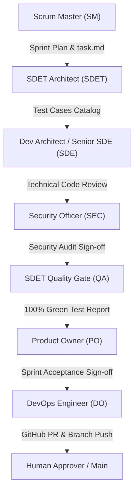
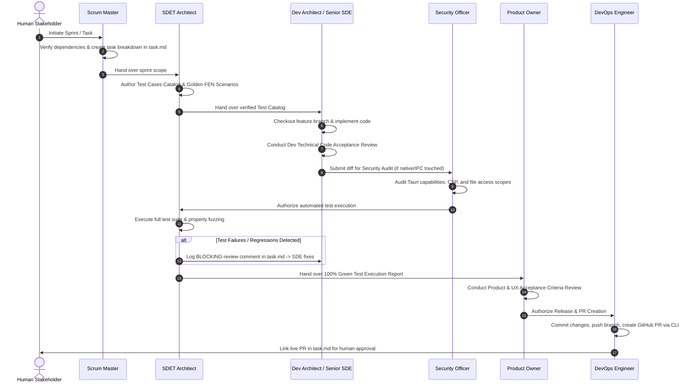

# ChessForge Agent Workflow & Operating Contract

**Document Version:** 1.0.0  
**Status:** Approved Operating Standard  
**Target Platform:** Windows 10/11 Desktop Multi-Agent Agile Development Environment

---

## 1. Operating Philosophy & Objectives

ChessForge leverages a multi-agent agile development model where AI coding agents (Antigravity), CI automation pipelines, and human stakeholders collaborate seamlessly. To maintain software quality, architectural rigor, and desktop security, all agent operations must follow strict, deterministic operating contracts.

### Core Operating Mandates
1. **Local-First Desktop Integrity:** ChessForge v1 is a local Windows desktop application. Agents must never introduce speculative backend microservices, cloud databases, auth servers, or telemetry infrastructure.
2. **Deterministic Lifecycle Handoffs:** Every sprint proceeds sequentially through defined persona gates. No phase is skipped, and no code is committed without automated test verification.
3. **Ironclad Anti-Bypass Guardrails:** Agents are strictly prohibited from bypassing failures by suppressing tests (`it.skip`), disabling linters (`eslint-disable`), ignoring type errors (`// @ts-ignore`), or fabricating reports.
4. **Git Branching & Atomic Conventional Commits:** Direct commits to `main` are strictly forbidden. All work occurs on isolated feature branches and integrates via reviewed Pull Requests.

---

## 2. Agent Virtual Personas & Responsibilities



| Persona | Key Responsibilities | Primary Artifacts |
| :--- | :--- | :--- |
| **Scrum Master (SM)** | Sprint planning, backlog deconstruction, task allocation, tracking in `task.md`, dependency routing, handoff facilitation. | `task.md`, Sprint Plans (`planning/sprints/`) |
| **Chess Domain Architect (CDA)** | FIDE chess semantics, legal move rules, invariant verification, FEN/PGN/SAN codecs, Stockfish protocol adherence. | `src/domain/`, Domain Test Specs |
| **SDET Architect (SDET)** | Pre-implementation test case catalogs, Vitest unit suites, `fast-check` property fuzzing, E2E playout scripts, QA gates. | `docs/testing/`, Test Suites (`src/__tests__/`) |
| **Dev Architect & Senior SDE (SDE)** | Tauri v2 + React 19 architecture, clean layer implementation, modular code, internal code acceptance review. | `src/`, `src-tauri/`, ADRs (`docs/adr/`) |
| **Security & Desktop Safety Officer (SEC)** | Tauri capability auditing, CSP enforcement, WebWorker isolation, file path traversal defense, zero network verification. | `docs/security-model.md`, Capability Manifests |
| **Product Owner (PO)** | Product requirements validation, UX acceptance criteria check, desktop responsiveness verification, release sign-off. | `docs/product-requirements.md`, Release Notes |
| **DevOps Engineer (DO)** | CI/CD automation, Windows build packaging (NSIS/MSI), branch hygiene, atomic commits, GitHub PR creation. | `.github/workflows/`, PR Descriptions |

---

## 3. Sprint Execution Lifecycle & Quality Gates

Every sprint cycle follows a structured 8-step progression:



---

## 4. Review Severity & Refinement Loop Protocol

### 4.1 Review Finding Severity
When any persona conducts an acceptance review gate, findings must be explicitly classified:
- **`BLOCKING`**: Violates functional correctness, fails automated tests, introduces security flaws, or breaks architectural boundaries. **Halts the gate immediately; feature branch cannot progress.**
- **`NON-BLOCKING`**: Minor code quality or documentation improvement that should be addressed prior to sprint closure, but does not invalidate runtime integrity.
- **`SUGGESTION`**: Optional architectural or performance enhancement recorded for future sprint consideration.

### 4.2 Refinement Loop Format in `task.md`
Any blocking review comments or defect feedback must be recorded under `## Sprint Review Comments & Refinement Loop` in `task.md`:
```markdown
- `[REVIEWER_ROLE] -> [TARGET_ROLE]`: [SEVERITY] - Description of defect, failing test/criteria, and required remediation.
```

When remediation is complete, the reviewing persona re-evaluates the implementation and records a formal sign-off:
```markdown
- `[REVIEWER_ROLE] -> [TARGET_ROLE]`: Remediation verified. Full test suite green. Status: **APPROVED**.
```

---

## 5. Worktree, Branching, and Commit Standards

### 5.1 Branch Naming Conventions
- Feature Branches: `feature/<phase-sprint-short-description>` (e.g. `feature/p01-s05-testing-and-agent-operating-contract`)
- Bugfix Branches: `bugfix/<issue-short-description>` (e.g. `bugfix/castling-transit-check`)
- Hotfix Branches: `hotfix/<critical-patch-description>`

### 5.2 Atomic Conventional Commits
All commits must follow the Conventional Commits specification with descriptive messages:
- `feat(domain): implement castling legality and transit square validation`
- `fix(engine): resolve search cancellation token race condition`
- `test(chess): add fast-check generative property tests for FEN round-trips`
- `docs(testing): update test cases catalog for Sprint 05`
- `refactor(ui): extract move history panel into virtualized list`
- `chore(ci): update GitHub Actions workflow for Tauri Windows bundling`

### 5.3 Automated Pull Request Creation
Upon Product Owner approval, the DevOps Engineer autonomously:
1. Verifies that git working directory is clean and all tests pass.
2. Pushes the branch to the remote repository: `git push -u origin <branch-name>`.
3. Creates a structured PR document in `docs/pull_requests/pr_P<XX>_S<YY>_<name>.md`.
4. Creates the GitHub Pull Request using GitHub CLI:
   ```bash
   gh pr create --title "<PR Title>" --body-file docs/pull_requests/pr_P<XX>_S<YY>_<name>.md
   ```
5. Updates `task.md` with the active PR link for human review and merge authorization.

---

## 6. Anti-Bypass Guardrails & Failure Handling

Agents operating in the ChessForge workspace must strictly enforce the following rules:

| Violation Category | Prohibited Action | Enforcement Mechanism |
| :--- | :--- | :--- |
| **Test Suppression** | `it.skip()`, `test.skip()`, `xit()`, `describe.skip()` | CI linter rule & SDET review rejection. |
| **Type Check Bypass** | `// @ts-ignore`, `// @ts-nocheck`, `any` type casting | Strict TypeScript compiler `noImplicitAny: true`. |
| **Lint Suppression** | `/* eslint-disable */` without documented exemption | Static analysis CI check. |
| **Assertion Weakening** | Replacing exact assertions with `.toBeDefined()` | SDET Quality Gate code audit. |
| **Fabricated Metrics** | Reporting green test passes without terminal execution | Cross-referencing CI workflow run logs. |
| **Unsolicited Cloud** | Adding remote databases, auth APIs, or backend servers | Security Officer Capability Audit. |

---

## 7. Sprint Definition of Done (DoD)

A sprint is completely finished and eligible for human merge only when:
1. [x] **Scope Implemented:** All granular tasks from the sprint plan are completed.
2. [x] **Zero Unrelated Changes:** Clean git diff with no speculative features or stray edits.
3. [x] **100% Green Test Suite:** Vitest unit, property, and integration tests pass without failures or skips.
4. [x] **Typecheck & Lint Pass:** `npm run typecheck` and `npm run lint` execute with 0 errors.
5. [x] **Security Audit Signed Off:** Tauri capabilities, CSP, and file access scopes verified.
6. [x] **PO Acceptance Verified:** All product and UX acceptance criteria verified.
7. [x] **Documentation Updated:** Architectural ADRs, test catalogs, and operating docs updated.
8. [x] **Remote PR Created:** GitHub PR raised with complete markdown summary and linked in `task.md`.
