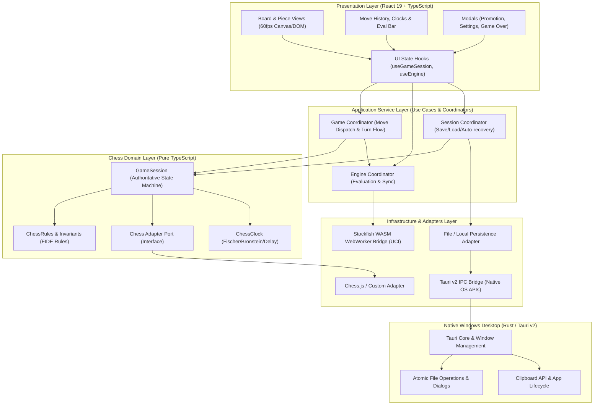
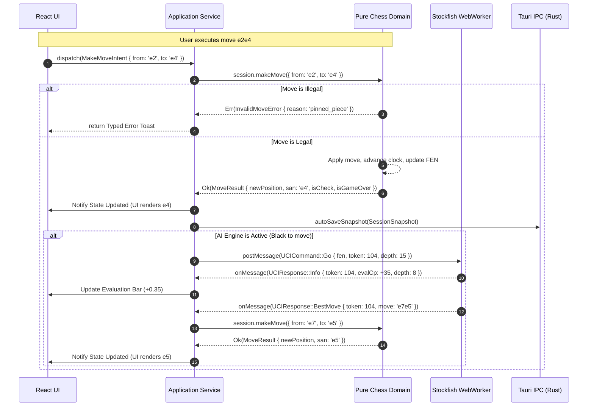
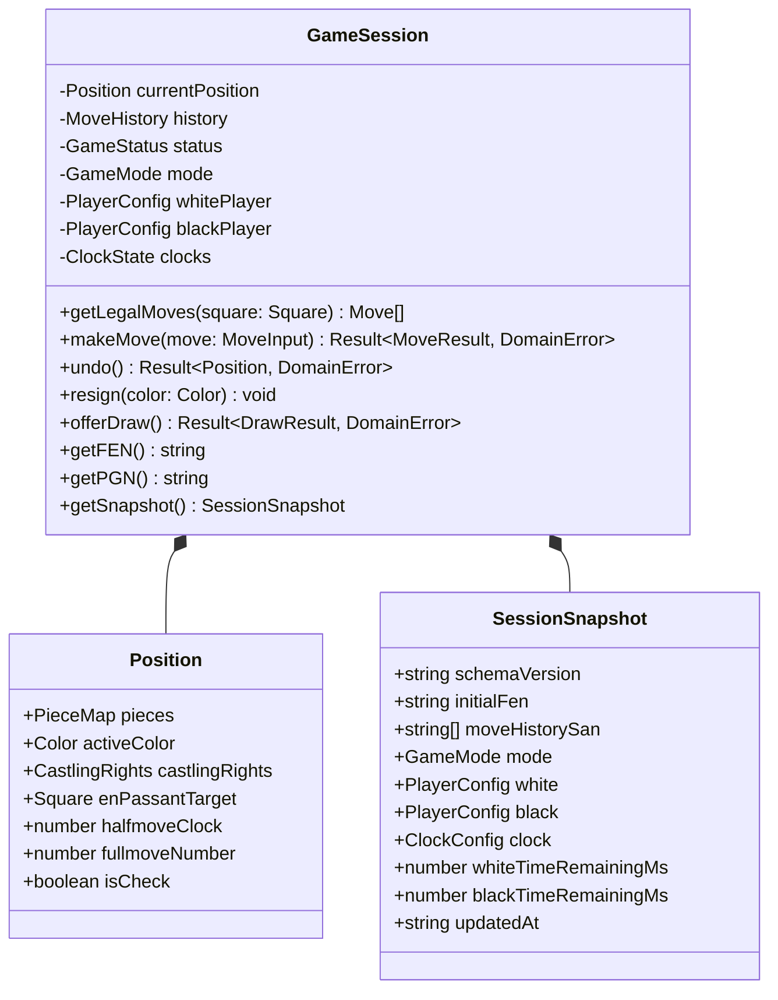
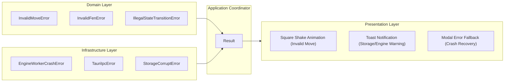

# ChessForge Technical Architecture & Module Boundaries

**Document Version:** 1.0.0  
**Status:** Approved Architectural Baseline  
**Target Platform:** Windows 10/11 Desktop (Tauri v2 + React 19 + TypeScript + Stockfish WASM)

---

## 1. Executive Summary & Architectural Principles

ChessForge is architected as a local-first, zero-cost, high-performance Windows desktop chess application. The architecture prioritizes:

1. **FIDE Correctness & Domain Purity:** The pure chess domain is independent of any UI framework, rendering layer, or desktop runtime.
2. **Decoupled Layering:** Strict unidirectional dependency flow:
   $$\text{Presentation (UI)} \longrightarrow \text{Application Service} \longrightarrow \text{Domain} \longrightarrow \text{Chess Library Adapter}$$
3. **Single Authoritative Runtime State:** The `GameSession` in the domain layer is the single source of truth during gameplay. Persistence is a snapshot; the engine is an advisor; UI state is transient.
4. **Worker & Native Isolation:** Stockfish WASM executes in an isolated WebWorker; native OS capabilities (file dialogs, window controls, settings persistence) execute across strictly typed Tauri v2 IPC boundaries.
5. **Robust Error & Boundary Safety:** Zero untyped `any`, runtime schema validation via Zod at all boundaries, and structured `Result<T, AppError>` error handling.



---

## 2. Layer Definitions & Responsibilities

### 2.1 Presentation Layer (`src/presentation/` or `src/ui/`)

- **Role:** Pure projection and user interaction layer.
- **Technologies:** React 19, TypeScript, Vanilla CSS (Design Tokens), Lucide Icons.
- **Responsibilities:**
  - Rendering the 8x8 chessboard, pieces, coordinates, legal move targets, and drag-and-drop visuals.
  - Rendering move history notation list, captured pieces, evaluation bar, and dual clocks.
  - Handling user input gestures (click-to-move, drag-and-drop, keyboard navigation `ArrowLeft`/`ArrowRight`).
  - Rendering transient modals (Pawn Promotion dialog, New Game modal, Settings modal, Game Over banner).
- **Prohibitions:**
  - **No chess legality rules:** The UI never calculates if a king is in check, if a square is an en passant target, or if castling is valid.
  - **No direct WebWorker access:** The UI never sends raw UCI strings to Stockfish.
  - **No direct Tauri IPC:** The UI invokes application services, which call typed infrastructure adapters.

### 2.2 Application Service Layer (`src/application/`)

- **Role:** Orchestrates workflows, coordinates asynchronous operations, and translates domain events into UI state updates.
- **Responsibilities:**
  - `GameCoordinator`: Handles user move intent -> calls domain validation -> updates session -> triggers engine evaluation if AI is active.
  - `EngineCoordinator`: Manages Stockfish worker lifecycle, UCI command dispatch, tokenized evaluation requests, search throttling, and stale response cancellation.
  - `SessionCoordinator`: Orchestrates auto-save on move commit, crash recovery on boot, PGN/FEN import/export workflows, and settings sync.
  - `ClockCoordinator`: Manages deterministic high-resolution game clocks with active side countdowns and increment application.

### 2.3 Pure Chess Domain Layer (`src/domain/`)

- **Role:** The immutable, authoritative core of chess logic, invariants, and state management.
- **Characteristics:** 100% pure TypeScript. Zero dependencies on React, Tauri, DOM, browser globals, or Node APIs. Fully portable and runnable in unit tests or WebWorkers.
- **Responsibilities:**
  - **Position & Board Representation:** Piece placement (rank/file 0-7 or a1-h8), active color, castling rights (`KQkq`), en passant target square, halfmove clock (50-move rule), fullmove number.
  - **Move Validation & Generation:** Legal move generation, pseudo-legal filtering, check avoidance, absolute pins, double checks, king safety.
  - **Special Moves:** Kingside/Queenside castling (verifying king/rook haven't moved and transit squares are unattacked), En Passant capture and 1-ply expiration, Pawn Promotion.
  - **Game Status & End Conditions:** Check, Checkmate, Stalemate, 50-move rule draw, Threefold repetition draw, Insufficient material draw.
  - **Notations & Codecs:** FEN parsing and serialization, Standard Algebraic Notation (SAN) generation and parsing, PGN tokenizer and game tree parser.
  - **Clock Domain:** Time control rules, Fischer increments, delay timing, timeout detection.

### 2.4 Infrastructure & Engine Layer (`src/infrastructure/`)

- **Role:** Implements external boundary adapters, WebWorker bridges, and Tauri IPC clients.
- **Components:**
  - `StockfishWorkerBridge`: Instantiates the Stockfish WASM WebWorker, manages typed UCI messaging (`uci`, `isready`, `ucinewgame`, `position fen <FEN>`, `go depth <N> / movetime <MS>`, `stop`), maps engine output (`info depth <D> score cp/mate <V> pv <moves>`, `bestmove <LAN>`) into typed events.
  - `PersistenceAdapter`: Encapsulates local file read/write and localStorage snapshot storage.
  - `TauriNativeBridge`: Typed wrapper around `@tauri-apps/api/core` for OS dialogs, window controls, and file access.

### 2.5 Desktop Platform Layer (`src-tauri/`)

- **Role:** Native Windows desktop runtime using Rust and Tauri v2.
- **Responsibilities:**
  - Native window creation, hardware acceleration, min/max bounds, custom title bar controls.
  - Scoped native file dialogs (`dialog:open`, `dialog:save`) restricted to `.pgn` and `.fen` extensions.
  - Atomic configuration file reading/writing in the user's local app data directory (`%APPDATA%/ChessForge`).
  - System clipboard interaction for FEN/PGN copy-paste.

---

## 3. Desktop, Native, and WebWorker Boundaries



### 3.1 Stockfish WASM WebWorker Protocol & Concurrency

- **Sandboxing:** Stockfish WASM is loaded inside a dedicated browser `Worker`. It has zero access to DOM, localStorage, or Tauri APIs.
- **CPU & Memory Guardrails:**
  - **Thread Limit:** Configured via `setoption name Threads value 1` (default) up to `Math.max(1, navigator.hardwareConcurrency - 1)`.
  - **Memory (Hash Table):** Configured via `setoption name Hash value 16` (16MB default, max 64MB) to prevent host memory bloat.
- **Request Invalidation (Token Generation):**
  Every search request generates a monotonic integer `searchToken`. If a user moves, restarts, or navigates history before the engine responds:
  1. The application sends `stop` to the WebWorker.
  2. The application increments the active `searchToken`.
  3. Any incoming `bestmove` or `info` bearing an older `searchToken` is immediately dropped.

### 3.2 Tauri v2 IPC Safety & Permission Scopes

- **Least Privilege Principle:** Tauri capabilities (`src-tauri/capabilities/default.json`) grant access only to:
  - `dialog:allow-open` (filter: `*.pgn`, `*.fen`)
  - `dialog:allow-save` (filter: `*.pgn`, `*.fen`)
  - `fs:allow-read-text-file` & `fs:allow-write-text-file` scoped strictly to `$APPDATA/ChessForge/**` and user-selected file paths.
  - `clipboard-manager:allow-read-text` & `clipboard-manager:allow-write-text`.
- **Zero Wildcard Permissions:** Wildcard filesystem or shell execution (`shell:execute`) is strictly disabled.

---

## 4. State Ownership & Single Source of Truth

To prevent dual-state divergence and synchronization bugs, state is strictly classified:

| State Category        | Authoritative Owner    | Lifecycle                 | Description                                                                                                                                                                                                                              |
| :-------------------- | :--------------------- | :------------------------ | :--------------------------------------------------------------------------------------------------------------------------------------------------------------------------------------------------------------------------------------- |
| **Domain State**      | `GameSession` (Domain) | Active Game               | Board matrix, active player turn, move history with SAN/LAN, castling rights, halfmove clock, game status (`ongoing`, `checkmate`, `stalemate`, `draw_50_moves`, `draw_repetition`, `draw_insufficient`, `resigned`, `timeout`), clocks. |
| **Persistence State** | File / Local Storage   | Durable Snapshot          | Versioned JSON snapshot containing initial FEN, move history SAN list, player profiles, clock settings, and application preferences.                                                                                                     |
| **Engine State**      | `EngineCoordinator`    | Ephemeral / Active Search | Current search depth, centipawn/mate score, principal variation (PV), search token, worker readiness.                                                                                                                                    |
| **UI State**          | React Component State  | Transient                 | Selected square, drag coordinates, animation progress, active modal visibility, hovered square highlight.                                                                                                                                |



---

## 5. Standardized Error Handling & Propagation

All layers utilize typed, explicit result types (`Result<T, AppError>`) rather than throwing untyped exceptions.



### 5.1 Type-Safe Error Contract

```typescript
export type DomainError =
  | {
      type: "ILLEGAL_MOVE";
      from: string;
      to: string;
      reason: "in_check" | "piece_pinned" | "invalid_path" | "not_your_turn";
    }
  | { type: "INVALID_FEN"; rawFen: string; reason: string }
  | { type: "INVALID_PGN"; rawPgn: string; line?: number; reason: string }
  | { type: "GAME_ALREADY_OVER"; status: string };

export type InfrastructureError =
  | { type: "ENGINE_CRASH"; message: string; recoverable: boolean }
  | { type: "ENGINE_TIMEOUT"; depth: number; elapsedMs: number }
  | { type: "FILE_IO_ERROR"; path?: string; message: string }
  | { type: "CORRUPTED_SNAPSHOT"; schemaErrors: string[] };

export type AppError = DomainError | InfrastructureError;

export type Result<T, E = AppError> =
  | { readonly success: true; readonly data: T }
  | { readonly success: false; readonly error: E };
```

---

## 6. Unidirectional Dependency Direction Rules

```text
Presentation Layer  ──>  Application Layer  ──>  Domain Layer
       │                        │                     │
       ▼                        ▼                     ▼
 (React / CSS / UI)       (Coordinators)       (Pure FIDE Logic)
                                │                     ▲
                                ▼                     │
                        Infrastructure Layer  ────────┘ (Implements Ports)
                        (Engine / Tauri / FS)
```

### Strict Architectural Invariants:

1. **Rule 1:** `Domain` depends on NOTHING. Zero imports from `src/ui`, `src/application`, `src/infrastructure`, `react`, `@tauri-apps`.
2. **Rule 2:** `Application` depends ONLY on `Domain` and `Infrastructure interfaces (Ports)`.
3. **Rule 3:** `Presentation` depends ONLY on `Application` and UI-specific utility libraries.
4. **Rule 4:** `Infrastructure` implements interfaces defined in `Application` / `Domain` and depends on `Domain` types.
5. **Rule 5:** Zero circular dependencies. Automated build gates enforce `madge --circular src/`.

---

## 7. Complete Module Directory Structure

```text
c:\Workspace\ChessGame\
├── .agents/                        # Agile personas, agent rules, and specialized skills
├── docs/                           # Architecture, ADRs, UX maps, Security & QA specs
│   ├── adr/                        # Architectural Decision Records (ADR-001 to ADR-005)
│   ├── architecture.md             # This document (Authoritative Architecture Baseline)
│   ├── product-requirements.md     # Product Requirements Document
│   ├── pull_requests/              # PR submission docs
│   ├── security/                   # Security audit reports & permission matrices
│   ├── testing/                    # Test Cases Catalogs & Quality Gate matrices
│   ├── ux-journeys.md              # Granular UX flow specifications
│   └── ux-state-map.md             # State machine transition maps
├── planning/                       # Master plans, phase plans, sprint specs
│   ├── master/
│   ├── phases/
│   └── sprints/
├── src/                            # Frontend Application Source (React 19 + TypeScript)
│   ├── application/                # Application Service Layer (Use Cases & Coordinators)
│   │   ├── coordinators/           # GameCoordinator, EngineCoordinator, SessionCoordinator
│   │   ├── ports/                  # EnginePort, PersistencePort, NativePort interfaces
│   │   └── index.ts
│   ├── domain/                     # Pure Chess Domain (Framework-independent)
│   │   ├── chess/                  # Position, Move, Rules, LegalGen, SpecialMoves, DrawRules
│   │   ├── clock/                  # ChessClock, TimeControl, IncrementLogic
│   │   ├── codecs/                 # FenCodec, PgnCodec, SanCodec
│   │   ├── models/                 # GameSession, Player, GameStatus, MoveHistory
│   │   └── index.ts
│   ├── infrastructure/             # Adapters, WebWorkers & Native Bridges
│   │   ├── engine/                 # StockfishWorkerBridge, UciProtocol, WorkerPool
│   │   ├── persistence/            # LocalStorageAdapter, AtomicFileAdapter, SnapshotValidator
│   │   ├── native/                 # TauriDialogAdapter, TauriClipboardAdapter, TauriWindowAdapter
│   │   └── index.ts
│   ├── presentation/               # UI Presentation Layer (React 19)
│   │   ├── components/             # Board, Square, Piece, EvalBar, HistoryPanel, Clocks, Modals
│   │   ├── hooks/                  # useGameSession, useEngineEval, useChessClock, useAudioEffect
│   │   ├── styles/                 # design-tokens.css, board.css, animations.css
│   │   └── App.tsx
│   └── shared/                     # Cross-layer Shared Types & Result Primitives
│       ├── result.ts               # Result<T, E>, Ok, Err helpers
│       ├── errors.ts               # AppError, DomainError, InfrastructureError
│       └── types.ts                # Square, Color, PieceType, GameMode
├── src-tauri/                      # Tauri v2 Native Host (Rust)
│   ├── capabilities/               # Scoped permissions (default.json)
│   ├── src/
│   │   ├── lib.rs                  # Tauri entrypoint, command handlers
│   │   └── main.rs
│   ├── Cargo.toml
│   └── tauri.conf.json
└── task.md                         # Scrum Master centralized task tracker
```

---

## 8. Extensibility & Future-Proofing (Local-First vs Online)

While ChessForge v1 is strictly a local Windows desktop application, the architecture is designed so that future enhancements (such as online game synchronization or cloud engine analysis) require **zero changes to the Pure Chess Domain**:

- **Pluggable Engine Port:** `ChessEnginePort` can be implemented by `StockfishWasmAdapter` (v1 default) or `RemoteUciEngineAdapter` (future).
- **Pluggable Session Port:** `GameSessionPort` can be bound to local human players, local AI, or a future `WebSocketPeerSessionAdapter`.
- **Portable Chess Domain:** Because the domain has zero UI or platform coupling, it can be executed in WebWorkers, Node microservices, or headless testing scripts without refactoring.
