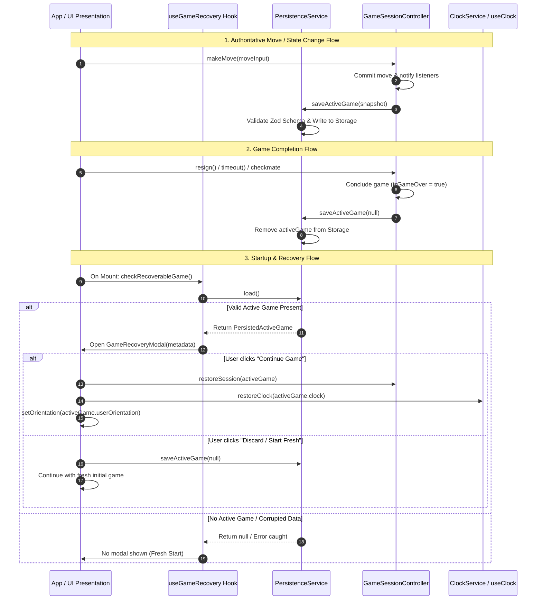

# Automatic Game Recovery Specification

## 1. Architectural Overview & Context

In a desktop chess application, interruptions (accidental window close, OS restart, power loss) must not cause players to lose an active match. In alignment with ADR-004 (_Local-First JSON Persistence and Atomic Recovery_) and Phase 08 objectives, ChessForge provides **Automatic Game Recovery** to ensure in-flight games are durably snapshot and can be seamlessly resumed or safely discarded on application restart.

---

## 2. Invariant Specifications (`REQ-RECOV-01` to `REQ-RECOV-06`)

### `REQ-RECOV-01`: Authoritative State Persistence Triggers

- Whenever an active game's authoritative state updates, a snapshot MUST be persisted via `PersistenceService.saveActiveGame()`.
- Authoritative triggers include:
  1. **Move Execution:** Dispatched and committed via `makeMove()`.
  2. **Move Undo:** Dispatched via `undo()`.
  3. **Mode & Opponent Update:** Updated via `updateGameMode()`.
  4. **Custom Position Load:** Loaded via `loadFen()`.
  5. **Time & Clock State:** Synchronized with remaining balances when moves occur.
- The snapshot payload MUST conform to `PersistedActiveGameSchema`:
  - `id: string` (Unique session identifier)
  - `mode: "human_vs_human" | "human_vs_engine"`
  - `fen: string` (Authoritative FEN representing current board placement and castling/en-passant rights)
  - `moveHistorySan: string[]` (Complete SAN move sequence)
  - `players: { w: PersistedPlayerConfig, b: PersistedPlayerConfig }`
  - `clock?: PersistedClockState` (Remaining white/black millisecond balances and time control)
  - `userOrientation: "w" | "b"`
  - `startedAt: number` (Epoch timestamp)
  - `updatedAt: number` (Epoch timestamp)

### `REQ-RECOV-02`: Game Completion Lifecycle & State Clearance

- When an active game concludes with any terminal state (`checkmate`, `stalemate`, `resigned`, `timeout`, `draw_agreement`, `draw_50_moves`, `draw_repetition`, `draw_insufficient_material`), the recovery snapshot MUST be immediately cleared by calling `saveActiveGame(null)`.
- Completed or aborted games MUST NEVER be presented as recoverable sessions upon relaunch.

### `REQ-RECOV-03`: Startup Detection & Recovery Workflow

- On application initialization, the recovery system inspects stored state.
- A session is classified as **Recoverable** if:
  1. `activeGame` is non-null.
  2. `activeGame.moveHistorySan.length > 0` OR `activeGame.fen !== STARTING_FEN`.
  3. The position in `activeGame.fen` does not represent a terminal game-over state.
- When a recoverable session is detected, the UI displays the `GameRecoveryModal` before normal play begins.

### `REQ-RECOV-04`: Safe Corruption & Schema Validation Guardrails

- If persisted recovery data is corrupt (malformed JSON, broken schema, invalid FEN string, unparsable move sequence):
  1. `PersistenceService` catches parsing and schema validation errors without throwing unhandled exceptions.
  2. The recovery detector ignores the corrupt entry and resets `activeGame` to `null`.
  3. The application cleanly boots into a fresh game state with 0 downtime or UI freezes.

### `REQ-RECOV-05`: Recovery Modal UX Contract (Continue vs Discard)

- The `GameRecoveryModal` provides full transparency and accessible choices:
  - **Metadata Presentation:** Displays game mode ("Pass & Play" vs "vs Computer"), player names, current turn, number of moves played, time control status, and timestamp of last activity.
  - **Continue Action (`btn-continue-game`):** Reconstitutes the domain state:
    - Loads the exact FEN position into `GameSessionController`.
    - Restores the move history, turn, and player configurations.
    - Synchronizes clock balances and starts/pauses clock appropriately.
    - Restores the board orientation.
    - Dismisses the modal.
  - **Discard Action (`btn-discard-game`):** Clears the recovery snapshot from storage (`saveActiveGame(null)`), leaves the fresh starting board intact, and dismisses the modal.

### `REQ-RECOV-06`: Decoupled Architecture & State Synchronization

- The recovery workflow must respect the unidirectional architecture:
  $$\text{GameRecoveryModal} \longrightarrow \text{useGameRecovery Hook} \longrightarrow \text{PersistenceService} \longrightarrow \text{GameSessionController / useClock}$$
- The UI layer does not validate chess FEN or manipulate raw storage; it interacts solely through the application services.
