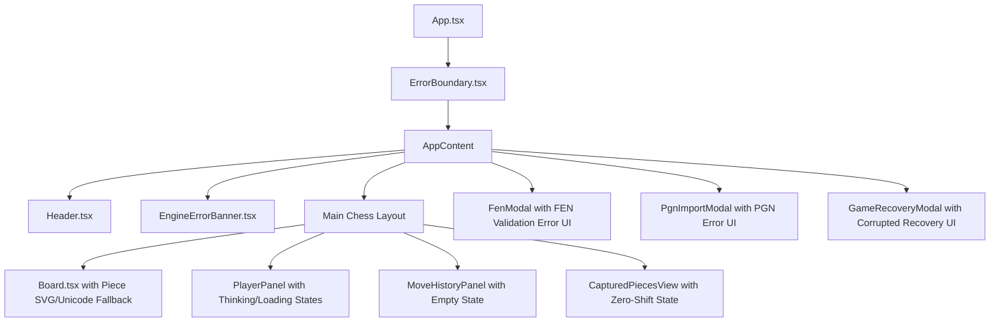

# ChessForge Specification: Error, Loading & Empty States

**Sprint:** Phase 09 · Sprint 05  
**Document:** `docs/architecture/error_loading_and_empty_states_specification.md`  
**Status:** Approved  
**Owners:** Chess Domain Architect & Dev Architect

---

## 1. Overview & Architectural Principles

A premier desktop chess application must fail gracefully, communicate clearly, and never strand the user in an unrecoverable or ambiguous state. In accordance with the ChessForge Local-First Mandate and Decoupled Architecture, failure paths must follow four core principles:

1. **State Immutability on Failure:** Erroneous operations (invalid FEN/PGN, failed engine calculations, corrupted storage) must never mutate or corrupt the authoritative `GameSession` or `ChessGame` state.
2. **Actionable, Human-Centric Communication:** Errors must explain what happened in plain language and present obvious next steps (e.g. "Retry Engine", "Switch to 2-Player", "Load Default Position", "Reset and Reload").
3. **Zero Raw Stack Dumps in Standard UI:** Raw stack traces and internal exceptions are logged to the developer console/diagnostics and made optionally copyable in a collapsed diagnostics drawer, never dumped raw into UI dialogues.
4. **Resilient Fallback Hierarchy:** Missing or failing assets (SVGs, sound synthesizers, theme tokens) degrade gracefully to Unicode chess symbols and silent operations without crashing.

---

## 2. Requirements Matrix

### 2.1 Error Boundary & Application Failures

- **`REQ-ERR-01` [App Error Boundary]:** An application-level React `ErrorBoundary` must wrap the primary UI tree. If any rendering exception or unhandled component error occurs:
  - It renders a dedicated `ErrorBoundaryFallback` screen matching the active theme tokens.
  - It provides immediate recovery buttons: "Try Again", "Restart Game", "Reset Settings & Reload", and "Copy Diagnostic Info".
  - It traps focus within the error view and includes `role="alert"` for assistive tech.
- **`REQ-ERR-02` [Engine Failure Resilience]:** If Stockfish WebWorker encounters a crash, init error, or unresponsive timeout:
  - An `EngineErrorBanner` is presented with clear severity styling.
  - The UI unfreezes: engine turn blocking is lifted so the user can continue playing as Human vs Human or retry the engine.
  - Options provided: "Retry Engine", "Switch to 2 Players", "Dismiss".
- **`REQ-ERR-03` [Invalid PGN Import Resilience]:** If imported PGN text is malformed or contains illegal moves:
  - `PgnImportModal` displays an inline error alert highlighting the parsing issue (e.g., "Illegal move 'e5' at move 1 for White" or "Invalid PGN header syntax").
  - The currently loaded game session remains completely untouched.
  - A "Load Sample Game" or "Clear" button is available to assist correction.
- **`REQ-ERR-04` [Invalid FEN Setup Resilience]:** If user enters an illegal or malformed FEN string:
  - `FenModal` displays contextual error messages (e.g., "Invalid piece placement: 8 ranks required", "Both White and Black must have exactly one King", "Kings cannot be adjacent").
  - Current board state is preserved until a valid FEN is submitted.
  - Quick-select valid preset buttons (Starting Position, Kiwipete, Endgame) are accessible.
- **`REQ-ERR-05` [Corrupted Persistence Recovery]:** If stored game session data or settings in local storage fails Zod schema validation or JSON parsing:
  - The application catches the parsing failure gracefully.
  - Corrupted keys are isolated, diagnostic error is logged, and clean defaults are instantiated.
  - `useGameRecovery` alerts the user with a clean option to start fresh without throwing unhandled exceptions.
- **`REQ-ERR-06` [Missing Asset & Theme Fallback]:** If an SVG piece set, custom color token, or Web Audio synthesizer is missing or fails:
  - Pieces fall back smoothly to standard Unicode glyphs (`♔`, `♕`, etc.) with full ARIA semantics (`Piece.tsx`).
  - Board theme falls back to standard classic wood/slate palette.
  - Sound effects degrade to no-op without interrupting gameplay flow.

### 2.2 Loading States

- **`REQ-LOAD-01` [Engine Evaluation & Move Search]:** When the engine is calculating a move:
  - `PlayerPanel` and `Board` display an animated pulse / thinking indicator ("Stockfish is thinking...").
  - A "Cancel Thinking" button allows instant interruption of the engine calculation.
  - Frame budget remains 60fps; no UI thread blocking.
- **`REQ-LOAD-02` [PGN File Reading / Processing]:** When reading large PGN files:
  - An inline loading spinner / indicator is displayed during file read and validation.
- **`REQ-LOAD-03` [Engine Initialization]:** While Stockfish WASM worker is loading and initializing:
  - Status reflects "Engine Initializing..." without blocking user setup of the board.

### 2.3 Contextual Empty States

- **`REQ-EMPTY-01` [Move History Empty State]:** When a new game starts with 0 moves:
  - `MoveHistoryPanel` renders a clean, welcoming empty state banner: "No moves yet. Make a move on the board or press Ctrl+N for a new game."
  - Shows shortcut hints and game mode indicators.
- **`REQ-EMPTY-02` [Captured Pieces Empty State]:** When no pieces have been captured yet:
  - `CapturedPiecesView` renders an unobtrusive placeholder container maintaining height to prevent layout shift.
- **`REQ-EMPTY-03` [PGN Export / Empty PGN]:** When exporting a game with 0 moves:
  - Generates valid PGN headers with standard initial FEN and indicates "Empty move text".
- **`REQ-EMPTY-04` [Settings & Shortcuts Modals]:** If shortcuts or settings lists are filtered/empty:
  - Renders clean "No matching options found" state with reset filter action.

---

## 3. UI Component Architecture

---

## 4. Diagnostics & Safety Architecture

1. **Diagnostic Logger (`src/services/diagnostics/`):** Centralized memory-bounded circular buffer for recent application warnings, engine lifecycle events, and validation errors.
2. **Copy Diagnostic Data:** Error boundary fallback screen provides a 1-click "Copy Diagnostics" button that serializes environment info (OS platform, app version, screen resolution, timestamp, recent error message) into clipboard without collecting private data.
3. **Local-First Boundary:** No external network requests, crashlytics, or analytics endpoints. Diagnostics remain strictly local.
