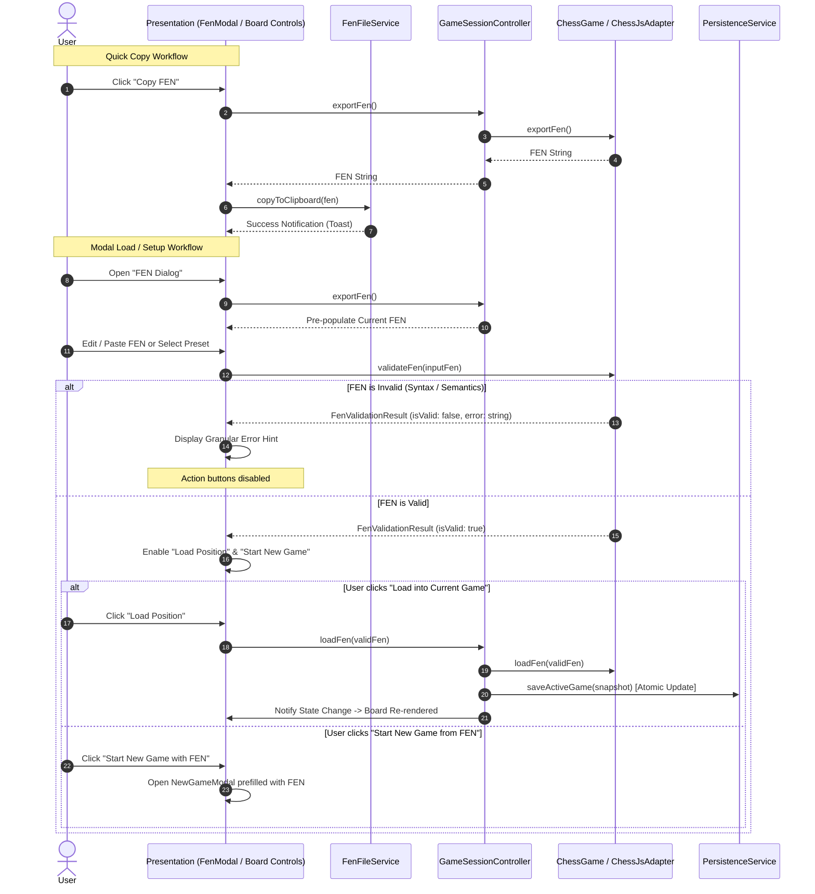

# FEN Workflow & Position Setup Architecture Specification

**Document Version:** 1.0.0  
**Status:** Approved  
**Author:** Chess Domain Architect & Dev Architect  
**Deciders:** Chess Domain Architect, Dev Architect, SDET Architect, Security Officer  
**Sprint Reference:** Phase 08 · Sprint 04 (`P08-S04-fen-workflow`)

---

## 1. Executive Summary & Goals

Forsyth-Edwards Notation (FEN) is the standard notation for describing a particular board position of a chess game. This specification establishes the architecture, invariants, domain boundaries, validation rules, clipboard/file interactions, and UI workflows for **FEN Export, Inspection, Copy, and Load/Position Setup** in ChessForge.

### Core Objectives

1. **Exact FEN Export & Instant Copy:** Provide 100% deterministic FEN export for the active board position, including piece placements, active color, castling availability, en passant target square, halfmove clock, and fullmove number. Enable single-click copying to the system clipboard with instant visual toast feedback.
2. **Dedicated FEN Inspection & Setup Modal:** Provide an accessible, user-friendly dialog allowing players and analysts to inspect the current FEN string, paste/edit arbitrary FEN positions, choose standard presets (e.g. Starting Position, King & Pawn Endgame, Lucena Position, Knight vs Bishop Endgame), and preview validity.
3. **Strict Syntactic & Semantic Validation:** Treat all pasted or imported FEN strings as untrusted external input. Validate the 6 space-delimited tokens, 8 ranks summing to 8 squares, valid piece characters, prohibition of pawns on 1st/8th ranks, exact king counts (1 White, 1 Black), valid active color, valid castling rights, rank consistency for en passant squares, and non-negative integer clocks.
4. **Non-Destructive State Protection:** If a FEN string fails validation or is rejected, the active game session, move history, clocks, and board position must remain 100% untouched.
5. **Flexible Setup Options:** Support two distinct actions when loading a valid FEN:
   - **Load Position into Current Session:** Updates board position and active turn in place while resetting move history and active clocks.
   - **Start New Game from FEN:** Opens or configures a new game setup with the specified position, allowing custom player names, game modes (Human vs Human or Human vs Stockfish Engine), and clock time controls.
6. **Local-First & Capability Sandboxed:** Execute all clipboard and dialog operations with zero network calls and full zero-privilege fallback.

---

## 2. Architectural Layering & Data Flow

---

## 3. Formal System Requirements

### `REQ-FEN-01`: Deterministic FEN Export & Instant Copy

- The system must serialize the active position into a canonical 6-token FEN string:
  $$\text{FEN} = \langle \text{piece\_placement}\rangle \ \langle \text{active\_color}\rangle \ \langle \text{castling}\rangle \ \langle \text{en\_passant}\rangle \ \langle \text{halfmove\_clock}\rangle \ \langle \text{fullmove\_number}\rangle$$
- Quick-copy actions must copy the current FEN string to the system clipboard via `FenFileService` and present an ephemeral feedback indicator ("Copied to clipboard!").

### `REQ-FEN-02`: FEN Dialog & Inspection Modal

- The application must provide a dedicated `FenModal` accessible from the board controls.
- The modal must contain:
  1. **Current Position FEN field / Textarea** with selectable text and copy-to-clipboard button.
  2. **Editable FEN input** supporting paste and manual adjustment.
  3. **Preset Positions dropdown / buttons**:
     - Standard Starting Position (`rnbqkbnr/pppppppp/8/8/8/8/PPPPPPPP/RNBQKBNR w KQkq - 0 1`)
     - King and Pawn Endgame (`8/8/8/4k3/8/8/4P3/4K3 w - - 0 1`)
     - Lucena Position (`1K6/1P1k4/8/8/8/8/r7/2R5 w - - 0 1`)
     - Opposite-Colored Bishops Endgame (`8/2b5/8/4k3/8/8/2B1K3/8 w - - 0 1`)
     - Knight vs Bishop Endgame (`8/2n5/8/4k3/8/8/2B1K3/8 w - - 0 1`)
  4. **Live validation indicator** updating synchronously on every input change.
  5. **Load Position button** to load the validated position immediately.
  6. **Start New Game button** to transition to `NewGameModal` with the FEN pre-filled.

### `REQ-FEN-03`: Strict Syntactic & Semantic Validation

- Validation via `validateFen` must enforce all FIDE chess constraints:
  - **Token Count:** Exactly 6 whitespace-delimited fields.
  - **Ranks & Squares:** Exactly 8 ranks separated by `/`, each rank resolving to exactly 8 squares without consecutive digits.
  - **Piece Placement:** Allowed characters `p, n, b, r, q, k, P, N, B, R, Q, K`.
  - **Pawn Placement:** Zero pawns on the 1st or 8th rank.
  - **King Counts:** Exactly one White King (`K`) and one Black King (`k`).
  - **Active Color:** Strictly `'w'` or `'b'`.
  - **Castling Rights:** `'-'` or a unique non-empty subset of `{ 'K', 'Q', 'k', 'q' }`.
  - **En Passant Square:** `'-'` or valid coordinate (`[a-h]3` when Black is to move; `[a-h]6` when White is to move).
  - **Halfmove Clock:** Integer $\ge 0$.
  - **Fullmove Number:** Integer $\ge 1$.

### `REQ-FEN-04`: Non-Destructive State Protection

- If a user inputs an invalid FEN string, the "Load" button must be disabled.
- If an programmatic attempt is made to load an invalid FEN via `loadFen(fen)`, the operation must return `Result.err(ChessDomainError)` and leave the current game state, move history, and clocks completely unchanged.

### `REQ-FEN-05`: Atomic Game State Replacement & Reset

- When a valid FEN is loaded into the active session:
  1. The chess board state is updated to the specified FEN.
  2. The move history is reset to empty (or starting position anchor).
  3. Captured pieces are reset according to the new board inventory.
  4. Clocks are reset or synchronized to the session's time control.
  5. Any active AI engine evaluation or search is immediately cancelled.
  6. The persistence service atomically records the updated active game snapshot.

### `REQ-FEN-06`: Safe Desktop Clipboard Service (`FenFileService`)

- The clipboard service must safely utilize standard Web Clipboard APIs (`navigator.clipboard.writeText`, `navigator.clipboard.readText`) with fallback to hidden textarea selection.
- All errors (clipboard permissions denied, browser restriction) must fail gracefully without unhandled exceptions or application panics.

### `REQ-FEN-07`: Invariant Preservation & Round-trip Semantics

- For any valid FEN string $F$, loading $F$ and immediately exporting the position must yield an equivalent FEN $F'$ where piece placements, active color, castling rights, and en passant squares match:
  $$\text{exportFen}(\text{loadFen}(F)) \equiv F$$
