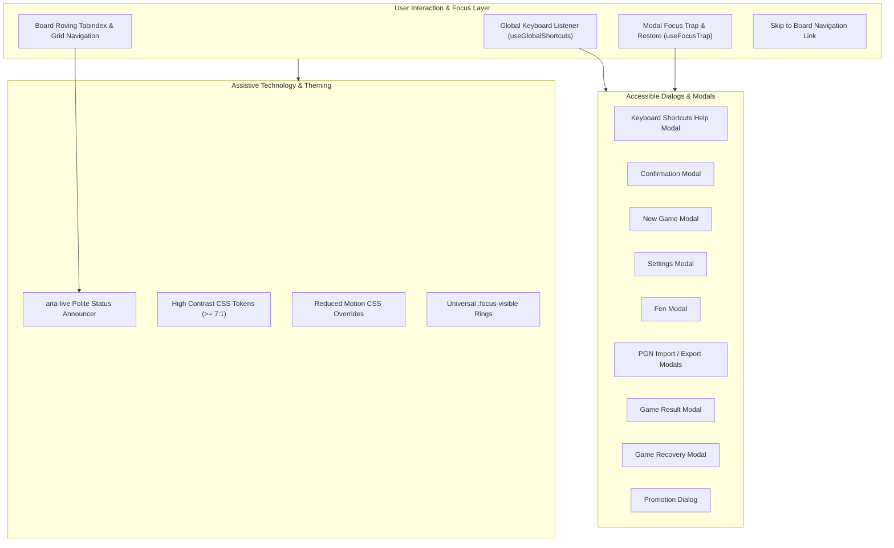

# Keyboard & Accessibility Completion Specification

## 1. Architectural Overview & Purpose

ChessForge is engineered as a premier, local-first Windows desktop chess application. To deliver an exceptional user experience for all chess enthusiasts—including keyboard-only power users, screen reader users, and individuals with visual or vestibular sensitivities—this specification establishes the comprehensive standards for keyboard operation, focus orchestration, assistive technology semantics, high-contrast theming, and reduced-motion enforcement across all application views.

---

## 2. Requirements Specification

### 2.1 Keyboard Operation & Navigation Requirements (`REQ-KBD`)

- **`REQ-KBD-01: Global Shortcut Mapping`**:
  The application shall support ubiquitous global keyboard shortcuts when no modal dialog is open:
  - `Ctrl + N` / `Cmd + N`: Open New Game Modal
  - `Ctrl + Z` / `Cmd + Z` or `u`: Undo Move (when legal and applicable)
  - `Ctrl + F` / `Cmd + F` or `f` / `F`: Flip Board orientation (White / Black)
  - `Ctrl + ,` / `Cmd + ,`: Open Settings Modal
  - `Ctrl + E` / `Cmd + E`: Open PGN Export Modal
  - `Ctrl + I` / `Cmd + I`: Open PGN Import Modal
  - `Ctrl + Shift + F`: Open FEN Modal
  - `?` or `F1` or `Shift + /`: Open Keyboard Shortcuts Help Cheat Sheet Modal
  - `Escape`: Cancel piece selection / promotion dialog or dismiss active modal dialog.

- **`REQ-KBD-02: Board Grid Roving Tabindex & Directional Traversal`**:
  - The chessboard shall implement a roving `tabindex` pattern where exactly one square holds `tabindex="0"` while other 63 squares hold `tabindex="-1"`.
  - Arrow keys (`ArrowUp`, `ArrowDown`, `ArrowLeft`, `ArrowRight`) move square focus orthogonally, respecting board orientation (`w` vs `b`).
  - Corner/Edge navigation keys (`Home`, `End`, `PageUp`, `PageDown`) jump to file and rank extremes.
  - `Enter` / `Space` activates or selects the focused square / executes a legal move.

- **`REQ-KBD-03: Focus Order & Skip Links`**:
  - The DOM order and tab sequence shall follow logical layout flow:
    1. Skip to Board link (`.skip-link` visible on focus)
    2. App Header (Brand, Status, Shortcuts Help button, Settings button)
    3. Main Board Section (Engine status banner if active, status bar, opponent player panel, chessboard grid, player panel, board control action bar)
    4. Sidebar Section (Move history notation table, information card).

- **`REQ-KBD-04: Shortcut Suppression During Text Input`**:
  - Single-character shortcuts (`u`, `f`, `?`) and editing chords shall not trigger when the active focus is inside an `<input>`, `<textarea>`, `<select>`, or content-editable field.

---

### 2.2 Modal Focus Trapping & Restoration (`REQ-TRAP`)

- **`REQ-TRAP-01: Focus Trapping Guarantee`**:
  - When any modal dialog or confirmation popup opens (`aria-modal="true"`), keyboard focus is immediately transferred to the modal's primary interactive control or close button.
  - Pressing `Tab` from the last focusable element in the dialog wraps focus to the first focusable element.
  - Pressing `Shift + Tab` from the first focusable element wraps focus to the last focusable element.

- **`REQ-TRAP-02: Focus Restoration on Dismissal`**:
  - Upon dialog closure (via Confirm, Cancel, Close button, backdrop click, or `Escape`), keyboard focus is reliably restored to the trigger element that launched the modal.

- **`REQ-TRAP-03: Zero Real-Time Sleeps`**:
  - Dialog focus transitions must use synchronous or microtask/animation-frame scheduling rather than arbitrary `setTimeout` sleeps to prevent race conditions and flakiness.

---

### 2.3 Assistive Technology & ARIA Semantics (`REQ-A11Y`)

- **`REQ-A11Y-01: Accessible Names on All Interactive Elements`**:
  - All buttons, icon triggers, tabs, inputs, radio selectors, and close buttons shall possess unambiguous, concise accessible names via text content, `aria-label`, or `aria-labelledby`.

- **`REQ-A11Y-02: Screen Reader Live Announcements`**:
  - A dedicated `aria-live="polite"` region (`data-testid="board-live-announcer"`) shall announce salient chess and system state transitions:
    - Piece moves (e.g. _"White plays Nf3"_ / _"Black captures on d4"_)
    - Special events (_"Check!"_, _"White wins by Checkmate"_, _"Draw by Stalemate"_, _"Resigned"_, _"Flag fall timeout"_)
    - Board orientation flips (_"Board flipped to Black perspective"_)
    - FEN/PGN position loads (_"Position loaded from FEN"_).

- **`REQ-A11Y-03: Non-Color Dependent State Indication`**:
  - Important chess states (Check, Checkmate, Legal Targets, Selected Square, Last Move) must never rely solely on color.
  - Check states feature explicit SVG indicator icons, textual status badges, and screen reader labels.
  - Legal moves display distinct circular dots and capture target rings.

---

### 2.4 High-Contrast & Reduced-Motion Invariants (`REQ-MOT-A11Y`)

- **`REQ-MOT-A11Y-01: High-Contrast Compliance`**:
  - In High-Contrast theme or `@media (forced-colors: active)` / `@media (prefers-contrast: more)`, text and interactive elements shall achieve a minimum contrast ratio of `7:1` (WCAG AAA).
  - All focused interactive elements display a prominent, high-contrast 2px focus ring (`outline: 2px solid var(--focus-ring, #38bdf8); outline-offset: 2px`).

- **`REQ-MOT-A11Y-02: Reduced-Motion Invariant`**:
  - When reduced-motion is enabled (via system preferences or in-app Settings toggle), all piece translation transitions, pulse animations, and modal sliding transforms are immediately bypassed (`transition-duration: 0.001ms !important; animation-duration: 0.001ms !important`).
  - No animations shall ever block or delay authoritative game state progression.

---

## 3. Architecture & Implementation Design

---

## 4. Verification & Quality Gates

1. **Unit & Integration Testing (Vitest + React Testing Library)**:
   - Full keyboard navigation and roving tabindex traversal.
   - Global shortcuts firing appropriate actions and respecting input fields.
   - Modal focus trapping, tab cycling, and trigger focus restoration.
   - Live announcer text updates upon moves, checks, and game terminations.
2. **E2E Automation (Playwright)**:
   - Complete keyboard-only game navigation flow (Start new game -> play moves via arrows/enter -> undo -> export PGN -> open settings -> close with Escape).
3. **Static Analysis & Linting**:
   - `npm run typecheck` (0 errors)
   - `npm run lint` (0 errors/warnings)
   - `npm run format:check` (100% compliant).
