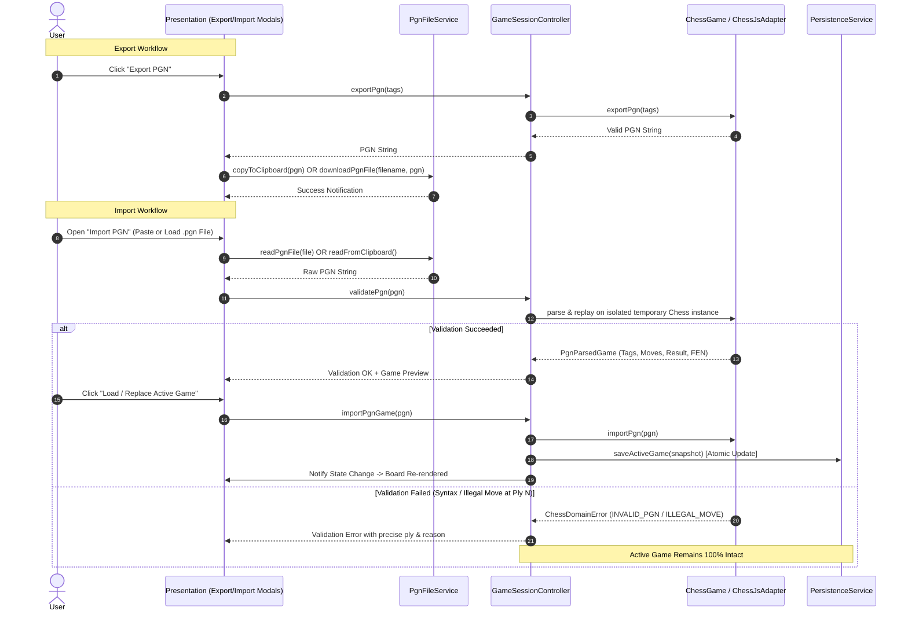

# PGN Export and Import UI & Persistence Architecture Specification

**Document Version:** 1.0.0  
**Status:** Approved  
**Author:** Chess Domain Architect & Dev Architect  
**Deciders:** Chess Domain Architect, Dev Architect, SDET Architect, Security Officer  
**Sprint Reference:** Phase 08 · Sprint 03 (`P08-S03-pgn-export-and-import-ui`)

---

## 1. Executive Summary & Goals

Portable Game Notation (PGN) is the universal standard for recording chess matches. This specification establishes the architecture, invariants, domain boundaries, validation rules, and UI interaction contracts for **PGN Export and Import** in ChessForge.

### Core Objectives

1. **Lossless Export:** Export active game sessions into compliant PGN text with the complete Seven Tag Roster, accurate move history in Standard Algebraic Notation (SAN), initial FEN tags (when applicable), and unambiguous terminal result tokens (`1-0`, `0-1`, `1/2-1/2`, `*`).
2. **Zero-Destruction Import Validation:** Treat imported PGN as untrusted input. Validate syntax and legality of all move tokens by replaying on an isolated domain instance before mutating the active session. If validation fails at any ply, the active game session remains 100% untouched.
3. **Atomic Session Replacement & State Synchronization:** On confirmed import, cleanly replace the active game session, configure player names from PGN tags, reset clocks, update captured pieces, and notify subscribers.
4. **Local-First & Capability Sandboxed:** Execute all file saving, loading, and clipboard operations locally without backend servers, external network calls, or excessive native permissions.

---

## 2. Architectural Layering & Data Flow



---

## 3. Formal System Requirements

### `REQ-PGN-01`: Standard PGN Export Formatting & Seven Tag Roster

- The system must format exported PGN strings adhering to the Seven Tag Roster standard:
  - `[Event "ChessForge Match"]` (or custom event tag)
  - `[Site "ChessForge Desktop"]`
  - `[Date "YYYY.MM.DD"]` (current UTC or session start date)
  - `[Round "1"]`
  - `[White "<White Player Name>"]`
  - `[Black "<Black Player Name>"]`
  - `[Result "<Result>"]` (`1-0`, `0-1`, `1/2-1/2`, or `*`)
- If the game started from a non-standard position, include `[SetUp "1"]` and `[FEN "<Starting FEN>"]`.
- The move section must be formatted in numbered move pairs (e.g., `1. e4 e5 2. Nf3 Nc6`) ending with the terminal result token.

### `REQ-PGN-02`: Strict Pre-Mutation Replay & Semantic Validation

- Before any mutation of the active game session:
  1. The raw PGN string must be parsed for header tags, comments, recursive annotation variations (RAV), and move tokens.
  2. A clean, isolated domain adapter instance must execute each move token sequentially.
  3. If an illegal move, ambiguous SAN token, or invalid syntax is encountered at ply $k$, validation must return an error payload containing:
     - Error code: `INVALID_PGN` or `ILLEGAL_MOVE`
     - Exact ply index $k$
     - Failing move token
     - FEN position immediately preceding the illegal move
- The active game session must never experience partial move application or state corruption.

### `REQ-PGN-03`: Atomic Game Session Replacement

- When an imported PGN is confirmed by the user:
  - The active `ChessGame` instance is replaced with the validated replay state.
  - The `GameSessionController` updates its player metadata:
    - If `[White "..."]` is present and non-empty, set White player name.
    - If `[Black "..."]` is present and non-empty, set Black player name.
  - Clocks are reset or configured to the active session time controls.
  - Captured pieces and move history are re-derived.
  - The automatic game recovery persistence is immediately updated with the new session snapshot (or cleared if the imported game is already completed).

### `REQ-PGN-04`: Import Preview & Verification Modal

- The UI must provide an intuitive modal dialog for importing PGN with:
  - A multi-line text area for pasting PGN.
  - A "Choose File (.pgn)" upload button.
  - Live or on-demand validation feedback.
  - A structured preview card displaying:
    - Players (White vs Black)
    - Event & Date
    - Total Moves (plies and move pairs)
    - Game Result (e.g. White Wins, Black Wins, Draw, In Progress)
  - Clear error callout when the PGN is invalid.
  - Explicit "Load Game" primary action (disabled when invalid or empty) and "Cancel" secondary action.

### `REQ-PGN-05`: Export Modal & Quick Actions

- The UI must provide an Export PGN modal and toolbar trigger with:
  - Read-only preview of the generated PGN text.
  - "Copy to Clipboard" button with instant visual confirmation ("Copied!").
  - "Download .pgn File" button triggering a standard safe local download with a default filename `chessforge_game_YYYYMMDD_HHMMSS.pgn`.
  - Optional editable metadata fields (Event, White, Black).

### `REQ-PGN-06`: Safe Local File & Clipboard I/O

- File saving and loading must use standard browser/Web platform capabilities (`Blob`, `URL.createObjectURL`, `<input type="file" accept=".pgn,text/plain">`, `navigator.clipboard`) with graceful fallback when clipboard permissions are denied.
- No native file system escalation or unrestricted path writes are permitted.

### `REQ-PGN-07`: Invariant Preservation

- FEN and PGN round-trip integrity:
  $$\text{Export}(\text{Import}(PGN)) \equiv PGN \pmod{\text{standard tag normalization}}$$
- Active game continuity invariant: If import is cancelled or rejected, `activeGame(t_1) === activeGame(t_0)`.

---

## 4. Domain & Service Interface Specifications

```typescript
export interface PgnValidationSuccess {
  readonly isValid: true;
  readonly parsedGame: {
    readonly tags: PgnTags;
    readonly moves: readonly string[];
    readonly result: PgnResult;
    readonly startingFen?: string;
    readonly moveCount: number;
    readonly finalFen: string;
  };
}

export interface PgnValidationFailure {
  readonly isValid: false;
  readonly error: string;
  readonly ply?: number;
  readonly moveToken?: string;
}

export type PgnValidationResult = PgnValidationSuccess | PgnValidationFailure;
```

---

## 5. Security & Desktop Safety Bounds

1. **Unbounded Input Guard:** PGN text input is capped at $1\text{ MB}$ to prevent Denial-of-Service / ReDoS from malicious payloads.
2. **Untrusted Input Sanitization:** Tag keys and values are sanitized to prevent script injection or DOM corruption.
3. **Local-First Assurance:** 0 external requests; 100% offline evaluation.
