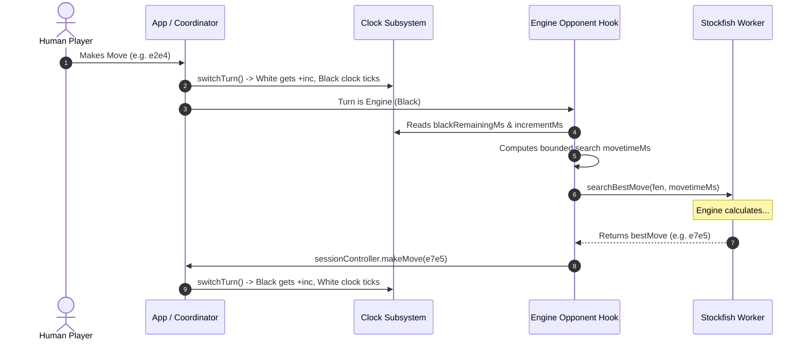
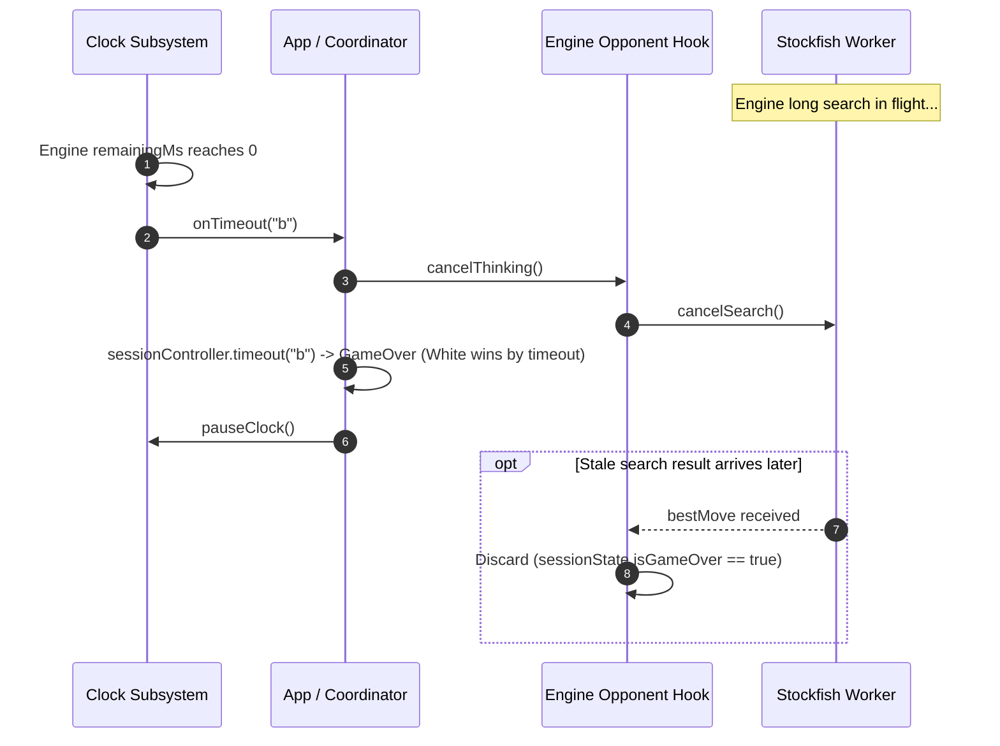

# AI and Clock Integration Specification

## 1. Scope & Architectural Intent

This specification establishes the architectural contract and domain invariants for the interaction between the **AI Engine Subsystem** (Stockfish WASM / `EngineService` / `useEngineOpponent`) and the **Chess Clock Subsystem** (`ClockController` / `useClock`) in **ChessForge**.

The primary objective is to guarantee that timed Human vs Engine and Engine vs Human games operate with strict chess time controls, zero timer drift, robust timeout enforcement, dynamic engine search budgeting, and deterministic lifecycle cleanup during interrupts (reset, undo, resignation, game-over).

---

## 2. Invariant Requirements

### `REQ-AI-CLK-01`: AI Turn Clock Activation & Synchronization

1. When it is the engine's turn to move and the chess clock is active (`timeControl.type !== "none"`), the engine's clock MUST tick continuously for the duration of the engine's calculation.
2. In Human vs Engine games:
   - When the Human completes a move, the turn switches to the Engine, applying Fischer increment to the Human and activating the Engine's clock.
   - When the Engine completes and commits its move to the authoritative `GameSessionController`, the turn switches back to the Human, applying Fischer increment to the Engine and activating the Human's clock.
3. In Engine vs Human games (Engine playing White):
   - Prior to move 1, clock is in `ready` state.
   - When the Engine commits move 1, White's move is registered, White receives any configured increment, and Black's clock starts ticking.

### `REQ-AI-CLK-02`: Dynamic Engine Search Time Budgeting

1. When calculating a move in a timed game (`timeControl.type !== "none"`), the engine's search parameters (`movetimeMs`) MUST be dynamically constrained by the engine's remaining time and increment.
2. Engine search time allocation formula:
   $$\text{targetMovetime} = \min\left(\text{difficulty.movetimeMs},\ \max\left(50\text{ ms},\ \left\lfloor \frac{\text{remainingMs}}{20} + \frac{\text{incrementMs}}{2} \right\rfloor\right)\right)$$
   $$\text{allocatedMovetime} = \min\left(\text{targetMovetime},\ \max\left(50\text{ ms},\ \text{remainingMs} - 100\text{ ms}\right)\right)$$
3. If remaining time is critically low ($\le 200\text{ ms}$), the engine must use a minimal emergency search limit ($50\text{ ms}$) to prevent immediate flag fall.
4. If `timeControl.type === "none"`, the engine uses the default static `difficulty.movetimeMs`.

### `REQ-AI-CLK-03`: Engine Timeout Detection & Authoritative Flag Fall

1. When the Engine's clock reaches $0\text{ ms}$ before a move is committed:
   - The `ClockController` flags and fires `onTimeout(engineColor)`.
   - The `GameSessionController` immediately transitions the game state to `isGameOver: true`, `result.winner = humanColor`, `result.reason = "timeout"`.
   - Active engine thinking is immediately halted (`cancelThinking()` / `engineService.cancelSearch()`).
   - The clock is frozen at `00:00`.
   - The Game Result Modal and screen reader announcements display the timeout victory.

### `REQ-AI-CLK-04`: Move Invalidation Post-Timeout / Post-Game-Over

1. If an engine search resolves after a timeout or terminal game-over event has occurred (due to race conditions or asynchronous worker processing):
   - The returned move MUST be strictly rejected and discarded.
   - No board state mutation or clock resumption is permitted once `sessionState.isGameOver` is true.

### `REQ-AI-CLK-05`: Synchronous Cleanup on Reset, Restart, Rematch, and Undo

1. If the user invokes **Restart**, **New Game**, **Undo**, or **Resign** while the engine is calculating:
   - Any pending engine search token MUST be cancelled immediately.
   - The clock MUST be paused/reset to match the new session state.
   - Stale engine responses from the cancelled session MUST NOT be processed.

### `REQ-AI-CLK-06`: Deterministic Testing Invariant

1. All AI and Clock integration tests MUST execute deterministically using mock engine workers (`MockEngineWorkerBridge`) and injected fake time providers (`DeterministicTimeProvider` / `vi.useFakeTimers()`).
2. Zero real-time sleeps (`setTimeout`) are allowed in test suites.

---

## 3. Interaction Sequence Diagrams

### 3.1 Normal Turn Flow with Fischer Increment

### 3.2 Engine Flag Fall / Timeout Flow

