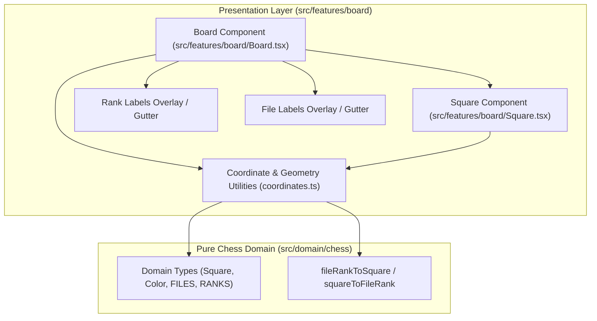

# Board Layout & Coordinate Invariants Specification

## 1. Executive Summary

This document formalizes the mathematical geometry, square parity, coordinate mapping, and orientation invariants for the **ChessForge Board Presentation Layer** (`src/features/board`).

Per [ADR-001](file:///c:/Workspace/ChessGame/docs/adr/ADR-001-decoupled-pure-chess-domain.md) and [docs/architecture.md](file:///c:/Workspace/ChessGame/docs/architecture.md), visual board layout components are decoupled from chess domain rule validation while strictly respecting FIDE coordinate conventions and deterministic bidirectional coordinate-to-screen mappings.

---

## 2. Mathematical Geometry & Square Parity

### 2.1 File and Rank Indexing

The chess board consists of an $8 \times 8$ grid of 64 discrete squares:

$$\text{Files: } f \in \{0, 1, 2, 3, 4, 5, 6, 7\} \longleftrightarrow \{\text{'a'}, \text{'b'}, \text{'c'}, \text{'d'}, \text{'e'}, \text{'f'}, \text{'g'}, \text{'h'}\}$$

$$\text{Ranks: } r \in \{0, 1, 2, 3, 4, 5, 6, 7\} \longleftrightarrow \{\text{'1'}, \text{'2'}, \text{'3'}, \text{'4'}, \text{'5'}, \text{'6'}, \text{'7'}, \text{'8'}\}$$

Every square is identified by its standard algebraic notation $\text{Square} = f_{\text{char}} + r_{\text{char}} \in \{\text{'a1'} \dots \text{'h8'}\}$.

### 2.2 Square Color Parity Invariant

FIDE Rule 2.1 dictates that the bottom-right corner square from each player's perspective must be light ("white on right"), meaning `a1` and `h8` are dark squares, while `h1` and `a8` are light squares.

$$\text{SquareColor}(f, r) = \begin{cases} \text{'dark'} & \text{if } (f + r) \pmod 2 = 0 \\ \text{'light'} & \text{if } (f + r) \pmod 2 = 1 \end{cases}$$

**Verification Matrix:**

- `a1` ($f=0, r=0$): $(0+0) \pmod 2 = 0 \implies \text{'dark'}$
- `h1` ($f=7, r=0$): $(7+0) \pmod 2 = 1 \implies \text{'light'}$
- `a8` ($f=0, r=7$): $(0+7) \pmod 2 = 1 \implies \text{'light'}$
- `h8` ($f=7, r=7$): $(7+7) \pmod 2 = 0 \implies \text{'dark'}$
- `e4` ($f=4, r=3$): $(4+3) \pmod 2 = 1 \implies \text{'light'}$
- `d4` ($f=3, r=3$): $(3+3) \pmod 2 = 0 \implies \text{'dark'}$

---

## 3. Board Orientation & Screen Mapping

The board supports two viewing orientations: `'w'` (White perspective) and `'b'` (Black perspective).

### 3.1 White Perspective (`orientation === 'w'`)

- **Top-to-Bottom Ranks:** Rank 8 down to Rank 1 ($r \in [7, 6, 5, 4, 3, 2, 1, 0]$)
- **Left-to-Right Files:** File a to File h ($f \in [0, 1, 2, 3, 4, 5, 6, 7]$)
- **Screen Grid Mapping:**
  $$\text{row} = 7 - r, \quad \text{col} = f$$
  $$\text{Inverse: } r = 7 - \text{row}, \quad f = \text{col}$$
- **Corner Coordinates:**
  - Top-Left: `a8` ($\text{row}=0, \text{col}=0$)
  - Top-Right: `h8` ($\text{row}=0, \text{col}=7$)
  - Bottom-Left: `a1` ($\text{row}=7, \text{col}=0$)
  - Bottom-Right: `h1` ($\text{row}=7, \text{col}=7$)

### 3.2 Black Perspective (`orientation === 'b'`)

- **Top-to-Bottom Ranks:** Rank 1 up to Rank 8 ($r \in [0, 1, 2, 3, 4, 5, 6, 7]$)
- **Left-to-Right Files:** File h down to File a ($f \in [7, 6, 5, 4, 3, 2, 1, 0]$)
- **Screen Grid Mapping:**
  $$\text{row} = r, \quad \text{col} = 7 - f$$
  $$\text{Inverse: } r = \text{row}, \quad f = 7 - \text{col}$$
- **Corner Coordinates:**
  - Top-Left: `h1` ($\text{row}=0, \text{col}=0$)
  - Top-Right: `a1` ($\text{row}=0, \text{col}=7$)
  - Bottom-Left: `h8` ($\text{row}=7, \text{col}=0$)
  - Bottom-Right: `a8` ($\text{row}=7, \text{col}=7$)

### 3.3 Universal Mapping Transformation

Given screen coordinates $(\text{row}, \text{col}) \in [0..7] \times [0..7]$ and orientation $O \in \{\text{'w'}, \text{'b'}\}$:

$$\text{fileIndex}(\text{col}, O) = \begin{cases} \text{col} & \text{if } O = \text{'w'} \\ 7 - \text{col} & \text{if } O = \text{'b'} \end{cases}$$

$$\text{rankIndex}(\text{row}, O) = \begin{cases} 7 - \text{row} & \text{if } O = \text{'w'} \\ \text{row} & \text{if } O = \text{'b'} \end{cases}$$

Every mapping is strictly bijective and reversible.

---

## 4. UI Component Architecture & Separation of Concerns

### 4.1 Invariant Guardrails

1. **No Legal Move Validation in Board Components:** `Board.tsx` and `Square.tsx` are pure rendering components.
2. **Stable DOM Selectors:** Every square renders `data-testid="board-square-[square]"`, `data-square="[square]"`, `data-file="[file]"`, `data-rank="[rank]"`, and `data-square-color="light|dark"`.
3. **Aspect Ratio Preservation:** The board container enforces a strict 1:1 aspect ratio (`aspect-ratio: 1 / 1; max-width: min(85vw, 85vh);`) preventing distortion across arbitrary window dimensions.
4. **Accessible Role Semantics:** The board container renders with `role="grid"` and `aria-label="Chessboard"`, with each rank as `role="row"` and each square as `role="gridcell"`.
