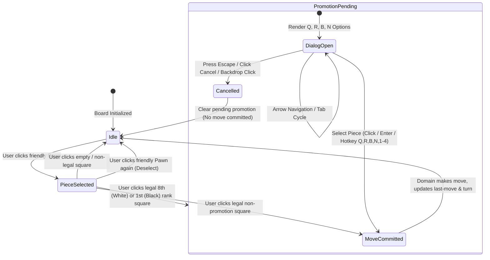

# Chess Domain & UI Invariants: Check and Promotion

## Overview

This specification formalizes the domain contracts, state machine transitions, and UI presentation invariants for **King Check / Checkmate Highlighting** and **Pawn Promotion Selection** in **ChessForge Phase 04 Sprint 05**.

---

## 1. King Check & Checkmate Resolution

### 1.1 Invariant: Single Authoritative King Locator

- When `game.getStatus().isCheck` is `true`, exactly one king on the board is in check.
- The checked king belongs strictly to the active player whose turn it is:
  $$\text{TargetKingColor} = \text{game.getPosition().turn}$$
- In `checkmate`, `isCheck` remains `true`, and the checkmate king is located at the same square.

### 1.2 Invariant: Multi-Modal Accessibility (Not Color-Only)

- In compliance with WCAG 2.1 SC 1.4.1 (Use of Color), check/checkmate cannot be represented solely by red square background tint.
- The King square in check must feature:
  1. A high-contrast visual check highlight and pulse overlay.
  2. A distinct SVG check badge / crosshair / crown-danger indicator icon rendered within the square.
  3. Strict semantic ARIA attributes (`aria-label="Square e8, dark, black king, in check"`, `data-is-check="true"`, `data-is-checkmate="true"`).

---

## 2. Pawn Promotion State Machine

### 2.1 Promotion Trigger Conditions

A promotion move occurs when:

1. Moving piece is a pawn (`piece.type === 'p'`).
2. Target rank is the opposing back rank (`square.endsWith('8')` for White, `square.endsWith('1')` for Black).
3. The move is a legal destination in `game.getLegalMoves(from)`.

### 2.2 Allowed Promotion Piece Types

Only 4 valid promotion piece choices exist under FIDE Article 3.7e:

- `'q'` (Queen)
- `'r'` (Rook)
- `'b'` (Bishop)
- `'n'` (Knight)

Pawns cannot promote to a King (`'k'`) or remain a Pawn (`'p'`).

### 2.3 Cancellation and Escape Semantics

- If a user cancels promotion (via `Escape` key, backdrop dismissal, or explicit cancel action):
  1. `pendingPromotion` state is reset to `null`.
  2. No domain mutation occurs (`game.makeMove()` is NOT invoked).
  3. Turn, clocks, move history, and position remain completely unchanged.
  4. The selected pawn selection is cleared or restored to idle.

---

## 3. Keyboard & Focus Management Contract

### 3.1 Dialog Focus Trap

- When the Promotion Dialog opens, initial focus is directed to the primary promotion option (Queen).
- Tab and Shift+Tab cycle trapped within the 4 choices and optional cancel trigger.
- Left / Up arrow keys move to previous piece; Right / Down arrow keys move to next piece.

### 3.2 Hotkey Mapping

- `1` or `Q` / `q`: Queen
- `2` or `R` / `r`: Rook
- `3` or `B` / `b`: Bishop
- `4` or `N` / `n`: Knight
- `Escape`: Cancel promotion

---

## 4. Race Condition & Concurrency Guardrails

1. **Atomic Move Submission**: Move execution occurs strictly when the user commits a piece choice. Multiple clicks during dialog transition cannot trigger duplicate move executions.
2. **State Validation**: If board orientation flips or game is reset while a promotion dialog is active, `pendingPromotion` must be immediately dismissed.
