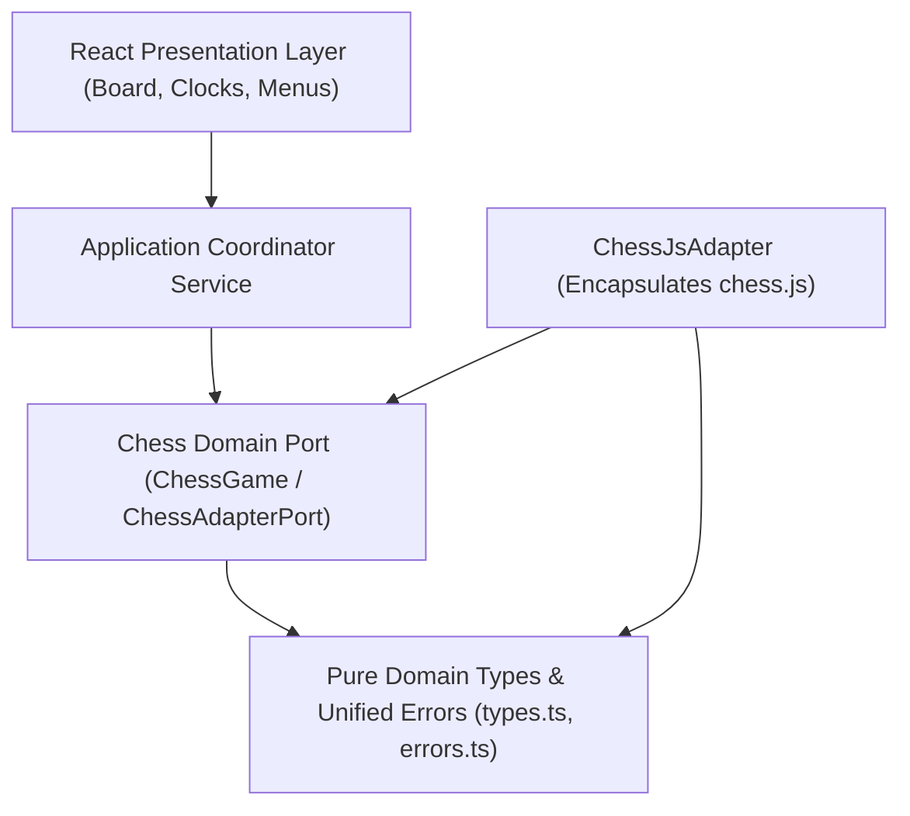

# Chess Domain Architecture & Adapter Contract Specification

## 1. Executive Summary

This document establishes the architectural ownership, boundary isolation, and domain contract specifications for the **Pure Chess Domain Layer** (`src/domain/chess`) in **ChessForge**.

Per [ADR-001](file:///c:/Workspace/ChessGame/docs/adr/ADR-001-decoupled-pure-chess-domain.md) and [ADR-005](file:///c:/Workspace/ChessGame/docs/adr/ADR-005-unified-typed-error-contracts.md), the Chess Domain is completely independent of React, DOM, and native desktop frameworks, operating as the single authoritative source of truth for chess rules, legal move generation, turn progression, invariant enforcement, and FEN/PGN codecs.

---

## 2. Layering & Dependency Flow



### Strict Architectural Boundaries

1. **Zero Framework Coupling:** No file in `src/domain/chess` may import `react`, `react-dom`, `@tauri-apps/*`, or DOM window/document primitives.
2. **Adapter Encapsulation:** Third-party calculation libraries (specifically `chess.js`) are strictly prohibited from being imported anywhere outside `src/domain/chess/adapters/`.
3. **Domain Authority:** React components and UI hooks NEVER compute legal moves, check conditions, or draw states. The UI queries the domain port for state and submits candidate moves.

---

## 3. Core Domain Primitives

### 3.1 Coordinates & Squares

- The board consists of 64 algebraic square coordinates `a1` through `h8` (`Square` type).
- `fileRankToSquare(file, rank)` and `squareToFileRank(square)` provide zero-cost bidirectional index mapping ($0..7 \longleftrightarrow \text{a1}..\text{h8}$).
- Runtime validation is enforced via Zod `SquareSchema`.

### 3.2 Position Representation

```typescript
export interface Position {
  readonly board: BoardMatrix; // 8x8 matrix (Rank 8 down to Rank 1, File a to File h)
  readonly turn: Color; // 'w' | 'b'
  readonly castling: PlayerCastlingRights; // { w: { kingside, queenside }, b: { kingside, queenside } }
  readonly enPassantSquare: Square | null;
  readonly halfmoveClock: number;
  readonly fullmoveNumber: number;
  readonly isCheck: boolean;
  readonly fen: string;
}
```

### 3.3 Unified Error Contracts

Per ADR-005, fallible domain operations return monadic `Result<T, ChessDomainError>`:

| Error Code           | Trigger Condition                                                         |
| :------------------- | :------------------------------------------------------------------------ |
| `ILLEGAL_MOVE`       | Attempted move violates piece rules, king safety, or pin constraints.     |
| `INVALID_SQUARE`     | Input square is malformed or outside the $8 \times 8$ board boundary.     |
| `INVALID_FEN`        | FEN string violates syntax or contains invalid piece layouts.             |
| `INVALID_PGN`        | PGN text contains syntax errors or invalid move sequences.                |
| `GAME_ALREADY_OVER`  | Move attempted on a game session that has concluded in checkmate or draw. |
| `NO_PIECE_AT_SQUARE` | Move origin square does not contain any piece.                            |
| `NOT_YOUR_TURN`      | Player attempted to move an opponent's piece.                             |
| `PROMOTION_REQUIRED` | Pawn reaches last rank without specifying promotion piece.                |
| `INVALID_PROMOTION`  | Specified promotion piece is illegal (e.g. King or Pawn).                 |
| `NO_MOVE_TO_UNDO`    | `undo()` invoked on an empty move history or starting position.           |

---

## 4. Port Interface Contract (`ChessGame` / `ChessAdapterPort`)

```typescript
export interface ChessGame {
  getPosition(): Position;
  getPiece(square: Square): Piece | null;
  getLegalMoves(square?: Square): Move[];
  isLegalMove(move: MoveInput): boolean;
  makeMove(move: MoveInput): Result<Move, ChessDomainError>;
  undo(): Result<Move, ChessDomainError>;
  loadFen(fen: string): Result<void, ChessDomainError>;
  exportFen(): string;
  importPgn(pgn: string): Result<void, ChessDomainError>;
  exportPgn(): string;
  getStatus(): GameStatus;
  getHistory(): Move[];
  reset(): void;
}
```

---

## 5. Third-Party Adapter Ownership Rules

The `ChessJsAdapter` class implements `ChessAdapterPort`:

1. **Mapping Discipline:** Converts `chess.js` raw move structures into immutable domain `Move` objects with full SAN, LAN, capture, en passant, castling, check, and checkmate flags.
2. **Error Translation:** Traps internal third-party exceptions and returns typed `Result<T, ChessDomainError>` instead of throwing runtime exceptions.
3. **FEN / PGN Round-Trip:** Guarantees lossless serialization and deserialization.
4. **Future Portability:** Should `chess.js` ever need to be replaced with a high-speed bitboard engine or Rust WebAssembly module, only `ChessJsAdapter` is rewritten; zero UI or application services change.
