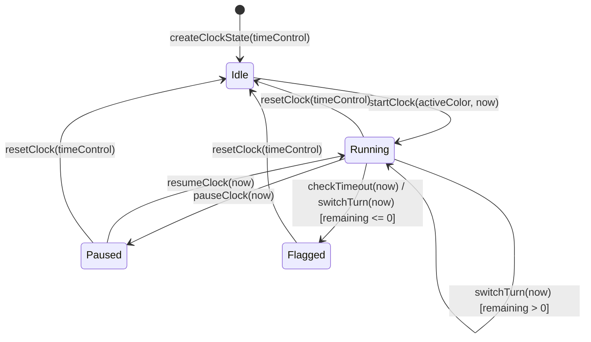

# ChessForge Clock Domain Model & Invariants Specification

## 1. Domain Overview & Purpose

The ChessForge Clock Domain Layer (`src/domain/clock/`) encapsulates the authoritative mathematical calculations, time-control models, Fischer increment mechanics, turn switching, and timeout determinations for timed chess games.

In accordance with the **Local-First & Decoupled Architecture Mandate** (AGENTS.md), the clock domain is 100% decoupled from React render frequency, requestAnimationFrame loops, and operating system wall-clock sleeps.

---

## 2. Mathematical Clock Formulation

### 2.1 Pure Timestamp Model

Rather than decrementing tick counters via `setInterval`, remaining time is derived deterministically from timestamp differentials:

$$\text{elapsed} = \text{currentTime} - \text{turnStartedAt}$$
$$\text{remaining}_{\text{active}} = \max\left(0, \text{bankedTime}_{\text{active}} - \text{elapsed}\right)$$
$$\text{remaining}_{\text{inactive}} = \text{bankedTime}_{\text{inactive}}$$

Where:

- $\text{bankedTime}_{\text{color}}$: Authoritative remaining time in milliseconds stored at the start of the turn.
- $\text{turnStartedAt}$: Authoritative timestamp (ms) when the active player's turn commenced.
- $\text{currentTime}$: Injected timestamp (ms) provided by a `TimeProvider`.

### 2.2 Fischer Increment Allocation

In standard Fischer time controls, the increment is awarded strictly upon valid move completion / turn switch, provided the player has not flagged:

$$ \text{bankedTime}'_{\text{ending}} = \begin{cases}
\text{bankedTime}_{\text{ending}} - \text{elapsed} + \text{incrementMs} & \text{if } \text{bankedTime}_{\text{ending}} - \text{elapsed} > 0 \\
0 & \text{if } \text{bankedTime}_{\text{ending}} - \text{elapsed} \le 0
\end{cases}$$

If the ending player exhausts their remaining time prior to completing the turn switch, timeout occurs ($\text{status} = \text{'flagged'}$, $\text{flaggedColor} = \text{endingColor}$), and no increment is awarded.

---

## 3. Clock Domain Invariants



### INV-CLK-01: Deterministic State Evaluation
Given an identical `ClockState` snapshot and an identical `currentTime` input, any pure clock calculation (`computeRemainingTime`, `checkTimeout`, `switchTurn`) MUST produce bit-for-bit identical output states.

### INV-CLK-02: Zero Render-Loop Dependency
The clock domain MUST NOT instantiate `setInterval`, `setTimeout`, `requestAnimationFrame`, or direct React state hooks. All time queries are driven via pure parameters or injected `TimeProvider` instances.

### INV-CLK-03: Fischer Increment Exactness
When a turn is switched at timestamp $T_1$, the ending side's banked time increases by exactly $\text{incrementMs}$, provided remaining time was positive. Increment is never applied to the waiting opponent or to an already-flagged player.

### INV-CLK-04: Authoritative Timeout & Immutability
When remaining time reaches $\le 0$, the clock transitions to `status = 'flagged'`, records `flaggedColor`, and halts further time decay (`running = false`). Once flagged, further turn switches or time queries maintain the flagged state until explicit `resetClock`.

### INV-CLK-05: Inactive Player Time Invariance
While player $C$ is active, the banked time and remaining time for opponent $\neg C$ is strictly constant:
$$\frac{\partial \text{remaining}_{\neg C}}{\partial t} = 0$$

### INV-CLK-06: Monotonic Time Decay During Active Turn
For any two timestamps $t_1 < t_2$ during an uninterrupted active turn without turn switches, the active player's remaining time satisfies:
$$\text{remaining}_{\text{active}}(t_2) \le \text{remaining}_{\text{active}}(t_1)$$

### INV-CLK-07: Pause/Resume State Preservation
Pausing a running clock at $t_{\text{pause}}$ freezes the elapsed time calculation. Resuming at $t_{\text{resume}} > t_{\text{pause}}$ updates `turnStartedAt = t_{\text{resume}}` without phantom time decay across the paused duration.

---

## 4. Time Control Classifications & Presets

ChessForge supports both standard preset time controls and custom configurations:

| Category | Preset Label | Initial Time (ms) | Increment (ms) | Category Rule |
| :--- | :--- | :--- | :--- | :--- |
| **Bullet** | `1 + 0` | 60,000 | 0 | $T_{\text{estimated}} < 3 \text{ min}$ |
| **Bullet** | `2 + 1` | 120,000 | 1,000 | $T_{\text{estimated}} < 3 \text{ min}$ |
| **Blitz** | `3 + 0` | 180,000 | 0 | $3 \le T_{\text{estimated}} < 10 \text{ min}$ |
| **Blitz** | `3 + 2` | 180,000 | 2,000 | $3 \le T_{\text{estimated}} < 10 \text{ min}$ |
| **Blitz** | `5 + 0` | 300,000 | 0 | $3 \le T_{\text{estimated}} < 10 \text{ min}$ |
| **Blitz** | `5 + 3` | 300,000 | 3,000 | $3 \le T_{\text{estimated}} < 10 \text{ min}$ |
| **Rapid** | `10 + 0` | 600,000 | 0 | $10 \le T_{\text{estimated}} < 30 \text{ min}$ |
| **Rapid** | `10 + 5` | 600,000 | 5,000 | $10 \le T_{\text{estimated}} < 30 \text{ min}$ |
| **Rapid** | `15 + 10` | 900,000 | 10,000 | $10 \le T_{\text{estimated}} < 30 \text{ min}$ |
| **Classical**| `30 + 0` | 1,800,000 | 0 | $T_{\text{estimated}} \ge 30 \text{ min}$ |
| **Untimed** | `Unlimited` | 0 | 0 | $\text{type} = \text{'none'}$ |
| **Custom** | Custom $(M+S)$ | $M \times 60,000$ | $S \times 1,000$ | User-defined bounds |

*Estimated time calculation formula:* $T_{\text{estimated}} = \frac{\text{initialMs} + 40 \times \text{incrementMs}}{60,000} \text{ minutes}$.

---

## 5. Public API Contracts

```typescript
export interface TimeControl {
  type: TimeControlType;
  initialMs: number;
  incrementMs: number;
  label?: string;
}

export interface ClockState {
  readonly whiteMs: number;
  readonly blackMs: number;
  readonly activeColor: 'white' | 'black' | null;
  readonly turnStartedAt: number | null;
  readonly status: ClockStatus;
  readonly running: boolean;
  readonly timeControl: TimeControl;
  readonly flaggedColor: 'white' | 'black' | null;
  readonly moveCount: {
    readonly white: number;
    readonly black: number;
  };
}

export interface TimeProvider {
  now(): number;
}
```
$$
