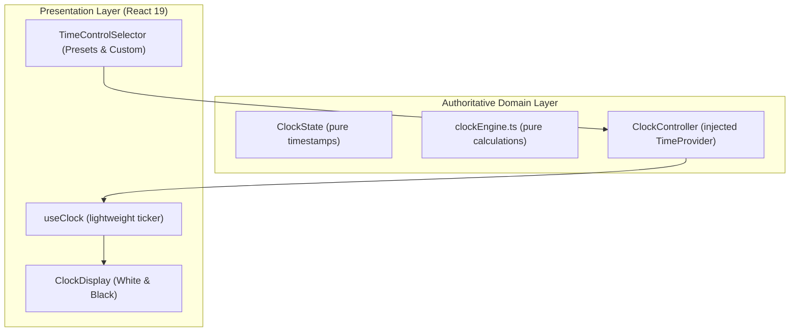

# ChessForge Clock UI & Preset Specifications

**Document Version:** 1.0.0  
**Phase:** Phase 07 (Clocks & Game Modes)  
**Sprint:** Sprint 02 (Clock UI and Presets)  
**Author:** Chess Domain Architect & Dev Architect  
**Status:** Approved

---

## 1. Executive Summary

This document formalizes the user interface contracts, accessibility rules, time formatting standards, low-time warning semantics, and preset configuration mechanisms for the ChessForge digital chess clock system.

---

## 2. Clock UI Architecture & Non-Drift Display Model

### 2.1 Authoritative vs Display State Separation



- **Invariant:** React render loops or `setInterval` tickers **MUST NEVER** mutate or decrement remaining time.
- **Display Calculation:**
  $$\text{Remaining Time (ms)} = \text{Authorized State Time} - (\text{Current Timestamp} - \text{Turn Start Timestamp})$$
- The presentation layer polls the pure calculation every 100ms (or on `requestAnimationFrame` when time $< 10\text{s}$) strictly to refresh visual pixels.

---

## 3. Clock Display Visual & Functional Requirements

### 3.1 Time Formatting (`REQ-CLK-UI-01`)

The clock display must format remaining milliseconds using the following unambiguous rules:

| Condition                                         | Format Example     | Description                                                            |
| :------------------------------------------------ | :----------------- | :--------------------------------------------------------------------- |
| $\text{Remaining} \ge 1\text{ hour}$              | `1:15:30`          | `HH:MM:SS` format (padded minutes and seconds).                        |
| $10\text{s} \le \text{Remaining} < 1\text{ hour}$ | `05:00`, `00:45`   | `MM:SS` format (padded seconds, standard chess digital format).        |
| $0 < \text{Remaining} < 10\text{s}$               | `0:09.4`, `0:02.1` | Tenths of a second format (`M:SS.t`) for high-precision time scramble. |
| $\text{Remaining} \le 0$                          | `0:00.0`           | Expired / Flag Fall indicator.                                         |
| Unlimited / Untimed Mode                          | `∞` or `Untimed`   | No countdown clock displayed; untimed status badge shown.              |

Digital numbers must use monospace tabular figures (`font-variant-numeric: tabular-nums`) to prevent layout shifting during countdown.

### 3.2 Active Clock Highlighting (`REQ-CLK-UI-02`)

The active player's clock (the player whose turn it is in an active, timed game) must be immediately and unambiguously identifiable:

- **Visual Border:** High-contrast luminous border (`--color-accent-primary` glow, 2px solid + box-shadow glow).
- **Background Contrast:** Elevated background lightness / distinct surface gradient.
- **Active Icon / Indicator:** A distinct "Active / Ticking" status badge or pulsing icon.
- **Inactive State:** Paused or non-active clock dimmed to secondary contrast (`opacity: 0.75` or muted background).

### 3.3 Accessible Low-Time Visual Warning (`REQ-CLK-UI-03`)

When a player's remaining time drops below **20 seconds** in a timed game:

- **Non-Color Distinction (Mandatory WCAG 1.4.1):** The warning **MUST NOT** rely on red color alone. It must incorporate:
  1. A distinct visual warning glyph/badge (e.g. `⚠️ LOW TIME` badge or text label).
  2. Distinct border styling (e.g. dashed/pulsing warning outline with border-radius contrast).
  3. High-contrast textual emphasis.
- **Reduced Motion Compliance (WCAG 2.3.3):** Any flashing or pulsing animations must respect `@media (prefers-reduced-motion: reduce)` and the user's reduced-motion setting.

### 3.4 Accessibility & Semantic Hierarchy (`REQ-CLK-UI-04`)

- **ARIA Role:** `role="timer"` on each clock display element.
- **ARIA Label:** `aria-label="White clock: 4 minutes 32 seconds"` or `aria-label="Black clock: 9.4 seconds remaining (Low Time)"`.
- **Live Regions:** Set to `aria-live="off"` on rapid tickers to prevent screen reader announcement floods, with milestone announcements at key thresholds (game over, timeout).

---

## 4. Time Control Presets & Custom Configuration

### 4.1 Standard Presets Grid (`REQ-CLK-UI-05`)

The `TimeControlSelector` component must offer organized preset buttons across standard chess speeds:

```text
[ Bullet ]
  - 1 + 0 (1 min, 0s increment)
  - 2 + 1 (2 min, 1s increment)

[ Blitz ]
  - 3 + 0 (3 min, 0s increment)
  - 3 + 2 (3 min, 2s increment)
  - 5 + 0 (5 min, 0s increment)
  - 5 + 3 (5 min, 3s increment)

[ Rapid ]
  - 10 + 0 (10 min, 0s increment)
  - 10 + 5 (10 min, 5s increment)
  - 15 + 10 (15 min, 10s increment)

[ Classical ]
  - 30 + 0 (30 min, 0s increment)

[ Untimed ]
  - Unlimited (No clocks)

[ Custom ]
  - Configurable Initial Minutes, Initial Seconds, Increment Seconds
```

### 4.2 Custom Time Input Validation Rules

For custom time controls:

- **Base Minutes:** Integer between $0$ and $180$.
- **Base Seconds:** Integer between $0$ and $59$.
- **Increment Seconds:** Integer between $0$ and $60$.
- **Minimum Condition:** Total initial time ($\text{Minutes} \times 60 + \text{Seconds}$) must be $> 0$ OR increment $> 0$. If total time $= 0$ and increment $= 0$, user must select "Unlimited".
- **Invalid Inputs:** Negative numbers, non-numeric strings, or values exceeding bounds must display inline error text and disable form submission.
