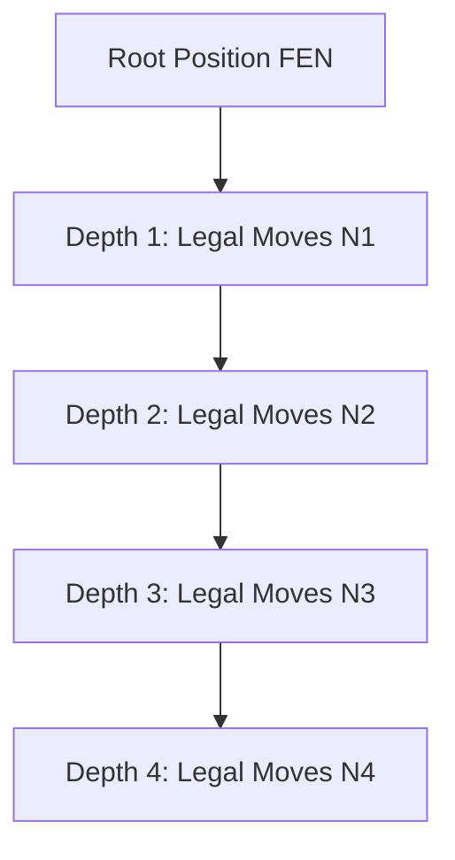

# Chess Domain Regression & Property-Based Testing Specification

**Document Version:** 1.0.0  
**Phase:** 03 (Chess Domain & Calculation Engine)  
**Sprint:** 07 (Domain Regression and Property Testing)  
**Status:** APPROVED  
**Author:** Chess Domain Architect

---

## 1. Executive Summary & Quality Strategy

Phase 03 establishes the pure chess domain engine powering **ChessForge**. To ensure that subsequent UI (Phase 04), Game Coordination (Phase 05), and Stockfish Engine (Phase 06) integration never encounter latent calculation bugs, Sprint 07 delivers a comprehensive, permanent regression safety net and property-based verification framework.

### Core Testing Pillars

1. **Perft (Performance Test) Benchmark Suite:** Standard FIDE test positions verified to exact combinatorial move-path depths.
2. **Move Generation Invariants:** Mathematical proofs and property tests verifying king safety, pin compliance, en passant expiration, and castling path clearance.
3. **Lossless Codec Invariance:** FEN and PGN bidirectional round-trip preservation across arbitrary random legal game trees.
4. **State Immutability on Negative Inputs:** Guaranteeing that rejected moves or malformed serialization strings leave game state 100% untouched.
5. **Seeded Deterministic Fuzzing:** Generative test runs configured with reproducible pseudorandom seeds for reliable CI/CD pipelines.

---

## 2. Standard Perft (Performance Test) Benchmark Corpus

Perft is the definitive benchmark for validating chess move generation accuracy. It computes the total number of legal leaf nodes at a given search depth.

### 2.1 Perft Benchmark Scenarios

| Position Name                                | FEN String                                                             | Depth               | Expected Node Count              | Key Tactical Edge Cases                                                          |
| :------------------------------------------- | :--------------------------------------------------------------------- | :------------------ | :------------------------------- | :------------------------------------------------------------------------------- |
| **Position 1 (Starting Position)**           | `rnbqkbnr/pppppppp/8/8/8/8/PPPPPPPP/RNBQKBNR w KQkq - 0 1`             | 1 2 3 4 | 20 400 8,902 197,281 | Standard pawn pushes, knight jumps, initial development.                         |
| **Position 2 (Kiwipete)**                    | `r3k2r/p1ppqpb1/bn2pnp1/3PN3/1p2P3/2N2Q1p/PPPBBPPP/R3K2R w KQkq - 0 1` | 1 2 3       | 48 2,039 97,862          | Both-side castling, en passant captures, double checks, pawn attacks on rooks.   |
| **Position 3 (Endgame Pins & Checks)**       | `8/2p5/3p4/KP5r/1R3p1k/8/4P1P1/8 w - - 0 1`                            | 1 2 3       | 14 191 2,812             | Absolute pin of pawn to king on rank/file, discovered checks.                    |
| **Position 4 (Mirrored Pawns & Promotions)** | `r3k2r/Pppp1ppp/1b3nbN/nP6/BBP1P3/q4N2/Pp1P2PP/R2Q1RK1 w kq - 0 1`     | 1 2 3       | 6 264 9,467              | Dual 8th/1st rank pawn promotions with capture, castling out of check denial.    |
| **Position 5 (Promotions & Sharp Pins)**     | `rnbq1k1r/pp1Pbppp/2p5/8/2B5/8/PPP1NnPP/RNBQK2R w KQ - 1 8`            | 1 2 3       | 44 1,486 62,379          | Underpromotion to knight giving check, bishop sacrifice, multiple pinned pieces. |

---

## 3. Authoritative Chess Domain Invariants

The automated test suites enforce the following mathematical invariants:

### Invariant 1: Strict King Safety

$$\forall \, m \in \text{getLegalMoves}(S), \quad \text{isInCheck}(\text{applyMove}(S, m), \text{turn}(S)) = \text{false}$$
_No legal move may ever leave the active player's King under attack._

### Invariant 2: Markov Property & History Independence

$$\text{Position}(S_1) = \text{Position}(S_2) \implies \text{getLegalMoves}(S_1) \equiv \text{getLegalMoves}(S_2)$$
_Move generation depends purely on current board state, castling availability, en passant target, and turn—not how the position was reached._

### Invariant 3: Move Execution & Undo Reversibility

$$\forall \, m \in \text{getLegalMoves}(S), \quad \text{undo}(\text{applyMove}(S, m)) \equiv S$$
_Every legal move execution followed by `undo()` restores the exact identical board matrix, FEN, turn, castling rights, en passant coordinate, and halfmove/fullmove clocks._

### Invariant 4: State Immutability on Negative Inputs

$$\forall \, m \notin \text{getLegalMoves}(S), \quad \text{makeMove}(m) = \text{Result.err(ILLEGAL\_MOVE)} \quad \land \quad S_{\text{after}} \equiv S_{\text{before}}$$
_Attempting illegal moves, moving wrong colored pieces, specifying non-square coordinates, or loading malformed strings guarantees 0% state mutation._

### Invariant 5: Codec Round-Trip Bijectivity

$$\text{exportFen}(\text{loadFen}(F)) = F \quad \land \quad \text{exportPgn}(\text{importPgn}(P)) \sim P$$
_Serialized board representations reproduce identical domain game states upon replay._

---

## 4. Seeded Reproducibility & Fuzzing Standards

To prevent non-deterministic or flaky test failures in automated CI runs:

1. **Seed Declaration:** All `fast-check` generative property fuzzers specify fixed integer seeds (`{ seed: 42, numRuns: 50 }`).
2. **Deterministic PRNG:** Random choices operate over standard pseudo-random number generator streams without `Math.random()` unseeded calls.
3. **Shrinking Verification:** When a property fails, `fast-check` automatically shrinks to the minimal failing move sequence for instant triage.

---

## 5. Phase 03 Complete Sprint Traceability Matrix

| Sprint  | Domain Capability                    | Test Coverage Artifacts                                                                             | Invariant Guardrail                                         |
| :------ | :----------------------------------- | :-------------------------------------------------------------------------------------------------- | :---------------------------------------------------------- |
| **S01** | Core Types & Port Contracts          | `domainTypes.test.ts`, `dependencyInversion.test.ts`                                                | Strict type safety, no UI coupling.                         |
| **S02** | Legal Move Execution                 | `moveExecution.test.ts`, `legalMoves.test.ts`, `undoHistory.test.ts`                                | Turn alternation, undo reversibility.                       |
| **S03** | Special Moves (Castling, EP, Promo)  | `castling.test.ts`, `enPassant.test.ts`, `promotion.test.ts`, `specialMovesSan.test.ts`             | FIDE special move semantics.                                |
| **S04** | Game Status & Draw Rules             | `gameStatus.test.ts`, `drawRules.test.ts`, `resignationTimeout.test.ts`, `statusPrecedence.test.ts` | Checkmate & 50-move/repetition rules.                       |
| **S05** | FEN Import & Export                  | `fenImportExport.test.ts`, `fenRoundTrip.test.ts`                                                   | 6-field FEN preservation, round-trip fidelity.              |
| **S06** | PGN Import & Export                  | `pgnImportExport.test.ts`, `pgnRoundTrip.test.ts`                                                   | STR metadata, SAN move replaying, result sync.              |
| **S07** | Domain Regression & Property Testing | `perftMoveGen.test.ts`, `domainRegression.test.ts`, `illegalMoveStateImmutability.test.ts`          | Perft benchmark counts, seeded fuzzing, state immutability. |

---

## 6. Definition of Done Sign-off

- [x] Perft benchmark node counts formalized for positions 1 through 5.
- [x] Move generation invariants 1 through 5 mathematically defined.
- [x] Seeded reproducibility rules documented.
- [x] Complete Phase 03 traceability matrix mapped.
