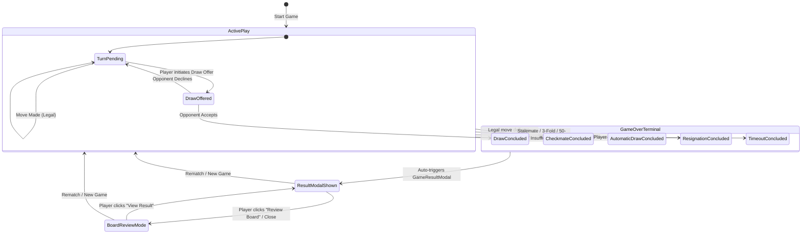

# ChessForge Domain Invariants: Draw Flow and Game Result

## 1. Domain Ownership & Architectural Context

This document formalizes the domain rules, state machine transitions, scoreline mappings, and presentation invariants for draw offers, automatic draw determinations, and game-over result handling in **ChessForge** Phase 05 · Sprint 05.



---

## 2. Draw Flow Semantics & State Machine

### 2.1 Local Human vs Human Draw Offer Protocol

In local-first desktop play, draw offers follow a synchronous, bilateral agreement model:

1. **Offer Initiation:**
   - Either player can initiate a draw offer when the game is active (`status.isOver === false`).
   - The active turn player $P_{\text{turn}}$ triggers "Offer Draw".
   - The system transitions UI to the `DrawOfferPending` modal addressed directly to the opponent $P_{\text{opp}}$.

2. **Offer Acceptance:**
   - If $P_{\text{opp}}$ selects **"Accept Draw"**:
     - The domain method `chessGame.agreeDraw()` is invoked.
     - `manualStatus` is committed as:
       $$\text{GameStatus} = \{ \text{state}: \text{"draw\_agreement"}, \text{isOver}: \text{true}, \text{winner}: \text{null}, \text{inDraw}: \text{true}, \text{drawReason}: \text{"agreement"} \}$$
     - Live ARIA announcement is broadcast: `"Draw agreed by mutual consent."`
     - The `GameResultModal` immediately opens displaying score `½ - ½`.

3. **Offer Rejection / Cancellation:**
   - If $P_{\text{opp}}$ selects **"Decline Draw"**:
     - The modal closes without modifying domain state or turn progression.
     - The game remains in `active` state.
     - Live ARIA announcement is broadcast: `"[Opponent Name] declined the draw offer."`
     - Board interaction remains enabled for $P_{\text{turn}}$.

4. **Terminal Invariant:**
   - Draw offers are **strictly prohibited** if `sessionState.isGameOver === true`.

---

## 3. Automatic Draw Invariants vs Agreed Draws

The application must never conflate automatic domain-determined draws with agreed draws:

| Outcome State             | Detection Origin                                                                                                            | `inDraw` | `drawReason`              | Official Score | Reason Title                  | Description                                                                    |
| :------------------------ | :-------------------------------------------------------------------------------------------------------------------------- | :------- | :------------------------ | :------------- | :---------------------------- | :----------------------------------------------------------------------------- |
| **Stalemate**             | Domain rule ($0$ legal moves, king not in check)                                                                            | `true`   | `"stalemate"`             | `½ - ½`        | Draw by Stalemate             | Active player has no legal moves and is not in check.                          |
| **Threefold Repetition**  | Domain position + rights tracking ($\ge 3$ identical states)                                                                | `true`   | `"threefold_repetition"`  | `½ - ½`        | Draw by Threefold Repetition  | The exact same board position and castling/en-passant rights occurred 3 times. |
| **50-Move Rule**          | Domain halfmove clock ($\ge 100$ plies without pawn move or capture)                                                        | `true`   | `"fifty_moves"`           | `½ - ½`        | Draw by 50-Move Rule          | 50 consecutive moves completed without a pawn move or capture.                 |
| **Insufficient Material** | Domain piece combination evaluation ($K\text{ vs }K$, $K+B\text{ vs }K$, $K+N\text{ vs }K$, $K+B\text{ vs }K+B$ same color) | `true`   | `"insufficient_material"` | `½ - ½`        | Draw by Insufficient Material | Neither player has sufficient pieces remaining to deliver checkmate.           |
| **Mutual Agreement**      | Player bilateral agreement via `agreeDraw()`                                                                                | `true`   | `"agreement"`             | `½ - ½`        | Draw by Mutual Agreement      | Both players agreed to a draw.                                                 |

---

## 4. Complete Game Result Taxonomy & Scoreline Invariants

Every completed chess game maps deterministically to standard chess scorelines:

```text
Result Scorelines:
- White Victory: "1 - 0"
- Black Victory: "0 - 1"
- Draw:          "½ - ½"
```

### Full Taxonomy Table

| State                        | Winner | Score   | Modal Title | Reason Subtitle          | Detailed Description                                |
| :--------------------------- | :----- | :------ | :---------- | :----------------------- | :-------------------------------------------------- |
| `checkmate`                  | `w`    | `1 - 0` | White Wins! | by Checkmate             | White delivered checkmate against Black.            |
| `checkmate`                  | `b`    | `0 - 1` | Black Wins! | by Checkmate             | Black delivered checkmate against White.            |
| `resigned`                   | `w`    | `1 - 0` | White Wins! | by Resignation           | Black resigned the game.                            |
| `resigned`                   | `b`    | `0 - 1` | Black Wins! | by Resignation           | White resigned the game.                            |
| `timeout`                    | `w`    | `1 - 0` | White Wins! | by Timeout               | Black ran out of time.                              |
| `timeout`                    | `b`    | `0 - 1` | Black Wins! | by Timeout               | White ran out of time.                              |
| `stalemate`                  | `null` | `½ - ½` | Game Drawn  | by Stalemate             | Black/White has no legal moves and is not in check. |
| `draw_threefold_repetition`  | `null` | `½ - ½` | Game Drawn  | by Threefold Repetition  | Position repeated 3 times.                          |
| `draw_fifty_moves`           | `null` | `½ - ½` | Game Drawn  | by 50-Move Rule          | 50 moves without pawn move or piece capture.        |
| `draw_insufficient_material` | `null` | `½ - ½` | Game Drawn  | by Insufficient Material | Insufficient material to force checkmate.           |
| `draw_agreement`             | `null` | `½ - ½` | Game Drawn  | by Mutual Agreement      | Both players agreed to a draw.                      |

---

## 5. Terminal State Immutability & Board Review Guardrails

1. **Board Non-Interactivity:**
   When `isGameOver === true`, the board enters non-interactive state:
   - Square clicking is disabled.
   - Piece selection and legal move highlights are cleared.
   - Drag-and-drop gestures are blocked.
   - Promotion modal is suppressed.

2. **Game Control Restrictions:**
   - `Undo`: Disabled (moves cannot be undone after formal game conclusion).
   - `Resign`: Disabled.
   - `Offer Draw`: Disabled.
   - `Restart`: Enabled (resets to starting position).
   - `New Game`: Enabled (opens configuration modal).
   - `View Result`: Enabled (allows reopening `GameResultModal` while reviewing board).

3. **Result Presentation Lifecycle:**
   - **Auto-Popup:** Upon game over transition, `GameResultModal` opens automatically.
   - **Review Board Action:** Clicking "Review Board" closes the modal while preserving the terminal position and move history so users can review the game.
   - **Reopen Result:** A dedicated "View Result" button in the controls allows reopening the result dialog at any time during board review.
