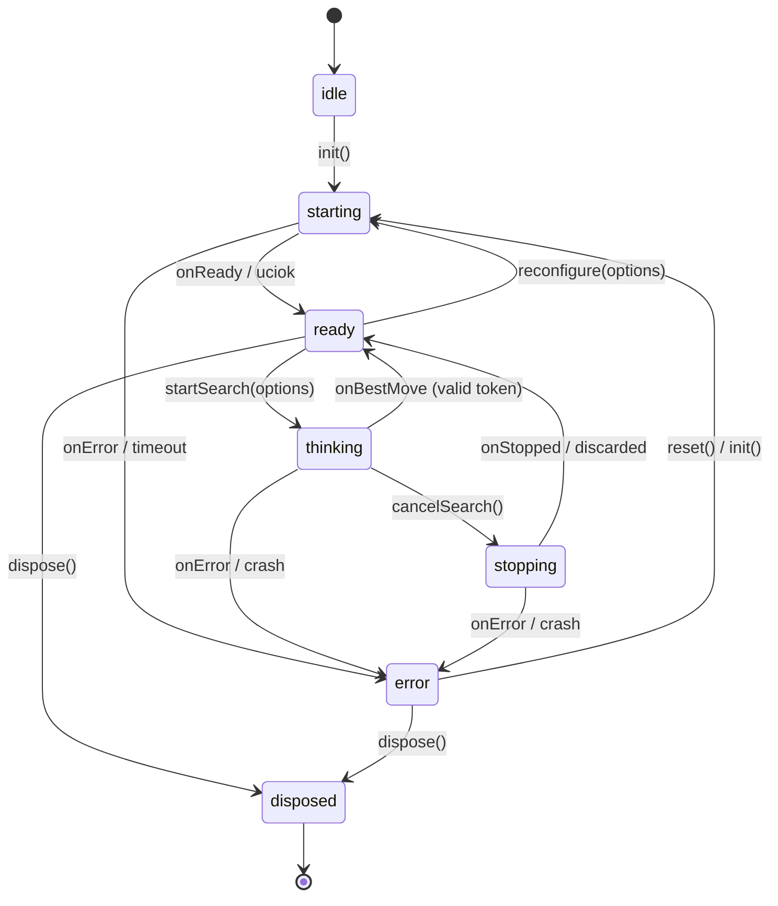

# Engine Abstraction & WebWorker Protocol Invariants

**Document Version:** 1.0.0  
**Status:** Canonical  
**Author:** Chess Domain Architect & Dev Architect  
**Reviewers:** SDET Architect, Security Officer, Product Owner  
**Date:** 2026-08-18

---

## 1. Executive Summary & Purpose

This specification formalizes the architectural boundary, lifecycle state machine, message protocols, and synchronization invariants governing chess engine communication (Stockfish WASM / Mock Engine) within **ChessForge**.

The engine serves strictly as an **asynchronous advisor** for computer move generation and evaluation. It holds **zero authority** over game state, move legality, or session rules.

---

## 2. Decoupled Architectural Flow

```text
┌────────────────────────────────────────────────────────┐
│               UI Presentation Layer                    │
│   (PlayerPanel, Board, Controls, Evaluation Bar)       │
└───────────────────────────┬────────────────────────────┘
                            │ Method calls / State Subscriptions
                            ▼
┌────────────────────────────────────────────────────────┐
│             Application Layer / EngineService          │
│   (Request IDs, State Machine, Cancellation, Discard)  │
└─────────────┬────────────────────────────┬─────────────┘
              │ WebWorker IPC              │ Move Validation
              ▼                            ▼
┌───────────────────────────┐ ┌──────────────────────────┐
│   Engine Worker Bridge    │ │    Chess Domain Layer    │
│  (Stockfish WASM / Mock)  │ │  (Legal Validation & FEN)│
└───────────────────────────┘ └──────────────────────────┘
```

### Core Invariants

1. **INV-ENG-01: Zero Direct Board Mutation**  
   The engine layer must never directly manipulate `GameSession` state or DOM elements. All engine move suggestions are passed as proposed moves to the application layer, validated by `ChessDomain`, and committed via standard game actions.
2. **INV-ENG-02: UCI Protocol Encapsulation**  
   The UI components must have zero awareness of UCI protocol strings (e.g. `uci`, `isready`, `ucinewgame`, `position fen`, `go depth`, `bestmove`, `info score cp`). All UCI parsing and formatting is strictly contained within worker communication adapters.
3. **INV-ENG-03: Non-Blocking Execution**  
   Engine computation must never occur on the browser UI thread. Engine execution is isolated to a WebWorker. Main-thread execution time for engine message handling must remain $< 1.0\text{ ms}$ per event.

---

## 3. Engine Lifecycle State Machine



### Lifecycle States

| State      | Description                                                               | Allowed Operations                            |
| :--------- | :------------------------------------------------------------------------ | :-------------------------------------------- |
| `idle`     | Worker is unspawned or uninitialized.                                     | `init()`, `dispose()`                         |
| `starting` | Worker is booting, loading WASM, establishing UCI handshake.              | `dispose()`                                   |
| `ready`    | Engine is ready to receive search, evaluation, or configuration requests. | `startSearch()`, `reconfigure()`, `dispose()` |
| `thinking` | Engine is actively computing a position with an active `searchToken`.     | `cancelSearch()`, `dispose()`                 |
| `stopping` | Search cancellation sent; engine stopping search calculation.             | `dispose()`                                   |
| `error`    | Worker crashed, timed out, or encountered a protocol fault.               | `reset()`, `dispose()`                        |
| `disposed` | Worker terminated, subscriptions cleared, memory released.                | _None_                                        |

---

## 4. Request Correlation, Search Tokens & Cancellation

### 4.1 Token-Based Request Correlation

Every search or evaluation request initiated by the application layer is assigned a monotonic `searchToken` (integer or UUID) and associated with the current `positionFen` and `sessionId`:

```typescript
export interface EngineSearchRequest {
  readonly searchToken: string;
  readonly sessionId: string;
  readonly fen: string;
  readonly depth?: number;
  readonly movetimeMs?: number;
  readonly skillLevel?: number;
}
```

### 4.2 Concurrency & Stale Response Discard Invariant

```text
Position A (Token 1) ───> Engine search dispatched (State: thinking)
     │
User moves piece / resets game ───> cancelSearch() dispatched
     │                                Token incremented to Token 2
     │                                Engine state -> ready / thinking (Token 2)
Engine returns bestmove for Token 1 ───> DISCARDED SILENTLY (Token mismatch)
```

- **INV-ENG-04: Stale Result Rejection:**  
  When an engine response arrives with a `searchToken` that does not match the active `currentSearchToken`, the payload is discarded immediately without firing state change listeners or committing moves.
- **INV-ENG-05: Immediate Cancellation:**  
  Calling `cancelSearch()` synchronously increments the search token, marks the previous search as void, transitions the state out of `thinking`, and dispatches the cancellation signal (`stop`) to the worker.

---

## 5. WebWorker Message Protocol Contract

Communication between the main thread `EngineWorkerBridge` and the WebWorker strictly adheres to typed message envelopes:

### 5.1 Main Thread -> Worker Messages (`EngineWorkerRequest`)

```typescript
export type EngineWorkerRequest =
  | { type: "INIT"; config?: EngineConfig }
  | { type: "SET_OPTION"; name: string; value: string | number | boolean }
  | { type: "NEW_GAME" }
  | { type: "SEARCH"; request: EngineSearchRequest }
  | { type: "STOP" }
  | { type: "TERMINATE" };
```

### 5.2 Worker -> Main Thread Messages (`EngineWorkerResponse`)

```typescript
export type EngineWorkerResponse =
  | { type: "READY"; engineName?: string }
  | {
      type: "SEARCH_INFO";
      searchToken: string;
      depth: number;
      scoreCp?: number;
      mate?: number;
      nodes?: number;
      nps?: number;
      pv?: string[];
    }
  | {
      type: "BEST_MOVE";
      searchToken: string;
      uciMove: string;
      ponderMove?: string;
    }
  | { type: "STOPPED"; searchToken: string }
  | { type: "ERROR"; message: string; fatal?: boolean };
```

---

## 6. Mock Engine Adapter Contract for Deterministic Testing

To guarantee zero flakiness and high test velocity, a `MockEngineAdapter` and `MockEngineWorkerBridge` are provided with deterministic controls:

```typescript
export interface MockEngineControls {
  respondInstantly(bestMoveUci: string): void;
  simulateThinkingDelay(delayMs: number, bestMoveUci: string): Promise<void>;
  simulateCrash(errorMessage: string): void;
  simulateStaleResponse(staleToken: string, moveUci: string): void;
  simulateInfoStream(token: string, infos: EngineSearchInfo[]): void;
}
```

- **INV-ENG-06: Deterministic Testability:**  
  All engine contract tests, coordinator integration tests, and UI tests must be executable against `MockEngineAdapter` without requiring WebAssembly compilation or live worker thread spawning.

---

## 7. Quality & Security Checklist

- [x] Unidirectional data flow strictly maintained.
- [x] Zero UCI strings exposed in public `EngineService` interface.
- [x] Every search correlated with monotonic token.
- [x] Stale responses discarded before application notification.
- [x] Worker crash transitions engine safely to `error` state without corrupting `GameSession`.
- [x] Mock engine enables 100% deterministic test coverage.
