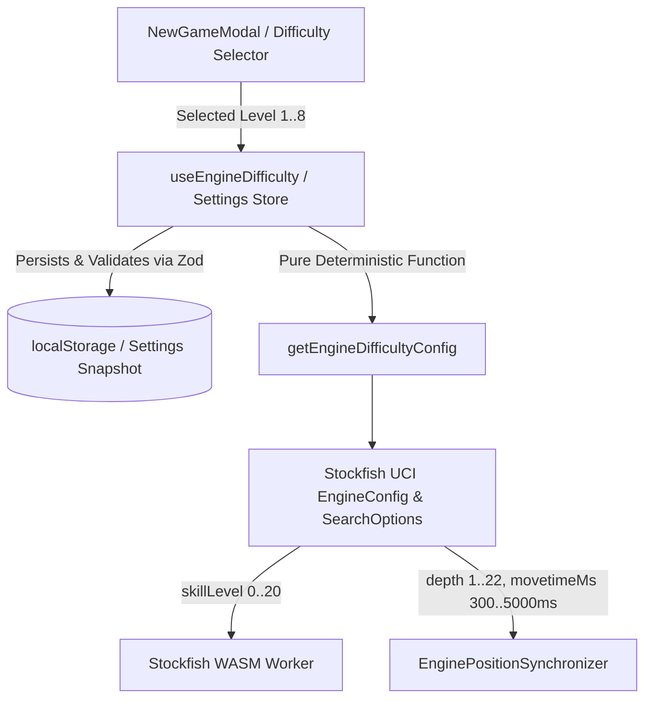

# Engine Difficulty & Thinking Policy Specification

**Document Version:** 1.0.0  
**Phase:** 06 · Stockfish AI  
**Sprint:** 04 · Engine Difficulty and Thinking Policy  
**Architect:** Chess Domain Architect / Dev Architect  
**Review Status:** Approved for Implementation

---

## 1. Domain Overview & Purpose

In chess engine implementations, user experience is severely degraded when engine strength is either overwhelmingly superhuman or arbitrarily configured. Furthermore, chess software frequently displays misleading numerical Elo ratings (e.g. "Level 3 = 1400 Elo") that have not undergone standardized game calibration or rating pool normalization.

The **ChessForge Engine Difficulty and Thinking Policy** establishes a clean, bounded, deterministic difficulty management system across 8 distinct levels. It maps discrete difficulty presets to Stockfish UCI parameters (`Skill Level`, search `depth`, and `movetime` limits) while enforcing strict hardware limits (single-thread WASM execution, capped memory, bounded calculation times) to guarantee desktop UI responsiveness and zero host degradation.

---

## 2. Formal Invariants Matrix

### Invariant Table

| Invariant ID    | Rule Name                             | Description                                                                                                                                                                                                                                                       | Enforcing Component         |
| :-------------- | :------------------------------------ | :---------------------------------------------------------------------------------------------------------------------------------------------------------------------------------------------------------------------------------------------------------------- | :-------------------------- |
| **INV-DIFF-01** | **Discrete 8 Levels**                 | The application defines exactly 8 sequential difficulty levels (`1` to `8`), each with unique name, description, and calibrated engine parameters.                                                                                                                | `difficulty.ts`, `types.ts` |
| **INV-DIFF-02** | **Deterministic Parameter Mapping**   | Given a difficulty level $L \in \{1..8\}$, `getEngineDifficultyConfig(L)` returns identical immutable parameters (`skillLevel`, `depth`, `movetimeMs`) without stochastic variation.                                                                              | `getEngineDifficultyConfig` |
| **INV-DIFF-03** | **Search Upper Bounds**               | Every difficulty level enforces hard upper bounds on search depth ($1 \le \text{depth} \le 22$) and thinking time ($300\text{ms} \le \text{movetimeMs} \le 5000\text{ms}$). Unbounded searches (`infinite` or $> 5000\text{ms}$) are prohibited in standard play. | `EngineThinkingPolicy`      |
| **INV-DIFF-04** | **Zero Uncalibrated Elo Claims**      | Level descriptions use descriptive tactical/strategic milestones ("Beginner", "Casual", "Intermediate", "Advanced", "Proficient", "Expert", "Master", "Grandmaster") and explicitly omit unverified numerical FIDE Elo ratings.                                   | `DIFFICULTY_PRESETS`        |
| **INV-DIFF-05** | **Hardware & Memory Guardrails**      | AI worker execution is strictly single-threaded (`threads: 1`) with bounded hash allocation (`hashSizeMb: 16`), preserving the $< 150\text{MB}$ total application memory footprint and 60fps render budget.                                                       | `DEFAULT_ENGINE_CONFIG`     |
| **INV-DIFF-06** | **Settings Persistence & Validation** | Difficulty preferences are saved in `localStorage` under a versioned key (`chessforge:engine_difficulty_v1`) and validated via Zod schema. Corrupted or out-of-range storage values automatically fallback to Level 3 (`Intermediate`).                           | `useEngineDifficulty`       |

---

## 3. Difficulty Level Calibration Matrix

| Level | Identifier     | Label            | Skill Level (`0..20`) | Max Depth | Max Movetime | Behavioral Profile                                                                   |
| :---: | :------------- | :--------------- | :-------------------: | :-------: | :----------: | :----------------------------------------------------------------------------------- |
| **1** | `beginner`     | **Beginner**     |           0           |     1     |    300 ms    | Plays simple legal moves; prone to immediate tactical oversights and blunders.       |
| **2** | `casual`       | **Casual**       |           3           |     3     |    500 ms    | Developing basic piece activity; frequently overlooks multi-ply combinations.        |
| **3** | `intermediate` | **Intermediate** |           6           |     5     |    800 ms    | Solid basic tactics and piece coordination; occasional positional inaccuracies.      |
| **4** | `advanced`     | **Advanced**     |           9           |     8     |   1200 ms    | Consistent tactical calculation, sound opening development, and king safety.         |
| **5** | `proficient`   | **Proficient**   |          12           |    11     |   1800 ms    | Strong combinational vision, active piece play, and structured pawn management.      |
| **6** | `expert`       | **Expert**       |          15           |    14     |   2500 ms    | Deep calculation, tactical sharpness, and positional pressure.                       |
| **7** | `master`       | **Master**       |          18           |    18     |   3500 ms    | Near-flawless tactical precision and strong endgame conversion.                      |
| **8** | `grandmaster`  | **Grandmaster**  |          20           |    22     |   5000 ms    | Full Stockfish calculation strength bounded within 5-second desktop thinking limits. |

---

## 4. Thinking Policy Specification

1. **Max Movetime Limit:** When executing `searchBestMove` or `syncPosition`, the engine search options MUST include `movetimeMs` derived from the selected difficulty preset.
2. **Max Depth Limit:** Search options MUST set `depth` derived from the preset to prevent exponential node expansion during tactical quiescence.
3. **Skill Level Setting:** The UCI option `Skill Level` ($0..20$) must be applied prior to search execution or passed directly in search options.
4. **UI Cancellation:** If the user executes an action (undo, resign, restart, new game) while the engine is thinking, the active search is immediately cancelled and the move is discarded.

---

## 5. Security & Persistence Boundaries

- **Storage Key:** `chessforge:engine_difficulty_v1`
- **Validation Schema:** `z.number().int().min(1).max(8)`
- **Sanitization:** Any non-integer, string, `null`, `undefined`, or out-of-range value (e.g. `0`, `9`, `NaN`, `Infinity`) is discarded and safely resets to the default level (`3`).
- **No Remote Telemetry:** Settings persistence is 100% local to the user's browser / Webview storage.
