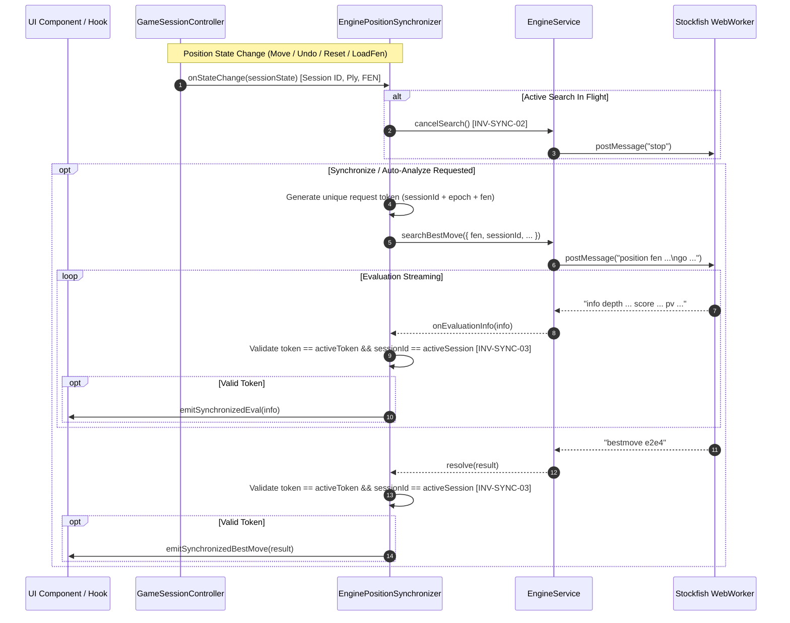

# Engine Position Synchronization & Concurrency Invariants

**Document Version:** 1.0.0  
**Phase:** Phase 06 (Local Engine Integration & AI Opponent)  
**Sprint:** Sprint 03 (Engine Position Synchronization)  
**Author:** Chess Domain Architect & Dev Architect  
**Status:** Approved Architectural Baseline

---

## 1. Executive Summary & Purpose

The Engine Position Synchronization subsystem is the bridge between the authoritative, synchronous pure chess domain (`GameSessionController`) and the asynchronous, non-blocking engine service (`EngineService` / Stockfish WebWorker).

Its primary mandate is to **guarantee that Stockfish always and only analyzes the current game position**, and that stale, late-arriving, or obsolete engine responses can never mutate active game session state or produce visual artifacts.

---

## 2. Synchronization Architecture & Data Flow



---

## 3. Authoritative Synchronization Invariants

### INV-SYNC-01: Session & Epoch Correlation

Every engine synchronization request must be bound to:

1. `sessionId`: The unique identifier of the active `GameSession`.
2. `positionEpoch`: A monotonically increasing integer counter representing the position revision within the session (incremented on every move, undo, reset, or FEN load).
3. `fen`: The canonical FEN string representation of the position.

### INV-SYNC-02: Immediate Preemption on State Transition

Whenever the game session changes state (via `makeMove`, `undo`, `loadFen`, `reset`, or termination), any active engine search MUST be immediately cancelled before or concurrently with dispatching the new position.

### INV-SYNC-03: Stale Response Invalidation & Discarding

If an asynchronous engine response (whether evaluation `SEARCH_INFO` or `BEST_MOVE`) arrives with a token or session identifier that does not match the active `(sessionId, positionEpoch)`, the response **MUST be discarded immediately**. It must not trigger UI state updates, notify listeners, or execute moves.

### INV-SYNC-04: Canonical Domain-to-FEN Translation

The domain `Position` state is transformed into an exact, valid 6-field standard FEN string (piece placement, active color, castling availability, en passant target, halfmove clock, fullmove number) prior to transmission to the engine.

### INV-SYNC-05: Reset & New Game Invalidation

When `notifyNewGame()` or `reset()` is invoked:

1. The active `sessionId` changes.
2. The `positionEpoch` is reset or advanced.
3. All pending search promises from the prior session are aborted with `EngineSearchCancelledError`.
4. A `ucinewgame` signal is posted to Stockfish to clear transposition tables and internal search history.

### INV-SYNC-06: Non-Blocking Non-Corrupting Error Containment

Engine worker crashes, timeouts, or UCI syntax errors must be isolated. Under no circumstance may an engine failure corrupt or invalidate the synchronous domain `GameSessionController` state.

### INV-SYNC-07: Deterministic State Machine

The `EnginePositionSynchronizer` maintains a clear lifecycle state:
$$\text{idle} \rightleftharpoons \text{syncing} \longrightarrow \text{analyzing} \longrightarrow \text{ready} \big/ \text{cancelled} \big/ \text{error}$$

---

## 4. Race Condition Matrix & Mitigations

| Scenario                         | Potential Hazard                                                                       | Architectural Mitigation                                                                                            |
| :------------------------------- | :------------------------------------------------------------------------------------- | :------------------------------------------------------------------------------------------------------------------ |
| **Rapid User Moves (Blitz)**     | Engine finishes analyzing move $N-1$ after user plays move $N$.                        | Epoch mismatch: Engine result for epoch $K$ is dropped because active epoch is $K+1$. Active search $K$ is stopped. |
| **Game Reset During Search**     | Engine returns bestmove for old game while user is viewing starting board of new game. | Session ID mismatch: Old search token rejected; new session ID renders old responses inert.                         |
| **Undo Move During Search**      | Engine finishes calculation for undone position.                                       | Position FEN and epoch mismatch: Undone state increments epoch; old calculation discarded.                          |
| **Custom FEN Loaded**            | Engine evaluates previous game while custom setup is loaded.                           | `loadFen()` generates new epoch and cancels in-flight search.                                                       |
| **Worker Crashes During Search** | Engine service transitions to `error` state.                                           | Synchronizer catches error, enters `error` state, notifies listeners, without affecting session state.              |

---

## 5. Interface Contract Baseline

```typescript
export type EngineSyncStatus =
  "idle" | "syncing" | "analyzing" | "cancelled" | "error";

export interface PositionSyncOptions {
  readonly depth?: number | undefined;
  readonly movetimeMs?: number | undefined;
  readonly skillLevel?: number | undefined;
  readonly autoAnalyze?: boolean | undefined;
}

export interface SynchronizedEvalInfo {
  readonly sessionId: string;
  readonly epoch: number;
  readonly fen: string;
  readonly searchToken: string;
  readonly depth: number;
  readonly scoreCp?: number | undefined;
  readonly mate?: number | undefined;
  readonly pv?: readonly string[] | undefined;
  readonly bestMoveUci?: string | undefined;
}

export interface IEnginePositionSynchronizer {
  readonly status: EngineSyncStatus;
  readonly currentSessionId: string | null;
  readonly currentEpoch: number;
  readonly currentFen: string | null;

  syncPosition(
    options?: PositionSyncOptions
  ): Promise<EngineEvaluationResult | null>;
  cancelActiveSync(): Promise<void>;
  notifyNewGame(sessionId?: string): Promise<void>;
  reset(sessionId?: string): Promise<void>;
  dispose(): void;

  onStatusChange(listener: (status: EngineSyncStatus) => void): () => void;
  onSynchronizedEval(
    listener: (info: SynchronizedEvalInfo) => void
  ): () => void;
}
```
