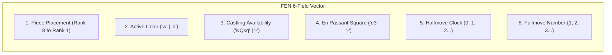

# FEN Import/Export & Parsing Domain Invariants

This document formalizes the authoritative Forsyth-Edwards Notation (FEN) specification, 6-field parsing and serialization semantics, validation invariants, illegal position rejection criteria, and golden test fixtures for **ChessForge** v1.

---

## 1. FEN Format Specification (6-Field Structure)

A valid FEN string represents a complete snapshot of a chess position using exactly six space-delimited fields:

$$\text{FEN} = \langle \text{PiecePlacement} \rangle \sqcup \langle \text{ActiveColor} \rangle \sqcup \langle \text{CastlingRights} \rangle \sqcup \langle \text{EnPassantTarget} \rangle \sqcup \langle \text{HalfmoveClock} \rangle \sqcup \langle \text{FullmoveNumber} \rangle$$

### 1.1 Field Breakdown

| Field # | Name              | Grammar / Pattern                                      | Valid Examples                                | Invalid Examples                          | Description                                                                                                                                        |
| :------ | :---------------- | :----------------------------------------------------- | :-------------------------------------------- | :---------------------------------------- | :------------------------------------------------------------------------------------------------------------------------------------------------- |
| **1**   | Piece Placement   | `^([pnbrqkPNBRQK1-8]{1,8}/){7}[pnbrqkPNBRQK1-8]{1,8}$` | `rnbqkbnr/pppppppp/8/8/8/8/PPPPPPPP/RNBQKBNR` | `rnbqkbnr/8/8/8/8/8/8`, `8/8/8/8/8/8/8/9` | 8 ranks from rank 8 to rank 1 separated by `/`. Digits `1`-`8` represent consecutive empty squares. Sum of squares per rank must strictly equal 8. |
| **2**   | Active Color      | `^(w\|b)$`                                             | `w`, `b`                                      | `W`, `B`, `white`, `0`                    | Side to move. `"w"` for White, `"b"` for Black.                                                                                                    |
| **3**   | Castling Rights   | `^(\-                                                  | K?Q?k?q?)$` (non-empty)                       | `KQkq`, `Kq`, `Q`, `-`                    | `KQkqX`, `kqKQ`, `--`                                                                                                                              | Castling availability for both players. `K`/`Q` for White kingside/queenside; `k`/`q` for Black kingside/queenside. `"-"` if neither player has castling rights.                                                                                    |
| **4**   | En Passant Target | `^(\-                                                  | [a-h][36])$`                                  | `-`, `e3`, `c6`                           | `e4`, `d5`, `h1`, `a9`                                                                                                                             | Square over which a pawn just stepped in a 2-square advance. Must be on rank 3 (if Black to move, meaning White moved pawn 2 squares) or rank 6 (if White to move, meaning Black moved pawn 2 squares). `"-"` if no en passant capture is possible. |
| **5**   | Halfmove Clock    | `^\d+$` ($\ge 0$)                                      | `0`, `14`, `99`, `100`                        | `-1`, `3.5`, `NaN`                        | Count of half-moves (plies) since the last pawn advance or piece capture. Used for the 50-move rule (100 plies = draw).                            |
| **6**   | Fullmove Number   | `^[1-9]\d*$` ($\ge 1$)                                 | `1`, `42`, `150`                              | `0`, `-5`, `abc`                          | The number of the full move. Starts at 1 and is incremented after every Black move.                                                                |

---

## 2. Validation & Rejection Invariants

The chess domain strictly validates all imported FEN strings before updating game state. An invalid FEN must return a structured `INVALID_FEN` error contract without mutating existing game state.

### 2.1 Syntactic Rejection Rules

1. **Field Count Invariant:** A FEN string must contain exactly 6 whitespace-delimited tokens. Strings with $<6$ or $>6$ tokens are rejected.
2. **Rank Count Invariant:** The piece placement field must contain exactly 8 slash-delimited rank strings.
3. **Rank Width Invariant:** Each rank string must expand to exactly 8 squares (e.g. `p3p2` = $1+3+1+2=7 \ne 8 \implies$ REJECT).
4. **Valid Character Invariant:** Piece placement must only contain characters `[pnbrqkPNBRQK1-8]`.
5. **Color Field Invariant:** Must be strictly `"w"` or `"b"`.
6. **Castling Syntax Invariant:** Must be `"-"` or contain only unique characters from `{ 'K', 'Q', 'k', 'q' }`.
7. **En Passant Syntax Invariant:** Must be `"-"` or a valid algebraic coordinate on rank 3 or rank 6 (`[a-h]3` or `[a-h]6`).
8. **Counter Syntax Invariant:** Halfmove clock must be an integer $\ge 0$. Fullmove number must be an integer $\ge 1$.

### 2.2 Semantic & Legal Position Invariants

Beyond syntax, the domain verifies chess-legal position invariants:

1. **King Count Invariant:** The position must contain **exactly one White King** (`'K'`) and **exactly one Black King** (`'k'`). Positions with 0 kings, $>1$ white king, or $>1$ black king are illegal and must be rejected.
2. **Pawn Placement Invariant:** Pawns cannot exist on the 1st rank (rank 1) or the 8th rank (rank 8) because pawns must promote upon reaching rank 8 and can never start/reach rank 1.
3. **Inactive King Safety Invariant:** The side **not** to move cannot be in check. (If White is to move, the Black king cannot be under attack by White pieces, because that would mean White made a move that left Black in check without Black responding).
4. **Both Kings In Check Invariant:** Both kings cannot be in check simultaneously.
5. **Piece Limit Invariants:** Total pieces per color cannot exceed 16. Total pawns per color cannot exceed 8. Total pieces of any promoted type cannot exceed $8 + \text{original count}$ (e.g. max 9 Queens).

---

## 3. Serialization, Normalization & Round-Trip Invariants

### 3.1 Canonical Export Serialization

- `exportFen()` produces a single line with exactly 6 tokens joined by single spaces.
- Empty squares are maximally compressed (e.g., `8`, not `11111111` or `44`).
- Castling rights are ordered canonically: `K` then `Q` then `k` then `q` (or `"-"` if none).
- All 6 fields are always present.

### 3.2 Round-Trip Invariant

$$\forall \text{ valid canonical } F \in \mathcal{F}_{\text{valid}}: \quad \text{exportFen}(\text{loadFen}(F)) = F$$

Loading a valid FEN and immediately exporting it must preserve:

1. Every piece on its exact square.
2. Active turn (`w` vs `b`).
3. Castling rights availability.
4. En passant target square.
5. Halfmove clock counter.
6. Fullmove counter.

---

## 4. Golden FEN Fixture Catalog

### 4.1 Valid Standard & Edge Case Fixtures

| Fixture ID     | FEN String                                                             | Characteristics Tested                                             |
| :------------- | :--------------------------------------------------------------------- | :----------------------------------------------------------------- |
| **FEN-VAL-01** | `rnbqkbnr/pppppppp/8/8/8/8/PPPPPPPP/RNBQKBNR w KQkq - 0 1`             | Standard initial starting position.                                |
| **FEN-VAL-02** | `r3k2r/p1ppqpb1/bn2pnp1/3PN3/1p2P3/2N2Q1p/PPPBBPPP/R3K2R w KQkq - 0 1` | "Kiwipete" position: all castling rights, complex pieces.          |
| **FEN-VAL-03** | `8/2p5/3p4/KP5r/1R3p1k/8/4P1P1/8 w - - 0 1`                            | Endgame with no castling rights (`-`), no en passant (`-`).        |
| **FEN-VAL-04** | `rnbqkbnr/ppp1pppp/8/3pP3/8/8/PPPP1PPP/RNBQKBNR w KQkq d6 0 2`         | Active en passant target square (`d6`) with White to move.         |
| **FEN-VAL-05** | `rnbqkbnr/pppp1ppp/8/8/3Pp3/8/PPP1PPPP/RNBQKBNR b KQkq d3 0 2`         | Active en passant target square (`d3`) with Black to move.         |
| **FEN-VAL-06** | `r3k2r/8/8/8/8/8/8/R3K2R w Kq - 0 1`                                   | Partial castling rights (`Kq`: White kingside, Black queenside).   |
| **FEN-VAL-07** | `4k3/8/8/8/8/8/8/4K2R w K - 15 42`                                     | Single castling right (`K`), high halfmove (15) and fullmove (42). |
| **FEN-VAL-08** | `8/8/8/8/8/8/8/4K2k w - - 99 150`                                      | King-only endgame, near 50-move threshold (`99`), move 150.        |
| **FEN-VAL-09** | `QQQQkQQQ/8/8/8/8/8/8/4K3 w - - 0 1`                                   | Extreme promoted pieces (7 Queens).                                |
| **FEN-VAL-10** | `rnbqkb1r/pppp1ppp/5n2/4p3/4P3/5N2/PPPP1PPP/RNBQKB1R w KQkq - 2 3`     | Symmetrical opening after 2... Nf6.                                |

### 4.2 Invalid & Malformed Fixtures (Must Reject with `INVALID_FEN`)

| Fixture ID     | Malformed FEN String                                             | Failure Reason                                                      |
| :------------- | :--------------------------------------------------------------- | :------------------------------------------------------------------ |
| **FEN-INV-01** | `""` (Empty string)                                              | 0 tokens.                                                           |
| **FEN-INV-02** | `rnbqkbnr/pppppppp/8/8/8/8/PPPPPPPP/RNBQKBNR w KQkq - 0`         | Only 5 tokens (missing fullmove number).                            |
| **FEN-INV-03** | `rnbqkbnr/pppppppp/8/8/8/8/PPPPPPPP/RNBQKBNR w KQkq - 0 1 extra` | 7 tokens (excess token).                                            |
| **FEN-INV-04** | `rnbqkbnr/pppppppp/8/8/8/8/PPPPPPPP w KQkq - 0 1`                | Only 7 ranks in piece placement field.                              |
| **FEN-INV-05** | `rnbqkbnr/pppppppp/8/8/8/8/8/PPPPPPPP/RNBQKBNR w KQkq - 0 1`     | 9 ranks in piece placement field.                                   |
| **FEN-INV-06** | `rnbqkbnr/ppppppp2/8/8/8/8/PPPPPPPP/RNBQKBNR w KQkq - 0 1`       | Rank 7 sum = $7+2=9 \ne 8$.                                         |
| **FEN-INV-07** | `rnbqkbnr/pppppp/8/8/8/8/PPPPPPPP/RNBQKBNR w KQkq - 0 1`         | Rank 7 sum = $6 \ne 8$.                                             |
| **FEN-INV-08** | `rnbqkbnr/pppppppp/8/8/8/8/PPPPPPPP/RNBQKBNX w KQkq - 0 1`       | Invalid piece character `'X'`.                                      |
| **FEN-INV-09** | `rnbqkbnr/pppppppp/8/8/8/8/PPPPPPPP/RNBQKBNR x KQkq - 0 1`       | Invalid active color `'x'`.                                         |
| **FEN-INV-10** | `rnbqkbnr/pppppppp/8/8/8/8/PPPPPPPP/RNBQKBNR w ABCD - 0 1`       | Invalid castling rights `'ABCD'`.                                   |
| **FEN-INV-11** | `rnbqkbnr/pppppppp/8/8/8/8/PPPPPPPP/RNBQKBNR w KQkq e4 0 1`      | Invalid en passant square `e4` (must be rank 3 or 6).               |
| **FEN-INV-12** | `rnbqkbnr/pppppppp/8/8/8/8/PPPPPPPP/RNBQKBNR w KQkq - -1 1`      | Negative halfmove clock `-1`.                                       |
| **FEN-INV-13** | `rnbqkbnr/pppppppp/8/8/8/8/PPPPPPPP/RNBQKBNR w KQkq - 0 0`       | Fullmove number $0 < 1$.                                            |
| **FEN-INV-14** | `8/8/8/8/8/8/8/4k3 w - - 0 1`                                    | Missing White King.                                                 |
| **FEN-INV-15** | `8/8/8/8/8/8/8/4K3 w - - 0 1`                                    | Missing Black King.                                                 |
| **FEN-INV-16** | `4K2K/8/8/8/8/8/8/4k3 w - - 0 1`                                 | Two White Kings.                                                    |
| **FEN-INV-17** | `4k3/8/8/8/8/8/8/4K2k w - - 0 1`                                 | Two Black Kings.                                                    |
| **FEN-INV-18** | `P3k3/8/8/8/8/8/8/4K3 w - - 0 1`                                 | White Pawn on rank 8 (illegal unpromoted pawn).                     |
| **FEN-INV-19** | `4k3/8/8/8/8/8/8/p3K3 w - - 0 1`                                 | Black Pawn on rank 1 (illegal pawn on 1st rank).                    |
| **FEN-INV-20** | `rnb1kbnr/pppppppp/8/8/8/8/PPPPPPPP/RNBQKBNR w KQkq - 0 1`       | White to move, but Black King is in direct check (unparried check). |

---

## 5. Architectural Non-Functional Invariants

1. **Zero UI Dependency:** FEN import/export and validation operate purely at the Chess Domain layer and have 0 dependencies on React, HTML, CSS, or window objects.
2. **State Protection on Error:** When `loadFen` fails due to syntax or illegal position, the domain game session must NOT be mutated or reset to an undefined state; it retains its previous valid position.
3. **Deterministic Performance:** FEN parsing and serialization must execute synchronously in $< 0.1\text{ ms}$ with zero memory allocations surviving the parse operation.
