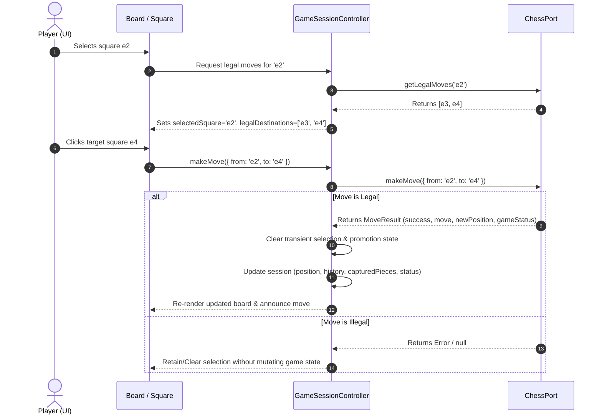

# Phase 05 · Sprint 01: Game Session State & Domain Invariants

**Document Owner:** Chess Domain Architect (CDA)  
**Status:** Approved  
**Version:** 1.0.0

---

## 1. Architectural Role & Boundary Specification

The **Game Session** layer operates as the authoritative application coordinator connecting the pure Chess Domain (`ChessPort`) to the UI Presentation layer (`Board`, controls, status indicators).

```text
┌────────────────────────────────────────────────────────┐
│                   UI Presentation                      │
│   (Board, Square, PromotionDialog, Status, Controls)   │
└──────────────────────────▲─────────────────────────────┘
                           │ (Read State / Dispatch Actions)
┌──────────────────────────▼─────────────────────────────┐
│                 Game Session Layer                     │
│  - Authoritative Game State (Position, History, Status)│
│  - Player Session Metadata                             │
│  - Transient UI State Coordination                     │
└──────────────────────────▲─────────────────────────────┘
                           │ (Strict Unidirectional Delegations)
┌──────────────────────────▼─────────────────────────────┐
│                 Chess Domain Layer                     │
│  - Legal Move Generation & Validation                  │
│  - Check / Checkmate / Stalemate / Draw Rules          │
│  - FEN / PGN / SAN Codecs & History Reversibility      │
└────────────────────────────────────────────────────────┘
```

---

## 2. Authoritative State vs. Transient UI State Invariants

### 2.1 State Categorization Matrix

| State Category                 | Attributes                                                                                                                      | Source of Truth              | Mutation Path                               |
| :----------------------------- | :------------------------------------------------------------------------------------------------------------------------------ | :--------------------------- | :------------------------------------------ |
| **Authoritative Domain State** | `position`, `turn`, `fen`, `status`, `moveHistory`, `capturedPieces`, `isCheck`, `isCheckmate`, `isGameOver`                    | `ChessPort` adapter instance | `session.makeMove(move)`, `session.reset()` |
| **Session Configuration**      | `gameId`, `mode` (`'human_vs_human'`), `players` (`white`, `black`), `startedAt`                                                | Game Session Controller      | `session.reset(config)`                     |
| **Transient UI State**         | `selectedSquare`, `focusedSquare`, `legalDestinations`, `pendingPromotion`, `announcement`, `boardOrientation`, `reducedMotion` | UI Session Interaction Hook  | Local React State / Interaction Controller  |

### 2.2 Strict Invariant Rules

1. **Single Authoritative Source:** The Chess Domain is the sole arbiter of move legality, check status, checkmate, stalemate, and draw conditions. The UI state must never compute or override domain rules.
2. **Immutability of Finished Games:** Once a game transitions to a terminal state (`checkmate`, `stalemate`, `draw`, `resigned`), no further moves can be dispatched or executed until `session.reset()` is invoked.
3. **Transient State Isolation:** Transient UI state (such as clicking a square or opening a promotion dialog) cannot mutate the board position, turn, or move history.
4. **Clean Reset Invariant:** Invoking `reset()` must atomically:
   - Reinitialize `ChessPort` to the standard starting position (`rnbqkbnr/pppppppp/8/8/8/8/PPPPPPPP/RNBQKBNR w KQkq - 0 1`).
   - Clear move history (`moveHistory.length === 0`).
   - Clear captured pieces (`capturedPieces = { white: [], black: [] }`).
   - Reset game status to `{ state: 'in_progress', isCheck: false }`.
   - Clear all transient selections (`selectedSquare = null`, `legalDestinations = new Set()`, `pendingPromotion = null`).
5. **Captured Pieces Consistency:** Captured pieces list must strictly reflect all pieces removed from the board across the move history, maintaining accurate counts for both White and Black.
6. **Move History Integrity:** Every move in `moveHistory` must contain accurate `from`, `to`, `piece`, `color`, `san`, `fenAfter`, and optional `captured` / `promotion` data matching standard FIDE algebraic notation.

---

## 3. Move Execution & Event Flow



---

## 4. Acceptance Criteria & Sign-Off

- [x] Clear decoupling between Authoritative Domain State, Session Configuration, and Transient UI State.
- [x] Strict state machine rules preventing illegal mutations on terminated games.
- [x] Complete specification for move history recording, captured piece derivation, and clean reset mechanics.

**CDA Sign-off:** APPROVED for SDET Test Cases Catalog authoring.
