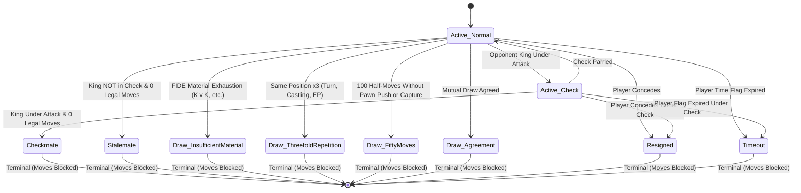

# Game Status, Draw Rules & Precedence Domain Invariants

This document formalizes the authoritative game status calculation, FIDE draw rules, resignation and timeout hooks, precedence hierarchy, and golden test fixtures for **ChessForge** v1.

---

## 1. Domain Status Architecture & States

The chess game session status is authoritative, deterministic, and evaluated purely from the domain game state.

---

## 2. Exhaustive Game States & Outcome Matrix

| State Name                   | `isOver` | `winner`      | `isCheck` | `inDraw` | `drawReason`              | Description & Semantics                                                                                   |
| :--------------------------- | :------- | :------------ | :-------- | :------- | :------------------------ | :-------------------------------------------------------------------------------------------------------- |
| `active` (Normal)            | `false`  | `null`        | `false`   | `false`  | `null`                    | Game in progress. Player has legal moves. Not in check.                                                   |
| `active` (In Check)          | `false`  | `null`        | `true`    | `false`  | `null`                    | Game in progress. Current player's King is in check, but legal evasions exist.                            |
| `checkmate`                  | `true`   | `"w"` / `"b"` | `true`    | `false`  | `null`                    | King is attacked with 0 legal evasions. Winner is the opposite of side to move.                           |
| `stalemate`                  | `true`   | `null`        | `false`   | `true`   | `"stalemate"`             | Current player is NOT in check and has 0 legal moves.                                                     |
| `draw_insufficient_material` | `true`   | `null`        | `false`   | `true`   | `"insufficient_material"` | FIDE rule: Neither player has mating material (e.g., K vs K, K+N vs K, K+B vs K, K+B vs K+B same-color).  |
| `draw_threefold_repetition`  | `true`   | `null`        | `isCheck` | `true`   | `"threefold_repetition"`  | The identical position (board pieces, turn, castling rights, en passant square) has occurred 3 times.     |
| `draw_fifty_moves`           | `true`   | `null`        | `isCheck` | `true`   | `"fifty_moves"`           | 50 consecutive full moves (100 half-moves) without a pawn move or piece capture (`halfmoveClock >= 100`). |
| `draw_agreement`             | `true`   | `null`        | `isCheck` | `true`   | `"agreement"`             | Mutually agreed draw between players.                                                                     |
| `resigned`                   | `true`   | `"w"` / `"b"` | `isCheck` | `false`  | `null`                    | Concession by one player. Winner is the opponent.                                                         |
| `timeout`                    | `true`   | `"w"` / `"b"` | `isCheck` | `false`  | `null`                    | Player's clock expired. Winner is the opponent.                                                           |

---

## 3. Status Precedence Hierarchy

When evaluating the game status after each ply or upon manual action, the precedence rules are strictly applied:

$$\text{Manual Hook (Resign/Timeout)} \succ \text{Checkmate} \succ \text{Stalemate} \succ \text{Threefold Repetition} \succ \text{Insufficient Material} \succ \text{Fifty-Move Rule} \succ \text{Active Check} \succ \text{Active Normal}$$

1. **Terminal Lock / Manual Concession:**
   - If an active game receives `resign(player)` or `timeout(player)`, the game immediately enters `resigned` or `timeout` status.
   - If the game is already in any terminal state (`isOver === true`), subsequent move attempts (`makeMove`) are rejected with domain error `GAME_ALREADY_OVER`.
   - Calling `resign` or `timeout` on an already completed game returns `GAME_ALREADY_OVER`.
2. **Checkmate Override:**
   - If a move simultaneously reaches 100 halfmoves or repeats a position for the 3rd time AND delivers checkmate, **Checkmate takes precedence**. Checkmate ends the game with decisive victory immediately.
3. **Stalemate Detection:**
   - If side to move is NOT in check and has 0 legal moves, the game is immediately a draw by stalemate.
4. **Threefold Repetition Detection:**
   - If position has occurred 3 times in game history with identical active turn, castling rights, and en passant square, game is drawn by threefold repetition.
5. **Insufficient Material Detection:**
   - Detected automatically according to FIDE Article 5.2.2.
6. **Fifty-Move Rule Detection:**
   - Halfmove clock $\ge 100$ plies without pawn movement or piece capture.
7. **Active Play (Check vs Normal):**
   - If side to move has legal moves and King is under attack $\to$ `active` with `isCheck: true`.
   - If side to move has legal moves and King is safe $\to$ `active` with `isCheck: false`.

---

## 4. FIDE Insufficient Material Rules Matrix

Under FIDE chess laws, a game is drawn when no sequence of legal moves can lead to checkmate. The minimum standard cases are:

1. **King vs King (`k vs k`):** Insufficient material.
2. **King and Bishop vs King (`kb vs k` or `k vs kb`):** Insufficient material.
3. **King and Knight vs King (`kn vs k` or `k vs kn`):** Insufficient material.
4. **King and Bishop vs King and Bishop (`kb vs kb`):**
   - **Same-color squares:** Insufficient material (drawn).
   - **Opposite-color squares:** Sufficient material for theoretical helper mate (not automatically drawn in FIDE standard rules).
5. **Any Pawns, Rooks, or Queens present:** Material is sufficient (not drawn by insufficient material).

---

## 5. Golden FEN Fixtures for Game Status & Draws

### 5.1 Checkmate Scenarios

- **Fool's Mate (Black wins):** `rnb1kbnr/pppp1ppp/8/4p3/6Pq/5P2/PPPPP2P/RNBQKBNR w KQkq - 1 3`
  - Turn: `w`, Legal Moves: `0`, In Check: `true`, Status: `checkmate`, Winner: `b`.
- **Scholar's Mate (White wins):** `r1bqkb1r/pppp1Qpp/2n2n2/4p3/2B1P3/8/PPPP1PPP/RNB1K1NR b KQkq - 0 4`
  - Turn: `b`, Legal Moves: `0`, In Check: `true`, Status: `checkmate`, Winner: `w`.
- **Back-Rank Mate:** `6k1/5ppp/8/8/8/8/8/4R1K1 b - - 0 1`
  - Move: `Re8#` or initial state `6k1/5ppp/4R3/8/8/8/8/6K1` $\to$ after `Re8#`: `4R1k1/5ppp/8/8/8/8/8/6K1 b - - 1 1`.

### 5.2 Stalemate Scenarios

- **Classic King and Queen Corner Stalemate:** `k7/2Q5/8/8/8/8/8/7K b - - 0 1`
  - Turn: `b`, Legal Moves: `0`, In Check: `false`, Status: `stalemate`, Winner: `null`.
- **Pawn Push to Stalemate:** `k7/8/PK6/8/8/8/8/8 b - - 0 1`
  - Turn: `b`, Legal Moves: `0`, In Check: `false`, Status: `stalemate`.

### 5.3 Insufficient Material Scenarios

- **Bare Kings (K vs K):** `8/8/8/4k3/8/8/4K3/8 w - - 0 1` $\to$ `draw_insufficient_material`.
- **King + Bishop vs King:** `8/8/8/4k3/8/5B2/4K3/8 w - - 0 1` $\to$ `draw_insufficient_material`.
- **King + Knight vs King:** `8/8/8/4k3/8/5N2/4K3/8 b - - 0 1` $\to$ `draw_insufficient_material`.
- **King + Bishop vs King + Bishop (Same color: both on dark squares):** `8/8/2b5/4k3/8/5B2/4K3/8 w - - 0 1`
  - Bishops on `c6` (dark: $2+5=7$ odd $\implies$ dark) and `f3` (dark: $5+2=7$ odd $\implies$ dark) $\to$ `draw_insufficient_material`.
- **King + Bishop vs King + Bishop (Opposite color squares: c6 dark, f4 light):** `8/8/2b5/4k3/5B2/8/4K3/8 w - - 0 1` $\to$ `active` (not drawn by insufficient material).

### 5.4 Fifty-Move Rule Scenarios

- **49.5 Moves (Halfmove Clock = 99):** `8/8/8/4k3/8/8/4K3/8 w - - 99 50` $\to$ `active` (`isOver = false`).
- **50 Moves Reached (Halfmove Clock = 100):** `8/8/8/4k3/8/8/4K3/8 b - - 100 50` $\to$ `draw_fifty_moves` (`isOver = true`).

### 5.5 Threefold Repetition Scenarios

- Knight bouncing between `Nf3-g1-Nf3-g1` starting from starting FEN $\to$ 3rd appearance of initial position produces `draw_threefold_repetition`.

### 5.6 In-Check (Non-terminal) Scenarios

- **Direct Check with Escapes:** `rnbqkbnr/ppp1pppp/8/3p4/4P3/8/PPPP1PPP/RNBQKBNR w KQkq d6 0 2` $\to$ after `Qh5` or check move like `Bb5+`: `rnbqkbnr/pppp1ppp/8/1B6/4P3/8/PPPP1PPP/RNBQK1NR b KQkq - 1 2`
  - Turn: `b`, In Check: `true`, Legal Moves: $> 0$, Status: `active`.

---

## 6. Failure & Immutability Invariants

1. **Terminal State Immutability:**
   Once a game reaches any terminal state (`checkmate`, `stalemate`, `draw_insufficient_material`, `draw_threefold_repetition`, `draw_fifty_moves`, `draw_agreement`, `resigned`, `timeout`):
   - `makeMove(moveInput)` returns `err({ code: "GAME_ALREADY_OVER", ... })`.
   - The board position, turn, move history, clocks, and FEN remain unmodified.
2. **Undo After Terminal State:**
   - In standard analysis/practice sessions, `undo()` reverts the terminating move, restoring the prior non-terminal game position and active status.
3. **Resignation & Timeout Validation:**
   - A player cannot resign or timeout if the game has already concluded.
   - Calling `resign("w")` on active game sets state to `resigned`, `winner: "b"`, `isOver: true`.
   - Calling `timeout("b")` on active game sets state to `timeout`, `winner: "w"`, `isOver: true`.
