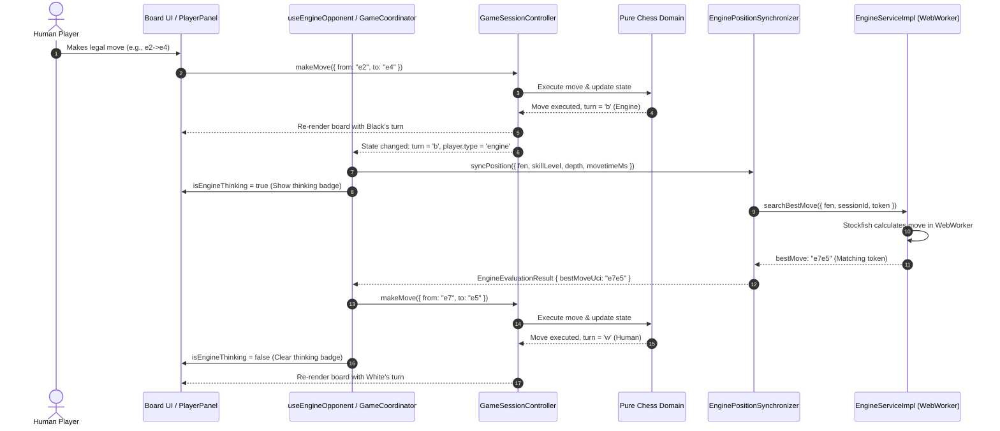

# Human vs Computer Game Flow Invariants Specification

## 1. Scope & Purpose

This specification formalizes the architectural invariants, state transitions, concurrency policies, and UI behaviors governing the **Human vs Computer (Stockfish AI)** game flow in **ChessForge**.

---

## 2. Invariants Specification

### INV-HVC-01: Engine Turn Detection & Auto-Trigger

- Whenever the active turn in a `human_vs_engine` session belongs to an engine player (`players[turn].type === 'engine'`) and the session is active (`!isGameOver`), the engine opponent coordinator MUST automatically initiate an asynchronous search for the best move in the current position (`exportFen()`).

### INV-HVC-02: White Engine Auto-Opening

- When a new game is started where White is the computer (`players.w.type === 'engine'`, such as when a human chooses to play as Black), the engine MUST automatically compute and execute White's opening move upon game session initialization without requiring any manual human trigger.

### INV-HVC-03: Board Non-Interactivity & Input Locking

- While the engine is thinking (`isEngineThinking === true`) or during the engine's turn (`turn === enginePlayer.color`), the board interface MUST remain strictly locked against user move inputs:
  - Square selection clicks MUST be ignored.
  - Drag-and-drop gestures MUST be disabled.
  - Keyboard navigation MUST NOT commit moves for the engine.
  - Promotion dialogs MUST NOT be displayed for engine moves (engine specifies promotion piece directly).

### INV-HVC-04: Thinking State Presentation

- The UI MUST visually communicate engine thinking activity:
  - The engine's `PlayerPanel` renders an active thinking badge / indicator (`data-testid="player-thinking-{color}"`).
  - The turn indicator / status bar reflects the engine's thinking state (`"Stockfish is thinking..."` or `"[Player] is thinking..."`).
  - Thinking indicators MUST immediately clear when the best move is resolved, cancelled, or when the game concludes.

### INV-HVC-05: UCI Move Parsing & Authoritative Execution

- The best move string returned from the engine (e.g. `"e2e4"`, `"e7e8q"`, `"g1f3"`) MUST be parsed into domain `MoveInput`:
  - `from`: Square (e.g. `"e2"`)
  - `to`: Square (e.g. `"e4"`)
  - `promotion`: PieceType optional (e.g. `"q"`, `"r"`, `"b"`, `"n"`)
- The move is dispatched through `GameSessionController.makeMove()`.
- The move MUST be validated and executed through the pure chess domain adapter, accurately updating move history, captured pieces, check/checkmate status, and turn alternation.

### INV-HVC-06: Concurrency & Stale Move Discard

- If a game session is reset, restarted, or a new game is initiated while the engine is calculating a move:
  - The active engine search MUST be cancelled immediately via `cancelSearch()`.
  - The session / epoch token MUST be invalidated.
  - Any late best move message arriving from the worker MUST be discarded and MUST NOT mutate the newly reset board position.

### INV-HVC-07: Undo & Takeback Policy in Human vs Computer

- In `human_vs_engine` mode:
  - If the human player triggers Undo during their turn (after the engine has replied): the game controller rolls back two plies (both the engine's response and the human's preceding move) so that it remains the human's turn. If only one move has been played in the game, it rolls back one move.
  - If the human player triggers Undo while the engine is thinking: the in-flight engine search is cancelled immediately, and one ply (the human's move) is rolled back, returning control to the human.

### INV-HVC-08: Resignation & Draw Safety During Thinking

- If the human player resigns or triggers a restart while the engine is thinking:
  - The engine search MUST be cancelled immediately.
  - The game status MUST transition cleanly without unhandled rejections or stuck thinking states.

### INV-HVC-09: Engine Difficulty Binding

- Engine search options (`skillLevel`, `depth`, `movetimeMs`) MUST be parameterized by the configured engine difficulty preset (Levels 1..8) associated with the player config or active difficulty preference.

---

## 3. Architecture & Data Flow

---

## 4. Handoff & Governance

- **Author:** Chess Domain Architect & Dev Architect
- **Target:** SDET Architect
- **Status:** **APPROVED FOR TEST CATALOGING & IMPLEMENTATION**
