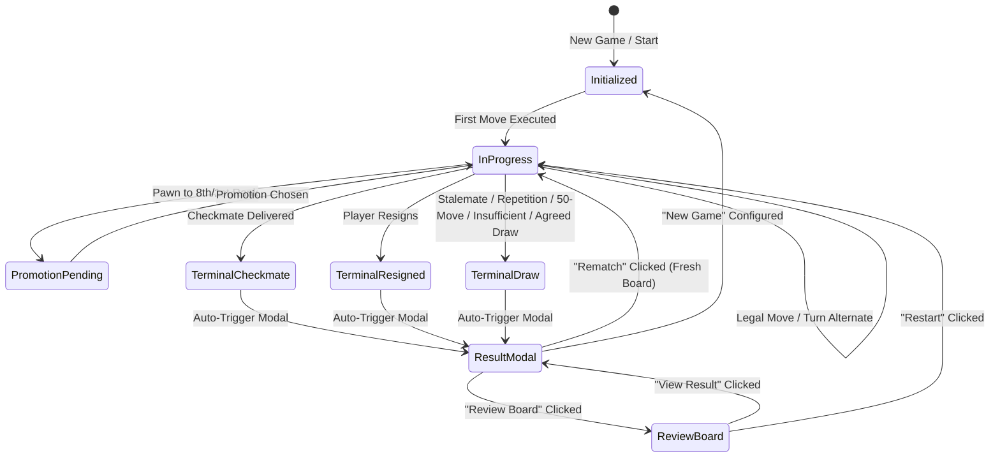

# Human vs Human End-to-End Game Lifecycle Invariants

**Document Ref:** `docs/chess/human_vs_human_e2e_invariants.md`  
**Author:** Chess Domain Architect  
**Sprint:** Phase 05 · Sprint 06: Human vs Human End-to-End  
**Status:** Approved Architectural Contract

---

## 1. Executive Summary & Objective

This specification formalizes the comprehensive domain invariants, session state lifecycle, and presentation synchronization guarantees governing complete local **Human vs Human** chess matches within **ChessForge**.

The local chess loop encompasses the complete lifecycle from session initialization through multi-ply move execution, special tactical moves (castling, en passant, promotion), tactical game-over states (checkmate, resignation, automatic draw, agreed draw), board review, rematch, and fresh game instantiation.

---

## 2. Core Domain & Lifecycle Invariants

### 2.1 Unidirectional State & Authority Invariant

$$\text{User / Pointer Gesture} \longrightarrow \text{UI Component} \longrightarrow \text{useGameSession / GameCoordinator} \longrightarrow \text{ChessDomainPort} \longrightarrow \text{Chess.js Adapter}$$

- **Invariant 1.1 (Domain Authority):** The chess domain port is the single authoritative source of truth for board position, turn, legal destinations, in-check state, checkmate, stalemate, and draw conditions.
- **Invariant 1.2 (UI Decoupling):** UI components (Board, Square, Piece, MoveHistoryPanel, PlayerPanel, GameResultModal) contain zero chess move validation or legality calculations.
- **Invariant 1.3 (Transient Isolation):** UI transient state (square hover, drag-and-drop ghost, selected square, promotion dialog open, confirmation modal open) cannot mutate domain state without an explicit validated move dispatch.

### 2.2 Board Immutability in Terminal State

- **Invariant 2.1 (Post-Game Move Immunity):** Once a game reaches a terminal state (`checkmate`, `resignation`, `stalemate`, `threefold_repetition`, `fifty_move_rule`, `insufficient_material`, `draw_agreement`), all board interactions (square clicks, piece dragging, keyboard navigation move submission) are strictly disabled.
- **Invariant 2.2 (Terminal Result Preservation):** Entering "Review Board" mode preserves the exact terminal FEN, move history list, captured pieces, and active scoreline. No board mutations can occur during review mode.

### 2.3 Move History & Captured Material Bijectivity

- **Invariant 3.1 (Sequential Move History):** Every legal move executed appends exactly one notation record with official Standard Algebraic Notation (SAN), move number, and active color. Move numbering increases monotonically after Black's turn ($1. e4\ e5,\ 2. Nf3\ Nc6\dots$).
- **Invariant 3.2 (Piece Set Conservation):** The active board pieces plus captured pieces for each color must always equal the initial set of 16 pieces:
  $$\text{Count}(\text{Active Pieces}_c) + \text{Count}(\text{Captured Pieces}_c) = 16 \quad \forall c \in \{\text{White}, \text{Black}\}$$
- **Invariant 3.3 (Material Balance Accuracy):** Material balance ($\sum \text{value}(\text{captured by White}) - \sum \text{value}(\text{captured by Black})$) updates synchronously on each capture/undo ply.

### 2.4 Pawn Promotion Flow Invariants

- **Invariant 4.1 (Promotion Suspension):** When a pawn reaches the terminal rank (8th rank for White, 1st rank for Black), the game session suspends normal turn progression and displays the `PromotionDialog`.
- **Invariant 4.2 (Atomic Move Commit):** The promotion move is committed to the chess domain as an atomic unit (`e7e8q`, `a2a1n`, etc.) only after the human player selects the promotion piece role (Queen, Rook, Bishop, Knight).
- **Invariant 4.3 (Cancellation / Re-selection):** If the promotion dialog is dismissed or another square is clicked, the pawn remains on its original pre-move square and active turn is not advanced.

### 2.5 Resignation & Draw Bilateral Invariants

- **Invariant 5.1 (Resignation Terminal Score):**
  - If White resigns $\implies$ Winner is Black, Score is `0 - 1`, Reason is `"by Resignation"`.
  - If Black resigns $\implies$ Winner is White, Score is `1 - 0`, Reason is `"by Resignation"`.
- **Invariant 5.2 (Agreed Draw Terminal Score):**
  - When a player offers a draw, the opponent is prompted to Accept or Decline.
  - If Accepted $\implies$ Game terminates with `state: "draw_agreement"`, Score is `½ - ½`, Reason is `"by Mutual Agreement"`.
  - If Declined $\implies$ Modal closes, game remains active, turn is unchanged, live announcement alerts players.

### 2.6 Session Reset & Clean Slate Invariants

- **Invariant 6.1 (Rematch Cleanliness):** Clicking "Rematch" resets the game to standard starting FEN (`rnbqkbnr/pppppppp/8/8/8/8/PPPPPPPP/RNBQKBNR w KQkq - 0 1`), clears move history, resets captured pieces trays, clears result modal, resets clocks, and keeps configured player names.
- **Invariant 6.2 (New Game Cleanliness):** Starting a New Game resets all game state and allows reconfiguration of player names and initial board orientation.

---

## 3. Standard Game Scenarios & Verification Matrix

| Scenario Name                | Move Playout Sequence                                    | Expected Terminal State      | Expected Score | Modal Reason Subtitle         |
| :--------------------------- | :------------------------------------------------------- | :--------------------------- | :------------- | :---------------------------- |
| **Scholar's Mate**           | 1. e4 e5 2. Bc4 Nc6 3. Qh5 Nf6 4. Qxf7#                  | `checkmate` (White Wins)     | `1 - 0`        | `"by Checkmate"`              |
| **Fool's Mate**              | 1. f3 e5 2. g4 Qh4#                                      | `checkmate` (Black Wins)     | `0 - 1`        | `"by Checkmate"`              |
| **White Resigns**            | 1. e4 e5 2. Nf3 (White Resigns)                          | `resignation` (Black Wins)   | `0 - 1`        | `"by Resignation"`            |
| **Black Resigns**            | 1. e4 (Black Resigns)                                    | `resignation` (White Wins)   | `1 - 0`        | `"by Resignation"`            |
| **Agreed Draw**              | 1. e4 e5 2. Nf3 Nf6 (White offers draw -> Black accepts) | `draw_agreement` (Draw)      | `½ - ½`        | `"by Mutual Agreement"`       |
| **Draw Declined & Continue** | 1. e4 e5 (White offers draw -> Black declines -> 2. Nf3) | `in_progress`                | N/A            | Modal closes, game continues  |
| **Promotion to Queen**       | 1. e4 d5 2. exd5 c6 3. dxc6 ... pawn promotes e8=Q       | `in_progress` or `checkmate` | N/A or `1 - 0` | Piece rendered as Queen       |
| **Restart Mid-Game**         | 1. e4 e5 2. Nf3 (Restart confirmed)                      | Initial state                | N/A            | History empty, board at start |
| **Review Board & Rematch**   | Checkmate -> Click Review Board -> Click Rematch         | Initial state                | N/A            | Fresh game started            |

---

## 4. Sign-Off & Handoff

The domain invariants defined herein provide a complete, deterministic contract for the Human vs Human local game loop.

- **Domain Authority:** Validated.
- **Terminal Immutability:** Enforced.
- **Status:** **APPROVED**. Ready for SDET Architect Test Cases Catalog authoring.
