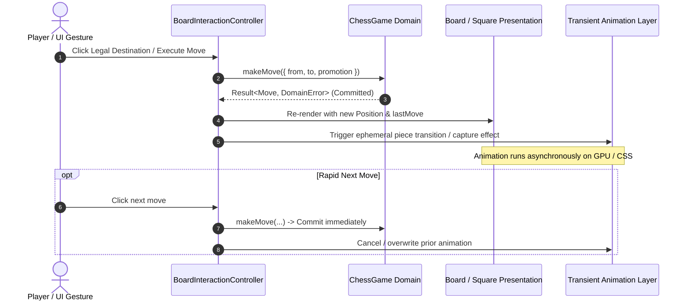

# Chess Domain Specification: Move Animation and Last-Move Invariants

## Document Metadata

- **Phase:** 04 (Board UI Presentation)
- **Sprint:** 04 (Move Animation and Last-Move State)
- **Author:** Chess Domain Architect
- **Target Role:** SDET Architect & Dev Architect / Senior SDE
- **Status:** APPROVED

---

## 1. Domain Authority vs. Ephemeral Presentation

ChessForge enforces strict unidirectional architectural decoupling:
$$\text{UI Presentation} \longrightarrow \text{Application Service} \longrightarrow \text{Chess Domain} \longrightarrow \text{Adapter}$$

Move animation and visual indicators are **strictly presentation-tier transient effects**. They must adhere to the following architectural rules:

1. **Instantaneous State Commitment:** When a move is executed (`game.makeMove(input)`), the domain updates the board matrix, turn, halfmove clock, fullmove counter, check status, and game history synchronously and atomically.
2. **Non-Blocking Visuals:** Animations, transitions, and timers must **NEVER** delay, debounce, or lock domain state updates. User interactions, engine evaluations, and undo/redo operations must function immediately without waiting for CSS or JS animations to finish.
3. **Deterministic State Invariance:** Even if an animation is interrupted, aborted, or skipped (e.g., due to rapid moves or reduced motion), the visual board state must match the domain's authoritative position matrix with 100% fidelity.

---

## 2. Last-Move State Semantics

The `lastMove` state captures the most recent half-move executed on the board:

$$\text{lastMove} = \{ \text{from}: \text{Square}, \text{to}: \text{Square} \} \mid \text{null}$$

### 2.1 Origin & Destination Semantics

- **`from` (Origin Square):** The square where the moving piece originated.
- **`to` (Destination Square):** The square where the moving piece landed.
- **Visual Distinction:** Both squares receive the `is-last-move` indicator. To assist visual parsing and accessibility, origin and destination squares are differentiated via data attributes (`data-is-last-move="from"` vs `data-is-last-move="to"`) and CSS classes (`is-last-move-from`, `is-last-move-to`).

### 2.2 Special Move Semantics

| Move Type                      | `from` Square                     | `to` Square                          | Auxiliary Domain Event                                                           |
| :----------------------------- | :-------------------------------- | :----------------------------------- | :------------------------------------------------------------------------------- |
| **Standard Move**              | Piece start square                | Piece target square                  | Single piece relocation                                                          |
| **Standard Capture**           | Capturing piece start             | Captured piece square                | Captured piece removed; capture effect at `to`                                   |
| **Kingside Castling (O-O)**    | `e1` (White) / `e8` (Black)       | `g1` (White) / `g8` (Black)          | King move highlighted; Rook relocates from `h1`->`f1` / `h8`->`f8`               |
| **Queenside Castling (O-O-O)** | `e1` (White) / `e8` (Black)       | `c1` (White) / `c8` (Black)          | King move highlighted; Rook relocates from `a1`->`d1` / `a8`->`d8`               |
| **En Passant Capture**         | Attacking pawn square (e.g. `e5`) | En passant target square (e.g. `d6`) | Captured pawn removed from adjacent square (e.g. `d5`); capture effect triggered |
| **Pawn Promotion**             | Pawn 7th rank (e.g. `e7`)         | Pawn 8th rank (e.g. `e8`)            | Pawn replaced immediately by promoted piece (e.g. `Q`) at destination            |

---

## 3. Piece Movement & Capture Animation Specifications

### 3.1 Piece Slide Animation

- **Mechanism:** Smooth CSS transform/translation from the origin square coordinate to the destination square coordinate.
- **Duration Budget:** $150\text{ms} - 200\text{ms}$ with `cubic-bezier(0.2, 0, 0.2, 1)` easing.
- **Hardware Acceleration:** Uses CSS `transform: translate3d(...)` and `will-change: transform` to ensure $60\text{fps}$ rendering within the desktop memory footprint budget ($< 150\text{ MB}$).
- **Zero Layout Shifts:** Animation must operate on transform coordinates, never altering DOM layout geometry or flow.

### 3.2 Capture Animation

- **Visual Feedback:** When a piece is captured, the destination square triggers a brief, subtle capture pop/flash effect (`scale` pulse and glow) to clearly communicate piece removal.
- **Duration:** $\le 200\text{ms}$.

---

## 4. Reduced-Motion & Accessibility Invariants

### 4.1 Reduced-Motion Contract

- **System Preference Detection:** Check OS-level media query `(prefers-reduced-motion: reduce)`.
- **Application Control:** Provide an accessible setting/hook (`useReducedMotion`) allowing users to toggle animation preferences.
- **Behavior under Reduced Motion:**
  - Piece movement transitions are set to $0\text{ms}$ (instantaneous relocation).
  - Capture pop/scale animations are disabled.
  - **Crucial Invariant:** Last-move highlighting (`is-last-move`, `is-last-move-from`, `is-last-move-to`) and check highlighting remain **100% active and visible**. Accessibility indicators must never be stripped when motion is reduced.

---

## 5. Rapid-Move & Concurrency Invariants

1. **Rapid Playout Invariant:** If multiple moves occur within $< 150\text{ms}$ (e.g. engine moves, scripted tests, rapid blitz clicks), animations must not accumulate, desynchronize, or orphan ghost pieces in the DOM.
2. **Game Reset / Position Load Invariant:** Calling `game.reset()` or loading a new FEN/PGN clears `lastMove` or sets it to the position's designated last move, immediately terminating any active transitions.
3. **Move Undo / Redo Invariant:** When `game.undo()` is invoked, the previous board state is restored immediately, and `lastMove` updates to the prior historical move (or `null` if at the starting position).

---

## 6. Chess Domain Architect Sign-Off

The requirements and invariants specified herein maintain strict domain decoupling, preserve 100% FIDE correctness across all move types, ensure instant state commits, and establish non-blocking animation contracts.

**Sign-off Status:** **APPROVED** -> Ready for SDET Architect Test Cases Catalog.
