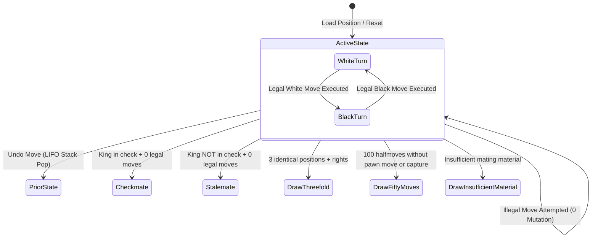
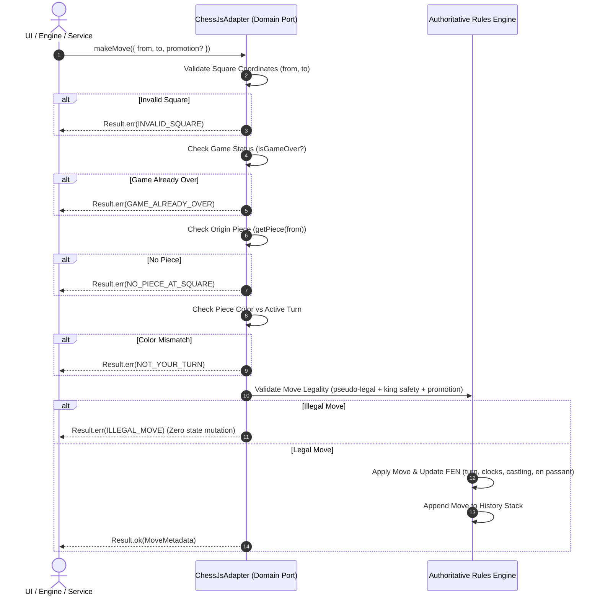

# Chess Domain: Move Execution Invariants & State Transition Contract

**Domain Specification · Phase 03 · Sprint 02: Legal Move Execution**  
**Author:** Chess Domain Architect (`role-chess-domain-architect`)  
**Status:** Canonical & Authoritative

---

## 1. Executive Summary

This document establishes the authoritative FIDE chess semantics, state transition invariants, move validation pipelines, failure immutability guarantees, and undo history contracts for **ChessForge**.

In accordance with our architecture, the **Chess Domain** is the single authoritative source of truth. All move calculations, legal move validations, turn transitions, clock updates, and history records must strictly satisfy the invariants defined herein.

---

## 2. Domain Invariants



### 2.1 Board & Piece Invariants

1. **King Invariant:** There is always exactly one White King (`w.k`) and one Black King (`b.k`) on the board.
2. **Absolute King Safety:** No legal move may result in a position where the moving player's king is in check.
3. **Turn Exclusivity:** Only the player whose turn it is (`w` or `b`) may move. Attempting to move an opponent's piece or moving when it is not the player's turn must be rejected with `NOT_YOUR_TURN`.
4. **Coordinate Integrity:** All squares must strictly adhere to standard algebraic notation `[a-h][1-8]`. Any move with out-of-bounds squares must fail with `INVALID_SQUARE`.
5. **Game Over Immutability:** Once a game reaches a terminal state (`checkmate`, `stalemate`, `draw_*`), no further moves may be executed. Attempting to move must fail with `GAME_ALREADY_OVER`.

---

## 3. Authoritative Move Validation & Execution Pipeline



### 3.1 Move Input Handling

The domain accepts moves via `MoveInput`:

```typescript
export interface MoveInput {
  from: Square;
  to: Square;
  promotion?: PromotionPieceType; // 'q' | 'r' | 'b' | 'n'
}
```

- **Pawn Promotion:** If a pawn moves to the 8th rank (for White) or 1st rank (for Black), a `promotion` piece type must be specified or default to `'q'`. If an invalid promotion piece is provided or required promotion is missing, move validation must reject the move.
- **Ambiguous Moves:** Coordinate-based input (`from`, `to`, `promotion`) provides 100% unambiguous move specification.

### 3.2 State Transition & Clock Mechanics

When a legal move is executed:

1. **Turn Toggle:** Active color changes strictly: `w -> b` or `b -> w`.
2. **Halfmove Clock (50-move rule counter):**
   - Reset to `0` if the moving piece is a **Pawn** (`p`) or if any piece is **Captured**.
   - Incremented by `1` for all other piece moves without capture.
3. **Fullmove Number:**
   - Unchanged after White's move.
   - Incremented by `1` immediately after Black's move completes.
4. **Castling Rights Revocation:**
   - King move permanently revokes both kingside and queenside castling rights for that player.
   - Rook move or capture of original corner rook revokes castling rights on that specific wing.
5. **En Passant Target Square:**
   - Created when a pawn advances 2 squares from its initial rank (`rank 2 -> rank 4` for White, `rank 7 -> rank 5` for Black) without obstacle. The target square is the square skipped.
   - Cleared to `-` on the subsequent move regardless of whether en passant was captured.

---

## 4. Failure Immutability Contract

An illegal move attempt must **NEVER** mutate any part of the domain state:

- Board matrix positions remain identical.
- FEN string before and after rejected move are strictly equal.
- Active player turn remains identical.
- Move history length and items remain identical.
- Clocks and castling rights remain identical.

---

## 5. Move Metadata Specification

Every successfully executed move returns a structured `Move` metadata object:

| Field         | Type                                     | Description                                                                  |
| :------------ | :--------------------------------------- | :--------------------------------------------------------------------------- |
| `from`        | `Square`                                 | Origin square (`a1`–`h8`).                                                   |
| `to`          | `Square`                                 | Destination square (`a1`–`h8`).                                              |
| `piece`       | `Piece`                                  | Moving piece `{ type, color }`.                                              |
| `promotion`   | `PromotionPieceType \| undefined`        | Promoted piece type if pawn promotion occurred (`q`, `r`, `b`, `n`).         |
| `captured`    | `Piece \| undefined`                     | Captured piece `{ type, color }` if capture occurred (including en passant). |
| `san`         | `string`                                 | Standard Algebraic Notation (e.g. `Nf3`, `exd5`, `e8=Q#`, `O-O`).            |
| `lan`         | `string`                                 | Long Algebraic / UCI notation (e.g. `e2e4`, `e7e8q`).                        |
| `isEnPassant` | `boolean \| undefined`                   | `true` if move was an en passant capture.                                    |
| `isCastling`  | `'kingside' \| 'queenside' \| undefined` | Castling wing if move was castling.                                          |
| `isCheck`     | `boolean \| undefined`                   | `true` if opponent is in check following move.                               |
| `isCheckmate` | `boolean \| undefined`                   | `true` if opponent is checkmated following move.                             |
| `beforeFen`   | `string`                                 | Full FEN representation immediately prior to move.                           |
| `afterFen`    | `string`                                 | Full FEN representation immediately following move.                          |

---

## 6. Undo and Position Reconstruction

### 6.1 Move Undo (LIFO Stack)

- `undo()` removes and returns the most recent move from the internal move stack.
- Board state, active player, castling rights, en passant target, and halfmove/fullmove clocks are restored to their exact state prior to that move.
- Calling `undo()` on an initial board with empty history returns `Result.err(NO_MOVE_TO_UNDO)`.

### 6.2 Position Reconstruction & Invariant Preservation

- Loading a FEN via `loadFen(fen)` clears history and resets the game state to the exact FEN position.
- Replaying a game via `getHistory()` on a fresh board reconstructs the exact final FEN position, satisfying the property:
  $$\text{Replay}(\text{game.getHistory()}) \equiv \text{game.getPosition()}$$

---

## 7. Golden FEN Fixtures for Move Execution

| Fixture ID      | Golden FEN                                                                 | Scenario / Feature                                                   |
| :-------------- | :------------------------------------------------------------------------- | :------------------------------------------------------------------- |
| `FEN-GOLDEN-01` | `rnbqkbnr/pppppppp/8/8/8/8/PPPPPPPP/RNBQKBNR w KQkq - 0 1`                 | Initial board, 20 legal white moves.                                 |
| `FEN-GOLDEN-02` | `r1bqkb1r/pppp1ppp/2n5/4p3/2B1n3/5N2/PPPP1PPP/RNBQK2R w KQkq - 0 5`        | White can castle kingside `O-O` (`e1g1`).                            |
| `FEN-GOLDEN-03` | `r3k2r/pppq1ppp/2np1n2/2b1p1B1/2B1P1b1/2NP1N2/PPPQ1PPP/R3K2R w KQkq - 4 8` | Both players have kingside & queenside castling rights.              |
| `FEN-GOLDEN-04` | `rnbqkbnr/pp1p1ppp/8/2p1pP2/8/8/PPPPP1PP/RNBQKBNR w KQkq e6 0 3`           | White en passant capture available (`f5xe6`).                        |
| `FEN-GOLDEN-05` | `8/4P3/8/8/8/8/k6K/8 w - - 0 1`                                            | White pawn on 7th rank ready for promotion.                          |
| `FEN-GOLDEN-06` | `rnb1kbnr/pppp1ppp/8/4p3/6Pq/5P2/PPPPP2P/RNBQKBNR w KQkq - 1 3`            | Fool's Mate (immediate checkmate, zero legal moves for White).       |
| `FEN-GOLDEN-07` | `k7/8/1Q6/8/8/8/8/K7 b - - 0 1`                                            | Stalemate (Black king has no legal moves, not in check).             |
| `FEN-GOLDEN-08` | `8/8/8/4k3/8/8/8/4K2R w K - 0 1`                                           | Castling through check test: `e1g1` illegal if `f1` attacked.        |
| `FEN-GOLDEN-09` | `8/2p5/3P4/8/8/8/8/k6K w - - 0 1`                                          | Pawn capture and promotion test.                                     |
| `FEN-GOLDEN-10` | `rnbqkbnr/pppppppp/8/8/4P3/8/PPPP1PPP/RNBQKBNR b KQkq e3 0 1`              | Post 1. e4: verify turn is `b`, en passant is `e3`, fullmove is `1`. |
