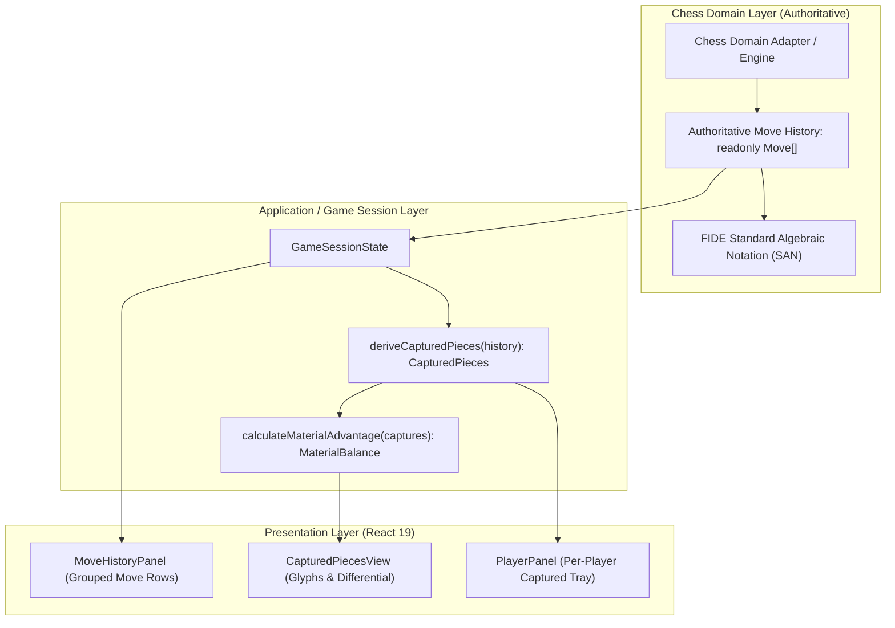

# Move History, Ply Grouping & Captured Pieces Invariants

## Phase 05 · Sprint 03: Move History and Captured Pieces

This document formalizes the domain invariants, algebraic notation grouping, captured piece derivation, and material differential calculations for the **ChessForge** game review subsystem.

---

## 1. Architectural Boundary & Authoritative State

- **Domain Authority:** All SAN strings, capture flags, piece identities, and move sequences originate strictly from the Chess Domain (`ChessGame` / `ChessJsAdapter`). The UI presentation layer **MUST NOT** construct, manipulate, or parse SAN strings manually.
- **Snapshot Immutability:** `moveHistory` is exposed as an immutable array `readonly Move[]` in `GameSessionState`.
- **Pure Derived Metrics:** Captured piece lists and material balances are purely derived functions of the authoritative move history:
  $$f(\text{moveHistory}) \to \text{CapturedPieces}$$
  $$g(\text{CapturedPieces}) \to \text{MaterialBalance}$$

---

## 2. Move Numbering, Plies, and Row Grouping Invariants

### 2.1 Ply vs Move Definition

- A **Ply** (half-move) corresponds to a single turn taken by one player ($i \in [0, N-1]$).
- A **Full Move** is a complete cycle of White move followed by Black move.

### 2.2 Grouping Formula

For any move history array with length $N$:

- The total number of full move rows is $R = \lceil N / 2 \rceil$.
- For row index $k \in [0, R-1]$:
  - **Move Number:** $M = k + 1$
  - **White Ply Index:** $\text{ply}_{\text{white}} = 2k$
  - **White Move Record:** $\text{history}[2k]$
  - **Black Ply Index:** $\text{ply}_{\text{black}} = 2k + 1$
  - **Black Move Record:** $\text{history}[2k + 1]$ (if $2k + 1 < N$, otherwise `undefined` for active White turn)

### 2.3 Row Invariants

1. **Monotonic Move Numbers:** Move numbers must strictly increment from $1$ to $R$ with no gaps.
2. **Deterministic Ply Association:** Row $k$ contains White ply $2k$ and optional Black ply $2k+1$.
3. **Latest Move Identity:**
   - If $N > 0$, the latest move is strictly $\text{history}[N-1]$.
   - If $N = 0$, latest move is `undefined`.

---

## 3. Captured Pieces & Material Differential Invariants

### 3.1 Captured Piece Attribution

A captured piece is removed from the board when a player executes a capturing move:

- When **White** captures a piece ($\text{move.piece.color} = \text{'w'}$, $\text{move.captured} \neq \text{null}$), the captured piece was **Black** and is added to **White's Captured Tray**.
- When **Black** captures a piece ($\text{move.piece.color} = \text{'b'}$, $\text{move.captured} \neq \text{null}$), the captured piece was **White** and is added to **Black's Captured Tray**.

### 3.2 Special Capturing Rules

1. **En Passant Captures:**
   - The captured pawn is on the passed square (e.g. $e5$ when moving $d5 \to e6$), not the destination square.
   - $\text{move.captured.type} = \text{'p'}$.
   - The captured pawn is correctly attributed to the capturing player's tray.
2. **Promotion Captures:**
   - A pawn moves to the 8th/1st rank while capturing an opposing piece ($\text{move.captured} \neq \text{null}$).
   - The captured piece is recorded in the capturer's tray. The promoted piece (e.g. Queen) remains on the board and is not considered a capture.

### 3.3 FIDE Standard Piece Values

| Piece Type | Symbol    | Point Value    | Display Sort Priority    |
| :--------- | :-------- | :------------- | :----------------------- |
| **Queen**  | `q` / `Q` | 9              | 1 (Highest)              |
| **Rook**   | `r` / `R` | 5              | 2                        |
| **Bishop** | `b` / `B` | 3              | 3                        |
| **Knight** | `n` / `N` | 3              | 4                        |
| **Pawn**   | `p` / `P` | 1              | 5 (Lowest)               |
| **King**   | `k` / `K` | $\infty$ (N/A) | N/A (Cannot be captured) |

### 3.4 Material Score Calculation & Advantage Differential

For a captured pieces state $(\text{whiteCaptures}, \text{blackCaptures})$:
$$\text{Score}_{\text{white}} = \sum_{p \in \text{whiteCaptures}} \text{Value}(p)$$
$$\text{Score}_{\text{black}} = \sum_{p \in \text{blackCaptures}} \text{Value}(p)$$
$$\Delta = \text{Score}_{\text{white}} - \text{Score}_{\text{black}}$$

- If $\Delta > 0$: White holds material advantage $+\Delta$. Displayed on White's tray/panel.
- If $\Delta < 0$: Black holds material advantage $+|\Delta|$. Displayed on Black's tray/panel.
- If $\Delta = 0$: Material is strictly balanced. No differential badge is displayed.

---

## 4. UI Rendering, Virtualization & Accessibility Guardrails

1. **Auto-Scroll Behavior:** When a new move is executed, the `MoveHistoryPanel` container smoothly scrolls to the latest move row ensuring the active move is always in viewport.
2. **Keyboard & Screen Reader Accessibility:**
   - Move history container uses semantic `role="region"` and `aria-label="Move history"`.
   - Move rows and move buttons provide clear ARIA labels (e.g. `aria-label="Move 1, White, e4"`).
   - Captured piece trays use `aria-label="White captured pieces"` / `aria-label="Black captured pieces"`.
3. **Session Reset & Reversibility:**
   - On `undo()`, the last move is removed from history and any captured piece is restored to the active board, recalculating scores immediately.
   - On `reset()` or `loadFen()`, history and captures reset atomically to initial empty state without memory leaks or stale UI artifacts.
