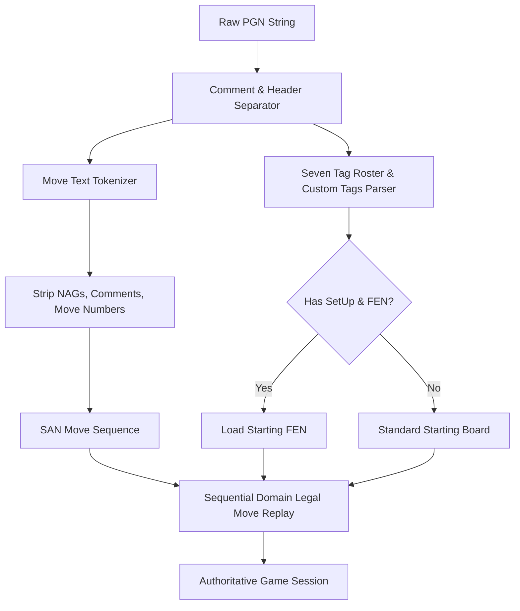

# PGN Import / Export Domain Invariants & Specification

**Document Version:** 1.0.0  
**Phase:** 03 (Chess Domain & Calculation Engine)  
**Sprint:** 06 (PGN Import Export)  
**Status:** APPROVED  
**Author:** Chess Domain Architect

---

## 1. Executive Summary & Architectural Scope

Portable Game Notation (PGN) is the standard textual format for recording chess games. Within **ChessForge**, PGN import and export functionality operates strictly within the pure chess domain layer.

### Core Architectural Principles

1. **Local-First & Pure Domain:** PGN parsing, validation, move replaying, and serialization are independent of React, DOM, and UI components.
2. **Replay Validation & Domain Authority:** Every move in an imported PGN move text must be validated against the active board state using domain legal move generation. Illegal moves must immediately fail with structured errors without corrupting active game state.
3. **Seven Tag Roster (STR) Adherence:** Standard metadata tag pairs must be parsed, preserved, validated, and exported accurately.
4. **Resilience & Sanitization:** Comments (`{...}` and `;...`), Numeric Annotation Glyphs (NAGs `$1..$255`, `!`, `?`), and Recursive Annotation Variations (`(...)`) must be safely handled without breaking move tokenization.
5. **Round-Trip Fidelity:** Any valid game played or imported through ChessForge, when exported to PGN and re-imported, must produce the exact identical move history, terminal board position (FEN), and game status.

---

## 2. Seven Tag Roster (STR) Specification

Every complete PGN archive exports the Seven Tag Roster in standard order before the move text section:

| Tag      | Type     | Required / Default                                | Format / Constraints                        |
| :------- | :------- | :------------------------------------------------ | :------------------------------------------ |
| `Event`  | `string` | Mandatory (Default: `"Casual Game"`)              | Event name                                  |
| `Site`   | `string` | Mandatory (Default: `"ChessForge Desktop"`)       | City, Region, or System                     |
| `Date`   | `string` | Mandatory (Default: `YYYY.MM.DD` or `????.??.??`) | Standard PGN date format                    |
| `Round`  | `string` | Mandatory (Default: `"?"` or `"1"`)               | Round number or `?`                         |
| `White`  | `string` | Mandatory (Default: `"White"`)                    | White player name                           |
| `Black`  | `string` | Mandatory (Default: `"Black"`)                    | Black player name                           |
| `Result` | `string` | Mandatory (Default: `"*"`)                        | Must be one of `1-0`, `0-1`, `1/2-1/2`, `*` |

### Supplementary & Setup Tags

- `SetUp`: Mandatory when starting from non-standard position (`"1"`).
- `FEN`: Mandatory when `SetUp` is `"1"`, containing the authoritative 6-field starting FEN string.
- `PlyCount`: Integer count of half-moves.
- `Termination`: Reason for game conclusion (e.g. `"normal"`, `"time forfeit"`, `"abandoned"`).

---

## 3. SAN Move Notation & Token Invariants

Standard Algebraic Notation (SAN) represents moves compactly:

1. **Piece Moves:** Uppercase letter `N`, `B`, `R`, `Q`, `K` followed by target square (e.g., `Nf3`, `Bc4`, `Qd1`). Pawns omit piece letter (`e4`, `d5`).
2. **Captures:** Indicated with `x` (e.g., `Bxf7`, `Nxd4`). Pawn captures include origin file (e.g., `exd5`, `cxb4`, `axb3`).
3. **Disambiguation:** When two identical pieces can move to the same square:
   - File disambiguation preferred: `Nbd2`, `Rae1`, `Rad1`.
   - Rank disambiguation if files match: `N1d2`, `R1e2`.
   - Full square disambiguation if rank and file are ambiguous (rare with 3+ promoted pieces): `Qh4e1`.
4. **Castling:**
   - Kingside: `O-O` (capital letters 'O', uppercase) or `0-0` (numeric fallback accepted during import).
   - Queenside: `O-O-O` or `0-0-0`.
5. **Pawn Promotion:** Destination square followed by promotion piece (e.g., `e8=Q`, `a1=N`, `d8=R`, `f1=B` or suffix `e8Q`).
6. **Check and Checkmate Suffixes:**
   - Check: `+` (e.g., `Qh5+`, `Bxf7+`).
   - Double check: `+` or `++`.
   - Checkmate: `#` (e.g., `Qxf7#`, `Rh8#`).
7. **En Passant Captures:** Formatted as standard pawn capture (e.g., `exd6` or `cxd6`).

---

## 4. Parser & Tokenizer Rules



### Invariants for Parsing

1. **Comment Stripping:**
   - Multi-character comments inside `{ ... }` must be ignored during move tokenization.
   - Rest-of-line comments starting with `;` until newline `\n` must be ignored.
2. **NAGs & Annotations:**
   - Numeric Annotation Glyphs (e.g., `$1`, `$2`, `$14`) and text glyphs (`!`, `?`, `!?`, `?!`, `!!`, `??`) must be safely skipped.
3. **Variations:**
   - RAV sub-variations inside parentheses `( ... )` must be skipped in main line extraction.
4. **Move Numbers:**
   - Numbers followed by period(s) (e.g., `1.`, `1...`, `12.`) indicate move count and must not be treated as moves.
5. **Termination Marker:**
   - The trailing result marker (`1-0`, `0-1`, `1/2-1/2`, `*`) concludes the move text.
   - If missing, default to `*` (in-progress/unknown).
6. **Tag Syntax:**
   - Tag lines must match `[TagName "TagValue"]` format.
   - Double quotes inside tag values must be escaped if present.

---

## 5. Move Replaying & State Transition Invariants

1. **Sequential Legality:** Every move token in the sequence must be checked against `getLegalMoves()` of the board at that ply.
2. **Ambiguity Resolution:** The domain adapter converts SAN (e.g. `Nf3`) to authoritative coordinates (`g1` -> `f3`).
3. **Atomic Failure:** If any move token is illegal, unrecognized, or syntactically invalid, parsing stops immediately, returns a structured `ChessDomainError`, and leaves the target `ChessGame` instance unmodified.
4. **Status Synchronization:** When the PGN contains a termination marker (`1-0`, `0-1`, `1/2-1/2`), the final status must align with board conditions (checkmate, draw, or manual resignation/agreement).

---

## 6. Golden PGN Fixtures

### Fixture 1: Standard Short Game (Scholar's Mate)

```pgn
[Event "Casual Game"]
[Site "ChessForge Desktop"]
[Date "2026.08.17"]
[Round "1"]
[White "Scholar"]
[Black "Novice"]
[Result "1-0"]

1. e4 e5 2. Qh5 Nc6 3. Bc4 Nf6 4. Qxf7# 1-0
```

- **Final FEN:** `r1bqkb1r/pppp1Qpp/2n2n2/4p3/2B1P3/8/PPPP1PPP/RNB1K1NR b KQkq - 0 4`
- **Result:** Checkmate, White wins (`1-0`).

### Fixture 2: Opera Game (Morphy vs Duke of Brunswick & Count Isouard, 1858)

```pgn
[Event "Paris Opera"]
[Site "Paris FRA"]
[Date "1858.??.??"]
[Round "?"]
[White "Paul Morphy"]
[Black "Duke of Brunswick / Count Isouard"]
[Result "1-0"]

1. e4 e5 2. Nf3 d6 3. d4 Bg4 4. dxe5 Bxf3 5. Qxf3 dxe5 6. Bc4 Nf6 7. Qb3 Qe7 8. Nc3 c6 9. Bg5 b5 10. Nxb5 cxb5 11. Bxb5+ Nbd7 12. O-O-O Rd8 13. Rxd7 Rxd7 14. Rd1 Qe6 15. Bxd7+ Nxd7 16. Qb8+ Nxb8 17. Rd8# 1-0
```

- **Final FEN:** `1n1Rkb1r/p4ppp/4q3/4p1B1/4P3/8/PPP2PPP/2K5 b k - 1 17`
- **Result:** Checkmate (`1-0`).

### Fixture 3: Game with Castling, En Passant, and Pawn Promotion

```pgn
[Event "Special Moves Demo"]
[Site "ChessForge"]
[Date "2026.08.17"]
[Round "1"]
[White "Player A"]
[Black "Player B"]
[Result "1-0"]

1. e4 c5 2. Nf3 d6 3. d4 cxd4 4. Nxd4 Nf6 5. Nc3 a6 6. Be2 e5 7. Nb3 Be7 8. O-O O-O 9. f4 exf4 10. Bxf4 Nc6 11. g4 Ne5 12. g5 Nfd7 13. Qd2 b5 14. Nd5 Bb7 15. Nxe7+ Qxe7 16. Rad1 Bxe4 17. Qxd6 Qxd6 18. Rxd6 Bxc2 19. Nd4 Bg6 20. Rd1 Rfe8 21. Nc6 Nxc6 22. Bf3 Nde5 23. Bxe5 Nxe5 24. Bxa8 Rxa8 25. Rd8+ Rxd8 26. Rxd8# 1-0
```

### Fixture 4: Custom Starting Position (Setup & FEN Tags)

```pgn
[Event "Custom Endgame Study"]
[Site "ChessForge"]
[Date "2026.08.17"]
[Round "1"]
[White "Composer"]
[Black "Solver"]
[Result "1-0"]
[SetUp "1"]
[FEN "8/8/8/8/8/4k3/4p3/4K1R1 w - - 0 1"]

1. Rg3+ Kf4 2. Ra3 Ke4 3. Kxe2 1-0
```

- **Starting FEN:** `8/8/8/8/8/4k3/4p3/4K1R1 w - - 0 1`
- **Final FEN:** `8/8/8/8/4k3/R7/4K3/8 b - - 0 3`

---

## 7. Error Handling & Malformed Scenarios

| Malformed Condition          | Example Input                          | Expected Behavior                                                            |
| :--------------------------- | :------------------------------------- | :--------------------------------------------------------------------------- |
| **Illegal Move in Sequence** | `1. e4 e5 2. Ke2 Ke7 3. Ke8`           | Return `Result.err(ILLEGAL_MOVE)` or `INVALID_PGN`. State remains unchanged. |
| **Invalid SAN Syntax**       | `1. e4 e5 2. Xz9#`                     | Return `Result.err(INVALID_PGN)`.                                            |
| **Unclosed Tag Pair**        | `[Event "Missing quote] 1. e4`         | Return `Result.err(INVALID_PGN)`.                                            |
| **Unclosed Comment**         | `1. e4 {Unclosed comment 1... e5`      | Handled gracefully without crash or parsed as error.                         |
| **Invalid Starting FEN**     | `[SetUp "1"][FEN "invalid fen"] 1. e4` | Return `Result.err(INVALID_FEN)` or `INVALID_PGN`.                           |
| **Empty Input**              | `""` or `" "`                          | Return `Result.err(INVALID_PGN)`.                                            |

---

## 8. Definition of Done for Chess Domain Invariants

- [x] Seven Tag Roster metadata specification finalized.
- [x] SAN token grammar, disambiguation, castling, and promotions defined.
- [x] Comment, NAG, and variation stripping rules documented.
- [x] Sequential move replaying and state isolation invariants locked.
- [x] Golden PGN test fixtures specified.
