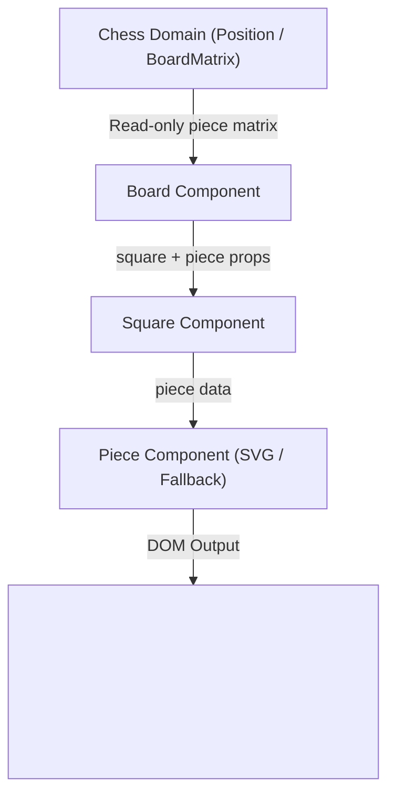

# Piece Rendering Semantics & Invariants

This specification defines the authoritative domain mapping, accessible naming standards, asset rendering strategies, fallback behaviors, and architectural invariants for chess piece rendering within **ChessForge**.

---

## 1. Domain Piece Representation & Taxonomy

In ChessForge's decoupled architecture, pieces are represented in the pure chess domain as immutable objects adhering to the `Piece` schema:

```typescript
export interface Piece {
  readonly type: PieceType; // 'p' | 'n' | 'b' | 'r' | 'q' | 'k'
  readonly color: Color; // 'w' | 'b'
}
```

### Complete 12-Piece Variant Mapping Matrix

| Piece Type       | Domain Code (`type`) | Domain Color (`color`) | FEN / SAN Symbol | Unicode Symbol | Accessible Name (ARIA Label) |
| :--------------- | :------------------- | :--------------------- | :--------------- | :------------- | :--------------------------- |
| **White Pawn**   | `'p'`                | `'w'`                  | `P`              | `♙` (`U+2659`) | `"White Pawn"`               |
| **White Knight** | `'n'`                | `'w'`                  | `N`              | `♘` (`U+2658`) | `"White Knight"`             |
| **White Bishop** | `'b'`                | `'w'`                  | `B`              | `♗` (`U+2657`) | `"White Bishop"`             |
| **White Rook**   | `'r'`                | `'w'`                  | `R`              | `♖` (`U+2656`) | `"White Rook"`               |
| **White Queen**  | `'q'`                | `'w'`                  | `Q`              | `♕` (`U+2655`) | `"White Queen"`              |
| **White King**   | `'k'`                | `'w'`                  | `K`              | `♔` (`U+2654`) | `"White King"`               |
| **Black Pawn**   | `'p'`                | `'b'`                  | `p`              | `♟` (`U+265F`) | `"Black Pawn"`               |
| **Black Knight** | `'n'`                | `'b'`                  | `n`              | `♞` (`U+265E`) | `"Black Knight"`             |
| **Black Bishop** | `'b'`                | `'b'`                  | `b`              | `♝` (`U+265D`) | `"Black Bishop"`             |
| **Black Rook**   | `'r'`                | `'b'`                  | `r`              | `♜` (`U+265C`) | `"Black Rook"`               |
| **Black Queen**  | `'q'`                | `'b'`                  | `q`              | `♛` (`U+265B`) | `"Black Queen"`              |
| **Black King**   | `'k'`                | `'b'`                  | `k`              | `♚` (`U+265A`) | `"Black King"`               |

---

## 2. Empty Square Semantics

- When a square in the `BoardMatrix` or position is `null` (unoccupied), the renderer **MUST NOT** render a piece element.
- The `Square` container remains clean and interactive without ghost child elements.
- Accessible announcement for an empty square defaults to `Square <square>, <color>` (e.g. `"Square e4, light"`).

---

## 3. Vector Asset & Fallback Strategy

1. **Inline Scalable Vector Graphics (SVG):**
   - High-contrast, clean vector definitions optimized for standard chessboards across all desktop DPI scaling factors (100% to 300% on 4K Windows displays).
   - Zero external HTTP requests; all SVG paths are bundled statically in the local application bundle.
   - SVG elements are styled with CSS classes (`piece`, `piece-w`, `piece-b`, `piece-p`, etc.) allowing theming while preserving crisp geometry.
2. **Graceful Fallback Behavior:**
   - If an invalid or unmapped piece payload is provided to the renderer, it must gracefully degrade to a safe fallback (rendering the piece's character symbol or Unicode representation) without throwing unhandled UI exceptions or crashing the React tree.

---

## 4. Accessibility & Screen Reader Standards (WCAG 2.1 AA)

- Every rendered piece element must have:
  - `role="img"`
  - `aria-label="<Color> <PieceType>"` (e.g. `"White Queen"`)
  - `data-testid="piece-<color><type>"` (e.g. `data-testid="piece-wq"`)
  - `data-piece-color="<color>"` (`"w"` | `"b"`)
  - `data-piece-type="<type>"` (`"p"` | `"n"` | `"b"` | `"r"` | `"q"` | `"k"`)
- Screen readers navigating the board gridcells can announce both square coordinate and occupant piece seamlessly.

---

## 5. Architectural Decoupling & Non-Mutation Invariants

- **Unidirectional Data Flow:** The Piece component is a pure presentational component (`Piece: React.FC<PieceProps>`).
- **Zero Legality / Rule Logic:** The Piece component has no knowledge of legal moves, checks, turns, or game status.
- **Strict Immutability:** Rendering never mutates the underlying `Position`, `BoardMatrix`, or `Piece` objects.


