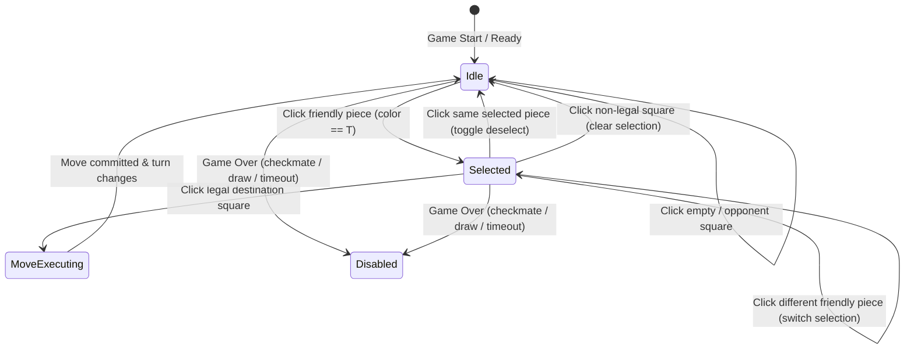

# ChessForge Invariants: Piece Selection, Legal Move Highlighting, and Interaction

This document formalizes the authoritative rules, domain interaction invariants, selection state machines, capture indicators, and game-over boundaries for piece selection and legal move visualization in **ChessForge**.

---

## 1. Architectural Principles & Unidirectional Flow

The presentation layer (React) and the chess domain adhere to a strict unidirectional flow:

```text
User Gesture (Click / Key / Drag)
  │
  ▼
Board Interaction Layer (React UI State)
  │
  ├─► Query: game.getLegalMoves(selectedSquare) [Read-Only Domain Query]
  │
  └─► Dispatch: game.makeMove({ from, to, promotion? }) [Domain State Mutation]
        │
        ▼
Chess Domain (Authoritative State Machine)
```

### Mandates:

1. **Zero UI Legality Calculation:** Visual components MUST NOT compute piece rays, knight jumps, pawn vectors, or check conditions. The chess domain `ChessGame` is the sole source of truth for legal moves.
2. **Read-Only Invariant:** Querying `getLegalMoves(square)` or inspecting `getPosition()` MUST NOT mutate board state, turn counter, halfmove clock, or move history.
3. **Strict Ephemeral UI State:** The `selectedSquare` and `legalDestinations` are transient presentation state. Domain state remains immutable until an authoritative move is executed.

---

## 2. Selection State Machine & Transition Rules

Let $S$ be the current selected square ($S \in \text{Square} \cup \{\text{null}\}$), $T$ be the active turn color ($T \in \{\text{'w'}, \text{'b'}\}$), and $Q$ be the clicked square ($Q \in \text{Square}$).



### Transition Matrix:

| Current State                       | Target Square $Q$ Content                       | Condition / Legal Target?               | Next State                   | Action / Visual Indicator                                            |
| :---------------------------------- | :---------------------------------------------- | :-------------------------------------- | :--------------------------- | :------------------------------------------------------------------- |
| **Idle** ($S = \text{null}$)        | Friendly piece ($P.\text{color} = T$)           | $P$ has $\ge 0$ moves                   | **Selected** ($S = Q$)       | Highlight $S$; compute & highlight all legal destinations $D(Q)$.    |
| **Idle** ($S = \text{null}$)        | Opponent piece ($P.\text{color} \neq T$)        | N/A                                     | **Idle** ($S = \text{null}$) | No selection, no highlights.                                         |
| **Idle** ($S = \text{null}$)        | Empty square                                    | N/A                                     | **Idle** ($S = \text{null}$) | No selection, no highlights.                                         |
| **Selected** ($S \neq \text{null}$) | Friendly piece ($Q = S$)                        | Click same piece                        | **Idle** ($S = \text{null}$) | Deselect $S$, clear destination highlights.                          |
| **Selected** ($S \neq \text{null}$) | Friendly piece ($Q \neq S, P.\text{color} = T$) | Castling destination? No                | **Selected** ($S = Q$)       | Switch selection to $Q$; update legal destinations to $D(Q)$.        |
| **Selected** ($S \neq \text{null}$) | Any square $Q$                                  | $Q \in D(S)$ (Legal destination)        | **Move Action / Ready**      | Execute/dispatch move $S \rightarrow Q$.                             |
| **Selected** ($S \neq \text{null}$) | Non-legal square $Q \notin D(S)$                | Neither friendly piece nor legal target | **Idle** ($S = \text{null}$) | Clear selection, clear destination highlights. Zero domain mutation. |
| **Any**                             | Any square                                      | `game.getStatus().isGameOver === true`  | **Disabled**                 | Interactions blocked, cursor default, no selection.                  |

---

## 3. Legal Destination & Capture Taxonomy

When a piece at square $S$ is selected, the domain provides its legal moves:
$$D(S) = \{ m \in \text{game.getLegalMoves}(S) \}$$

Every legal destination $m \in D(S)$ belongs to exactly one category:

### A. Non-Capture Move (Quiet Move)

- **Definition:** The target square $m.\text{to}$ is currently empty, and the move is not an en passant capture.
- **Visual Representation:** Centered semi-transparent dot indicator (`data-target-type="move"` / `.legal-move-dot`).
- **Accessible Text:** `"Legal move to [square]"`.

### B. Capture Move (Regular or En Passant)

- **Definition:**
  - Standard capture: Target square $m.\text{to}$ contains an opposing piece ($m.\text{captured}$ is defined or piece present).
  - En passant capture: Target square $m.\text{to}$ is empty, but move is flagged as en passant ($m.\text{isEnPassant} = \text{true}$ / `flags: 'e'`).
- **Visual Representation:** Corner/perimeter ring indicator or target capture boundary framing the capturable piece (`data-target-type="capture"` / `.legal-capture-ring`).
- **Accessible Text:** `"Legal capture on [square]"`.

---

## 4. Game-Over Interaction Boundary

When the game reaches a terminal state (`game.getStatus().isGameOver === true`):

1. **Interaction Lock:** All board squares transition to `aria-disabled="true"` and `is-disabled`.
2. **Selection Purge:** Any active `selectedSquare` and legal target highlights are purged immediately.
3. **Pointer Events:** Clicks or keyboard triggers (`Enter`, `Space`) on any square produce zero state mutation.

---

## 5. Invariant Checklist for Sprint 03

- [x] **INV-SEL-01:** Selecting a piece belonging to the active player highlights the square with `aria-selected="true"`.
- [x] **INV-SEL-02:** Selecting an opponent piece or empty square while idle does nothing.
- [x] **INV-SEL-03:** Legal destinations match `game.getLegalMoves(square)` with 100% mathematical fidelity.
- [x] **INV-SEL-04:** Captures (standard and en passant) are visually distinct from quiet moves.
- [x] **INV-SEL-05:** Clicking an invalid square deselects without mutating game state.
- [x] **INV-SEL-06:** Clicking another friendly piece switches selection cleanly.
- [x] **INV-SEL-07:** Game over disables all square selection.
