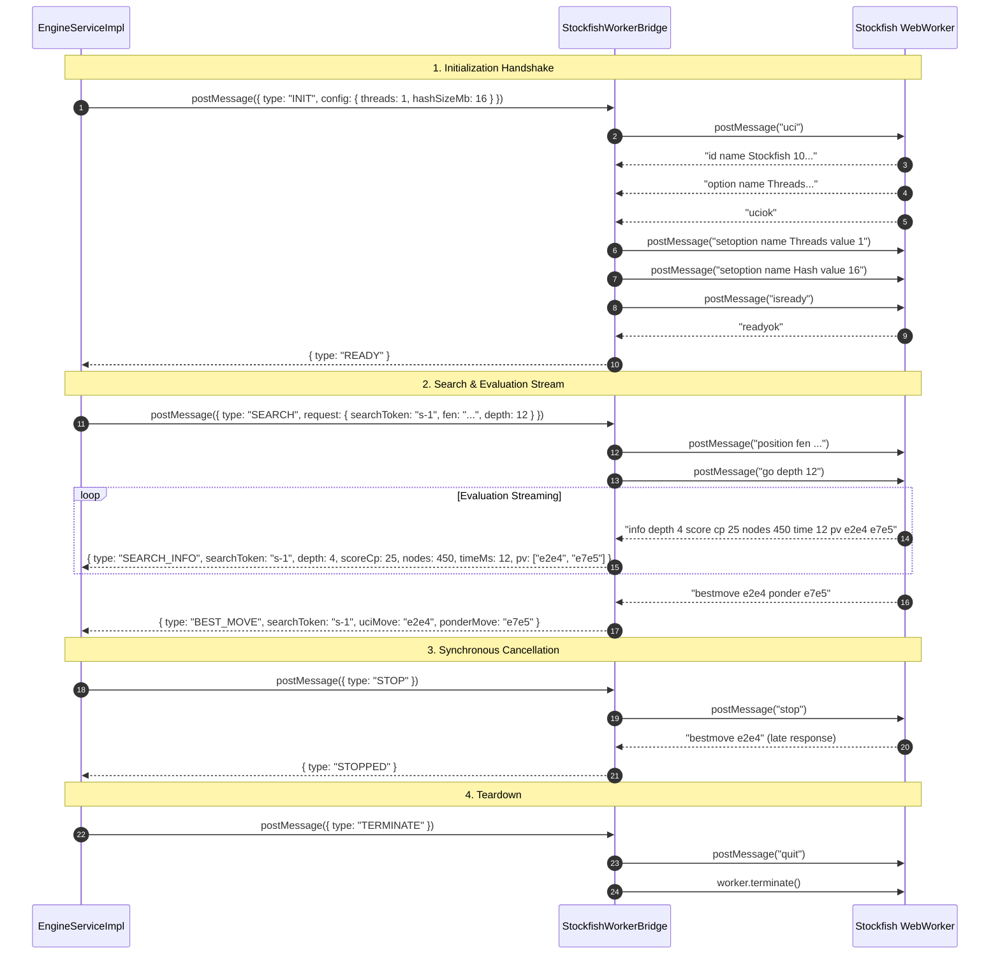

# Stockfish WASM Worker Integration Invariants & UCI Protocol Specification

**Status:** Approved  
**Phase:** 06 · AI Engine Integration & Game Modes  
**Sprint:** 02 · Stockfish WASM Worker Integration  
**Architects:** Chess Domain Architect, Dev Architect & Senior SDE  
**Date:** 2026-08-18

---

## 1. Executive Summary & Purpose

This specification formalizes the concrete WebWorker bridge, UCI protocol communication, and lifecycle invariants for integrating **Stockfish (WASM / JS)** into **ChessForge**.

In accordance with [ADR-003](file:///c:/Workspace/ChessGame/docs/adr/ADR-003-stockfish-wasm-webworker-isolation.md), Stockfish executes in a sandboxed WebWorker, communicating strictly via the standard Universal Chess Interface (UCI) text protocol. The `StockfishWorkerBridge` acts as an adapter that translates between typed `EngineWorkerRequest`/`EngineWorkerResponse` objects and raw UCI text streams.

---

## 2. Core Invariants

### INV-SF-01: Sandboxed WebWorker & UI Thread Non-Blocking Execution

- Stockfish WASM/JS must run strictly inside a dedicated WebWorker thread.
- The React/DOM main UI thread must never execute Stockfish WebAssembly bytecode or perform CPU-intensive search calculations.
- Zero DOM, `window`, or Tauri native API access is available inside the worker thread.

### INV-SF-02: Strict Two-Stage UCI Initialization Handshake

- The initialization handshake follows standard UCI protocol:
  1. Bridge sends: `uci\n`
  2. Bridge waits for engine response line: `uciok`
  3. Bridge configures initial options via `setoption name <name> value <val>\n` (e.g. `Threads`, `Hash`, `Skill Level`).
  4. Bridge sends: `isready\n`
  5. Bridge waits for engine response line: `readyok`
  6. Upon receiving `readyok`, the bridge emits `{ type: "READY" }` to `EngineServiceImpl`.
- Any command sent prior to `readyok` (except `uci`, `setoption`, `isready`) is invalid.

### INV-SF-03: Tokenized Search Dispatch & Position Synchronization

- When `EngineServiceImpl` dispatches a `{ type: "SEARCH", request: { searchToken, fen, depth, movetimeMs, skillLevel } }`:
  1. The bridge records `activeSearchToken = searchToken`.
  2. If `skillLevel` is provided, bridge sends `setoption name Skill Level value <skillLevel>\n`.
  3. Bridge sends position command: `position fen <fen>\n`.
  4. Bridge sends search command:
     - If `movetimeMs` is provided: `go movetime <movetimeMs>\n`
     - Else if `depth` is provided: `go depth <depth>\n`
     - Else default: `go depth 12\n`
  5. As the engine streams evaluation lines, the bridge parses them and tags every `SEARCH_INFO` event with `searchToken`.
  6. When the engine emits `bestmove <uciMove> [ponder <ponderMove>]`, the bridge emits `{ type: "BEST_MOVE", searchToken, uciMove, ponderMove }` and clears `activeSearchToken`.

### INV-SF-04: Stale Result Rejection & Clean Stop Handling

- When search cancellation is requested via `{ type: "STOP" }`:
  1. The bridge immediately sends `stop\n` to the engine.
  2. The bridge records `stoppingToken = activeSearchToken` and clears `activeSearchToken`.
  3. When the engine responds with the trailing `bestmove` from the stopped search, the bridge attaches the cancelled token or suppresses it if no active search exists.
  4. Bridge emits `{ type: "STOPPED" }`.
  5. Per `INV-ENG-04`, `EngineServiceImpl` rejects or discards responses matching cancelled tokens.

### INV-SF-05: Robust UCI Stream Parsing & Resilience

- UCI parser must handle line-by-line streaming without buffering overflows or crashes on unrecognized lines.
- **Handled lines:**
  - `uciok` $\rightarrow$ Handshake stage 1 complete.
  - `readyok` $\rightarrow$ Engine ready for search/commands.
  - `info depth <d> ... score cp <v>|mate <m> nodes <n> nps <nps> time <t> pv <moves...>` $\rightarrow$ Parsed into structured `SEARCH_INFO`.
  - `bestmove <move> [ponder <ponder>]` $\rightarrow$ Parsed into structured `BEST_MOVE`.
  - `bestmove (none)` $\rightarrow$ Handled gracefully (e.g. in terminal checkmate/stalemate positions).
- **Ignored / Informational lines:**
  - Engine banner (`Stockfish ... by ...`), `id name ...`, `id author ...`, `option name ...`, `info string ...`.

### INV-SF-06: Desktop Resource & Concurrency Throttling

- Default configuration limits:
  - `Threads = 1` (Single worker thread, prevents multi-core hogging on low-end laptops).
  - `Hash = 16` (16 MB transposition table, max 64 MB; well within the $< 150\text{ MB}$ desktop footprint mandate).
- Ensures smooth 60fps frame rate and quiet CPU fans on Windows 10/11 desktop environments.

### INV-SF-07: Graceful Teardown & Worker Disposal

- On `{ type: "TERMINATE" }` or `bridge.terminate()`:
  1. Bridge sends `quit\n` to engine.
  2. Bridge calls `worker.terminate()`.
  3. Bridge removes all event listeners and nullifies worker reference.

---

## 3. UCI Protocol Message Sequence

---

## 4. Parser Grammar & Field Mapping

| UCI Token        | Example Output      | Parsed Field | Type                  | Description                                      |
| :--------------- | :------------------ | :----------- | :-------------------- | :----------------------------------------------- |
| `depth <N>`      | `depth 12`          | `depth`      | `number`              | Iterative deepening search depth                 |
| `score cp <N>`   | `score cp 45`       | `scoreCp`    | `number`              | Centipawn evaluation (+45 = +0.45 pawns White)   |
| `score mate <N>` | `score mate 3`      | `mate`       | `number`              | Mate in $N$ moves (+3 White wins, -2 Black wins) |
| `nodes <N>`      | `nodes 54200`       | `nodes`      | `number`              | Total positions searched                         |
| `nps <N>`        | `nps 1250000`       | `nps`        | `number`              | Nodes evaluated per second                       |
| `time <N>`       | `time 120`          | `timeMs`     | `number`              | Elapsed search time in milliseconds              |
| `pv <m1 m2 ...>` | `pv e2e4 c7c5 g1f3` | `pv`         | `string[]`            | Principal variation moves                        |
| `bestmove <m>`   | `bestmove e2e4`     | `uciMove`    | `string`              | Best move in UCI coordinate notation             |
| `ponder <m>`     | `ponder e7e5`       | `ponderMove` | `string \| undefined` | Expected opponent response                       |

---

## 5. Architectural Compliance & Sign-Off

- **ADR Alignment:** Fully compliant with [ADR-003](file:///c:/Workspace/ChessGame/docs/adr/ADR-003-stockfish-wasm-webworker-isolation.md) and [ADR-005](file:///c:/Workspace/ChessGame/docs/adr/ADR-005-unified-typed-error-contracts.md).
- **Security Posture:** Zero native Tauri privilege escalation; Worker sandboxed with strict runtime message schema validation.
- **Handoff Target:** Ready for **SDET Architect** Test Cases Catalog definition.
