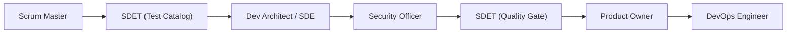

# ChessForge Agent Guardrails & Multi-Agent Development Guide

**Document Version:** 1.0.0  
**Status:** Approved Operating Guide  
**Target Platform:** Windows 10/11 Local-First Desktop Development

---

## 1. Overview & Operating Philosophy

ChessForge utilizes an agile, multi-agent development workflow where autonomous AI assistants collaborate across defined specialized personas. To ensure safety, deterministic execution, and desktop stability, all agent operations must comply with explicit guardrails, protected file boundaries, command execution limits, and structured review processes.

---

## 2. Virtual Personas & Lifecycle Gates

Every sprint progresses sequentially through the virtual persona chain:



1. **Scrum Master (SM):** Deconstructs sprint plans, checks prerequisites, creates feature branches, and initializes `task.md`.
2. **SDET Architect (SDET):** Authors pre-implementation test case catalogs (`docs/testing/test_cases_catalog_*.md`) before code is written.
3. **Dev Architect & Senior SDE (SDE):** Implements features, conducts internal technical code reviews, and maintains architecture.
4. **Security & Desktop Safety Officer (SEC):** Audits Tauri IPC permissions, CSP scopes, file isolation, and supply chain dependencies.
5. **SDET Quality Gate (QA):** Executes the full automated suite locally (Vitest, Playwright, typecheck, lint, build) and signs off.
6. **Product Owner (PO):** Validates acceptance criteria against the Sprint Definition of Done and user journeys.
7. **DevOps Engineer (DO):** Commits atomic conventional changes, pushes feature branches, and creates GitHub Pull Requests using GitHub CLI.

---

## 3. Protected Workspace Boundaries

Files within the repository are categorized into protected tiers to prevent unauthorized modifications or silent regressions:

| Tier                                          | File / Directory Scope                                                                                                             | Access & Modification Rules                                                                                                 |
| :-------------------------------------------- | :--------------------------------------------------------------------------------------------------------------------------------- | :-------------------------------------------------------------------------------------------------------------------------- |
| **Tier 1: Core Tooling & Lockfiles**          | `package.json`, `package-lock.json`, `tsconfig*.json`, `vite.config.ts`, `playwright.config.ts`, `eslint.config.js`, `.prettierrc` | Modified only when tooling changes or package upgrades are explicitly part of the sprint plan.                              |
| **Tier 2: Architecture & Security**           | `docs/adr/`, `docs/architecture.md`, `docs/security-model.md`, `src-tauri/capabilities/`, `src-tauri/tauri.conf.json`              | Requires joint sign-off from Dev Architect and Security Officer. Tauri permissions must strictly adhere to least privilege. |
| **Tier 3: CI/CD Workflows**                   | `.github/workflows/ci.yml`, `.github/pull_request_template.md`                                                                     | Modified exclusively by DevOps Engineer / Dev Architect with action SHA/major version pinning.                              |
| **Tier 4: Agent Governance & Rules**          | `AGENTS.md`, `.agents/AGENTS.md`, `.agents/skills/`                                                                                | Maintained in canonical locations. Must reflect approved operating contracts.                                               |
| **Tier 5: Version Control & System Metadata** | `.git/`, `.gitignore`                                                                                                              | Direct edits to `.git/` internals are strictly prohibited.                                                                  |

---

## 4. Terminal Command Execution Boundaries

### 4.1 Allowed Commands

Agents may execute standard non-destructive development commands:

- **Quality & Verification:**
  - `npm test` / `npm run test:unit`
  - `npm run test:e2e` / `npx playwright test`
  - `npm run lint`
  - `npm run typecheck`
  - `npm run format:check` / `npm run format`
  - `npm run build`
  - `cargo test` / `cargo check` / `cargo clippy`
- **Application Lifecycle:**
  - `npm run dev`
  - `npm run tauri:dev`
  - `npm run tauri:build`
- **Git & GitHub CLI:**
  - `git status`, `git diff`, `git log`, `git branch`
  - `git checkout -b <branch>`, `git checkout <branch>`
  - `git add <files>`, `git commit -m "<message>"`
  - `git push -u origin <branch>`
  - `gh pr create`, `gh pr view`, `gh pr status`, `gh pr list`

### 4.2 Strictly Blocked Commands

The following destructive commands are strictly prohibited:

- **Destructive Git Operations:** `git push --force`, `git push -f`, `git reset --hard`, `git clean -fxd`.
- **Destructive File System Commands:** `rm -rf /`, `del /s /q C:\*`, executing untrusted binary scripts.
- **Unsolicited Cloud & Network Infrastructure:** Starting remote backend microservices, creating cloud databases, adding telemetry beacons.

---

## 5. Standardized Agent Handoff Protocol

Every transition between virtual personas must be accompanied by the standard 5-point report format:

```markdown
### Persona Handoff Report: [CURRENT_ROLE] -> [TARGET_ROLE]

1. **Completed Work:** Detailed list of deliverables and modified files.
2. **Remaining Work:** Outstanding tasks required to achieve the sprint Definition of Done.
3. **Executed Tests & Results:** Terminal commands executed with exact pass/fail counts.
4. **Known Issues or Deferred Items:** Any non-blocking observations or backlog recommendations.
5. **Next Assigned Persona & Verification Required:** Target role and clear action criteria.
```

---

## 6. Review Artifact Expectations

All sprints produce standard documentation artifacts:

1. **`task.md`**: Centrally located in repository root, updated at every handoff with task states (`[ ]`, `[/]`, `[x]`) and refinement loop comments.
2. **`docs/testing/test_cases_catalog_P<XX>_S<YY>.md`**: Authored by SDET before coding, containing complete test matrices and golden fixtures.
3. **`docs/pull_requests/pr_P<XX>_S<YY>_<name>.md`**: Authored by DevOps Engineer for automated PR creation.
4. **`docs/guides/`**: System and developer guides providing architectural documentation.

---

## 7. Anti-Bypass Guardrails & Failure Handling

Agents must never bypass validation failures:

- **No Test Skipping:** Forbid `it.skip()`, `test.skip()`, `describe.skip()`.
- **No Assertion Softening:** Exact chess position and state assertions must never be relaxed to `.toBeDefined()`.
- **No Compiler / Lint Bypassing:** Forbid `// @ts-ignore` and `eslint-disable`.
- **No Fabricated Evidence:** All quality reports must reflect verified local execution.

---

## 8. Pull Request Submission & DoD

When all quality gates are satisfied:

1. DevOps Engineer verifies git status is clean and format is validated.
2. Changes are committed using conventional commit prefixes (`feat:`, `fix:`, `test:`, `docs:`, `chore:`).
3. The branch is pushed: `git push -u origin <branch-name>`.
4. Pull request is created via GitHub CLI using the PR template and documented in `task.md`.
