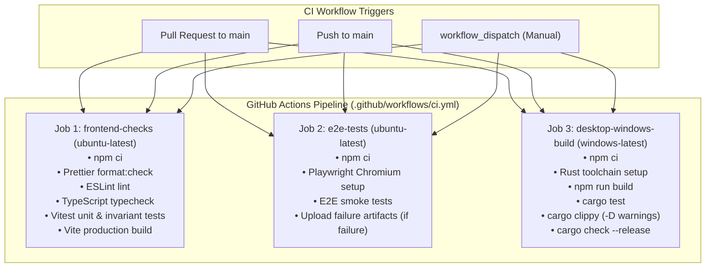

# GitHub Actions CI Workflow Guide

## 1. Overview & Architecture

ChessForge utilizes GitHub Actions for continuous integration (CI) to guarantee that every Pull Request and commit on `main` is deterministically tested, linted, typechecked, and verified across both web/browser and native Windows desktop compilation targets.



---

## 2. CI Jobs Breakdown

### 2.1 Job 1: `frontend-checks`

- **Environment:** `ubuntu-latest` (fast Linux VM)
- **Node Version:** `22.x` (LTS) with npm caching
- **Execution Steps:**
  1. `actions/checkout@v4`: Shallow clone of the repository.
  2. `actions/setup-node@v4`: Setup Node.js runtime and cache `~/.npm`.
  3. `npm ci`: Deterministic dependency installation based strictly on `package-lock.json`.
  4. `npm run format:check`: Verifies code formatting with Prettier.
  5. `npm run lint`: Executes ESLint across all TypeScript and React components.
  6. `npm run typecheck`: Runs `tsc --noEmit` under `strict: true`.
  7. `npm run test`: Executes all Vitest unit, component, and property-based test suites.
  8. `npm run build`: Compiles production frontend bundle to `dist/`.

### 2.2 Job 2: `e2e-tests`

- **Environment:** `ubuntu-latest`
- **Execution Steps:**
  1. `actions/checkout@v4` & `actions/setup-node@v4` (cached).
  2. `npm ci`: Deterministic dependency installation.
  3. `npx playwright install --with-deps chromium`: Installs headless Chromium browser binaries and OS dependencies.
  4. `npm run test:e2e`: Runs all Playwright E2E smoke tests against Vite local webServer (`localhost:1420`).
  5. **Failure Diagnostic Upload:** If any test fails (`if: failure()`), `actions/upload-artifact@v4` uploads `playwright-report/` and `test-results/` (traces, screenshots, video replays) with a 7-day retention period.

### 2.3 Job 3: `desktop-windows-build`

- **Environment:** `windows-latest` (Native Windows runner)
- **Execution Steps:**
  1. `actions/checkout@v4` & `actions/setup-node@v4` (cached).
  2. `actions-rust-lang/setup-rust-toolchain@v1`: Installs stable Rust toolchain with `clippy` component and cargo caching.
  3. `npm ci`: Installs frontend dependencies.
  4. `npm run build`: Generates frontend bundle required by Tauri.
  5. `cargo test --manifest-path src-tauri/Cargo.toml`: Executes Rust unit and integration tests.
  6. `cargo clippy --manifest-path src-tauri/Cargo.toml -- -D warnings`: Enforces strict zero-warning Rust linting.
  7. `cargo check --manifest-path src-tauri/Cargo.toml --release`: Validates release compilation of the native Tauri Windows desktop backend.

---

## 3. Security & Supply Chain Hardening

- **Principle of Least Privilege:** Top-level permissions are strictly declared as `permissions: contents: read`. The baseline CI workflow has zero write permissions to the repository.
- **Action Pinning:** All third-party GitHub Actions are pinned to official major versions:
  - `actions/checkout@v4`
  - `actions/setup-node@v4`
  - `actions-rust-lang/setup-rust-toolchain@v1`
  - `actions/upload-artifact@v4`
- **Zero Secret Dependency:** The baseline CI pipeline executes without requiring any repository secrets, API tokens, or signing certificates.
- **Concurrency Management:** Redundant runs on outdated pull request commits are automatically cancelled using `concurrency` with `cancel-in-progress: true`.

---

## 4. Local Reproduction & Verification

Developers can run the full local validation sequence prior to pushing:

```powershell
# 1. Format & Lint
npm run format:check
npm run lint

# 2. Typecheck & Tests
npm run typecheck
npm run test

# 3. Frontend Bundle Build
npm run build

# 4. E2E Tests
npm run test:e2e

# 5. Rust / Tauri Verification (when Rust toolchain is installed)
cargo test --manifest-path src-tauri/Cargo.toml
cargo clippy --manifest-path src-tauri/Cargo.toml -- -D warnings
```
