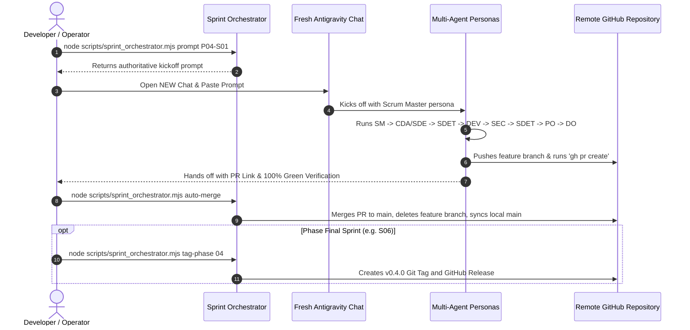

# ChessForge Multi-Agent Sprint Orchestration Guide

This guide explains how to execute remaining sprints (Phase 04 to Phase 11) sequentially in fresh Antigravity conversations, raise Pull Requests, auto-merge to `main`, and create release tags upon phase completion.

---

## 1. Quick Sprint Commands

The workspace includes a built-in orchestrator script (`scripts/sprint_orchestrator.mjs` and `scripts/sprint_orchestrator.py`):

```bash
# 1. View current progress and next sprint in pipeline
node scripts/sprint_orchestrator.mjs status

# 2. Generate the exact multi-agent kickoff prompt for any sprint (e.g. P04-S01)
node scripts/sprint_orchestrator.mjs prompt P04-S01

# 3. Verify all automated quality gates (lint, typecheck, format, tests, build)
node scripts/sprint_orchestrator.mjs verify-gates

# 4. Auto-merge the open PR to main and sync local branch
node scripts/sprint_orchestrator.mjs auto-merge

# 5. Tag and publish a phase release (e.g. Phase 04)
node scripts/sprint_orchestrator.mjs tag-phase 04
```

---

## 2. Standard Sprint-by-Sprint Execution Workflow

For each sprint from Phase 04 through Phase 11:



---

## 3. Next Sprints Roadmap

| Sprint ID     | Phase & Name                                                                    | Execution Command / Prompt                            |
| :------------ | :------------------------------------------------------------------------------ | :---------------------------------------------------- |
| **`P04-S01`** | **Phase 04 · Sprint 01: Board Layout & Coordinate System**                      | `node scripts/sprint_orchestrator.mjs prompt P04-S01` |
| **`P04-S02`** | **Phase 04 · Sprint 02: Piece Rendering & SVGs**                                | `node scripts/sprint_orchestrator.mjs prompt P04-S02` |
| **`P04-S03`** | **Phase 04 · Sprint 03: Selection & Legal Move Interaction**                    | `node scripts/sprint_orchestrator.mjs prompt P04-S03` |
| **`P04-S04`** | **Phase 04 · Sprint 04: Move Animation & Last Move State**                      | `node scripts/sprint_orchestrator.mjs prompt P04-S04` |
| **`P04-S05`** | **Phase 04 · Sprint 05: Check & Promotion UI Dialogs**                          | `node scripts/sprint_orchestrator.mjs prompt P04-S05` |
| **`P04-S06`** | **Phase 04 · Sprint 06: Board Accessibility & Visual Themes (🏷️ Phase 04 Tag)** | `node scripts/sprint_orchestrator.mjs prompt P04-S06` |
| **`P05-S01`** | **Phase 05 · Sprint 01: Game Session State**                                    | `node scripts/sprint_orchestrator.mjs prompt P05-S01` |
| ...           | ...                                                                             | ...                                                   |
