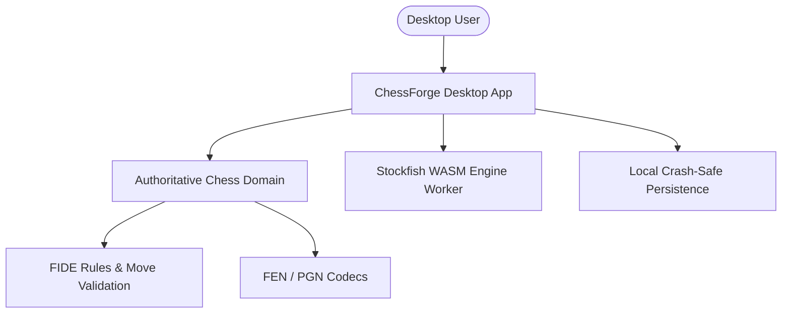
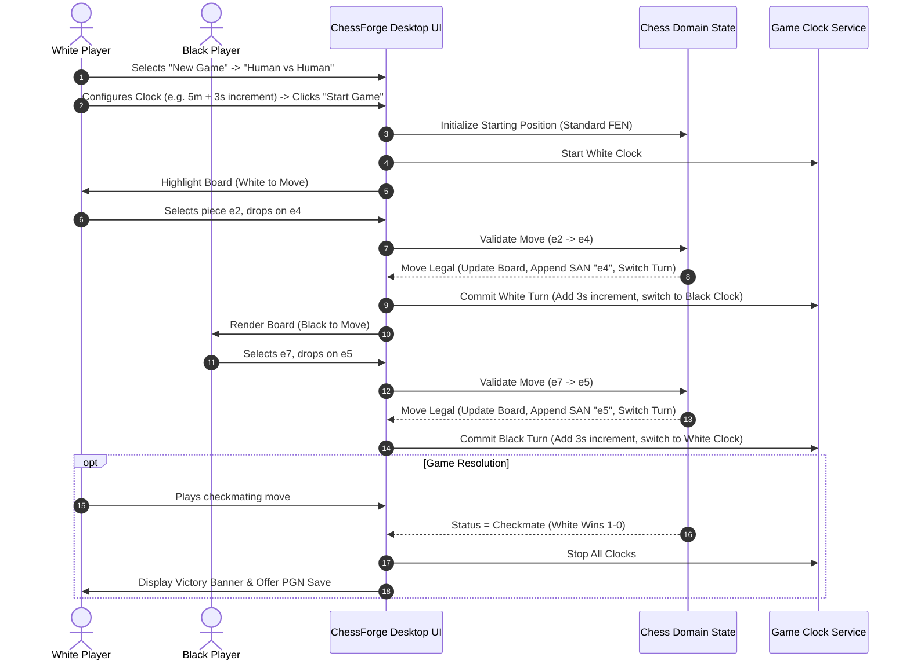
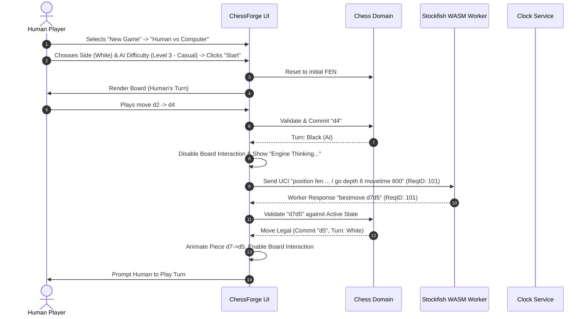

# ChessForge: Product Requirements Specification (v1 Baseline)

**Document Version:** `1.0.0`  
**Status:** `Approved Baseline`  
**Target Platform:** Windows 10/11 x64 Desktop  
**Architecture Model:** Local-First Desktop (Tauri v2 + React + TypeScript + Stockfish WASM)

---

## 1. Executive Summary & Vision

**ChessForge** is a premium, offline-first Windows desktop chess application designed to provide a distraction-free, fluid, and robust chess playing experience. Unlike lightweight browser demos, ChessForge delivers full FIDE rule completeness, responsive Stockfish AI sparring across calibrated difficulty levels, custom time controls, move analysis history, FEN/PGN interoperability, and crash-resilient local persistence.

The v1 release is focused strictly on delivering a world-class **local single-player and two-player desktop experience** with zero backend infrastructure or external service dependencies.

---

## 2. Target Users & User Personas

| Persona                                | Description                                                                        | Primary Needs                                                                                               | Key Value Delivered                                                       |
| :------------------------------------- | :--------------------------------------------------------------------------------- | :---------------------------------------------------------------------------------------------------------- | :------------------------------------------------------------------------ |
| **The Solo Learner / Casual Player**   | Plays chess casually to sharpen tactical thinking; plays against AI during breaks. | Adjustable engine difficulties, clean visual feedback for legal moves and check, instant undo for learning. | Stress-free sparring, transparent move history, easy mistake correction.  |
| **The Local Competitive Duo**          | Two players sharing a single PC / laptop at home, school, or club.                 | Smooth alternating turns, board flip toggle, optional time controls (Blitz/Rapid), captured pieces display. | Authentic over-the-board feel with automated rule enforcement and clocks. |
| **The Chess Enthusiast / Club Player** | Studies games, tests specific opening positions, archives games.                   | Strict FIDE rules (en passant, threefold, 50-move), FEN position import/export, clean PGN export.           | High-fidelity domain accuracy and universal chess notation portability.   |

---

## 3. Primary User Journeys

### 3.1 User Journey 1: Human vs. Human (Local 2-Player Match)

#### Step-by-Step Flow:

1. **Match Initialization:** The user launches the application, opens the "New Game" modal, selects "Human vs Human", sets player names, and selects a time control preset (or un-timed).
2. **Move Execution:** Players alternate making moves via drag-and-drop or click-click piece selection. Valid move indicators show all legal destinations.
3. **Turn Feedback:** The active turn indicator updates, last move is highlighted with distinct subtle accents, and moves are logged in standard algebraic notation (e.g., `1. e4 e5 2. Nf3 Nc6`).
4. **Board Orientation:** Players can toggle "Auto-flip board on turn" or manually flip the board view anytime.
5. **Game Termination:** The match terminates upon checkmate, stalemate, timeout (flag fall), draw agreement, 50-move rule, threefold repetition, insufficient material, or resignation.

---

### 3.2 User Journey 2: Human vs. Computer (Solo AI Sparring)

#### Step-by-Step Flow:

1. **AI Match Setup:** User selects "Human vs Computer", chooses side (White, Black, or Random), selects AI difficulty level (1 through 8), and configures clock settings.
2. **Player Move:** User executes a legal move. The domain updates state, logs the move, and hands off the position to the Engine Service.
3. **Engine Evaluation:** Stockfish WASM calculates in a dedicated Web Worker (non-blocking). A subtle thinking indicator shows the engine is processing. Board piece input is locked for the human during the engine's turn.
4. **Engine Move Dispatch:** When Stockfish returns `bestmove`, the Chess Domain validates the move independently against the authoritative game state and updates the board.
5. **Undo Flow:** If the human makes a mistake, clicking "Undo" rolls back **two plies** (the AI's last move and the human's last move), placing the human back on their turn.

---

## 4. Complete Supported Chess Rules & Invariants

ChessForge enforces 100% of standard FIDE chess rules with zero exceptions.

### 4.1 Board & Piece Geometry

- Standard 8x8 grid composed of 64 alternating light and dark squares.
- Files designated `a` through `h` (left to right from White's perspective); ranks designated `1` through `8` (bottom to top from White's perspective).
- Piece sets: 1 King, 1 Queen, 2 Rooks, 2 Bishops, 2 Knights, 8 Pawns per side.

### 4.2 Standard Legal Moves

- **King:** Moves exactly 1 square in any direction (horizontal, vertical, diagonal). Cannot move into check.
- **Queen:** Moves any number of unoccupied squares horizontally, vertically, or diagonally.
- **Rook:** Moves any number of unoccupied squares horizontally or vertically.
- **Bishop:** Moves any number of unoccupied squares diagonally.
- **Knight:** Moves in an "L-shape" (2 squares along an axis, then 1 square perpendicular). Can jump over intermediate pieces.
- **Pawn:**
  - Moves 1 square forward along its file if unoccupied.
  - On its initial move, can optionally advance 2 squares forward if both squares are unoccupied.
  - Captures 1 square diagonally forward onto an enemy-occupied square.

### 4.3 Special Moves & Complex Invariants

#### 1. Castling (Kingside `O-O` and Queenside `O-O-O`)

- **Move:** The King moves 2 squares towards the Rook (`e1g1`/`e1c1` for White; `e8g8`/`e8c8` for Black), and the chosen Rook leaps over the King to the adjacent square (`f1`/`d1` for White; `f8`/`d8` for Black).
- **Mandatory Preconditions:**
  1. Neither the King nor the chosen Rook has moved since the game began.
  2. All squares between the King and the Rook must be empty.
  3. The King must NOT currently be in check.
  4. The square the King passes through (transit square) must NOT be under attack.
  5. The square the King lands on must NOT be under attack.
  6. Castling rights are permanently revoked for that side once the King moves, or for that wing once that Rook moves or is captured.

#### 2. En Passant Capture

- **Rule:** If a pawn advances 2 squares from its starting rank and lands adjacent on the same rank to an enemy pawn, the enemy pawn may capture it as if it had advanced only 1 square.
- **Single-Ply Expiration Invariant:** The en passant capture is legal **only on the immediately following ply**. If not exercised immediately, the en passant right is permanently lost for that opportunity.

#### 3. Pawn Promotion

- **Rule:** When a pawn reaches the opposite end of the board (rank 8 for White, rank 1 for Black), it MUST immediately be exchanged for a Queen, Rook, Bishop, or Knight of the same color.
- **UI & Domain Contract:** Promotion cannot default silently. An interactive promotion modal appears immediately upon reaching the promotion rank. The move is not committed until the player selects the promotion piece.

---

### 4.4 Check, Checkmate, and Terminal Draw Conditions

| Status                    | Domain Definition                                                                                                                                                                                                             | Resolution                                                                                                |
| :------------------------ | :---------------------------------------------------------------------------------------------------------------------------------------------------------------------------------------------------------------------------- | :-------------------------------------------------------------------------------------------------------- |
| **Check**                 | King is under direct attack by one or more opposing pieces.                                                                                                                                                                   | Player MUST make a move that eliminates the attack (moving King, blocking, or capturing attacking piece). |
| **Checkmate**             | King is in check, and the active player has zero legal moves available.                                                                                                                                                       | Game Over. Win for attacking player (`1-0` or `0-1`).                                                     |
| **Stalemate**             | King is NOT in check, and the active player has zero legal moves available.                                                                                                                                                   | Game Over. Draw (`1/2-1/2`).                                                                              |
| **Insufficient Material** | Neither player has sufficient material to checkmate by any sequence of legal moves. Mandatory combinations:  • K vs. K  • K+B vs. K  • K+N vs. K  • K+B vs. K+B (where bishops reside on the same color squares). | Game Over. Automatic Draw (`1/2-1/2`).                                                                    |
| **Threefold Repetition**  | The exact same board position (same piece layout, active player turn, castling rights, and en passant target) occurs for the 3rd time across the game.                                                                        | Game Over. Draw (`1/2-1/2`).                                                                              |
| **Fifty-Move Rule**       | 50 consecutive full moves (100 plies) have occurred without any pawn advance and without any piece capture.                                                                                                                   | Game Over. Draw (`1/2-1/2`).                                                                              |
| **Draw by Agreement**     | In Human vs Human mode, a player offers a draw and the opponent accepts.                                                                                                                                                      | Game Over. Draw (`1/2-1/2`).                                                                              |
| **Resignation**           | The active player elects to resign.                                                                                                                                                                                           | Game Over. Immediate win for opponent.                                                                    |

---

## 5. PGN and FEN Notation Requirements

### 5.1 FEN (Forsyth-Edwards Notation)

- **Structure:** 6 space-delimited fields:
  1. `Piece Placement`: Ranks 8 to 1 from White's perspective (`p`, `r`, `n`, `b`, `q`, `k` lowercase for black; uppercase for white; digits `1-8` for empty runs).
  2. `Active Color`: `w` or `b`.
  3. `Castling Rights`: `KQkq`, subset, or `-`.
  4. `En Passant Target Square`: algebraic target square behind 2-square pawn push (e.g. `e3`, `d6`) or `-`.
  5. `Halfmove Clock`: Integer tracking plies since last capture or pawn move (for 50-move rule).
  6. `Fullmove Number`: Integer starting at 1, incremented after Black's move.
- **Copy FEN:** Copies exact active position FEN to OS clipboard.
- **Import FEN:** Validates FEN string through domain parser. Rejects invalid FENs with clear error feedback and preserves active game on failure.

### 5.2 PGN (Portable Game Notation)

- **Standard Tag Roster (Seven Tag Roster):**
  - `[Event "ChessForge Match"]`
  - `[Site "Local Desktop"]`
  - `[Date "YYYY.MM.DD"]`
  - `[Round "1"]`
  - `[White "White Player / Human"]`
  - `[Black "Black Player / Stockfish Level X"]`
  - `[Result "1-0" | "0-1" | "1/2-1/2" | "*"]`
- **Movetext:** Clean standard algebraic notation with move numbering, disambiguation when multiple identical pieces can move to the same square (e.g., `Nbd7`, `R1e2`), capture markers (`x`), checks (`+`), checkmates (`#`), and promotion (`=Q`).
- **Save PGN:** Prompts native OS file save dialog (via Tauri IPC dialog) to write `.pgn` file.
- **Load PGN:** Prompts native OS file open dialog to read `.pgn`, parse header tags, replay all moves sequentially, and set the board state. Rejects corrupted PGN files safely without crashing.

---

## 6. Clocks, Game Settings & Recovery

### 6.1 Game Clocks & Timing Modes

- **Supported Time Controls:**
  - **Untimed:** Relaxed play without clock enforcement.
  - **Sudden Death:** Fixed base time per player (e.g., 5 min, 10 min).
  - **Fischer Increment:** Base time + fixed seconds added per completed move (e.g., `3m + 2s`, `5m + 3s`, `15m + 10s`).
- **Timing Presets:**
  - Bullet: `1m + 0s`, `1m + 1s`, `2m + 1s`
  - Blitz: `3m + 0s`, `3m + 2s`, `5m + 0s`, `5m + 3s`
  - Rapid: `10m + 0s`, `15m + 10s`, `30m + 0s`
  - Custom: Configurable base minutes and increment seconds.
- **Flag Fall / Timeout Invariant:**
  - When active player's clock reaches `00:00.000`, the game immediately halts with status `timeout`.
  - If opponent has sufficient mating material, opponent wins.
  - If opponent has insufficient mating material, the result is an automatic draw.

### 6.2 Application Settings

All settings persist locally in JSON storage:

- **Board Appearance:** Board theme (Classic Wood, Modern Slate, High Contrast Dark), Piece set (Standard Vector, Classic Alpha, Neo).
- **Sound Effects:** Move sound, capture sound, check warning sound, game-over chime (Toggle on/off, volume slider).
- **Visual Aids:** Toggle legal move dots, toggle last move highlight, toggle check alert highlight.
- **Behavioral:** Auto-flip board on turn (HvH only), confirmation on Resign/Restart.

### 6.3 Crash-Safe State Recovery

- **Snapshot Persistence:** Every committed move automatically writes the active game state snapshot (current FEN, full move history, clock remaining times, player config) to local crash-safe storage.
- **Restoration on Launch:** If the application terminates abnormally, launch detects the uncompleted active game and prompts: "Resume in-progress game?" with one-click restore.

---

## 7. AI Engine Specification (Stockfish WASM)

### 7.1 Calibrated Difficulty Levels

| Level | Name         | Target Experience                                    | Search Depth Limit | Movetime Target | Skill Level (UCI) |
| :---: | :----------- | :--------------------------------------------------- | :----------------: | :-------------: | :---------------: |
| **1** | Beginner     | Blunders frequently, novice sparring                 |      Depth 1       |      150ms      |         0         |
| **2** | Easy         | Basic captures, occasional tactical oversights       |      Depth 3       |      250ms      |         3         |
| **3** | Casual       | Solid fundamental moves, rare tactical blind spots   |      Depth 5       |      400ms      |         6         |
| **4** | Intermediate | Strong tactical awareness, punishes blunders         |      Depth 8       |      700ms      |        10         |
| **5** | Advanced     | High tactical accuracy, basic positional play        |      Depth 12      |     1000ms      |        14         |
| **6** | Strong       | Expert club player level, sharp tactical calculation |      Depth 15      |     1500ms      |        17         |
| **7** | Expert       | Master strength, deep positional understanding       |      Depth 18      |     2000ms      |        19         |
| **8** | Maximum      | Full Stockfish WASM strength                         |     Depth 20+      |   3000ms max    |        20         |

### 7.2 Non-Blocking & Concurrency Rules

- Stockfish WASM executes strictly inside a Web Worker.
- Worker concurrency is throttled (max 1 search thread) to prevent desktop CPU starvation.
- Engine calculations never block the UI rendering thread or user interaction with other UI controls (e.g. menus, settings).
- **Session Request ID Stamping:** All search requests send a unique monotonically increasing `requestId`. When engine results return, results are discarded if the `requestId` does not match the active session state (prevents stale moves after Undo or New Game).

---

## 8. Explicit v1 Exclusions (Scope Boundary Guardrails)

To ensure high product quality and reliable desktop delivery, the following features are **strictly out of scope for v1**:

1. **No Online / Network Multiplayer:** No WebSockets, WebRTC, socket servers, or online matchmaking.
2. **No User Accounts / Cloud Authentication:** No user login, cloud sync, passwords, or OAuth.
3. **No Central Database / Cloud Infrastructure:** No remote databases, Redis, Docker clusters, or REST APIs.
4. **No Chess Variants:** No Chess960 (Fischer Random), King of the Hill, 3-Check, Bughouse, or Crazyhouse.
5. **No Speculative Complex Analytics:** No real-time cloud engine evaluation graphs, blunder analytics graphs, or opening book database explorer in v1 (reserved for future release phases).
6. **No Mobile / Web Deployments:** Build and distribution targets Windows 10/11 x64 desktop exclusively.

---

## 9. Non-Functional & Desktop Quality Requirements

### 9.1 Performance Targets

- **Startup Time:** Cold start to interactive UI in $< 3.0$ seconds on standard Windows desktop hardware.
- **Board Interaction Responsiveness:** Input latency for piece selection and drop $< 16\text{ms}$ (60 FPS smooth rendering).
- **Memory Footprint:** Application total memory $< 200\text{MB}$ during active gameplay; no memory leaks during multi-hour sessions.
- **Engine Worker CPU Bounds:** AI calculations must not freeze the OS or cause stutter in audio/animations.

### 9.2 Desktop Integration & Display

- **Windows High-DPI:** Crisp, vector-based board and piece rendering on 100%, 125%, 150%, and 200% Windows display scaling.
- **Frameless/Native Window:** Clean native Windows frame with standard minimize, maximize, and close controls.
- **Keyboard Navigation & Accessibility:** Full board navigation using arrow keys + Enter/Space for square selection; ARIA announcements for screen readers.
- **Distribution Package:** Offline standalone Windows Installer (`.msi` / `.exe` via NSIS) with uninstaller and clean registry footprint.

---

## 10. Traceable Acceptance Criteria

| Req ID    | Capability                         | Acceptance Criteria                                                                                                                                                                                                                                                           |
| :-------- | :--------------------------------- | :---------------------------------------------------------------------------------------------------------------------------------------------------------------------------------------------------------------------------------------------------------------------------- |
| **AC-01** | **Chess Rules Completeness**       | System enforces 100% legal FIDE moves including castling (with check transit validation), en passant (with 1-ply expiration), pawn promotion modal (Queen, Rook, Bishop, Knight), check, checkmate, stalemate, 50-move rule, threefold repetition, and insufficient material. |
| **AC-02** | **Human vs Human Mode**            | Two players can play locally with alternating turns, interactive board flipping, accurate move history notation (SAN), captured pieces display, and full draw/resign options.                                                                                                 |
| **AC-03** | **Human vs Computer Mode**         | Solo player can spar against Stockfish WASM across 8 difficulty levels. Engine runs in a background worker without UI freezing. Undo reverts 2 plies cleanly. Stale engine responses are ignored.                                                                             |
| **AC-04** | **Game Clocks & Time Controls**    | Supports Untimed, Sudden Death, and Fischer Increment with predefined presets (Bullet, Blitz, Rapid). Timeout flags immediately terminate match with correct winner or draw on insufficient material.                                                                         |
| **AC-05** | **FEN & PGN Interoperability**     | One-click FEN copy and validated FEN import. Full PGN export with Seven Tag Roster + valid SAN movetext, and PGN import that replays games to current board state.                                                                                                            |
| **AC-06** | **Settings & Crash Recovery**      | Board themes, piece sets, sounds, and visual aids persist in local storage. Sudden application closure restores the exact active game state upon next launch.                                                                                                                 |
| **AC-07** | **Desktop Quality & Zero Network** | Application runs 100% offline with zero external network requests, clean high-DPI scaling on Windows 10/11, and startup under 3 seconds.                                                                                                                                      |

---

## 11. Domain Glossary

| Term                     | Definition                                                                                                                                                        |
| :----------------------- | :---------------------------------------------------------------------------------------------------------------------------------------------------------------- |
| **FEN**                  | _Forsyth-Edwards Notation_. A standard format for describing a particular board position of a chess game in a single text line.                                   |
| **PGN**                  | _Portable Game Notation_. A standard plain text format for recording chess games (both moves and metadata) in a format readable by humans and software.           |
| **SAN**                  | _Standard Algebraic Notation_. The standard format for recording chess moves (e.g. `Nf3`, `exd5`, `O-O`, `e8=Q#`).                                                |
| **LAN / UCI**            | _Long Algebraic Notation / Universal Chess Interface_. Notation used for engine communication representing source and destination squares (e.g. `e2e4`, `e7e8q`). |
| **Ply**                  | A single half-move made by one player (one turn). Two plies equal one full move.                                                                                  |
| **Halfmove Clock**       | Number of plies since the last pawn advance or piece capture. Used to enforce the 50-move draw rule when it reaches 100.                                          |
| **Fullmove Number**      | The count of the full moves in a game, incremented after Black plays. Starts at 1.                                                                                |
| **En Passant**           | A special pawn capture rule allowing a pawn to capture an enemy pawn that has just advanced two squares past it.                                                  |
| **Castling**             | A special move involving the King and either Rook, moving the King 2 squares towards the Rook and the Rook leaping over.                                          |
| **Stalemate**            | A game-ending condition where the player whose turn it is has no legal moves and is not in check, resulting in a draw.                                            |
| **Threefold Repetition** | A draw condition triggered when the same position with identical rights occurs three times.                                                                       |
| **Flag Fall / Timeout**  | When a player's clock countdown reaches zero, resulting in a loss on time (or draw if opponent lacks mating material).                                            |
| **Stockfish WASM**       | The Stockfish chess engine compiled to WebAssembly to run locally in the client environment.                                                                      |
