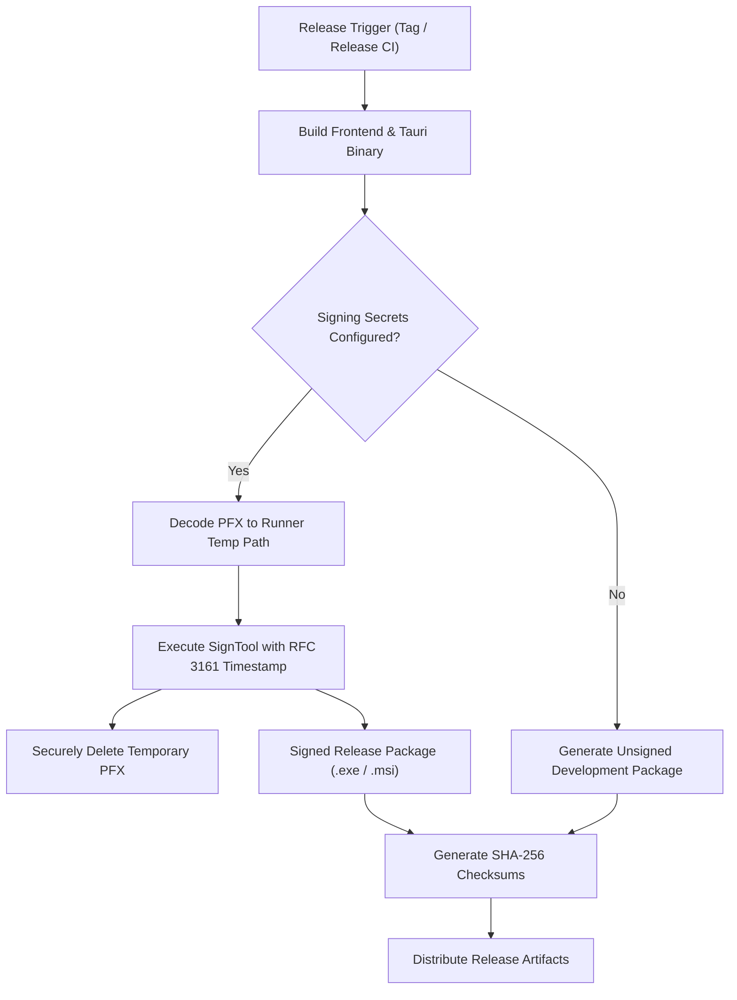

# Code Signing & Release Security Guide

**Application:** ChessForge v1.0.0  
**Target Platform:** Windows 10 / Windows 11 (x64)  
**Security Standard:** Windows Authenticode (SHA-256) & Zero-Leakage CI/CD Secret Isolation  
**Document Status:** Complete & Verified

---

## 1. Overview & Security Objectives

ChessForge is distributed as a standalone Windows desktop application. To ensure user trust, executable integrity, and prevent tampering during distribution, release builds support cryptographic digital signatures via Microsoft Authenticode.



### Core Security Mandates

1. **Zero Secret Storage in Repository:** Private keys (`.pfx`, `.p12`, `.key`, `.snk`), certificates, and signing passwords must **NEVER** be committed to version control.
2. **Ephemeral CI Key Lifecycle:** Signing certificates are injected into CI runners as base64-encoded encrypted secrets, written exclusively to volatile runner temporary paths, and destroyed immediately upon task completion in a `finally` cleanup block.
3. **Unsigned Developer Fallback:** Local developer builds, automated test suites, and pull request CI checks must build and run cleanly without requiring signing credentials.
4. **Offline & Zero-Cloud Invariant:** Code signing verifies binary authenticity without introducing runtime telemetry, remote DRM, or cloud connectivity into ChessForge.

---

## 2. Windows Authenticode Signing Architecture

### A. SignTool Command Specification

For production releases, Windows executables and installers are signed using the Microsoft `signtool.exe` utility:

```powershell
signtool sign `
  /f "$certPath" `
  /p "$env:WINDOWS_CERTIFICATE_PASSWORD" `
  /tr "http://timestamp.digicert.com" `
  /td sha256 `
  /fd sha256 `
  "$artifactPath"
```

| Parameter       | Purpose                                            | Requirement                     |
| :-------------- | :------------------------------------------------- | :------------------------------ |
| `/f <path>`     | Path to the PKCS#12 (`.pfx`) certificate container | Runner temporary file           |
| `/p <password>` | Password to unlock private key container           | Encrypted GitHub Actions Secret |
| `/tr <url>`     | RFC 3161 compliant timestamp server URL            | `http://timestamp.digicert.com` |
| `/td sha256`    | Timestamp digest algorithm                         | Must be SHA-256                 |
| `/fd sha256`    | File digest algorithm                              | Must be SHA-256                 |

### B. RFC 3161 Cryptographic Timestamping

A valid digital signature must include an RFC 3161 timestamp. This ensures the executable remains valid and trusted even after the signing certificate expires, as long as the binary was signed within the certificate's validity window.

---

## 3. GitHub Actions Secret Configuration

For release distribution, the following repository secrets are configured in GitHub Repository Settings (`Settings > Secrets and variables > Actions`):

| Secret Name                    | Content Description                              | Masking / Protection         |
| :----------------------------- | :----------------------------------------------- | :--------------------------- |
| `WINDOWS_CERTIFICATE_BASE64`   | Base64-encoded PKCS#12 certificate file (`.pfx`) | Automatically masked in logs |
| `WINDOWS_CERTIFICATE_PASSWORD` | Password for the certificate private key         | Automatically masked in logs |

### Certificate Encoding for CI Ingestion

To prepare a PFX certificate for GitHub Actions secrets:

```powershell
# Convert PFX binary to base64 string
[Convert]::ToBase64String([IO.File]::ReadAllBytes("path\to\your-cert.pfx")) | Set-Clipboard
```

---

## 4. Local Development & Unsigned Build Fallback

Developers working locally or running automated test pipelines do not need code signing certificates.

### A. Local Unsigned Packaging

```bash
# Frontend build
npm run build

# Package unsigned desktop installers
npm run tauri:build
```

### B. Executing Unsigned Development Builds on Windows

When launching an unsigned development build on Windows 10/11:

1. Windows SmartScreen may present a dialog: _"Windows protected your PC"_.
2. Click **More info**.
3. Click **Run anyway**.

### C. Creating a Local Self-Signed Test Certificate (Optional)

For local testing of the signing pipeline:

```powershell
# 1. Create self-signed code signing certificate
$cert = New-SelfSignedCertificate `
  -Type CodeSigningCert `
  -Subject "CN=ChessForge Local Dev" `
  -CertStoreLocation "Cert:\CurrentUser\My"

# 2. Export to password-protected PFX
$password = ConvertTo-SecureString -String "DevPassword123" -Force -AsPlainText
Export-PfxCertificate -Cert $cert -FilePath "$env:TEMP\chessforge_dev.pfx" -Password $password
```

---

## 5. Signature & Integrity Verification Procedures

### A. PowerShell Authenticode Signature Verification

To inspect and verify the digital signature of a built installer or executable:

```powershell
Get-AuthenticodeSignature -FilePath "src-tauri/target/release/bundle/nsis/ChessForge_1.0.0_x64-setup.exe"
```

Expected output for a valid signed binary:

- `Status`: `Valid`
- `StatusMessage`: `Signature verified.`
- `SignerCertificate`: Displays publisher identity.

### B. SignTool Verification Command

```powershell
signtool verify /pa /v "src-tauri/target/release/bundle/nsis/ChessForge_1.0.0_x64-setup.exe"
```

### C. SHA-256 Checksum Validation

Release packages include a `checksums.txt` file containing SHA-256 hashes of all distribution artifacts:

```powershell
# Generate SHA-256 hash locally
Get-FileHash -Path "ChessForge_1.0.0_x64-setup.exe" -Algorithm SHA256

# Verify against checksums.txt
Get-Content checksums.txt
```

---

## 6. Repository Secret Defense & Security Rules

1. `.gitignore` strictly blocks all certificate extensions: `*.pfx`, `*.p12`, `*.key`, `*.snk`, `*.sig`, `*.cert`, `*.cer`, `*.crt`, `*.pem`, `*.asc`, `*.der`, `*.jks`, `*.keystore`, and `secrets/`.
2. CI logs are monitored to verify secrets are never printed in plaintext stdout/stderr.
3. Temporary certificate files created during signing are purged in a `finally` block to prevent lingering artifacts on runner disks.
