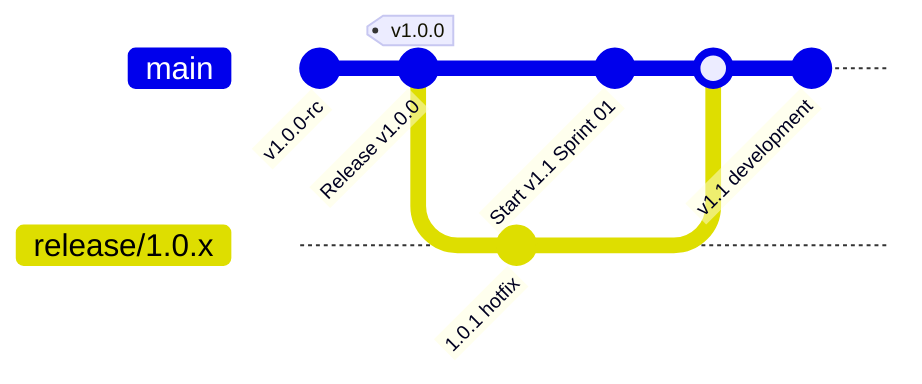

# Post-Release Baseline & Maintenance Guide: ChessForge

**Document Version:** `1.0.0`  
**Status:** Canonical Engineering Guide  
**Audience:** Core Engineers, Release Managers, Contributors

---

## 1. Executive Summary

This guide outlines the standard operating procedures (SOP), branching workflows, hotfix protocols, and quality assurance baselines for maintaining **ChessForge v1.0.0** post-release and transitioning smoothly into the **v1.1** product cycle.

---

## 2. Branching & Release Maintenance Model



### 2.1 Branching Strategy

1. **`main` Branch (Active Development):**
   - Receives all forward-looking features and improvements scoped for v1.1.
   - All merges require conventional commits and PR approvals.
2. **`release/1.0.x` Maintenance Branch (Hotfixes Only):**
   - Created if critical patch releases (e.g. `v1.0.1`) are required for the released v1.0 version.
   - Strictly restricted to critical bug fixes and security patches.
   - All hotfixes merged into `release/1.0.x` must be backported to `main`.

---

## 3. Hotfix Standard Operating Procedure (SOP)

If a critical production bug or security defect is discovered in v1.0.0:

1. **Triage & Classification:**
   - Security or crash issues evaluated under `BLOCKING` severity.
2. **Checkout Maintenance Branch:**
   ```bash
   git checkout -b hotfix/issue-description release/1.0.x
   ```
3. **Reproduction & Regression Test:**
   - Author a failing test reproducing the defect in Vitest or Playwright.
4. **Implement Minimal Atomic Fix:**
   - Fix defect with zero unrelated refactorings.
5. **Quality Gates Execution:**
   - Run `npm test`, `npm run test:e2e`, `npm run typecheck`, `npm run lint`.
6. **Patch Tagging & Release:**
   - Increment patch version in manifests (`1.0.1`), commit with `fix: ...`, create PR, and tag `v1.0.1`.
7. **Backport to Main:**
   - Merge or cherry-pick hotfix commits into `main`.

---

## 4. Post-Release Telemetry & Feedback Handling

- **Zero-Telemetry Policy:** ChessForge retains no automated telemetry or background error tracking endpoints.
- **User Issue Intake:** User feedback and bug reports are gathered exclusively through public GitHub Issues using structured issue templates:
  - `.github/ISSUE_TEMPLATE/bug_report.md`
  - `.github/ISSUE_TEMPLATE/feature_request.md`

---

## 5. Summary Checklist for Release Engineers

- [x] Tag `v1.0.0` pushed to remote repository.
- [x] GitHub Release published with installers, release notes, and SHA-256 checksums.
- [x] Post-release baseline established on `main`.
- [x] v1.1 backlog prioritized and isolated from v1.0 release branch.
