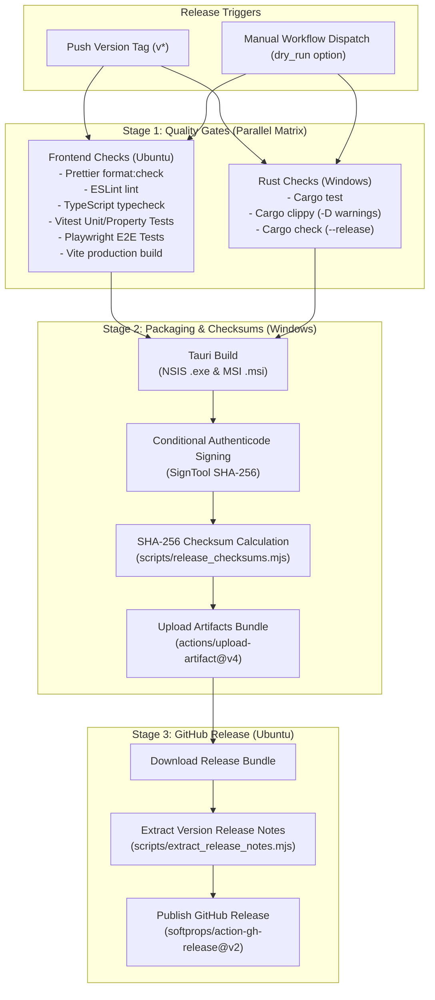

# ChessForge Release Automation and Checksums Guide

**Document Version:** 1.0.0  
**Target Platform:** Windows 10 / Windows 11 (x64)  
**Classification:** DevOps & Distribution Architecture

---

## 1. Overview & Architecture

ChessForge uses a fully automated, multi-stage, gated release pipeline implemented in `.github/workflows/release.yml`. Every official release of ChessForge requires 100% green verification across all automated test tiers, native Rust compilation checks, and Playwright E2E suites before installer binaries are packaged, cryptographically signed, hashed, and published to GitHub Releases.



---

## 2. Release Triggering Protocol

### 2.1 Triggering a Production Release via Git Tag

Official production releases are triggered automatically by pushing a semantic version tag matching `v*` (e.g. `v1.0.0`, `v1.0.1`):

```bash
# 1. Ensure working directory is clean and on main
git checkout main
git pull origin main

# 2. Tag the release commit
git tag -a v1.0.0 -m "Release ChessForge v1.0.0"

# 3. Push tag to GitHub
git push origin v1.0.0
```

### 2.2 Triggering a Dry-Run Release via Workflow Dispatch

To validate the entire build, packaging, and checksum generation pipeline without publishing a public GitHub Release:

1. Navigate to **Actions** -> **Release Automation** in the GitHub repository.
2. Click **Run workflow**.
3. Select branch (e.g. `main` or feature branch).
4. Check the **Dry run release** box (`dry_run: true`).
5. Click **Run workflow**.

The workflow will execute all quality gates, compile the Windows installers, generate `checksums.txt`, and upload the release bundle as a downloadable workflow artifact, while cleanly skipping the public GitHub Release publication step.

---

## 3. SHA-256 Checksum Format & Generation

### 3.1 Standard Format

ChessForge release checksums are generated in the industry-standard GNU Coreutils format:

```text
<lowercase_sha256_hex_hash>  <filename>
```

Example `checksums.txt`:

```text
a1b2c3d4e5f60718293a4b5c6d7e8f90123456789abcdef0123456789abcdef0  ChessForge-Setup-1.0.0.exe
f0e1d2c3b4a5968778695a4b3c2d1e0f0123456789abcdef0123456789abcdef0  ChessForge_1.0.0_x64_en-US.msi
```

### 3.2 Generator Utility (`scripts/release_checksums.mjs`)

The standalone utility generates and verifies SHA-256 hashes across distribution artifacts:

```bash
# Generate checksums for a bundle directory:
node scripts/release_checksums.mjs --dir src-tauri/target/release/bundle --output src-tauri/target/release/bundle/checksums.txt

# Verify generated checksums against bundle directory:
node scripts/release_checksums.mjs --verify src-tauri/target/release/bundle/checksums.txt --dir src-tauri/target/release/bundle
```

---

## 4. End-User Checksum Verification Instructions

Users downloading ChessForge installers can independently verify the cryptographic integrity of their downloaded packages using built-in operating system tools.

### 4.1 Windows PowerShell Verification

Open PowerShell in the directory containing your downloaded installer and run:

```powershell
# Calculate SHA-256 hash of the downloaded installer
Get-FileHash -Path .\ChessForge-Setup-1.0.0.exe -Algorithm SHA256

# Compare against the expected hash in checksums.txt
$expected = (Get-Content .\checksums.txt | Select-String "ChessForge-Setup-1.0.0.exe").ToString().Split(" ")[0]
$actual = (Get-FileHash -Path .\ChessForge-Setup-1.0.0.exe -Algorithm SHA256).Hash.ToLower()

if ($actual -eq $expected) {
    Write-Host "Integrity Verification SUCCESSFUL: Hash matches checksums.txt" -ForegroundColor Green
} else {
    Write-Error "Integrity Verification FAILED: Hash mismatch!"
}
```

### 4.2 Windows Command Prompt (certutil)

```cmd
certutil -hashfile ChessForge-Setup-1.0.0.exe SHA256
```

### 4.3 Linux / macOS Verification

```bash
# Automated verification using sha256sum
sha256sum -c checksums.txt --ignore-missing

# Manual hash calculation
shasum -a 256 ChessForge-Setup-1.0.0.exe
```

---

## 5. Automated Release Notes Extraction

The utility `scripts/extract_release_notes.mjs` automatically extracts version-specific changelog and release summary text from `RELEASE_NOTES.md` or `CHANGELOG.md`:

```bash
# Extract release notes for version 1.0.0:
node scripts/extract_release_notes.mjs --file RELEASE_NOTES.md --tag v1.0.0 --output extracted_release_notes.md
```

The extracted markdown becomes the official description body of the published GitHub Release.

---

## 6. Security Boundaries & Guardrails

1. **Least-Privilege Token Permissions:** The release workflow default is `permissions: { contents: read }`. The elevated `contents: write` scope is granted strictly and exclusively to the `publish-github-release` job.
2. **Secret Isolation:** Code signing certificates (`WINDOWS_CERTIFICATE_BASE64` and `WINDOWS_CERTIFICATE_PASSWORD`) are passed only to the packaging runner, decoded in runner temp memory, and wiped in a `finally` block immediately after signing.
3. **Immutability of Checksums:** Checksums are computed directly on the final signed binaries inside the Windows runner before upload.
4. **Gated Failure Prevention:** Any test failure, lint defect, compilation error, or Playwright smoke test failure immediately terminates the pipeline, preventing artifact compilation or publication.
