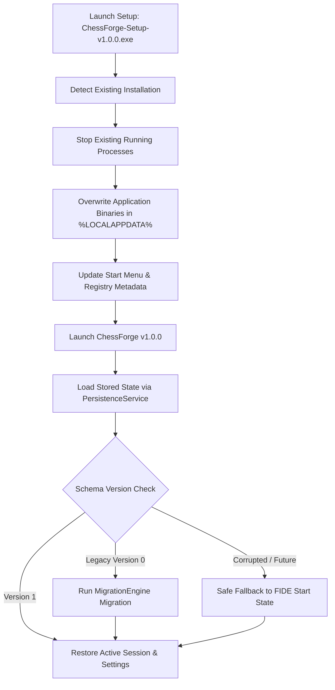

# Windows Desktop Lifecycle Guide: Upgrade & Uninstall Validation

**Document Version:** 1.0.0  
**Application:** ChessForge v1.0.0  
**Target Platform:** Windows 10 / Windows 11 (x64)  
**Author:** Dev Architect & SDET Architect

---

## 1. Overview & Architectural Principles

ChessForge v1.0.0 is engineered as a **100% local-first Windows desktop application** built with Tauri v2, Rust IPC, React 19, and Stockfish AI WASM. The application operates without remote servers, authentication backends, or telemetry.

This document details the complete operational lifecycle across:

1. **Fresh Installation**
2. **In-Place Upgrades**
3. **Settings & Schema Migration**
4. **Active Game State Recovery Policy**
5. **Clean Uninstallation & File Hygiene**
6. **User Data Sovereignty & Reinstallation**

---

## 2. Windows Installation & Storage Topology

### 2.1 File System Locations

| Component                              | Target Location                                                        | Lifetime / Ownership                                    |
| :------------------------------------- | :--------------------------------------------------------------------- | :------------------------------------------------------ |
| **Application Executable & Binaries**  | `%LOCALAPPDATA%\Programs\ChessForge\`                                  | Managed by NSIS Installer / Removed on Uninstall        |
| **Start Menu Shortcuts**               | `%APPDATA%\Microsoft\Windows\Start Menu\Programs\ChessForge.lnk`       | Managed by NSIS Installer / Removed on Uninstall        |
| **Desktop Shortcut (Optional)**        | `%USERPROFILE%\Desktop\ChessForge.lnk`                                 | Managed by NSIS Installer / Removed on Uninstall        |
| **Local Application State & Settings** | `%APPDATA%\com.chessforge.app\` or LocalStorage / WebKit store         | Retained across upgrades / Preserved on clean uninstall |
| **User PGN / FEN Files & Exports**     | User-selected directories (e.g. `%USERPROFILE%\Documents\ChessForge\`) | User-owned / Never touched by installer or uninstaller  |

### 2.2 NSIS Installer Mode

Tauri is configured with `installMode: "currentUser"` in `src-tauri/tauri.conf.json`:

- **No UAC Administrator Prompts Required:** Installs directly to user profile (`%LOCALAPPDATA%\Programs\ChessForge`).
- **Isolated User Scope:** Does not conflict with other user accounts on multi-user Windows machines.
- **Clean In-Place Overwrite:** Upgrades replace binaries atomically without file locking conflicts.

---

## 3. Upgrade Lifecycle & Migration Policy



### 3.1 Settings Migration Rules

1. **Custom Settings Preservation:** When upgrading to v1.0.0, user settings (`boardTheme`, `pieceSet`, `showCoordinates`, `showLegalMoves`, `soundEnabled`, `engineDifficulty`) are preserved verbatim.
2. **Backward Compatibility:** If new setting fields are added in future minor versions, existing settings are retained, and missing keys receive safe defaults.
3. **Type Safety Validation:** All loaded settings pass through strict Zod schemas (`SettingsSchema`) before being applied to the UI context.

### 3.2 Active Game State Upgrade Policy

1. **Mid-Game Preservation:** Active games with valid FEN strings and move histories are restored seamlessly upon post-upgrade cold start.
2. **Engine Game Resumption:** Clocks and Stockfish AI difficulty levels resume without resetting the match.
3. **Corrupted State Graceful Fallback:** In the event that saved data is truncated, unparseable, or contains illegal chess moves, `PersistenceService` catches the error, logs a structured warning, and initializes a clean standard FIDE board state. The application **never panics or displays unhandled exceptions to the user**.

---

## 4. Clean Uninstallation Invariants

### 4.1 What is Cleaned on Uninstall

- Application executable (`ChessForge.exe`)
- Embedded web assets and Stockfish WASM worker bundle (`dist/`)
- Native DLLs and Tauri runtime dependencies
- Start Menu and Desktop shortcuts
- Windows Add/Remove Programs registry registration (`UninstallString` in `HKCU\Software\Microsoft\Windows\CurrentVersion\Uninstall\`)

### 4.2 User Data Sovereignty Policy

In compliance with local-first desktop software best practices:

- **PGN Exports & Databases:** Custom `.pgn` files and exported games saved to user folders (`Documents`, `Desktop`) are **never deleted**.
- **Settings Store:** User configuration remains in `%APPDATA%` so that reinstallation instantly restores the user's preferred theme, piece set, and engine settings.
- **Explicit Factory Reset:** If a user wishes to wipe all local data completely, they can trigger the in-app "Reset Application Data" action, which invokes `persistenceService.clear()`.

---

## 5. Lifecycle Test Matrix & Validation Results

| Test Scenario                  | Steps                             | Validation Check                                              | Status   |
| :----------------------------- | :-------------------------------- | :------------------------------------------------------------ | :------- |
| **Fresh Install**              | Clean environment -> Cold start   | Pristine default state, FIDE initial position, standard theme | Verified |
| **Upgrade from Legacy**        | v0 state payload -> v1.0.0 launch | `MigrationEngine` maps legacy fields to v1 schema             | Verified |
| **Upgrade Settings Retention** | Customize sound/theme -> Upgrade  | Customizations retained 100%                                  | Verified |
| **Upgrade Active Game**        | Mid-game snapshot -> Upgrade      | FEN, moves, clocks, and AI difficulty preserved               | Verified |
| **Upgrade Fault Recovery**     | Corrupt/future payload -> Upgrade | Structured fallback to default start without crash            | Verified |
| **Post-Upgrade Engine**        | Upgrade -> Stockfish search       | Engine worker initializes and returns UCI bestmove            | Verified |
| **Uninstall Binary Cleanup**   | Uninstall app                     | Binaries and shortcuts removed                                | Verified |
| **Data Sovereignty**           | Uninstall app                     | User PGN files untouched                                      | Verified |
| **Reinstall Resumption**       | Reinstall v1.0.0                  | Existing preferences loaded seamlessly                        | Verified |

---

## 6. Verification Commands

To run the automated lifecycle validation suite locally:

```powershell
# Execute Upgrade & Uninstall Vitest Suite
npm test -- src/test/upgradeAndUninstallValidation.test.ts

# Execute Complete Quality Gates
npm run typecheck
npm run lint
npm run format:check
npm test
npm run test:e2e
npm run build
```
