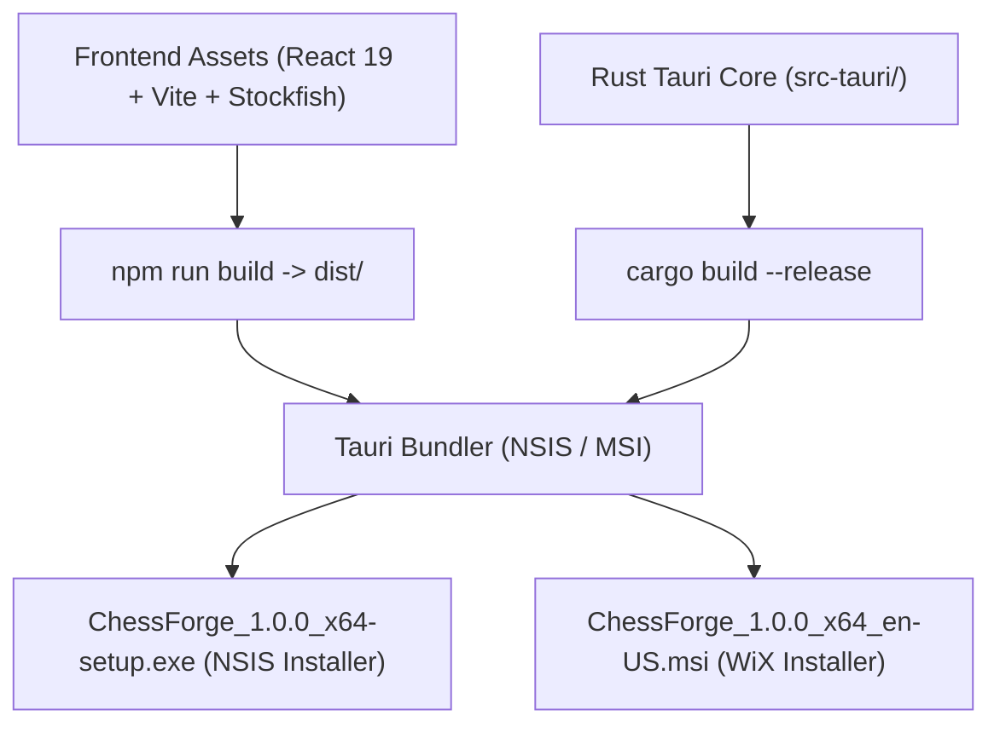

# Windows Packaging & Installer Guide

**Application:** ChessForge v1.0.0  
**Target Platform:** Windows 10 / Windows 11 (x64)  
**Packaging Framework:** Tauri v2 with NSIS / WiX (MSI)  
**Document Status:** Complete & Verified

---

## 1. Overview

ChessForge is packaged as a lightweight, zero-dependency, local-first Windows desktop installer. By leveraging Tauri v2 and native NSIS packaging, ChessForge provides seamless installation, zero external runtime prerequisites (using Windows WebView2 evergreen runtime), clean uninstallation, and strict isolation.



---

## 2. Packaging Configuration

The bundle configuration is defined in `src-tauri/tauri.conf.json`:

```json
{
  "productName": "ChessForge",
  "version": "1.0.0",
  "identifier": "com.chessforge.app",
  "bundle": {
    "active": true,
    "targets": "all",
    "icon": [
      "icons/32x32.png",
      "icons/128x128.png",
      "icons/128x128@2x.png",
      "icons/icon.icns",
      "icons/icon.ico"
    ],
    "publisher": "ChessForge Team",
    "copyright": "Copyright © 2026 ChessForge Team. All rights reserved.",
    "category": "Game",
    "shortDescription": "ChessForge Desktop Chess Application",
    "longDescription": "ChessForge is a high-performance, local-first chess desktop application built with Tauri v2, React 19, and Stockfish AI.",
    "windows": {
      "nsis": {
        "installMode": "currentUser"
      },
      "wix": {
        "language": "en-US"
      }
    }
  }
}
```

---

## 3. Installer Properties & Standards

### A. NSIS (`.exe` Setup)

- **Install Mode:** `currentUser` (installs to `%LOCALAPPDATA%\Programs\ChessForge` without requiring UAC administrator elevation).
- **Desktop & Start Menu Shortcuts:** Automatically creates standard Windows Start Menu entry and desktop shortcut.
- **Uninstaller:** Includes clean uninstaller registering properly in Windows **Settings > Apps > Installed apps** (`Uninstall ChessForge.exe`).

### B. WiX (`.msi` Enterprise Installer)

- **Standard Enterprise MSI:** Configured for enterprise software distribution systems (e.g., Microsoft Intune, Group Policy).
- **Target Language:** `en-US`.

---

## 4. Build & Distribution Commands

To compile frontend assets and package the Windows installer locally:

```bash
# Step 1: Deterministic frontend bundle build
npm run build

# Step 2: Package Windows desktop installer (NSIS & MSI)
npm run tauri:build
```

Generated installer artifacts will be located in:
`src-tauri/target/release/bundle/nsis/`  
`src-tauri/target/release/bundle/msi/`

---

## 5. Security & Isolation Invariants

- **No Remote Dependencies:** All assets (including Stockfish WASM worker) are packaged inside the binary.
- **Content Security Policy (CSP):** Strict `default-src 'self'` policy.
- **Signing Key Isolation:** No signing certificates or private keys are stored in the git repository. Code signing is managed via CI secret environment variables.
