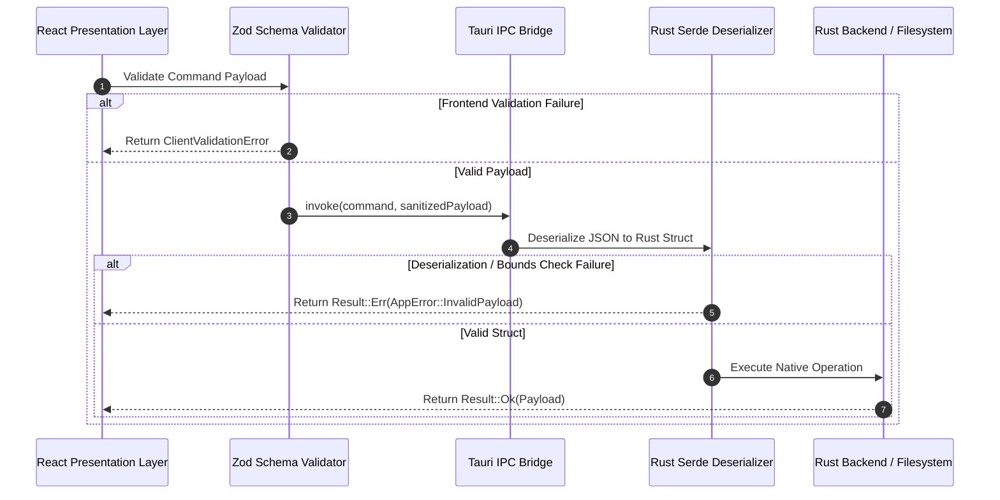

# ChessForge Desktop Security and Permissions Model

**Version:** 1.0.0  
**Phase:** Phase 01 · Sprint 04  
**Author:** Security & Desktop Safety Officer, Dev Architect  
**Classification:** Security Architecture Specification  
**Status:** Approved for Implementation

---

## 1. Executive Summary & Security Principles

ChessForge is a **local-first Windows desktop application** built with Tauri v2, Rust, React, and Stockfish WASM. Because ChessForge executes natively on Windows 10/11 with local filesystem and hardware access, security cannot rely on generic web application assumptions.

This document establishes the **authoritative desktop security model** for ChessForge, enforcing the following core security principles:

1. **Principle of Least Privilege:** Grant only the exact native operating system permissions necessary to perform user-initiated chess operations.
2. **Untrusted External Data Ingestion:** Treat all imported files (PGN, FEN, JSON configurations), clipboard inputs, and engine outputs as untrusted and potentially malicious.
3. **Strict Sandboxing & Process Isolation:** Stockfish AI evaluation executes strictly inside isolated WebWorkers without access to DOM, Tauri IPC, or operating system bridges.
4. **Defense in Depth:** Enforce input validation across multiple tiers: UI boundary, Rust IPC deserialization, domain invariants, and filesystem canonicalization.
5. **Zero Telemetry & 100% Offline Privacy:** ChessForge operates entirely offline. No user data, game telemetry, crash dumps, or telemetry payloads are transmitted to external servers.
6. **Zero Secrets in Source Control:** Zero API keys, signing certificates, or private credentials exist in the codebase.

```mermaid
graph TD
    subgraph Host_OS ["Windows Host Operating System"]
        subgraph Tauri_Core ["Tauri v2 Core / Rust Process"]
            IPC_Router["Typed IPC Command Router\n(Serde Validation)"]
            FS_Guard["Scoped Filesystem Manager\n(AppData & Dialog Guard)"]
            Clip_Guard["Clipboard Manager\n(Scoped Text-Only)"]
            Native_Store["Local JSON Store\n(Atomic Writes)"]
        end

        subgraph Webview ["Sandboxed WebView2 Process"]
            subgraph Presentation ["Presentation Layer (React UI)"]
                UI["UI Components & Board Renderer"]
                Zod_Val["Boundary Schema Validator (Zod)"]
            end

            subgraph Engine_Worker ["Stockfish WASM WebWorker"]
                SF_Engine["Stockfish Engine (WASM)"]
                UCI_Bridge["Typed UCI Bridge (MessagePort)"]
            end
        end

        Disk_AppDir[("$APPDATA/ChessForge/")]
        Disk_UserExport[("User Selected Export File")]
    end

    UI -->|Typed Invoke| IPC_Router
    IPC_Router --> FS_Guard
    IPC_Router --> Clip_Guard
    IPC_Router --> Native_Store

    FS_Guard --> Disk_AppDir
    FS_Guard --> Disk_UserExport

    UI -->|postMessage (Typed UCI)| UCI_Bridge
    UCI_Bridge --> SF_Engine

    style Host_OS fill:#0f172a,stroke:#334155,stroke-width:2px,color:#f8fafc
    style Tauri_Core fill:#1e293b,stroke:#475569,stroke-width:1px,color:#f8fafc
    style Webview fill:#1e293b,stroke:#475569,stroke-width:1px,color:#f8fafc
    style Presentation fill:#334155,stroke:#64748b,stroke-width:1px,color:#f8fafc
    style Engine_Worker fill:#334155,stroke:#64748b,stroke-width:1px,color:#f8fafc
```

---

## 2. Native Capabilities & Least-Privilege Permissions

Tauri v2 introduces a granular, capability-based security model configured through capability manifests in `src-tauri/capabilities/`. ChessForge prohibits wildcard permissions (`*`) and enables only explicit, audited capabilities.

### 2.1 Approved Native Capabilities Matrix

| Capability / Plugin | Specific Permission ID                                                                                                           | Architectural Justification                                              | Scope / Constraints                                                      |
| :------------------ | :------------------------------------------------------------------------------------------------------------------------------- | :----------------------------------------------------------------------- | :----------------------------------------------------------------------- |
| **Core Base**       | `core:default`                                                                                                                   | Fundamental Tauri runtime event routing and lifecycle management.        | Standard window lifecycle and minimal runtime bindings.                  |
| **Window Controls** | `core:window:allow-minimize`<br>`core:window:allow-maximize`<br>`core:window:allow-close`<br>`core:window:allow-toggle-maximize` | Custom native titlebar and window control interactions.                  | Scoped strictly to the main application window (`main`).                 |
| **File Dialogs**    | `dialog:allow-open`<br>`dialog:allow-save`                                                                                       | User-initiated PGN/FEN file import and PGN export workflows.             | Modal OS dialogs only. Returns chosen file paths back to frontend.       |
| **Clipboard**       | `clipboard-manager:allow-read-text`<br>`clipboard-manager:allow-write-text`                                                      | Copy FEN/PGN to clipboard; paste FEN/PGN into board setup/import.        | Text-only clipboard operations. Binary/file clipboard access is blocked. |
| **Scoped Store**    | `store:allow-get`<br>`store:allow-set`<br>`store:allow-save`                                                                     | Persisting user preferences (themes, piece sets, engine threads, sound). | Scoped strictly to `settings.json` within `$APPDATA/ChessForge/`.        |
| **Scoped FS**       | `fs:allow-read-text-file`<br>`fs:allow-write-text-file`                                                                          | Reading/writing game sessions and atomic recovery snapshots.             | Scoped strictly to `$APPDATA/ChessForge/*` and dialog-approved paths.    |

### 2.2 Tauri v2 Capability Manifest (`src-tauri/capabilities/default.json`)

The capability manifest enforces exact permission identifiers:

```json
{
  "$schema": "../gen/schemas/desktop-schema.json",
  "identifier": "chessforge-default-capability",
  "description": "Minimal least-privilege capability set for ChessForge v1 desktop.",
  "windows": ["main"],
  "permissions": [
    "core:default",
    "core:window:allow-minimize",
    "core:window:allow-maximize",
    "core:window:allow-toggle-maximize",
    "core:window:allow-close",
    "dialog:allow-open",
    "dialog:allow-save",
    "clipboard-manager:allow-read-text",
    "clipboard-manager:allow-write-text",
    "store:allow-get",
    "store:allow-set",
    "store:allow-save",
    {
      "identifier": "fs:allow-read-text-file",
      "allow": [{ "path": "$APPDATA/ChessForge/**" }]
    },
    {
      "identifier": "fs:allow-write-text-file",
      "allow": [{ "path": "$APPDATA/ChessForge/**" }]
    }
  ]
}
```

---

## 3. Prohibited Capabilities & Strict Deny Matrix

To eliminate dangerous desktop attack surfaces, the following capabilities are **explicitly prohibited** in ChessForge v1. Attempting to introduce any of these permissions will trigger a blocking review rejection during the Security Audit gate.

| Prohibited Capability                               | Reason for Prohibition                                                                                                                 | Enforced Guardrail                                                                                                   |
| :-------------------------------------------------- | :------------------------------------------------------------------------------------------------------------------------------------- | :------------------------------------------------------------------------------------------------------------------- |
| **`shell:execute` / `shell:spawn`**                 | Arbitrary OS command execution allows Remote Code Execution (RCE) if input is tainted.                                                 | The `tauri-plugin-shell` execution capabilities are completely omitted from `Cargo.toml` and capabilities manifests. |
| **`shell:open` (Arbitrary Protocols)**              | Launching arbitrary URLs or executable protocols (e.g. `file://`, `powershell://`) risks host compromise.                              | Protocol handling is omitted. No arbitrary URL launching is enabled.                                                 |
| **Unscoped Filesystem (`fs:default`)**              | Allows unrestricted reading/writing across the entire user drive (`C:\`, `C:\Windows`).                                                | Scoped strictly to `$APPDATA/ChessForge/**`. Path traversal checks enforced in Rust.                                 |
| **Network Client / Server (`http:*`, Raw Sockets)** | ChessForge is a 100% offline local application. Network listeners or outbound HTTP clients introduce data exfiltration and MITM risks. | No `tauri-plugin-http` or network crate bundled in release binaries. Outbound connections blocked by CSP.            |
| **Dynamic Code Execution (`eval`, `Function`)**     | Ingested PGN/FEN files or malicious payloads could execute arbitrary scripts.                                                          | Disabled by strict Content Security Policy (`script-src 'self' 'wasm-unsafe-eval'`).                                 |
| **Background Daemons / Services**                   | ChessForge runs strictly while the window is open. No background persistent daemons or system tray autostart.                          | Single desktop window lifecycle managed by Tauri.                                                                    |

---

## 4. Filesystem Access Scopes & Path Traversal Defenses

### 4.1 Designated Filesystem Hierarchy

All persistent application data resides strictly within the user's isolated local app directory:

```text
%APPDATA%/ChessForge/
├── settings.json              # User settings (theme, audio, engine threads)
├── session_snapshot.json      # Atomic crash-recovery game state snapshot
├── logs/                      # Bounded local diagnostic logs
│   ├── chessforge.log         # Active log (max 5MB, rotated to .1)
│   └── chessforge.log.1       # Rotated backup log
└── exports/                   # Default export staging directory (if used)
```

### 4.2 Path Traversal & Canonicalization Defenses

1. **Path Canonicalization:** All filesystem paths passed across IPC or received from file dialogs are resolved to their canonical, absolute representation using `std::fs::canonicalize` or `dunce::canonicalize` on Windows (resolving UNC path quirks).
2. **Scope Boundary Verification:** Before performing any read or write, the Rust backend verifies that the canonical path begins with the canonical `$APPDATA/ChessForge` path or matches the exact path returned by an active OS file dialog session.
3. **Null-Byte and Traversal String Rejection:** Any path containing null bytes (`\0`), relative parent traversals (`../`, `..\`), or special device filenames (`CON`, `PRN`, `AUX`, `NUL`, `COM1-9`, `LPT1-9`) is immediately rejected with `StorageError.AccessDenied`.
4. **Crash-Safe Atomic Writes:** All persistence writes follow an atomic write-replace pattern (write to `.tmp` file, flush to disk, atomic rename/replace) to prevent file corruption during sudden system shutdowns.

---

## 5. IPC Boundaries & Input Validation

The IPC boundary between the WebView frontend and the native Rust backend is a critical trust boundary.

### 5.1 Typed IPC Command Architecture



### 5.2 Mandatory IPC Validation Rules

1. **No Raw String Command Invocations:** Every IPC command must accept a strongly typed struct. Raw untyped JSON strings or arbitrary parameter arrays are forbidden.
2. **Double Validation (Frontend Zod + Rust Serde):**
   - **Frontend:** TypeScript validates payload parameters using Zod schemas before invoking `invoke()`.
   - **Backend:** Rust deserializes incoming payloads into typed structs with strict bounds checking (e.g. string length limits, numeric range limits).
3. **Standardized Typed Error Contracts:** All IPC handlers return `Result<T, AppErrorDto>`. Unhandled Rust `panic!` is strictly forbidden; all errors are mapped to sanitized, structured error objects.
4. **Zero Shell Commands:** No IPC command translates frontend requests into OS shell or command-prompt executions.

---

## 6. Untrusted External Data Ingestion & Sanitization

ChessForge ingests three types of external data: PGN files, FEN strings, and JSON configuration files. All external data is treated as untrusted.

### 6.1 Attack Vectors & Mitigations Matrix

| Ingestion Source   | Potential Attack Vector                                                                                                  | Defensive Mitigation                                                                                                                                        |
| :----------------- | :----------------------------------------------------------------------------------------------------------------------- | :---------------------------------------------------------------------------------------------------------------------------------------------------------- |
| **PGN Files**      | **Denial of Service (OOM):** Oversized PGN files (e.g. 500MB) causing browser memory crashes.                            | Enforce strict file size cap of **10MB** before loading into memory. Reject files exceeding limit with `ParsingError.FileTooLarge`.                         |
| **PGN Files**      | **Stack Overflow / ReDoS:** Deeply nested variations (`(((...)))`) or catastrophic regex backtracking.                   | Parser enforces maximum recursion depth limit of **32 levels** for recursive variations. Regex-free streaming lexer.                                        |
| **PGN Headers**    | **Cross-Site Scripting (XSS):** Malicious HTML/JS injected into PGN metadata headers (e.g. `[Event "<script>..."]`).     | PGN metadata headers are parsed as plain UTF-8 text, sanitized, and rendered strictly through React DOM text nodes (never `dangerouslySetInnerHTML`).       |
| **FEN Strings**    | **Illegal Board States:** Corrupted FEN strings with missing kings, overlapping pieces, or invalid en passant targets.   | Pure Chess Domain validates complete FIDE board invariants (exactly 1 king per side, valid active color, valid rank/file counts) before accepting position. |
| **JSON Settings**  | **Schema Poisoning / Injection:** Modified JSON setting files containing unexpected properties or out-of-bounds numbers. | Validated against strict Zod schema on frontend and Serde struct on backend. Invalid files trigger graceful fallback to defaults without crash.             |
| **Stockfish WASM** | **Desync / Corrupted Engine Moves:** Buggy or spoofed engine move output (e.g. illegal moves, non-UCI formatting).       | Engine proposed moves are treated as untrusted suggestions and validated by the Pure Chess Domain before committing to state.                               |

---

## 7. WebWorker Sandboxing & Content Security Policy (CSP)

### 7.1 WebWorker Sandboxing

Stockfish executes in a dedicated WebWorker via WebAssembly:

1. **Isolated Context:** The WebWorker runs in an isolated thread with no access to the DOM (`window`, `document`) or Tauri native IPC APIs (`__TAURI_INTERNALS__`).
2. **MessagePort Bridge:** Communication is restricted to typed UCI text messages (`position`, `go`, `bestmove`, `info`) passed over `postMessage`.
3. **Resource Throttling:** Concurrency is capped to `navigator.hardwareConcurrency - 1` (default: 1 thread) and Hash memory is capped at 32MB to prevent CPU saturation or host freezing on Windows 10/11.

### 7.2 Content Security Policy (CSP)

Tauri v2 enforces a strict CSP in `src-tauri/tauri.conf.json` and `index.html`:

```text
default-src 'self';
script-src 'self' 'wasm-unsafe-eval';
style-src 'self' 'unsafe-inline';
img-src 'self' data: blob:;
font-src 'self';
worker-src 'self' blob:;
connect-src 'none';
object-src 'none';
base-uri 'self';
form-action 'none';
frame-ancestors 'none';
```

- `'wasm-unsafe-eval'`: Required specifically for Stockfish WASM compilation while blocking arbitrary JavaScript `eval()`.
- `connect-src 'none'`: Enforces that no network connections (Fetch, XMLHttpRequest, WebSocket, EventSource) can be initiated from the application.

---

## 8. Secrets Management & Credential Policy

### 8.1 Zero-Secret Policy

1. **No Secrets in Code:** The repository contains zero private keys, API secrets, tokens, passwords, or encryption keys.
2. **No Environment Secrets in App:** Because ChessForge is an offline desktop application, no `.env` files or runtime secret variables exist in the application bundle.
3. **Automated Secret Detection:** Pre-commit hooks and CI workflows run automated secret scanning (detecting high-entropy strings, private key headers, and API token patterns) on every push and PR.

### 8.2 Release Signing & Build Integrity

1. **Isolated CI Environment Secrets:** Code signing certificates and Tauri update keys (for release builds) are stored exclusively in GitHub Actions Encrypted Secrets.
2. **Reproducible Builds:** Release binaries are compiled from clean Git tags in isolated CI runner environments with pinned toolchains.
3. **Binary Checksums:** Release artifacts produce SHA-256 checksums published alongside GitHub Releases.

---

## 9. Logging, Privacy & Data Protection

### 9.1 Privacy Mandates

1. **100% Offline by Default:** Zero tracking cookies, zero analytics SDKs (Google Analytics, Mixpanel, Sentry cloud, PostHog), and zero phone-home mechanisms.
2. **No Personally Identifiable Information (PII):** The application does not collect names, email addresses, IP addresses, or hardware MAC addresses.

### 9.2 Secure Local Logging Standards

1. **Local Diagnostic Logs Only:** Logs are stored strictly in `%APPDATA%/ChessForge/logs/chessforge.log`.
2. **Path Anonymization:** Absolute filesystem paths containing Windows usernames (e.g. `C:\Users\JohnDoe\AppData\...`) are sanitized in log outputs to `[USER_APPDATA]\...` or `[USER_HOME]\...`.
3. **Log Size Limits & Rotation:** Maximum log size is capped at **5MB**. When the limit is reached, the log is rotated to `chessforge.log.1` and the active log is truncated. Total log disk consumption never exceeds **10MB**.

---

## 10. Dependency Auditing & Supply Chain Security

To safeguard against software supply chain attacks:

1. **Lockfile Enforcement:** `package-lock.json` and `Cargo.lock` are committed to source control. CI builds use strict lockfile validation (`npm ci` and `cargo build --locked`).
2. **Automated Vulnerability Scanning:**
   - **Rust Dependencies:** Verified via `cargo audit` in CI pipeline. Builds fail on any critical or high severity advisory.
   - **NPM Dependencies:** Verified via `npm audit --audit-level=high` in CI pipeline.
3. **Minimal Dependency Principle:** Avoid importing heavy third-party libraries for trivial utility functions. Every new dependency requires justification and security assessment.

---

## 11. Security Review & Acceptance Checklist

Before any sprint involving native capabilities, file operations, or engine integration can be approved, the **Security & Desktop Safety Officer** verifies conformance against this checklist:

- [x] Every native permission in `src-tauri/capabilities/` is mapped to an approved architectural requirement.
- [x] No wildcard (`*`) capabilities or unscoped filesystem permissions exist.
- [x] `shell:execute`, `shell:spawn`, and arbitrary network listeners are completely absent.
- [x] All IPC command arguments are strictly validated with Serde (Rust) and Zod (TypeScript).
- [x] External PGN, FEN, and JSON files are subjected to size bounds, depth limits, and syntax sanitization.
- [x] Stockfish WASM WebWorker is isolated with no access to DOM or native bridges.
- [x] Strict Content Security Policy (`connect-src 'none'`) is active and enforced.
- [x] Error logs sanitize user paths and enforce a 10MB disk storage cap.
- [x] Zero secrets or private keys exist in repository history or code.
- [x] Dependency audit reports 0 critical/high vulnerabilities across `npm` and `cargo`.
