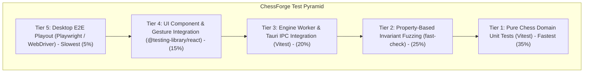

# ChessForge Testing Strategy & Verification Architecture

**Document Version:** 1.0.0  
**Status:** Approved Testing Standard  
**Target Platform:** Windows 10/11 Desktop (Tauri v2 + React 19 + TypeScript + Vitest + fast-check + Playwright)

---

## 1. Testing Philosophy & Core Principles

ChessForge demands uncompromising correctness. In chess software, a subtle off-by-one bug or unhandled rule edge case (such as illegal en passant during discovered check or false threefold repetition when castling rights differ) destroys user trust and compromises game integrity.

Our testing architecture is built on six foundational principles:
1. **Zero Tolerance for Chess Rule Regressions:** FIDE chess semantics are mathematically deterministic; any rule failure is a critical blocking defect.
2. **Determinism over Real Time:** Real-time waits (`setTimeout`, arbitrary sleeps) are strictly forbidden in automated tests. Timers, clocks, engine worker latency, and asynchronous dispatch must execute under deterministic control (`vi.useFakeTimers()`, mocked worker messages).
3. **Multi-Layered Defense (Test Pyramid):** Fast, isolated domain unit tests validate pure rules in milliseconds; property-based generative fuzzing verifies infinite state variations; integration tests validate application coordinators; and E2E tests verify desktop packaging and user journeys.
4. **Strict Anti-Bypass Rule:** Agents and developers are strictly forbidden from suppressing tests (`it.skip`, `test.skip`, `// @ts-ignore`), removing failing assertions, or lowering coverage gates to unblock PRs.
5. **Deterministic Golden FEN Scenarios:** High-complexity edge cases are expressed as immutable Golden FEN fixtures rather than fragile multi-move setup scripts.
6. **Local-First & CI Parity:** All tests execute locally on developer/agent machines with zero external network or cloud dependencies, matching automated GitHub Actions CI execution.

---

## 2. Test Pyramid & Ownership Matrix



### 2.1 Test Tier Specifications

| Tier | Name | Target Scope | Primary Tooling | Execution Target | Responsible Persona |
| :--- | :--- | :--- | :--- | :--- | :--- |
| **1** | **Chess Domain Unit** | Legal move generation, check/checkmate/stalemate, castling, en passant, draw rules (3-fold, 50-move, insufficient material), FEN/PGN/SAN codecs, SAN parser. | `Vitest` | $< 2$ seconds | **Chess Domain Architect & SDET** |
| **2** | **Property-Based Invariants** | Round-trip serialization ($FEN \to State \to FEN$), legal move preservation, move history undo/redo invariants, randomized game playout fuzzing. | `Vitest` + `fast-check` | $< 5$ seconds | **SDET & Chess Domain Architect** |
| **3** | **Engine & Service Integration** | WebWorker UCI protocol lifecycle (`uci`, `isready`, `ucinewgame`, `go`, `stop`, `bestmove`), evaluation token cancellation, search throttling, error recovery, `GameCoordinator`. | `Vitest` + Mock WebWorker | $< 3$ seconds | **Dev Architect & SDET** |
| **4** | **UI Component & Gestures** | Board rendering, square coordinate calculation, legal move highlight dots, drag-and-drop piece movement, pawn promotion modal picker, dual Fischer clock display. | `@testing-library/react` + `user-event` | $< 5$ seconds | **Dev Architect & SDET** |
| **5** | **Desktop E2E & File Workflows** | Complete Human vs Human & Human vs Engine playouts, PGN file export & import dialogs, theme/settings persistence across window reloads, window resizing. | `Playwright` / Tauri WebDriver | $< 30$ seconds | **SDET & DevOps Engineer** |
| **6** | **Security & Schema Audit** | Tauri capability allowlists, CSP headers, path traversal denial on file exports, untrusted FEN/PGN schema validation, zero network leakage tests. | Static Audits + Zod Schema Tests | $< 2$ seconds | **Security Officer & SDET** |

---

## 3. Chess Domain Invariants & Property-Based Testing

Using `fast-check`, ChessForge executes generative fuzzing over hundreds of generated positions to enforce mathematical chess invariants:

### 3.1 Core Invariants Checklist
1. **King Invariant:** In any valid position, exactly one White King and one Black King must exist on the board.
2. **Safety Invariant:** A legal move for side $S$ can never leave side $S$'s King in check.
3. **Board-History Parity:** The piece configuration on the active board must exactly match the state produced by replaying the move history list from the initial position.
4. **FEN Round-Trip Invariant:** For any valid game position $P$, parsing its FEN string into a game state and serializing back to FEN must produce an identical string:
   $$\text{serialize}(\text{deserialize}(FEN)) = FEN$$
5. **PGN Round-Trip Invariant:** Exporting a finished move history to PGN and re-importing it must reconstruct the identical final board position and move list.
6. **Undo/Redo Reversibility:** For any state $S_n$ and legal move $M$, applying $M$ to reach $S_{n+1}$ and executing `undo()` must produce state $S_n$ with identical castling rights, en passant targets, and halfmove clock.
7. **Terminal State Immutability:** Once a game reaches `checkmate`, `stalemate`, `draw_50_moves`, or `draw_threefold_repetition`, no further moves can be made, and engine evaluation is stopped.
8. **Stale Evaluation Isolation:** An evaluation response tagged with search token $T_{old}$ must be discarded immediately if the active position has moved to token $T_{new}$.

---

## 4. Deterministic Golden FEN Test Fixture Suite

To ensure absolute regression prevention, all domain and engine test suites reference standard Golden FEN fixtures:

```typescript
// fixtures/golden_fen_fixtures.ts
export const GOLDEN_FEN_FIXTURES = {
  // 1. Initial Position
  STARTING_POSITION: 'rnbqkbnr/pppppppp/8/8/8/8/PPPPPPPP/RNBQKBNR w KQkq - 0 1',

  // 2. Castling Restrictions (Attacked transit square d1/f1 prevents castling)
  CASTLING_THROUGH_CHECK: 'r3k2r/8/8/8/8/8/8/R3K2R w KQkq - 0 1',
  CASTLING_BLOCKED_BY_PIECE: 'rn1qkbnr/pppppppp/8/8/8/8/PPPPPPPP/RN1QKBNR w KQkq - 0 1',

  // 3. En Passant Expiration & Legality
  EN_PASSANT_ACTIVE: 'rnbqkbnr/ppp1p1pp/8/3pPp2/8/8/PPPP1PPP/RNBQKBNR w KQkq f6 0 3',
  EN_PASSANT_DISCOVERED_CHECK_ILLEGAL: '8/8/8/K2pP2r/8/8/8/8 w - d6 0 1', // White pawn on e5 taking d6 would expose Ka5 to Rh5

  // 4. Pawn Promotion Variations
  PROMOTION_STANDARD: '8/4P3/8/8/8/8/8/4K2k w - - 0 1',
  PROMOTION_WITH_CHECK: '8/2P5/8/8/8/8/8/K4k2 w - - 0 1',
  UNDERPROMOTION_KNIGHT_FORK: '8/5P2/8/8/8/8/8/K3k2q w - - 0 1',

  // 5. Absolute Pins & Discovered Checks
  ABSOLUTE_PIN_ROOK_KING: '4k3/8/8/8/4r3/8/4R3/4K3 w - - 0 1',
  DISCOVERED_CHECK_SETUP: '4k3/8/8/3n4/8/8/3B4/4K2R w K - 0 1',

  // 6. Draw Conditions
  THREEFOLD_REPETITION_STEP3: 'rnbqkbnr/pppppppp/8/8/8/8/PPPPPPPP/RNBQKBNR w KQkq - 4 3',
  FIFTY_MOVE_TRIGGER: '8/8/8/8/8/8/8/4K2k w - - 99 50', // 99 halfmoves without pawn move or capture
  FIFTY_MOVE_PAWN_RESET: '8/4P3/8/8/8/8/8/4K2k w - - 99 50',

  // 7. Insufficient Material Draws
  INSUFFICIENT_MATERIAL_KB_K: '8/8/8/8/8/4B3/8/4K2k w - - 0 1',
  INSUFFICIENT_MATERIAL_KN_K: '8/8/8/8/8/4N3/8/4K2k w - - 0 1',
  INSUFFICIENT_MATERIAL_KB_KB_SAME_COLOR: '8/2B5/8/8/8/5b2/8/4K2k w - - 0 1',

  // 8. Famous Historical Checkmates & Puzzles
  SCHOLARS_MATE: 'r1bqkb1r/pppp1ppp/2n5/4p3/2B1n3/5Q2/PPPP1PPP/RNB1K1NR w KQkq - 0 4',
  OPERA_GAME_MATE: '4kb1r/p2rqppp/5n2/1B2p1B1/4P3/1Q6/PPP2PPP/2KR4 b k - 1 14',
  SMOTHERED_MATE_CORNER: '6k1/5Npp/8/8/8/8/8/4K1Q1 w - - 0 1',

  // 9. Malformed / Untrusted FEN Strings (for Negative Testing)
  MALFORMED_ROW_OVERFLOW: 'rnbqkbnr/ppppppppp/8/8/8/8/PPPPPPPP/RNBQKBNR w KQkq - 0 1',
  MALFORMED_NO_KINGS: '8/8/8/8/8/8/8/8 w - - 0 1',
  MALFORMED_TWO_WHITE_KINGS: 'rnbqkbnr/pppppppp/8/8/8/8/PPPPPPPP/RNBQKKNR w KQkq - 0 1',
  MALFORMED_INVALID_ACTIVE_COLOR: 'rnbqkbnr/pppppppp/8/8/8/8/PPPPPPPP/RNBQKBNR x KQkq - 0 1',
  MALFORMED_NEGATIVE_HALFMOVE: 'rnbqkbnr/pppppppp/8/8/8/8/PPPPPPPP/RNBQKBNR w KQkq - -5 1',
};
```

---

## 5. Anti-Flakiness Rules & Mocking Protocols

### 5.1 Timers and Clock Simulation
- **Forbidden:** `new Promise((resolve) => setTimeout(resolve, 500))`
- **Mandatory:** `vi.useFakeTimers()`
```typescript
it('decrements active white clock by exactly 1000ms every second', () => {
  vi.useFakeTimers();
  const session = createGameSession({ timeControl: { initialMs: 300000, incrementMs: 0 } });
  session.startClock();
  
  vi.advanceTimersByTime(1000);
  expect(session.getClockState().whiteMs).toBe(299000);
  
  vi.useRealTimers();
});
```

### 5.2 Stockfish Engine Worker Mocking
- **Engine Worker Bridge Mock:** Tests simulating engine evaluation use a deterministic mock bridge rather than spinning up multi-megabyte WASM binaries on every unit test run:
```typescript
export class MockStockfishWorkerBridge implements IEngineWorkerPort {
  private listener: ((msg: EngineMessage) => void) | null = null;
  public sentCommands: string[] = [];

  public postMessage(command: string): void {
    this.sentCommands.push(command);
    if (command === 'isready') {
      this.listener?.({ type: 'readyok' });
    } else if (command.startsWith('go')) {
      // Return predictable evaluation response
      this.listener?.({
        type: 'info',
        depth: 12,
        scoreCp: 35,
        mate: null,
        pv: ['e2e4', 'e7e5', 'g1f3'],
        nps: 450000,
        nodes: 120000,
      });
      this.listener?.({ type: 'bestmove', move: 'e2e4' });
    }
  }

  public onMessage(callback: (msg: EngineMessage) => void): void {
    this.listener = callback;
  }

  public terminate(): void {
    this.sentCommands.push('quit');
  }
}
```

---

## 6. Performance & Resource Benchmarks

Automated performance checks run during integration testing to guarantee desktop responsiveness:

| Metric | Target Threshold | Test Verification Method |
| :--- | :--- | :--- |
| **Move Validation Latency** | $< 1.0\text{ ms}$ per move | Benchmark suite running 1,000 legal move validations in loop. |
| **Board Render Frame Time** | $< 16.6\text{ ms}$ (60 FPS) | React component re-render measurement via `@testing-library/react`. |
| **FEN Parse & Generate** | $< 0.1\text{ ms}$ per FEN | Benchmark suite parsing/serializing 5,000 FEN strings. |
| **Engine Worker Handshake** | $< 250\text{ ms}$ on boot | Measure WebWorker init to `readyok` response. |
| **Memory Footprint** | $< 150\text{ MB}$ total desktop RAM | Tauri dev process memory observation on continuous 100-move playout. |

---

## 7. Strict Failure-Handling & Anti-Bypass Rules

### 7.1 Anti-Bypass Guardrails
Agents and developers must strictly adhere to the following negative constraints:
1. **NEVER skip failing tests:** `it.skip()`, `test.skip()`, `describe.skip()`, `xit()`, `xtest()` are forbidden in committed code.
2. **NEVER weaken assertions:** Relaxing `expect(val).toBe(35)` to `expect(val).toBeDefined()` to mask a calculation defect is a critical process violation.
3. **NEVER disable typecheck or linter:** `// @ts-ignore`, `// @ts-nocheck`, or `eslint-disable` comments cannot be introduced without written justification and Security/Dev Architect approval.
4. **NEVER fabricate test results:** Quality gate reports must reflect real command output executed on the local terminal.

### 7.2 Defect Triage & Resolution Protocol
When a test failure occurs during sprint execution:
1. **Halt Progression:** The active quality gate is blocked immediately.
2. **Log Refinement Comment:** The reviewer persona logs a structured failure comment under `## Sprint Review Comments & Refinement Loop` in `task.md`.
3. **Isolate Root Cause:** Determine whether the failure is in domain logic, adapter integration, or test assertion.
4. **Implement Clean Fix:** The assigned persona fixes the underlying implementation on the feature branch.
5. **Re-Run Full Test Suite:** The full automated test suite must run clean ($100\%$ green) before the quality gate can be re-evaluated.

---

## 8. Definition of Done (DoD) for Testing

A sprint feature is considered tested and ready for release only when all of the following criteria are met:
- [x] **Unit Coverage:** $100\%$ of new domain rules and codec transformations have dedicated unit tests.
- [x] **Property Testing:** All new state transitions and serialization codecs pass $1000+$ iterations of `fast-check` generative fuzzing.
- [x] **Integration Coverage:** All UI interactions (clicks, drags, modal confirmations) have corresponding React Testing Library tests.
- [x] **No Flakiness:** Test suite runs 5 consecutive times locally without a single failure or timeout.
- [x] **Type & Lint Cleanliness:** `tsc --noEmit` and `eslint` complete with 0 errors and 0 warnings.
- [x] **100% Green Automation Report:** SDET Architect certifies a complete green run without skipped or bypassed tests.
