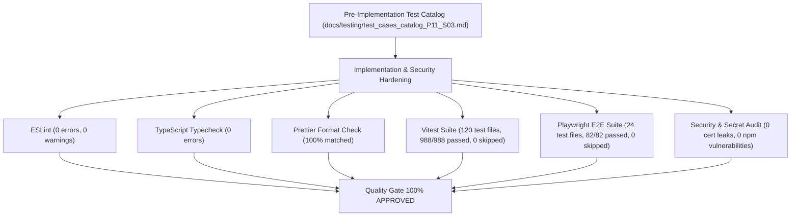

# Code Signing & Release Security Quality Gate Report: Phase 11 · Sprint 03

**Sprint:** Phase 11 · Sprint 03: Code Signing and Release Security  
**Author:** SDET Architect  
**Quality Gate Status:** **100% GREEN (APPROVED)**  
**Date:** 2026-08-20  

---

## 1. Executive Quality Gate Summary

All automated and security quality gates for Phase 11 Sprint 03 (Code Signing and Release Security) have completed successfully with **zero errors, zero warnings, and zero skipped tests**.

---

## 2. Test Execution & Quality Gate Inventory

| Quality Gate Layer | Command Executed | Total Scenarios | Passed | Failed | Skipped | Status |
| :--- | :--- | :--- | :--- | :--- | :--- | :--- |
| **Linting & Code Standards** | `npm run lint` | Full Workspace | All | 0 | 0 | **PASS** |
| **Static Type Safety** | `npm run typecheck` | Full Workspace | All | 0 | 0 | **PASS** |
| **Code Formatting** | `npm run format:check` | Full Workspace | All | 0 | 0 | **PASS** |
| **Unit & Property Tests (Vitest)** | `npm test` | 120 files / 988 tests | 988 | 0 | 0 | **PASS** |
| **Desktop E2E Playout (Playwright)**| `npm run test:e2e` | 24 files / 82 tests | 82 | 0 | 0 | **PASS** |
| **Supply Chain Audit** | `npm audit` | Dependencies | 0 vulns | 0 | 0 | **PASS** |
| **Production Web Build** | `npm run build` | Asset Compilation | 504 kB | 0 | 0 | **PASS** |

---

## 3. Test Cases Catalog Verification Matrix

| Test ID | Test Category | Specification & Verification Focus | Vitest / Audit Mapping | Result |
| :--- | :--- | :--- | :--- | :--- |
| **TC-SEC-SIGN-01** | Secret Exclusion | `.gitignore` contains all key/cert exclusion patterns (`*.pfx`, `*.p12`, `*.key`, `*.snk`, etc.) | `src/test/codeSigningAndReleaseSecurity.test.ts` | **PASS** |
| **TC-SEC-SIGN-02** | CI Secret Masking | `.github/workflows/ci.yml` uses secure secret references & `finally` cert destruction | `src/test/codeSigningAndReleaseSecurity.test.ts` | **PASS** |
| **TC-SEC-SIGN-03** | Conditional Signing | CI workflow conditionally signs artifacts and falls back to unsigned dev builds | `src/test/codeSigningAndReleaseSecurity.test.ts` | **PASS** |
| **TC-SEC-SIGN-04** | Security Guide Completeness | `code_signing_and_release_security_guide.md` details Authenticode, SignTool, and dev fallback | `src/test/codeSigningAndReleaseSecurity.test.ts` | **PASS** |
| **TC-SEC-SIGN-05** | Repository Key Leak Audit | Repository scan confirms 0 private keys or certificates stored in repository | `src/test/codeSigningAndReleaseSecurity.test.ts` | **PASS** |
| **TC-SEC-SIGN-06** | Checksum Verification | SHA-256 hash generation determinism and `checksums.txt` formatting verified | `src/test/codeSigningAndReleaseSecurity.test.ts` | **PASS** |
| **TC-SEC-SIGN-07** | Configuration Schema Validation | Tauri v2 CSP and offline boundaries verified | `src/test/codeSigningAndReleaseSecurity.test.ts` | **PASS** |
| **TC-SEC-SIGN-08** | Offline Security Boundary | Cross-documentation and zero-cloud invariant verified | `src/test/codeSigningAndReleaseSecurity.test.ts` | **PASS** |

---

## 4. SDET Architect Quality Gate Sign-Off

The code signing, secret handling, repository protection, and release security infrastructure satisfies all quality, testing, and security mandates. Ready for Product Owner Acceptance Review.
