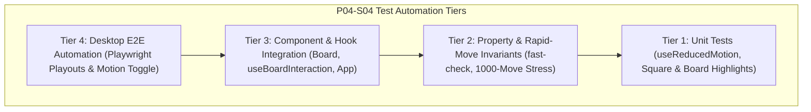

# Test Cases Catalog: Phase 04 · Sprint 04 (Move Animation & Last-Move State)

## Document Metadata

- **Phase:** 04 (Board UI Presentation)
- **Sprint:** 04 (Move Animation and Last-Move State)
- **Author:** SDET Architect
- **Target Role:** Dev Architect / Senior SDE & Product Owner
- **Status:** APPROVED

---

## 1. Test Scope & Strategy

This catalog specifies the automated and deterministic verification requirements for **Sprint 04: Move Animation and Last-Move State**. The suite ensures that all visual animations and last-move tracking operate strictly as transient presentation enhancements without compromising domain authority, state commitment speed, or accessibility requirements.

---

## 2. Test Cases Specification Matrix

| Test ID        | Category           | Description                           | Input / Setup                                              | Expected Outcome                                                                | Pass/Fail Criteria                              |
| :------------- | :----------------- | :------------------------------------ | :--------------------------------------------------------- | :------------------------------------------------------------------------------ | :---------------------------------------------- |
| **TC-ANIM-01** | Positive           | Track last-move on quiet move         | Execute `e2-e4`                                            | `lastMove` is `{ from: "e2", to: "e4" }`                                        | Exact square pair returned                      |
| **TC-ANIM-02** | Positive           | Origin square highlight               | Last move `e2-e4`                                          | Square `e2` has `is-last-move`, `is-last-move-from`, `data-is-last-move="from"` | DOM attributes & CSS present                    |
| **TC-ANIM-03** | Positive           | Destination square highlight          | Last move `e2-e4`                                          | Square `e4` has `is-last-move`, `is-last-move-to`, `data-is-last-move="to"`     | DOM attributes & CSS present                    |
| **TC-ANIM-04** | Positive           | Last-move reset on new game           | Game with moves -> `reset()`                               | `lastMove` becomes `null`, all last-move classes removed                        | Clean starting board                            |
| **TC-ANIM-05** | Positive           | Last-move update on `undo()`          | Execute `e2-e4`, `e7-e5` -> `undo()`                       | `lastMove` updates to `{ from: "e2", to: "e4" }`                                | Prior move restored                             |
| **TC-ANIM-06** | Positive           | Piece movement CSS styling            | Move executed with motion enabled                          | Piece/Square renders transition styling (`transform`, GPU layer)                | 60fps CSS transform classes                     |
| **TC-ANIM-07** | Positive           | Capture visual feedback               | Execute capture (`exd5` or `Qxd8`)                         | Destination square triggers capture visual indicator / class                    | `is-capture-effect` or capture animation active |
| **TC-ANIM-08** | Positive           | En passant capture animation          | White `e5`, Black `d7-d5`, White `exd6`                    | Last move is `e5-d6`, `d5` pawn removed from DOM instantly                      | Clean capture rendering                         |
| **TC-ANIM-09** | Positive           | Castling move highlights              | White plays `e1-g1` (O-O)                                  | Last move is `e1-g1`, King at `g1`, Rook at `f1` rendered correctly             | Castling squares accurate                       |
| **TC-ANIM-10** | Positive           | Promotion piece transition            | Pawn advances `e7-e8=Q`                                    | Promoted Queen renders immediately at `e8`, last move `e7-e8`                   | No render glitch or ghost pawn                  |
| **TC-ANIM-11** | Hook / OS          | `useReducedMotion` media query        | Mock `matchMedia('(prefers-reduced-motion: reduce)')` true | Hook returns `prefersReducedMotion: true`                                       | Correct OS preference detection                 |
| **TC-ANIM-12** | Hook / Override    | `useReducedMotion` explicit toggle    | Toggle reduced motion in hook / UI                         | Overrides preference, disables animation classes                                | Toggle state honored                            |
| **TC-ANIM-13** | Accessibility      | Visual highlights with reduced motion | Reduced motion enabled                                     | Transitions disabled (0ms), last-move highlights remain 100% visible            | Accessibility preserved                         |
| **TC-ANIM-14** | Invariant          | Instantaneous state commitment        | Execute move                                               | `game.getPosition()` updates synchronously before any animation frame           | State never awaits animation                    |
| **TC-ANIM-15** | Stress / Invariant | Rapid consecutive moves stress        | 20 rapid moves fired in < 100ms                            | Final DOM board matches `game.getPosition().board` with 100% fidelity           | Zero orphan or desynced pieces                  |
| **TC-ANIM-16** | Layout             | Orientation flip coordinate stability | Flip board to Black perspective                            | Square and piece coordinates adjust without broken transform deltas             | Clean rotated grid                              |
| **TC-ANIM-17** | Property           | Generative Invariant Fuzzing          | 1,000 randomized legal moves via `fast-check`              | At every ply, DOM piece placements match authoritative domain matrix            | 0 desyncs across 1,000 plies                    |
| **TC-ANIM-18** | Invariant          | Immutability under animation props    | Render board with animation props 1,000 times              | Input Position and History objects are never mutated                            | `Object.isFrozen` / immutability verified       |
| **TC-ANIM-19** | Edge Case          | Game over interaction locking         | Checkmate / Draw reached                                   | Board disabled, last-move highlight remains visible, no new animations          | Safe terminal state                             |
| **TC-ANIM-20** | Performance        | CSS Containment & Compositor budget   | Full board animated render                                 | `transform` and `opacity` used exclusively; memory footprint < 150 MB           | GPU composited, 60fps                           |

---

## 3. Anti-Flakiness & Quality Gate Mandate

1. **Deterministic Test Execution:** All animation tests must verify CSS classes, data attributes, and transform properties without relying on real-time sleeps or non-deterministic `setTimeout`.
2. **Quality Gate Threshold:** 100% pass rate across all Vitest suites, fast-check property tests, and Playwright E2E scenarios. 0 skipped tests.

---

## 4. SDET Architect Sign-Off

The Test Cases Catalog TC-ANIM-01 through TC-ANIM-20 is complete, deterministic, and approved for implementation handover.

**Sign-off Status:** **APPROVED** -> Handing off to Dev Architect / Senior SDE for production implementation.
