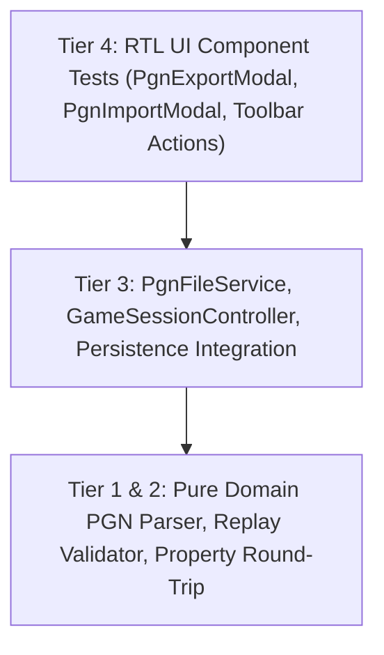

# Test Cases Catalog: Phase 08 · Sprint 03 - PGN Export & Import UI

**Document Version:** 1.0.0  
**Status:** Approved  
**Author:** SDET Architect  
**Deciders:** SDET Architect, Chess Domain Architect, Dev Architect  
**Sprint Reference:** Phase 08 · Sprint 03 (`P08-S03-pgn-export-and-import-ui`)  
**Specification:** `docs/architecture/pgn_export_import_specification.md`

---

## 1. Test Strategy Overview

This catalog specifies the automated, deterministic test cases covering PGN Export, PGN Import, file and clipboard workflows, pre-mutation validation, state immutability, UI dialogs, and property-based invariance for Sprint 03.

---

## 2. Test Cases Catalog Matrix

| Test ID            | Category      | Level               | Description                                                             | Pass Criteria                                                                              |
| :----------------- | :------------ | :------------------ | :---------------------------------------------------------------------- | :----------------------------------------------------------------------------------------- |
| **`TC-PGN-UI-01`** | Export        | Domain/Unit         | Standard 7-tag roster & SAN move stream export from active game session | Generates valid PGN with Event, Site, Date, Round, White, Black, Result and moves          |
| **`TC-PGN-UI-02`** | Export        | Domain/Unit         | Custom PGN tags export (custom event, site, date, round)                | User-supplied tags override default roster correctly                                       |
| **`TC-PGN-UI-03`** | Export        | Service/Unit        | PGN file download trigger (`downloadPgnFile`)                           | Creates `text/plain` Blob, sets download attribute with sanitized filename, triggers click |
| **`TC-PGN-UI-04`** | Export        | Service/Unit        | PGN clipboard copy with fallback                                        | Writes PGN to clipboard, returns success status; gracefully handles clipboard error        |
| **`TC-PGN-UI-05`** | Import        | Domain/Unit         | Valid PGN standard replay and position reconstruction                   | Parses moves, replays sequentially, derives exact final FEN, turn, and move history        |
| **`TC-PGN-UI-06`** | Import        | Domain/Unit         | PGN with custom starting FEN (`[SetUp "1"] [FEN "..."]`)                | Initializes domain with custom FEN and executes following moves correctly                  |
| **`TC-PGN-UI-07`** | Import        | Domain/Unit         | PGN terminal result notation (`1-0`, `0-1`, `1/2-1/2`, `*`)             | Sets session state (`resigned`, `draw_agreement`, or in-progress) consistently             |
| **`TC-PGN-UI-08`** | Validation    | Domain/Unit         | Malformed/corrupt PGN syntax handling                                   | Returns `INVALID_PGN` error with descriptive reason; throws no uncaught exceptions         |
| **`TC-PGN-UI-09`** | Validation    | Domain/Unit         | Illegal move at ply $k$ rejection & precision error reporting           | Returns `ILLEGAL_MOVE` with exact ply index, move token, and prior FEN                     |
| **`TC-PGN-UI-10`** | Import UI     | Component/RTL       | PGN file upload via input element (`readPgnFile`)                       | Reads file content as text, populates import text area, and triggers validation            |
| **`TC-PGN-UI-11`** | Import UI     | Component/RTL       | PGN Import preview card rendering                                       | Displays players, date, event, plies, result, and validation status                        |
| **`TC-PGN-UI-12`** | State Safety  | Integration         | Non-destructive import failure invariant                                | When invalid PGN is processed, active game board, clocks, and moves remain unchanged       |
| **`TC-PGN-UI-13`** | Controller    | Integration         | Atomic session replacement on confirmed import                          | Replaces board, resets clocks, updates player names from tags, synchronizes history        |
| **`TC-PGN-UI-14`** | Persistence   | Integration         | Automatic recovery snapshot update on PGN import                        | Persists imported active game to recovery storage, or clears if imported game is complete  |
| **`TC-PGN-UI-15`** | Accessibility | Component/RTL       | PGN Export & Import Modals ARIA & keyboard navigation                   | Escape closes modals, Tab cycles focus within dialog, form controls properly labeled       |
| **`TC-PGN-UI-16`** | Invariants    | Property/fast-check | Generative PGN Export/Import round-trip preservation                    | $\text{Export}(\text{Import}(PGN)) \equiv PGN$ across randomized legal games               |

---

## 3. Anti-Flakiness & Quality Gate Mandates

1. **Deterministic File & Clipboard Mocking:** Mock `URL.createObjectURL`, `URL.revokeObjectURL`, `navigator.clipboard`, and `FileReader` using deterministic Vitest spies with automatic cleanup in `afterEach`.
2. **Zero `setTimeout`:** All asynchronous UI updates and toast dismissals must use `vi.useFakeTimers()` or direct React state transitions.
3. **No Uncaught Rejections:** PGN file reading errors or clipboard permission denials must be captured as structured `Result<T, AppError>` types.
