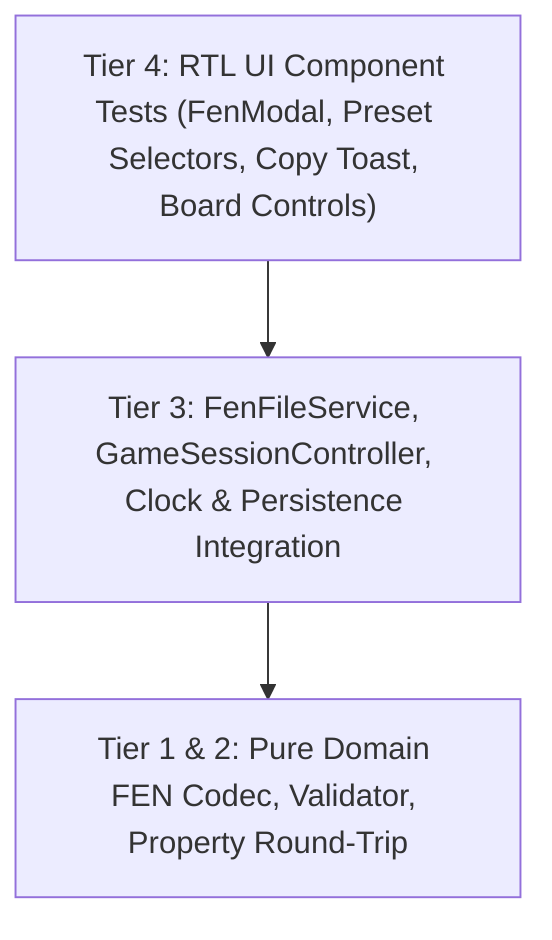

# Test Cases Catalog: Phase 08 · Sprint 04 - FEN Workflow

**Document Version:** 1.0.0  
**Status:** Approved  
**Author:** SDET Architect  
**Deciders:** SDET Architect, Chess Domain Architect, Dev Architect  
**Sprint Reference:** Phase 08 · Sprint 04 (`P08-S04-fen-workflow`)  
**Specification:** `docs/architecture/fen_workflow_specification.md`

---

## 1. Test Strategy Overview

This catalog specifies the automated, deterministic test cases covering FEN Export, single-click copy, FEN Dialog / Inspection UI, syntactic & semantic validation, presets loading, non-destructive safety, session synchronization, accessibility, and property-based invariance for Sprint 04.

---

## 2. Test Cases Catalog Matrix

| Test ID            | Category      | Level               | Description                                                     | Pass Criteria                                                                             |
| :----------------- | :------------ | :------------------ | :-------------------------------------------------------------- | :---------------------------------------------------------------------------------------- |
| **`TC-FEN-UI-01`** | Export & Copy | Domain/Unit         | Standard starting position and dynamic game position FEN export | Generates canonical 6-token FEN string with accurate piece placements and counters        |
| **`TC-FEN-UI-02`** | Export & Copy | Service/Unit        | Clipboard copy operation (`FenFileService.copyToClipboard`)     | Writes FEN string to navigator clipboard with fallback; handles permission denials safely |
| **`TC-FEN-UI-03`** | Export & Copy | Component/RTL       | Quick Copy FEN button in Board Controls / Modal                 | Copies current position FEN, displays "Copied to clipboard!" feedback toast               |
| **`TC-FEN-UI-04`** | FEN Dialog    | Component/RTL       | FEN Modal opening & pre-population with current board FEN       | Modal opens, renders active position FEN in textarea, enables copy and validation         |
| **`TC-FEN-UI-05`** | Presets       | Component/RTL       | Standard FEN Presets selection (Start, K+P, Lucena, Endgames)   | Selecting preset populates input, updates validation status to valid, renders preview     |
| **`TC-FEN-UI-06`** | Validation    | Domain/Unit         | Valid FEN strings syntactic & semantic validation               | Returns `{ isValid: true }` across standard, tactical, and endgame FENs                   |
| **`TC-FEN-UI-07`** | Validation    | Domain/Unit         | Invalid token count and malformed structure rejection           | Returns `{ isValid: false, error: "..." }` indicating field count mismatch                |
| **`TC-FEN-UI-08`** | Validation    | Domain/Unit         | Invalid piece character and invalid rank sum rejection          | Rejects ranks with invalid symbols or sum != 8 squares with explicit error message        |
| **`TC-FEN-UI-09`** | Validation    | Domain/Unit         | Illegal pawn placement on 1st or 8th rank rejection             | Flags pawns on 1st/8th rank as illegal position                                           |
| **`TC-FEN-UI-10`** | Validation    | Domain/Unit         | King count validation (exactly 1 White, 1 Black)                | Rejects 0 or >1 kings with clear error message                                            |
| **`TC-FEN-UI-11`** | Validation    | Domain/Unit         | En passant target rank consistency with active side to move     | En passant on rank 6 is legal only for White to move; rank 3 only for Black to move       |
| **`TC-FEN-UI-12`** | State Safety  | Integration         | Non-destructive load failure invariant                          | Attempting to load invalid FEN leaves active board, move history, and clocks 100% intact  |
| **`TC-FEN-UI-13`** | Load Position | Integration         | Atomic position replacement into current game session           | Updates board position, turn, and active color; resets move history & clocks              |
| **`TC-FEN-UI-14`** | Start Game    | Integration         | Start new game from FEN setup                                   | Initializes clean game session with initialFen set, resets move history, updates players  |
| **`TC-FEN-UI-15`** | Accessibility | Component/RTL       | FEN Modal ARIA roles, focus trap, and Escape key dismissal      | Modal has dialog role, focus trap operates correctly, Escape key closes modal             |
| **`TC-FEN-UI-16`** | Invariants    | Property/fast-check | Generative FEN load/export round-trip idempotency               | $\text{Export}(\text{Load}(FEN)) \equiv FEN$ across arbitrary valid chess positions       |

---

## 3. Anti-Flakiness & Quality Gate Mandates

1. **Deterministic Clipboard Mocking:** Mock `navigator.clipboard.writeText` and `navigator.clipboard.readText` using Vitest spies with automatic teardown in `afterEach`.
2. **Deterministic Timers:** Test feedback toasts (e.g. 2000ms dismissals) using `vi.useFakeTimers()` to eliminate real-time test delays.
3. **Strict Type Safety:** Zero `any` casting in test files. All FEN fixtures must adhere to typed contracts.
