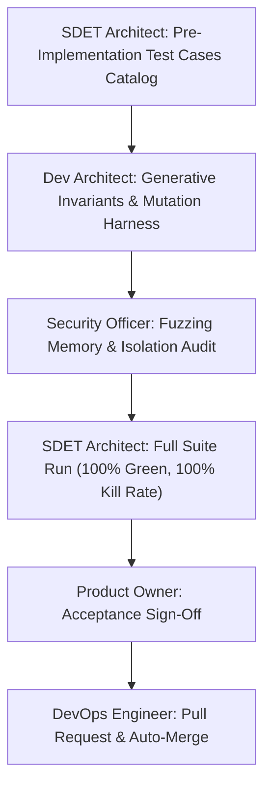

# Pre-Implementation Test Cases Catalog: Phase 10 · Sprint 03

**Sprint:** Phase 10 · Sprint 03: Property and Mutation Testing  
**Target Specification:** [Product Requirements Baseline](file:///c:/Workspace/ChessGame/docs/product-requirements.md), [Testing Strategy](file:///c:/Workspace/ChessGame/docs/testing-strategy.md), [Chess Domain Architecture](file:///c:/Workspace/ChessGame/docs/architecture.md), [QA Traceability Matrix](file:///c:/Workspace/ChessGame/docs/qa-matrix.md)  
**Author:** SDET Architect & Chess Domain Architect  
**Status:** `Approved & Ready for Execution`

---

## 1. Overview & Objectives

The primary objective of **Phase 10 · Sprint 03** is to mathematically verify and stress-test the ChessForge domain logic through:

1. **Generative Property-Based Invariant Fuzzing (`fast-check`):** Generating hundreds of reproducible, seeded random legal games to verify universal chess invariants (king counts, king safety, reversible move history, bijective FEN/PGN codecs, irreversible move clocks, material bounds).
2. **Controlled Domain Fault Injection & Mutation Testing:** Establishing a systematic mutation testing harness that injects realistic domain defects (bypassing check safety, corrupting castling/en passant, invalidating promotions, breaking turn alternation, omitting halfmove clock resets, misdetecting checkmate/stalemate, corrupting undo) and validates that the test suite detects ("kills") **100% of mutants** with zero surviving defects.
3. **Reproducibility & Resilience:** Guaranteeing that random property fuzzing is 100% reproducible via deterministic PRNG seeds, and that mutation test runs execute swiftly without flakiness or production side-effects.

---

## 2. Test Cases Specification

### 2.1 Generative Property-Based Invariants (TC-PROP-01 to TC-PROP-08)

| Test ID        | Category                  | Description & Fuzzing Parameters                                                                                                                                                | Expected Invariant Outcome                                                                                                               | Verification Tier              |
| :------------- | :------------------------ | :------------------------------------------------------------------------------------------------------------------------------------------------------------------------------ | :--------------------------------------------------------------------------------------------------------------------------------------- | :----------------------------- |
| **TC-PROP-01** | Invariant / Generative    | **Reproducible Seeded Legal Game Generation** Generates pseudo-random legal games from standard starting FEN up to 100+ plies using reproducible fast-check seeds.           | All generated games consist strictly of legal moves; runs deterministically across test executions.                                      | Tier 2 Property / `fast-check` |
| **TC-PROP-02** | Invariant / King Safety   | **King Count & Strict King Safety** Verify board after every legal move across generated games.                                                                              | Exactly 1 White King and 1 Black King exist; active player whose move just finished is NEVER in check; King can never be captured.       | Tier 2 Property / `fast-check` |
| **TC-PROP-03** | Invariant / Legality      | **Move Legality & Application Consistency** For any position $P$, all moves in `getLegalMoves(P)` pass `isLegalMove(m) === true` and execute successfully via `makeMove(m)`. | 100% agreement between move generator, legality validator, and move applicator.                                                          | Tier 2 Property / `fast-check` |
| **TC-PROP-04** | Invariant / Reversibility | **Sequential Move History Reversibility** For a game of $N$ legal moves, calling `undoMove()` $N$ times in reverse.                                                          | Reconstructs the exact initial FEN, turn, castling rights, and board state without artifact drift.                                       | Tier 2 Property / `fast-check` |
| **TC-PROP-05** | Invariant / Codec         | **FEN Bijective Serialization & Deserialization** For every position $P$ generated, serialize to FEN, validate, and instantiate new adapter.                                 | `new ChessJsAdapter(P.fen).getPosition()` matches $P$ exactly in board, turn, castling, en passant, and legal moves.                     | Tier 2 Property / `fast-check` |
| **TC-PROP-06** | Invariant / Codec         | **PGN Game Replay Bijective Invariance** Export generated game to PGN, parse PGN with `parsePgn()`, and replay move list.                                                    | PGN parser reproduces exact SAN move sequence, final status, and terminal position FEN.                                                  | Tier 2 Property / `fast-check` |
| **TC-PROP-07** | Invariant / Counters      | **Halfmove Clock & Fullmove Counter Invariant** Track clock transitions across all moves.                                                                                    | Halfmove clock resets to 0 on pawn advance or piece capture; increments by 1 on all other moves; fullmove increments after Black's move. | Tier 2 Property / `fast-check` |
| **TC-PROP-08** | Invariant / Material      | **Material Bounds & Promotion Type Invariants** Inspect piece count and promotion types in generated games.                                                                  | Total pieces $\le 32$; pawns per color $\le 8$; pawn promotions yield strictly `q`, `r`, `b`, or `n`.                                    | Tier 2 Property / `fast-check` |

---

### 2.2 Controlled Domain Mutation Fault Profiles (TC-MUT-01 to TC-MUT-12)

| Test ID       | Mutation Code        | Injected Fault Description                                                                                  | Target Test / Killer Invariant                           | Expected Mutation Result                                     |
| :------------ | :------------------- | :---------------------------------------------------------------------------------------------------------- | :------------------------------------------------------- | :----------------------------------------------------------- |
| **TC-MUT-01** | `M-KING-SAFETY`      | **Bypass King Check Safety** Allows moves that leave or put own king in check.                           | `TC-PROP-02`, King safety invariant, check tests.        | **KILLED** (Assertion failure / rejection detected).         |
| **TC-MUT-02** | `M-CASTLE-THROUGH`   | **Allow Castling Through Check** Permits kingside/queenside castling when transit square is attacked.    | `TC-REG-SPEC-02`, castling legal move validator.         | **KILLED** (Disallowed move generated / detected).           |
| **TC-MUT-03** | `M-CASTLE-IN-CHECK`  | **Allow Castling While in Check** Permits castling when king is currently checked.                       | `TC-REG-SPEC-03`, castling evasion validator.            | **KILLED** (Disallowed move detected).                       |
| **TC-MUT-04** | `M-EP-PAWN-RETAIN`   | **En Passant Captured Pawn Retention** Applies en passant move without removing the victim pawn.         | `TC-PROP-08`, piece count invariant, board matrix test.  | **KILLED** (Piece count mismatch / duplicate pawn detected). |
| **TC-MUT-05** | `M-EP-PIN-EXPOSURE`  | **En Passant Horizontal King Exposure Bypass** Permits en passant when removing both pawns exposes king. | `TC-REG-SPEC-04`, horizontal king pin test.              | **KILLED** (Illegal move permitted / invariant breached).    |
| **TC-MUT-06** | `M-PROMO-CORRUPT`    | **Promotion Piece Corruption** Promotes pawn to King or retains pawn type instead of chosen piece.       | `TC-PROP-08`, promotion unit tests, promotion validator. | **KILLED** (Invalid piece type detected).                    |
| **TC-MUT-07** | `M-TURN-INVERT`      | **Corrupt Turn Alternation** Fails to switch active turn color after a valid move.                       | `TC-PROP-01`, `TC-PROP-07`, turn alternation tests.      | **KILLED** (Wrong turn / illegal consecutive moves).         |
| **TC-MUT-08** | `M-CLOCK-NO-RESET`   | **Halfmove Clock Reset Omission** Does not reset halfmove clock to 0 on pawn pushes or captures.         | `TC-PROP-07`, 50-move draw counter tests.                | **KILLED** (Halfmove clock divergence detected).             |
| **TC-MUT-09** | `M-MATE-SUPPRESS`    | **Checkmate Detection Suppression** Fails to detect checkmate, reporting game as active with 0 moves.    | Status precedence tests, checkmate fixtures.             | **KILLED** (Status mismatch `active` vs `checkmate`).        |
| **TC-MUT-10** | `M-STALEMATE-INVERT` | **Stalemate vs Checkmate Inversion** Inverts stalemate and checkmate status outcomes.                    | Status precedence tests, Saavedra study.                 | **KILLED** (Status mismatch `stalemate` vs `checkmate`).     |
| **TC-MUT-11** | `M-OPPONENT-MOVE`    | **Moving Opponent Piece Leak** Allows player to move a piece belonging to the opposite color.            | `makeMove` input validation, movegen legality.           | **KILLED** (Move rejected / invalid active player piece).    |
| **TC-MUT-12** | `M-UNDO-CORRUPT`     | **Undo State Corruption** Fails to restore captured piece or previous turn during `undoMove()`.          | `TC-PROP-04`, reversibility invariant fuzzing.           | **KILLED** (FEN / board state mismatch on undo).             |

---

### 2.3 Mutation Kill-Rate & Resilience (TC-KILL-01 to TC-KILL-03)

| Test ID        | Category           | Description                                                                                                                                                        | Target Kill Rate                                              | Verification Tier            |
| :------------- | :----------------- | :----------------------------------------------------------------------------------------------------------------------------------------------------------------- | :------------------------------------------------------------ | :--------------------------- |
| **TC-KILL-01** | Metric / Gate      | **100% Mutation Kill Rate on Chess Domain** Automated mutation harness evaluates all 12 domain mutations against test suite.                                    | **100% Kill Rate** (0 surviving mutants).                     | Tier 2 Mutation / Vitest     |
| **TC-KILL-02** | Non-Functional     | **Deterministic & Fast Mutation Execution** Mutation test harness executes complete fault injection battery under 15 seconds.                                   | Execution time $< 15\text{s}$, 0 timeouts, 0 flakiness.       | Tier 2 Mutation / Vitest     |
| **TC-KILL-03** | Isolation / Safety | **Harness Cleanliness & Zero Production Leakage** Fault injector operates through isolated wrappers/delegates without mutating production source files on disk. | Production code remains pristine; zero residual side-effects. | Tier 6 Security & Code Audit |

---

## 3. Execution & Sign-Off Matrix

- **Catalog Sign-Off:** SDET Architect & Chess Domain Architect
- **Pass Criteria:**
  - 100% Green on all Generative Property Invariant Tests (`TC-PROP-01` to `TC-PROP-08`).
  - 100% Mutation Kill Rate across all 12 Domain Fault Profiles (`TC-MUT-01` to `TC-MUT-12`).
  - 0 typecheck, lint, or formatting warnings across the entire repository.
