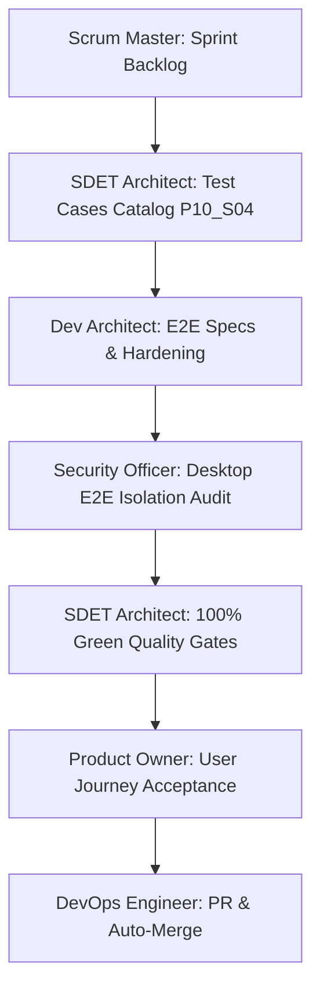

# Pre-Implementation Test Cases Catalog: Phase 10 · Sprint 04

**Sprint:** Phase 10 · Sprint 04: End-to-End Release Suite  
**Target Specification:** [Product Requirements Baseline](file:///c:/Workspace/ChessGame/docs/product-requirements.md), [Testing Strategy](file:///c:/Workspace/ChessGame/docs/testing-strategy.md), [Phase 10 Quality Engineering Plan](file:///c:/Workspace/ChessGame/planning/phases/10-phase-quality-engineering-release-candidate.md), [QA Traceability Matrix](file:///c:/Workspace/ChessGame/docs/qa-matrix.md)  
**Author:** SDET Architect & Chess Domain Architect  
**Status:** `Approved & Ready for Execution`

---

## 1. Overview & Objectives

The primary objective of **Phase 10 · Sprint 04** is to establish and harden the comprehensive **Tier 5 Desktop End-to-End (E2E) Release Suite** using Playwright. This suite validates all critical user journeys across the application runtime, eliminates UI flakiness, verifies robust diagnostic output, and guarantees release-grade stability for CI gating.

The suite verifies twelve primary functional user journeys:

1. **Launch Smoke:** App presentation, container visibility, theme loading, and local engine status.
2. **Human vs Human (HvH):** Turn alternation, legal move validation, capture trays, move history, and UI sync.
3. **Human vs Computer (HvC):** Match initiation against Stockfish AI, engine thinking states, automatic move responses, and board locking.
4. **Pawn Promotion:** Promotion dialog prompt on 8th rank, selection of Queen/Rook/Bishop/Knight, hotkey support, cancellation, and piece placement.
5. **Checkmate:** King safety checkmate indicator, terminal board locking, scoreline display, and result modal.
6. **Resignation:** Player resignation dialog prompt, cancellation, confirmation, and opponent victory declaration.
7. **Draw:** Draw offer, decline, acceptance, threefold repetition, 50-move rule, and stalemate handling.
8. **PGN Import/Export:** PGN generation with metadata tags, clipboard export, valid PGN replay, and invalid syntax rejection.
9. **FEN Workflow:** Current position extraction, preset loading (Lucena, Philidor, etc.), custom FEN game starts, and invalid FEN error trapping.
10. **Game Recovery:** State snapshot persistence in `localStorage`, recovery prompt on application reload, continue restore, and discard cleanup.
11. **Settings Persistence:** Appearance theme switching, piece set art selection, audio/motion toggles, engine strength settings, and persistence across reloads.
12. **Timed Games:** Fischer clock configuration (Blitz/Rapid/Classical/Custom), active countdown, increment addition upon move completion, and flag fall detection.

---

## 2. Test Cases Specification

### 2.1 Critical User Journey Specifications (TC-E2E-01 to TC-E2E-12)

| Test ID       | Journey Category     | Description & User Actions                                                                                    | Expected Assertions & Behavioral Contracts                                                                                                                | Spec File Target                                        |
| :------------ | :------------------- | :------------------------------------------------------------------------------------------------------------ | :-------------------------------------------------------------------------------------------------------------------------------------------------------- | :------------------------------------------------------ |
| **TC-E2E-01** | Launch Smoke         | Application opens from initial clean state.                                                                   | Header, brand, version badge `v0.1.0`, `< 150 MB` memory metric, `60 FPS` metric, `100% Local` metric, and `engine-status-badge` visible.                 | `app-launch.spec.ts`                                    |
| **TC-E2E-02** | Human vs Human       | Opening moves played (1. e4 e5 2. Nf3 Nc6 3. Bc4 Bc5).                                                        | Turn switches sequentially, SAN notation displayed in move history panel, last move indicator reflects `Bc5`.                                             | `human-vs-human.spec.ts`                                |
| **TC-E2E-03** | Human vs Computer    | Start game in `mode-human-vs-engine`, play 1. e4 as White or Black.                                           | Engine status reflects AI Black/White, engine computes and executes legal reply within timeout, turn passes back.                                         | `human-vs-computer.spec.ts`                             |
| **TC-E2E-04** | Pawn Promotion       | Advance pawn to 8th rank in custom or standard board setups.                                                  | `promotion-dialog` appears with Queen, Rook, Bishop, Knight options; selection updates target square to promoted piece; cancel restores pawn to 7th rank. | `promotion-workflow.spec.ts`                            |
| **TC-E2E-05** | Checkmate            | Deliver Scholar's Mate (1. e4 e5 2. Bc4 Nc6 3. Qh5 Nf6 4. Qxf7#) or Fool's Mate.                              | `checkmate-indicator` appears, `game-result-modal` opens with "White Wins!" / "Black Wins!", board disabled.                                              | `human-vs-human.spec.ts`, `check-and-promotion.spec.ts` |
| **TC-E2E-06** | Resignation          | Click `btn-resign-game` during active match and confirm resignation.                                          | `resign-confirm-modal` displays; confirm awards victory to opponent in `game-result-modal`; cancel resumes active game.                                   | `undo-restart-resign.spec.ts`, `human-vs-human.spec.ts` |
| **TC-E2E-07** | Draw Flows           | Offer draw via `btn-offer-draw`, test decline and accept; test stalemate.                                     | Decline keeps game active; accept triggers `game-result-modal` with score `½ - ½`; board controls lock cleanly.                                           | `draw-game-result.spec.ts`                              |
| **TC-E2E-08** | PGN Export/Import    | Export current game to PGN modal; import valid championship PGN; import invalid text.                         | PGN string contains valid headers and moves; valid import reconstructs players and board; invalid import displays error banner.                           | `pgn-export-import.spec.ts`                             |
| **TC-E2E-09** | FEN Workflow         | Open FEN modal, inspect current FEN, load preset (Lucena), input invalid FEN.                                 | Preset updates active board; invalid FEN renders `fen-status-card--invalid` and disables action buttons.                                                  | `fen-workflow.spec.ts`                                  |
| **TC-E2E-10** | Game Recovery        | Play 1. e4, reload page, verify recovery prompt, test Continue and Discard.                                   | `game-recovery-modal` displays on reload; Continue restores board and turn; Discard resets to fresh starting state.                                       | `game-recovery.spec.ts`                                 |
| **TC-E2E-11** | Settings Persistence | Open settings, change theme (e.g. Classic -> Wood -> Slate) and piece set (Standard -> Classic), reload page. | Settings are saved to `localStorage`, visual theme and piece set classes survive page reload, reset restores defaults.                                    | `settings-persistence.spec.ts`                          |
| **TC-E2E-12** | Timed Games & Clocks | Start game with Blitz (3+2) or custom clock, make moves, let clock count down.                                | Active player's clock counts down, turn switch applies increment, clock switches to opponent, timeout flags properly.                                     | `timed-game.spec.ts`                                    |

---

### 2.2 Flake Prevention & Quality Gate Metrics (TC-GATE-01 to TC-GATE-04)

| Test ID        | Metric / Gate      | Description                                                                 | Threshold / Criteria                                                             |
| :------------- | :----------------- | :-------------------------------------------------------------------------- | :------------------------------------------------------------------------------- |
| **TC-GATE-01** | Zero Flakiness     | Execute complete E2E suite consecutively.                                   | 100% Pass Rate across repeated executions; 0 timeouts, 0 flaky retries.          |
| **TC-GATE-02** | Diagnostic Logging | Failures (if triggered) capture DOM snapshots, screenshots, and trace data. | Playwright trace and screenshot artifacts configured for CI triage.              |
| **TC-GATE-03** | Anti-Sleep Mandate | No arbitrary `setTimeout` or sleep calls in E2E spec files.                 | Strict use of Playwright web-first assertions (`expect(locator).toBeVisible()`). |
| **TC-GATE-04** | Execution Budget   | Full Playwright E2E suite execution speed.                                  | Entire suite finishes in under 60 seconds on standard desktop hardware.          |

---

## 3. Test Traceability & Sign-Off Matrix

- **Sign-Off:** SDET Architect & Chess Domain Architect
- **Pass Criteria:**
  - 100% Green across all 12 Critical User Journey E2E specs.
  - Zero test skips (`test.skip`), zero flaky failures.
  - 0 typecheck, lint, or formatting errors in test suites.
