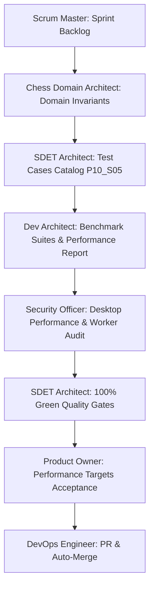

# Pre-Implementation Test Cases Catalog: Phase 10 · Sprint 05

**Sprint:** Phase 10 · Sprint 05: Performance and Reliability  
**Target Specification:** [Product Requirements Baseline](file:///c:/Workspace/ChessGame/docs/product-requirements.md), [Testing Strategy](file:///c:/Workspace/ChessGame/docs/testing-strategy.md), [Phase 10 Quality Engineering Plan](file:///c:/Workspace/ChessGame/planning/phases/10-phase-quality-engineering-release-candidate.md), [QA Traceability Matrix](file:///c:/Workspace/ChessGame/docs/qa-matrix.md)  
**Author:** SDET Architect & Chess Domain Architect  
**Status:** `Approved & Ready for Execution`

---

## 1. Overview & Objectives

The primary objective of **Phase 10 · Sprint 05** is to establish, measure, and verify the performance, resource efficiency, and long-session reliability of ChessForge against its core desktop mandates:

1. **Strict Desktop Memory Budget:** Total application memory footprint strictly below $150\text{ MB}$ at all times during long-running sessions.
2. **60 FPS Non-Blocking UI:** Board interactions, drag gestures, piece animations, and move executions must execute within the $16.6\text{ ms}$ frame budget with 0 UI freezes.
3. **Engine Worker Isolation:** Stockfish WASM evaluation operates asynchronously in background WebWorkers without blocking main-thread UI rendering or user input.
4. **Long-Game Stability:** High-ply games (100+ moves / 200+ plies), repeated game resets, and rapid mode switching run leak-free.
5. **High-Throughput Serialization:** Batch PGN import/export and FEN parsing/validation execute in sub-millisecond to low-millisecond time.

---

## 2. Test Cases Specification

### 2.1 Performance & Benchmark Test Cases (TC-PERF-01 to TC-PERF-08)

| Test ID        | Benchmark Category                     | Description & Test Procedure                                                                                                                | Quantitative Target & Assertion Contract                                                                                                                     | Test Suite Target                                                                           |
| :------------- | :------------------------------------- | :------------------------------------------------------------------------------------------------------------------------------------------ | :----------------------------------------------------------------------------------------------------------------------------------------------------------- | :------------------------------------------------------------------------------------------ |
| **TC-PERF-01** | Startup & Bootstrap Latency            | Measure application mount, theme resolution, initial board rendering, and Stockfish worker bridge readiness.                                | Application interactive in $< 1000\text{ ms}$; initial memory footprint $< 100\text{ MB}$ RAM; 0 blocking main-thread tasks $> 50\text{ ms}$.                | `tests/e2e/performance-soak.spec.ts`                                                        |
| **TC-PERF-02** | Board Interaction & Move Latency       | Measure square selection, legal move generation query latency, and state dispatch-to-DOM update cycle.                                      | Legal move query $< 2\text{ ms}$ per square; move execution cycle $< 10\text{ ms}$; frame rendering budget $< 16.6\text{ ms}$ (60 FPS).                      | `src/domain/chess/__tests__/performanceBenchmark.test.ts`                                   |
| **TC-PERF-03** | Engine Worker Responsiveness           | Measure Stockfish worker command dispatch, tokenized search cancellation (`stopEvaluation`), and search throttling under rapid move inputs. | Search cancellation clearance $< 25\text{ ms}$; 0 main thread freezes during heavy engine depth searches; UCI message parsing $< 1\text{ ms}$.               | `src/features/engine/__tests__/engineReliability.test.ts`                                   |
| **TC-PERF-04** | High-Ply Long Game Stress (200+ Plies) | Simulate full 100+ move (200+ plies) legal chess game with captures, checks, promotions, and threefold repetition evaluations.              | Total game execution $< 100\text{ ms}$; heap growth $< 15\text{ MB}$; move history SAN rendering $< 5\text{ ms}$; 200-ply undo/redo rewind $< 10\text{ ms}$. | `src/features/game/__tests__/gameReliability.test.ts`                                       |
| **TC-PERF-05** | Memory Soak & Leak Prevention          | Execute 50 consecutive new games with active moves, undo cycles, and modal openings.                                                        | Memory growth remains flat across iterations; 0 detached DOM nodes or unbounded closure retention; total footprint $< 150\text{ MB}$.                        | `src/features/game/__tests__/gameReliability.test.ts`, `tests/e2e/performance-soak.spec.ts` |
| **TC-PERF-06** | Engine Worker Start/Stop Stress        | Perform 25 rapid engine start/stop cycles (alternating between HvH and HvC, difficulty changes, and game resets).                           | 0 orphaned worker processes; 0 hanging evaluation promises; clean worker termination and re-initialization in $< 50\text{ ms}$.                              | `src/features/engine/__tests__/engineReliability.test.ts`                                   |
| **TC-PERF-07** | Batch PGN & FEN Throughput             | Benchmark batch parsing of 50 championship PGN games (50-100 moves each) and 500 FEN position validation/generation cycles.                 | 50 PGN games parsed & validated in $< 150\text{ ms}$; 500 FEN cycles completed in $< 25\text{ ms}$ (sub-0.05ms per FEN).                                     | `src/domain/chess/__tests__/performanceBenchmark.test.ts`                                   |
| **TC-PERF-08** | Storage Persistence Latency            | Measure `localStorage` state snapshot serialization and deserialization under maximum game history sizes.                                   | Snapshot serialization $< 5\text{ ms}$; deserialization & game hydration $< 5\text{ ms}$; storage payload $< 50\text{ KB}$.                                  | `src/features/game/__tests__/gameReliability.test.ts`                                       |

---

## 3. Flake Prevention & Quality Gate Metrics

| Test ID        | Gate / Threshold                | Description                                                                                            | Standard                                                                                               |
| :------------- | :------------------------------ | :----------------------------------------------------------------------------------------------------- | :----------------------------------------------------------------------------------------------------- |
| **TC-GATE-01** | Zero Flakiness Guarantee        | All performance & reliability benchmark suites run deterministically without time-dependent flakiness. | 100% Pass Rate across repeated runs; deterministic synthetic clocks or mock bridges where appropriate. |
| **TC-GATE-02** | Anti-Sleep Invariant            | Zero arbitrary `setTimeout` or sleep delays in test harnesses.                                         | Performance measured using high-resolution monotonic clocks (`performance.now()`).                     |
| **TC-GATE-03** | Memory Budget Ceiling           | Application memory footprint during intensive testing.                                                 | Memory strictly bounded $< 150\text{ MB}$ total footprint on Windows desktop.                          |
| **TC-GATE-04** | Complete Suite Execution Budget | Vitest unit/property/mutation/benchmark suites + Playwright E2E suites execution speed.                | Unit & benchmark suites complete in $< 30\text{ s}$; E2E soak suite completes in $< 45\text{ s}$.      |

---

## 4. Test Traceability & Sign-Off Matrix

- **Sign-Off:** SDET Architect & Chess Domain Architect
- **Pass Criteria:**
  - 100% Green across all Performance & Reliability suites.
  - Zero test skips (`test.skip`), zero regressions.
  - Quantitative benchmark metrics recorded and meeting all desktop target ceilings.
